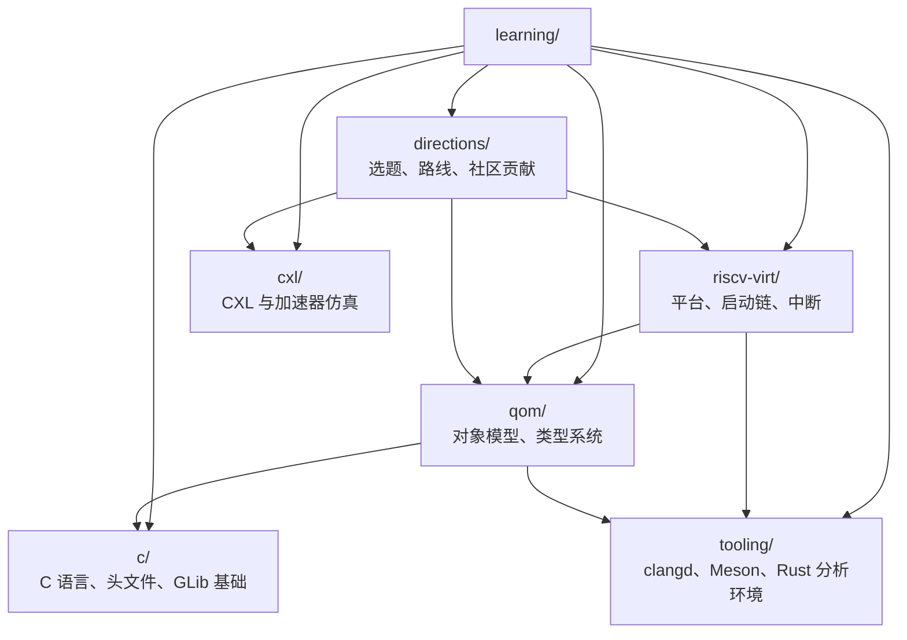

# `learning/` 知识图谱入口

这个目录现在按“主题地图 -> 具体笔记”组织，不再把所有内容平铺在根目录里。

可以把它当成一个轻量版 Obsidian vault：

- 根 `README` 是总入口
- 各子目录 `README` 是该主题的地图页
- 具体 `.md` 文件是细化笔记
- [`qemu-c-qom-basics.md`](qemu-c-qom-basics.md) 是保留的旧入口，不再作为主导航

## 整体关系图

## 先按什么问题来读

### 1. 我想先看 `QEMU virt` 启动和板级结构

1. [RISC-V `virt`](riscv-virt/README.md)
2. [QEMU `virt` 启动执行流程阅读指引](riscv-virt/virt-init-reading-guide.md)
3. [RISC-V `virt` 中断控制器速记](riscv-virt/interrupt-controllers.md)
4. [QEMU / RISC-V 术语速查](riscv-virt/glossary.md)

### 2. 我读源码时卡在 `QOM`、类型系统或 C 代码层

1. [QOM 对象模型](qom/README.md)
2. [QEMU QOM 对象模型总览](qom/qom-object-model.md)
3. [C 语言基础](c/README.md)
4. [QEMU 源码阅读里的 C 语言与头文件基础](c/c-language-and-headers.md)

### 3. 我卡在编辑器、构建或 Rust/Meson 工具链

1. [工具链与编辑器](tooling/README.md)
2. [QEMU 编辑器、clangd 与格式化器笔记](tooling/editor-clang-format.md)
3. [QEMU 里的 `configure` 和 `make`](tooling/qemu-configure-make.md)
4. [QEMU Rust + Meson + rust-analyzer 排错笔记](tooling/rust-analyzer-meson-qemu.md)

### 4. 我在想后续选题、方向或社区贡献

1. [方向与路线](directions/README.md)
2. [围绕 QEMU 能做什么：主线方向地图（2026-04）](directions/qemu-project-map.md)
3. [QEMU 社区里现在可以怎么贡献（截至 2026-04-19）](directions/qemu-community-contribution.md)
4. [作业方向比较：`CXL Type-2 GPU` vs `QEMU + Wine-CE`](directions/project-direction-comparison.md)
5. [CXL / 加速器仿真](cxl/README.md)

## 目录地图

- [RISC-V `virt`](riscv-virt/README.md)
  - 入口主题：平台模型、启动链、设备树、中断控制器、术语速查
- [QOM 对象模型](qom/README.md)
  - 入口主题：`Object`、`ObjectClass`、`TypeInfo`、类型注册、属性系统
- [C 语言基础](c/README.md)
  - 入口主题：头文件习惯、`struct`/`typedef`、`GLib`、源码阅读常见 C 技巧
- [工具链与编辑器](tooling/README.md)
  - 入口主题：`clangd`、`.clangd`、`.editorconfig`、`configure`/`make`、Rust 分析环境
- [方向与路线](directions/README.md)
  - 入口主题：未来项目方向、课程选题比较、社区贡献入口
- [CXL / 加速器仿真](cxl/README.md)
  - 入口主题：`CXL Type-2`、一致性、GPU 仿真与研究方向

## 使用约定

- 新笔记尽量先判断它属于哪个主题目录，再落到对应目录里。
- 如果一篇笔记更像“地图页”而不是具体知识点，优先补到对应目录的 `README.md`。
- 如果只是为了兼容旧路径，可以像 [`qemu-c-qom-basics.md`](qemu-c-qom-basics.md) 这样保留一个跳转页，但不要再把它当新的归档位置。
