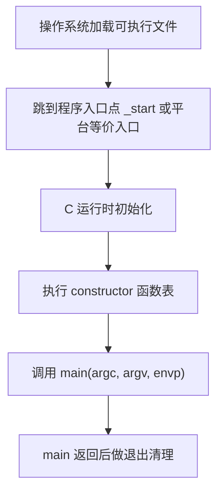

# QEMU 源码阅读里的 C 语言与头文件基础

这份笔记整理阅读 QEMU C 代码时最容易卡住的语言基础、头文件习惯、typedef 与宏相关问题。

## 相关笔记

- [QOM 对象模型基础](../qom/qom-object-model.md)
- [编辑器、clangd 与格式化器](../tooling/editor-clang-format.md)

---

- [QEMU 源码阅读里的 C 语言与头文件基础](#qemu-源码阅读里的-c-语言与头文件基础)
  - [相关笔记](#相关笔记)
  - [`qemu/osdep.h` 是什么](#qemuosdeph-是什么)
  - [`GLib` 到底是什么](#glib-到底是什么)
  - [`g_hash_table_lookup` 是什么](#g_hash_table_lookup-是什么)
  - [`g_strdup` 是什么](#g_strdup-是什么)
  - [`g_assert` 是什么](#g_assert-是什么)
  - [`g_malloc0` 是什么](#g_malloc0-是什么)
  - [`error_setg` / `Error **errp` 是怎么工作的](#error_setg--error-errp-是怎么工作的)
  - [QEMU 用的 C 标准是什么](#qemu-用的-c-标准是什么)
  - [函数参数列表里的 `void` 是什么意思](#函数参数列表里的-void-是什么意思)
    - [为什么不用直接写 `foo()`？](#为什么不用直接写-foo)
  - [`__attribute__((constructor))` 为什么能在 `main()` 前运行](#__attribute__constructor-为什么能在-main-前运行)
    - [这条规则到底属于哪个 C 标准](#这条规则到底属于哪个-c-标准)
    - [`C23` 又变了](#c23-又变了)
    - [`void` 不能当普通参数来用](#void-不能当普通参数来用)
  - [`__FILE__` / `__LINE__` / `__func__` 是什么](#__file__--__line__--__func__-是什么)
  - [头文件之间能不能互相 `#include`](#头文件之间能不能互相-include)
    - [这类写法叫什么](#这类写法叫什么)
    - [它是干什么的](#它是干什么的)
    - [最短理解](#最短理解)
    - [如果有多个编译单元都 `#include` 这个头，会怎样](#如果有多个编译单元都-include-这个头会怎样)
    - [那为什么通常没事](#那为什么通常没事)
    - [真正会出问题的是什么](#真正会出问题的是什么)
    - [所以最实用的判断法](#所以最实用的判断法)
    - [和 `#pragma once` 的关系](#和-pragma-once-的关系)
  - [C 里的条件编译是不是通过 `#define` 实现的](#c-里的条件编译是不是通过-define-实现的)
    - [常见的几种条件编译写法](#常见的几种条件编译写法)
    - [条件不一定只能来自源码里的 `#define`](#条件不一定只能来自源码里的-define)
    - [为什么说它是“预处理”不是“运行时 if”](#为什么说它是预处理不是运行时-if)
  - [`typedef struct Object Object;` 是什么意思](#typedef-struct-object-object-是什么意思)
  - [`typedef struct MyDevice { ... } MyDevice;` 是什么意思](#typedef-struct-mydevice----mydevice-是什么意思)
  - [C 里的 `union` 是什么意思](#c-里的-union-是什么意思)
  - [C 里 `struct` 的字面量初始化怎么写](#c-里-struct-的字面量初始化怎么写)
  - [`QemuCond thr_cond` 是什么](#qemucond-thr_cond-是什么)
  - [结构体里还能再定义结构体吗](#结构体里还能再定义结构体吗)
  - [宏参数能不能传字面量](#宏参数能不能传字面量)
  - [为什么 C 里有时必须写 `struct Foo`](#为什么-c-里有时必须写-struct-foo)
  - [为什么 `thread-posix.h` 里写 `struct QemuCond cond;`](#为什么-thread-posixh-里写-struct-qemucond-cond)
  - [为什么一个头文件里可以有很多前向声明，它们不会混在一起](#为什么一个头文件里可以有很多前向声明它们不会混在一起)
    - [1. 不同类型名字本来就互不影响](#1-不同类型名字本来就互不影响)
    - [2. `struct Foo` 和 `Foo` 还是两个层次](#2-struct-foo-和-foo-还是两个层次)
    - [3. 同一个头里出现很多这种写法也没问题](#3-同一个头里出现很多这种写法也没问题)
    - [4. `typedef struct TypeImpl *Type;` 又是什么](#4-typedef-struct-typeimpl-type-又是什么)
    - [5. 真正会冲突的情况是什么](#5-真正会冲突的情况是什么)
    - [6. 一句话记忆](#6-一句话记忆)
  - [为什么很多模块都有一对 `.h` / `.c`](#为什么很多模块都有一对-h--c)
    - [1. 一般什么会放进 `.h`](#1-一般什么会放进-h)
      - [`static inline` 这个组合到底是什么意思](#static-inline-这个组合到底是什么意思)
    - [2. 一般什么会放进 `.c`](#2-一般什么会放进-c)
    - [3. 为什么有些 `struct` 在 `.h` 里定义，有些却只在 `.c` 里定义](#3-为什么有些-struct-在-h-里定义有些却只在-c-里定义)
      - [情况 A：放在 `.h`](#情况-a放在-h)
      - [情况 B：放在 `.c`](#情况-b放在-c)
    - [4. `object.h` / `object.c` 可以这样对着读](#4-objecth--objectc-可以这样对着读)
    - [5. 这个仓库里一个很实用的判断标准](#5-这个仓库里一个很实用的判断标准)
      - [问题 1：别的 `.c` 文件是否需要“看见这个名字”？](#问题-1别的-c-文件是否需要看见这个名字)
      - [问题 2：别的文件是否需要“知道它的内部字段布局”？](#问题-2别的文件是否需要知道它的内部字段布局)
      - [问题 3：这是不是模块私有 helper？](#问题-3这是不是模块私有-helper)
    - [6. 一句话记忆](#6-一句话记忆-1)
  - [C 里的 `static` 到底是什么意思](#c-里的-static-到底是什么意思)
    - [1. 文件作用域的 `static`](#1-文件作用域的-static)
      - [这算不算“封装”](#这算不算封装)
    - [2. 函数内部的 `static`](#2-函数内部的-static)
    - [3. 这算不算“共享”](#3-这算不算共享)
      - [情况 A：同一个函数多次调用之间](#情况-a同一个函数多次调用之间)
      - [情况 B：别的函数能不能直接按名字访问](#情况-b别的函数能不能直接按名字访问)
    - [4. 和 Rust 对比时，最容易记的版本](#4-和-rust-对比时最容易记的版本)
    - [5. C 和 Rust 这块最本质的区别](#5-c-和-rust-这块最本质的区别)
    - [6. 一句话版](#6-一句话版)
    - [6.5 那 `extern` 就是 `public` 吗](#65-那-extern-就是-public-吗)
      - [意思 1：我刚才口语里说的那种](#意思-1我刚才口语里说的那种)
      - [意思 2：C 标准语境里的 `external declaration`](#意思-2c-标准语境里的-external-declaration)
    - [7. `static const` 组合是什么意思](#7-static-const-组合是什么意思)
    - [8. 那 `static const` 能不能放到头文件里](#8-那-static-const-能不能放到头文件里)
      - [什么时候放头文件里比较合理](#什么时候放头文件里比较合理)
      - [什么时候更适合放 `.c`](#什么时候更适合放-c)
    - [9. QEMU `object.h` 里为什么看起来也有 `static const`](#9-qemu-objecth-里为什么看起来也有-static-const)

---

## `qemu/osdep.h` 是什么

`qemu/osdep.h` 可以先理解成 QEMU C 文件的“公共环境头”。

它不只是一个普通头文件，而是会统一拉进很多：

- 常见系统头
  - `stdint.h`
  - `stdbool.h`
  - `stdio.h`
  - `string.h`
- 平台差异处理
  - POSIX / Windows / wasm 之类兼容
- QEMU 基础编译环境
  - `config-host.h`
  - `qemu/compiler.h`
  - `glib-compat.h`
  - `qemu/typedefs.h`

源码说明见：

- `include/qemu/osdep.h:1`

QEMU 代码约定基本是：

- `.c` 文件应把 `qemu/osdep.h` 放在第一个 `#include`

仓库脚本里直接写了这条约定：

- `scripts/clean-includes:239`

> All .c should include qemu/osdep.h first.

所以它不是“编译器自动导入”的，而是：

- **QEMU 代码规范要求 `.c` 文件自己显式 include 它**

---

## `GLib` 到底是什么

`GLib` 可以先理解成：

- **一套给 C 程序用的基础运行库 / 工具库**

它不是 C 标准库本身，也不等于 `GTK` 整个图形界面框架。

很多初学者第一次看到 `g_malloc0`、`g_autoptr`、`GHashTable`、`GSList`，会以为：

- 这是 `QEMU` 自己发明的一套东西
- 或者这是 `GTK` 图形界面的 API

更准确地说：

- 这些很多其实来自 **GLib**

#### `GSList` 是什么

一句话先记：

- **`GSList` 是 `GLib` 提供的单向链表（singly linked list）节点类型。**

也就是说它不是：

- QEMU 自己定义的新语法
- C 语言内建容器

而是：

- `GLib` 这套基础库里的通用数据结构

你在 QEMU 里看到：

```c
GSList *interfaces;
```

可以先把它理解成：

- **“一个单链表的表头指针”**

它的使用方式通常是：

- 每个节点里放一份 `data`
- 再用 `next` 指向下一个节点

所以像这种代码：

```c
for (e = parent->class->interfaces; e; e = e->next) {
    InterfaceClass *iface = e->data;
    ...
}
```

本质上就是在：

- 从链表头开始
- 顺着 `next` 一个节点一个节点往后走
- 每个节点的 `data` 里取出真正存的对象指针

最短记法：

- `GSList *x` 不表示“一个对象本体”
- 它更像是“链表节点指针 / 链表头”
- 真正想要的业务对象，通常放在节点的 `data` 里

### 可以先把 `GLib` 放在这个层级里

```text
C 标准库
  └── 很基础：malloc / free / printf / strlen ...

GLib
  └── 在 C 标准库之上再包一层更好用的通用基础设施

GObject
  └── 建立在 GLib 之上的对象系统

GTK
  └── 建立在 GLib / GObject 之上的 GUI 工具包
```

所以：

- `GLib` 不是“GUI 库本体”
- 它更像“底层通用基础设施库”

### 它大概提供什么

在你现在读 QEMU 这条线里，最常碰到的是这些：

- 内存分配包装
  - `g_malloc`
  - `g_malloc0`
  - `g_free`
- 常用数据结构
  - `GHashTable`
  - `GSList`
  - `GArray`
- 字符串 / 工具函数
  - `g_strdup`
  - `g_strdup_printf`
- 宏和编译器兼容包装
  - `G_GNUC_UNUSED`
  - `G_NORETURN`
- 一些“在 C 里补出更顺手习惯”的机制
  - `g_autoptr`
  - `g_clear_pointer`

### 那它和 `GObject` 是什么关系

这个也很容易混：

- `GLib` 本身主要是**通用基础库**
- `GObject` 是建立在 `GLib` 之上的**对象系统**

所以如果你看到：

- `g_malloc0`
- `GHashTable`

这更偏 `GLib`

如果你看到：

- 运行时类型系统
- 信号
- 属性
- 引用计数对象风格

那通常更接近 `GObject`

### 那它和 QEMU 是什么关系

最实用的理解是：

- **QEMU 不是用纯裸 C 标准库从零搭所有基础设施**
- 它大量借用了 `GLib` 提供的底层通用能力

所以在 QEMU 代码里你会经常看到：

- `g_malloc0(...)`
- `g_free(...)`
- `GSList *`
- `GHashTable *`
- `g_autoptr(...)`

但这不表示：

- QEMU 变成了一个 GTK 图形程序

更准确地说是：

- **QEMU 复用了 GLib 这层“通用 C 工具箱”**

### 那 `GLib` 在 C 语言社区里地位怎么样

一句话先说结论：

- **很重要，但不是“整个 C 社区的唯一标准基础库”**

更准确地看，它的地位可以分层理解：

#### 1. 在 `GNOME` / `GTK` / `GObject` 这条生态里

- `GLib` 基本是 **事实标准（de facto standard）基础设施**
- 这一层里它不是“可选小工具库”，而更像：
  - 地基
  - 公共运行时习惯
  - 数据结构 / 字符串 / 事件循环 / 对象系统周边能力的共同底座

如果你在看：

- `GTK`
- `GObject`
- `libsoup`
- `GIO`
- 很多 `GNOME` 相关项目

那么 `GLib` 的地位是非常核心的。

#### 2. 在“通用用户态 C 开源项目”里

- `GLib` 也很有影响力
- 它属于那种“很多人都知道、很多大项目都实际在用”的成熟基础库

像 `QEMU` 这种项目大量使用：

- `g_malloc0`
- `g_strdup`
- `GHashTable`
- `GSList`
- `GString`
- `g_autoptr`

说明它不只是桌面 GUI 才会用。

也就是说：

- 它在整个 C 世界里 **绝不是边缘库**
- 但也 **没有大到等于“C 标准库第二层官方标准”**

#### 3. 在更广义的整个 C 社区里

这里就要收一收说法了：

- `GLib` 很重要
- 但不是所有 C 项目都会选它

很多 C 项目会走别的路线，比如：

- 只用 libc / POSIX
- 自己维护一套轻量工具层
- 用别的事件库 / 容器库 / 平台抽象层
- 在内核、嵌入式、极轻量依赖场景里刻意避免引入 `GLib`

所以它不像：

- `libc`
- `POSIX`

那样几乎属于“默认空气层”。

更像是：

- **C 世界里非常成熟、非常有影响力的一套大型基础设施库**
- **在某些生态中接近标准**
- **在整个 C 世界里则是“强势选项之一”，而不是唯一答案**

#### 4. 为什么很多人尊重它，但也有人不想用它

这是理解它“社区地位”的关键。

喜欢它的人通常看中：

- 工具箱很全
- API 风格统一
- 跨平台老牌、稳定
- 数据结构 / 字符串 / 内存 / main loop / 工具宏比较省事
- 能在 C 里补出很多“本来语言没给你”的工程习惯

不想用它的人通常顾虑：

- 依赖比较重
- 命名和宏体系有自己的世界观
- `GObject` / `GLib` 风格不一定符合所有项目审美
- 对“想保持非常薄的 C + POSIX 风格”的项目来说显得偏厚

所以它在社区里的真实位置很像：

- **工程上很成熟**
- **历史地位很稳**
- **生态影响很大**
- **但不是所有 C 程序员都会默认接受的“唯一正统”**

#### 5. 如果用 Rust 的感觉类比

只能类比，不要完全等同。

可以粗略想成：

- `GLib` 不是 C 的 `std`
- 更像“一个非常老牌、覆盖面很广、被很多大型项目长期采用的基础 crate 生态底座”

但和 Rust 最大不同是：

- Rust 的 `std` 是语言官方的一部分
- `GLib` 不是 C 官方标准的一部分
- 它是第三方但非常成功、非常有历史地位的基础库

所以最短判断版：

- **在 GNOME/GTK 生态：核心地基**
- **在大型用户态 C 项目里：强势、成熟、很有分量**
- **在整个 C 社区里：重要但不统治，不是唯一标准答案**

### 最短记忆版

- `GLib` = 给 C 用的通用基础库
- `GObject` = 建在 `GLib` 上的对象系统
- `GTK` = 建在 `GLib` / `GObject` 上的 GUI 工具包
- `QEMU` = 大量使用 `GLib`，但不等于 `GTK` 程序

---

## `g_hash_table_lookup` 是什么

`g_hash_table_lookup` 是 GLib 的哈希表查询函数。

它的函数声明大概是：

```c
gpointer g_hash_table_lookup(GHashTable *hash_table,
                             gconstpointer key);
```

可以先把它理解成：

- 给它一个 `GHashTable *`
- 再给它一个 `key`
- 它帮你在哈希表里找这个 key 对应的 value

也就是很多语言里的：

```text
map[key]
```

或者：

```text
hashmap.get(key)
```

### 一个最小例子

```c
GHashTable *table = g_hash_table_new(g_str_hash, g_str_equal);

g_hash_table_insert(table, "name", "qemu");

const char *value = g_hash_table_lookup(table, "name");
```

这时：

```c
value == "qemu"
```

### 在 QEMU 里的例子

`qom/object.c` 里有：

```c
return g_hash_table_lookup(type_table_get(), name);
```

可以翻成人话：

- `type_table_get()` 拿到 QOM 的类型表
- `name` 是要找的 QOM 类型名
- `g_hash_table_lookup(...)` 按这个名字查对应的类型对象
- 查到了就返回对应 value
- 没查到就返回 `NULL`

所以它经常出现在这种语义里：

- “按名字找对象”
- “按 ID 找状态”
- “按指针找缓存项”
- “按 key 找已经登记过的数据”

### 返回值的 `NULL` 要小心

官方语义里：

- 找不到 key 时，返回 `NULL`

但还有一个容易忽略的情况：

- 如果这个 key 存在，但对应 value 本身就是 `NULL`
- `g_hash_table_lookup(...)` 也会返回 `NULL`

所以只看返回值时，下面两种情况可能分不清：

```text
情况 A：key 不存在
情况 B：key 存在，但 value 是 NULL
```

如果你需要明确区分，可以用：

- `g_hash_table_contains(hash_table, key)`
  - 只问 key 是否存在
- `g_hash_table_lookup_extended(hash_table, key, &orig_key, &value)`
  - 同时拿到原始 key 和 value，并用返回的 `gboolean` 表示是否找到

### 它会不会复制 value

不会。

`g_hash_table_lookup(...)` 返回的是哈希表里已经存着的那个 value 指针。

所以：

- 它不是新分配一份 value
- 调用者一般不应该随手 `g_free(value)`
- value 的生命周期要看这个哈希表怎么创建、插入和销毁

如果这个表是用 `g_hash_table_new_full(...)` 创建的，并且传了 key/value 的 destroy 函数，那么条目被移除或表被销毁时，GLib 会按那些 destroy 函数清理 key/value。

### 和 C 普通数组访问的区别

普通数组：

```c
arr[index]
```

- `index` 通常是整数位置

哈希表：

```c
g_hash_table_lookup(table, key)
```

- `key` 可以是字符串、指针、整数包装成指针等
- 怎么判断两个 key 相等，由创建表时传入的 hash/equal 函数决定

比如字符串 key 常见是：

```c
g_hash_table_new(g_str_hash, g_str_equal);
```

意思是：

- 用字符串内容计算 hash
- 用字符串内容判断相等

最短记忆版：

- `GHashTable` = GLib 的哈希表 / 字典
- `g_hash_table_lookup(table, key)` = 按 key 查 value
- 找不到返回 `NULL`
- 如果需要区分“没找到”和“value 本来就是 NULL”，用 `g_hash_table_contains` 或 `g_hash_table_lookup_extended`

---

## `g_strdup` 是什么

`g_strdup` 是 GLib 的字符串复制函数。

它大概等价于：

- 给一个 C 字符串
- 重新分配一块内存
- 把字符串内容复制过去
- 返回新字符串的指针

函数声明大概是：

```c
gchar *g_strdup(const gchar *str);
```

其中：

- `gchar` 基本可以先理解成 `char`
- 参数 `str` 是要复制的原字符串
- 返回值是新分配出来的字符串

### 最小例子

```c
const char *src = "qemu";
char *copy = g_strdup(src);
```

这时可以理解成：

```text
src  -> "qemu"
copy -> 另一份新分配出来的 "qemu"
```

它不是简单地把指针复制一份：

```c
char *copy = src;  /* 只是复制指针，不是复制字符串内容 */
```

而是复制字符串内容。

### 和 `strdup` 的关系

`g_strdup` 很像 POSIX 里的：

```c
strdup(str)
```

但在 QEMU / GLib 项目里，常用 `g_strdup` 是因为：

- 它属于 GLib 的统一风格
- 返回的内存应该配合 `g_free(...)` 释放
- 它和 GLib 的内存分配习惯保持一致

### 谁负责释放

这个点很重要。

`g_strdup` 返回的是 **新分配的字符串**，所以用完后通常要：

```c
g_free(copy);
```

否则就会内存泄漏。

所以看到：

```c
ti->name = g_strdup(info->name);
```

可以翻成人话：

- 不只是让 `ti->name` 指向 `info->name`
- 而是给 `ti->name` 存一份独立拷贝
- 这样后续即使原来的 `info->name` 生命周期结束，`ti->name` 仍然有自己的字符串内容

### 如果传入 `NULL` 会怎样

GLib 的 `g_strdup(NULL)` 会返回 `NULL`。

所以它通常可以安全处理可空字符串：

```c
char *copy = g_strdup(maybe_null);
```

如果 `maybe_null == NULL`：

```c
copy == NULL
```

### 和 `g_strdup_printf` 的区别

这两个名字很像：

```c
g_strdup(str)
g_strdup_printf("cpu-%d", id)
```

区别是：

- `g_strdup(str)`：复制一个已有字符串
- `g_strdup_printf(...)`：先按 `printf` 格式生成字符串，再返回新分配的结果

最短记忆版：

- `g_strdup` = GLib 版字符串复制
- 返回新分配的字符串
- 用完通常要 `g_free`
- 复制的是内容，不只是复制指针
- `g_strdup(NULL)` 返回 `NULL`

---

## `g_assert` 是什么

`g_assert` 不是普通函数，而是：

- **GLib 提供的断言宏**

它的作用和 C 标准库里的 `assert(...)` 很像：

- 检查一个表达式是否为真
- 如果为真，什么也不做，程序继续运行
- 如果为假，打印断言失败信息并终止程序

例如：

```c
g_assert(obj != NULL);
```

意思是：

- “我认为这里 `obj` 一定不应该是 `NULL`”
- 如果这个假设被打破，说明程序内部逻辑错了，直接停下来

### 它大概展开成什么

在没有定义 `G_DISABLE_ASSERT` 时，GLib 头文件里的核心形状大概是：

```c
#define g_assert(expr) G_STMT_START { \
    if G_LIKELY (expr) ; else \
        g_assertion_message_expr(G_LOG_DOMAIN, __FILE__, __LINE__, G_STRFUNC, #expr); \
} G_STMT_END
```

所以它会记录：

- 当前日志域 `G_LOG_DOMAIN`
- 当前文件 `__FILE__`
- 当前行号 `__LINE__`
- 当前函数 `G_STRFUNC`
- 失败的表达式字符串 `#expr`

这也是为什么断言失败时，错误信息通常能告诉你：

- 哪个文件
- 哪一行
- 哪个函数
- 哪个条件不成立

### 如果定义了 `G_DISABLE_ASSERT` 会怎样

如果编译时定义了：

```c
G_DISABLE_ASSERT
```

那么 `g_assert(expr)` 会变成近似：

```c
(void) 0;
```

也就是：

- 不检查 `expr`
- 不求值 `expr`
- 什么都不做

所以不要把有副作用的代码写进 `g_assert` 里，例如：

```c
g_assert(init_device(dev));  /* 不推荐 */
```

因为一旦禁用断言，`init_device(dev)` 可能根本不会执行。

更好的写法是：

```c
bool ok = init_device(dev);
g_assert(ok);
```

### `g_assert` 应该用来检查什么

适合检查：

- 程序内部不变量
- “理论上绝不该发生”的状态
- 开发期尽早暴露 bug 的条件

不适合检查：

- 用户输入是否合法
- 文件是否存在
- 网络请求是否成功
- 正常运行时可能出现的错误

这些正常错误应该走显式错误处理，而不是靠 `g_assert` 让程序崩掉。

### 和普通 `assert` 的区别

这里的“普通 `assert`”一般指 C 标准库 `<assert.h>` 里的：

```c
assert(expr);
```

它和 `g_assert(expr)` 的核心目的很像：

- 都是断言宏
- 都用来检查内部逻辑假设
- 条件失败时通常都会终止程序
- 都不应该把必须执行的副作用放进表达式里

但它们属于不同体系：

| 对比点 | `assert(expr)` | `g_assert(expr)` |
| --- | --- | --- |
| 来源 | C 标准库 `<assert.h>` | GLib |
| 禁用开关 | `NDEBUG` | `G_DISABLE_ASSERT` |
| 失败信息 | 由 C 库实现决定，通常含表达式、文件、行号 | 走 GLib 的 `g_assertion_message_expr(...)`，包含 `G_LOG_DOMAIN`、文件、行号、函数名、表达式 |
| 项目风格 | 通用 C 项目都能用 | 使用 GLib 的项目更常见 |

所以在 QEMU 这种大量使用 GLib 的项目里：

- 看到 `g_assert(...)` 很正常
- 它不是“更底层的 C 语言机制”
- 而是 **GLib 风格的断言包装**

如果只看作用，可以先粗略记成：

- `g_assert(expr)` ≈ `assert(expr)` 的 GLib 版本

但如果看编译开关和报错体系，它们并不完全一样。

### 和 `g_return_if_fail` 的区别

它们都来自 GLib，但语义不一样：

| 宏 | 条件失败时 | 适合表达 |
| --- | --- | --- |
| `g_assert(expr)` | 打印断言失败并终止程序 | 内部逻辑不变量被破坏 |
| `g_return_if_fail(expr)` | 打印警告并从当前函数返回 | API 前置条件不满足 |

另外它们的禁用宏也不同：

- `g_assert` 受 `G_DISABLE_ASSERT` 控制
- `g_return_if_fail` / `g_return_val_if_fail` 受 `G_DISABLE_CHECKS` 控制

最短记忆版：

- `g_assert` = GLib 版断言宏
- 条件假时终止程序
- 可被 `G_DISABLE_ASSERT` 编译期开关禁用
- 不要在表达式里放必须执行的副作用

---

## `g_malloc0` 是什么

`g_malloc0` 不是 C 标准库里的函数，而是：

- **GLib（GNOME 基础库）提供的内存分配函数**

最短可以把它记成：

- **`g_malloc0(size)` ≈ `malloc(size)` + 把整块内存清零**

也就是它分配出来的内存一开始通常是：

- 整数字段为 `0`
- 指针字段为 `NULL`
- 布尔字段为 `0` / `false`

### 它和 `malloc` 最直接的区别

普通 `malloc`：

```c
void *p = malloc(size);
```

- 只负责分配内存
- **不会自动清零**
- 里面原来是什么垃圾值，你就会拿到什么

而 `g_malloc0`：

```c
void *p = g_malloc0(size);
```

- 分配内存
- **再把这块内存清成全 0**

所以它更接近：

```c
void *p = malloc(size);
if (p) {
    memset(p, 0, size);
}
```

### 那它和 `calloc` 像不像

很像。

可以粗略理解成：

- `g_malloc0(size)` 很像单参数版本的 `calloc`

但在 QEMU / GLib 语境里，更重要的是：

- 这套 `g_*` 分配函数属于 **GLib 统一内存分配接口**
- 代码风格上经常优先用它们，而不是直接混用裸 `malloc`

### 失败时行为也不一样

这个点很重要：

- `malloc` 失败时通常返回 `NULL`
- `g_malloc0` 按 GLib 文档语义，**内存分配失败会直接终止程序**

所以如果你看到：

```c
ptr = g_malloc0(size);
if (!ptr) {
    ...
}
```

很多时候这种判空在逻辑上其实并不是必须的。

如果你想要“失败时返回 `NULL`，由调用者自己处理”，对应的 GLib 版本通常是：

- `g_try_malloc0`

### 为什么 QEMU 里很爱用它

因为很多 QEMU 结构体都有大量字段：

- 函数指针
- 标志位
- 链表头
- 指针字段
- 计数字段

这时先来一发：

```c
obj = g_malloc0(sizeof(*obj));
```

就能保证：

- 默认状态先是一个“全零初始态”
- 没显式写到的字段不会带随机垃圾值

例如你前面读到的：

- `g_malloc0(ti->class_size)`

它的直观意义就是：

- 先分一块 `ObjectClass` 内存
- 并且让这块内存初始全为 `0`
- 后面再拷父类内容、再覆写本类方法槽位

### 最短记忆版

- `malloc`：分配，但不清零
- `g_malloc0`：分配，并清零
- `g_try_malloc0`：分配并清零，但失败时返回 `NULL`

---

## `error_setg` / `Error **errp` 是怎么工作的

QEMU 很多函数不会直接 `printf` 或 `exit`，而是把错误先装进一个 `Error` 对象，再交给上层决定怎么处理。

最常见的函数签名长这样：

```c
bool foo(..., Error **errp)
```

可以先这样理解：

- `errp`
  - 不是错误本体
  - 而是“**错误输出口**”
- 这个函数如果失败：
  - 可以往 `*errp` 里放一个 `Error *`
- 上层拿到以后再决定：
  - 忽略
  - 往上继续传
  - 打印
  - 直接退出

### `error_setg(errp, ...)` 在做什么

例如：

```c
if (!type) {
    error_setg(errp, "unknown type '%s'", name);
}
```

它的人话版就是：

- 如果 `type` 没找到
- 就构造一条错误消息
- 通过 `errp` 交给调用者

`error_setg` 在 `include/qapi/error.h` 里其实是个宏：

```c
#define error_setg(errp, fmt, ...)                              \
    error_setg_internal((errp), __FILE__, __LINE__, __func__,   \
                        (fmt), ## __VA_ARGS__)
```

所以它除了错误消息本身，还会把：

- `__FILE__`
- `__LINE__`
- `__func__`

这些源码位置信息也带进去。

### `Error` 对象里大概装了什么

`include/qapi/error-internal.h` 里的 `struct Error` 主要有：

- `msg`
  - 人类可读错误消息
- `err_class`
  - 错误类别
- `src` / `line` / `func`
  - 源码位置
- `hint`
  - 额外提示文本

所以 `error_setg()` 的本质不是“立刻打印字符串”，而是：

- **分配一个 `Error` 对象**
- **把消息和上下文装进去**
- **再按 `errp` 的含义交出去**

### `errp` 可能有哪些传法

QEMU 这套设计里，`errp` 最常见有 4 种传法：

1. `NULL`
   - 表示：**我不关心错误内容**
   - 错误会被忽略

2. `&error_abort`
   - 表示：**一出错就 `abort()`**
   - 更像内部断言/绝不该失败的路径

3. `&error_fatal`
   - 表示：**一出错就报告并 `exit(1)`**
   - 常见于启动阶段、配置阶段

4. `&local_err`
   - 其中 `local_err` 一开始是 `Error *local_err = NULL;`
   - 表示：**把错误对象交给当前调用者自己处理**

### QEMU 真正是怎么分流处理的

`util/error.c` 里的核心逻辑在 `error_handle()`。

它会根据 `errp` 的传法分流：

- 如果 `errp == &error_abort`
  - 打印带源码位置的错误
  - `abort()`
- 如果 `errp == &error_fatal`
  - `error_report_err(err)`
  - `exit(1)`
- 如果 `errp` 是普通 `Error **`
  - 且 `*errp == NULL`
  - 就把新建的 `Error *` 塞进去
- 否则
  - 这个错误没人接，或者已经有旧错误
  - 就把当前错误对象释放掉

最短可以记成：

- **创建错误的是 `error_setg()`**
- **决定命运的是 `errp` 怎么传**

### 一个典型调用链

还是用 QOM 那条线举例：

```c
static TypeImpl *type_get_or_load_by_name(const char *name, Error **errp)
{
    TypeImpl *type = type_get_by_name_noload(name);

    if (!type) {
        error_setg(errp, "unknown type '%s'", name);
    }

    return type;
}
```

如果上层这样调用：

```c
TypeImpl *ti = type_get_or_load_by_name(typename, &error_fatal);
```

那么效果是：

1. 底层发现错误
2. `error_setg(&error_fatal, ...)`
3. `util/error.c` 检测到这是 `&error_fatal`
4. 调用 `error_report_err(err)`
5. 打印错误
6. `exit(1)`

如果上层这样调用：

```c
Error *local_err = NULL;
TypeImpl *ti = type_get_or_load_by_name(typename, &local_err);
if (local_err) {
    error_report_err(local_err);
}
```

那么效果是：

1. 底层创建 `Error` 对象
2. 塞到 `local_err`
3. 先返回给调用者
4. 调用者决定何时打印、追加上下文或继续传播

如果上层这样调用：

```c
TypeImpl *type = type_get_or_load_by_name(typename, NULL);
```

那就表示：

- **找不到就算了**
- 不要错误对象
- 调用者只看返回值是不是 `NULL`

这在 `module_object_class_by_name()` 这种“探测某个类型是否存在”的代码里就很常见。

### `error_report_err()` 又做了什么

它做的事很简单：

- 把错误消息打印出来
- 如果有 `hint` 也一起打印
- 然后释放这个 `Error` 对象

所以：

- `error_setg()`
  - 创建错误
- `error_propagate()`
  - 往上层转交错误
- `error_prepend()`
  - 给错误消息前面再补一层上下文
- `error_report_err()`
  - 打印并销毁错误

### 为什么 QEMU 要这样设计

因为很多地方发现错误时，并不知道“现在该不该立刻打印、该不该退出”。

例如：

- 底层函数只知道“这个类型没找到”
- 但它不知道：
  - 当前是探测路径
  - 启动阶段必失败路径
  - 还是 QMP 命令返回给管理层的路径

所以 QEMU 把职责分开：

- **底层负责发现错误并构造错误对象**
- **上层负责决定怎么处理这个错误**

这正是 `Error **errp` 这套设计的核心。

---

## QEMU 用的 C 标准是什么

这份源码里：

- 代码风格目标：`C11`
- 实际编译标准：`gnu11`

对应位置：

- `docs/devel/style.rst:544`
- `meson.build:2`

所以更准确地说：

- QEMU 的 C 代码按 **C11 语义**来写
- 编译器用的是带 GNU 扩展的 **GNU C11**

---

## 函数参数列表里的 `void` 是什么意思

如果你看到：

```c
int foo(void);
```

这里的 `void` 不是“有一个叫 `void` 的参数”，而是：

- **这个函数不接收任何参数**

也就是它等价于我们平时说的：

- `foo` 调用时后面应该是空括号

例如：

```c
int foo(void);

foo();      /* 对 */
foo(123);   /* 不对 */
```

---

### 为什么不用直接写 `foo()`？

在 **C 语言** 里：

```c
int foo();
```

这不表示“明确没有参数”，而更接近：

- **这里没有把参数类型说明白**

这是旧式 C 声明留下来的语义。

所以在 C 里：

- `foo(void)`
  - 明确表示“没有参数”
- `foo()`
  - 表示“参数列表未说明”

这也是为什么你会经常看到：

```c
int main(void)
```

而不是：

```c
int main()
```

前者更明确，也更符合现代 C 的习惯。

---

## `__attribute__((constructor))` 为什么能在 `main()` 前运行

先纠正一个常见误解：

- **`main()` 不是整个程序真正的第一条入口。**
- `main()` 是 C 运行时帮你调用的“用户入口函数”。

程序启动时大概是这样：



`__attribute__((constructor))` 的作用是告诉编译器：

- “请把这个函数登记到启动阶段要自动执行的函数表里。”

在不同目标格式里，这个“函数表”的名字不完全一样：

- ELF/Linux 常见是 `.init_array`
- Mach-O/macOS 常见是 `__mod_init_func`

但学习时可以先统一理解成：

- **编译器/链接器把 constructor 函数地址放进一个特殊表**
- **C 运行时或动态加载器在调用 `main()` 前遍历这张表**

所以像 QEMU 里的：

```c
static void __attribute__((constructor)) do_qemu_init_foo(void)
{
    register_module_init(foo, MODULE_INIT_QOM);
}
```

并不是魔法，也不是 `main()` 自己调用了它。

它真正依赖的是：

- 编译器识别 `constructor` 属性
- 链接器把函数地址放进特殊初始化段
- 程序启动运行时在 `main()` 前执行这些初始化段

最短记忆版：

- **`main()` 是用户代码入口，不是进程最早入口。**
- **constructor 函数被塞进启动初始化表，所以能在 `main()` 前运行。**

---

### 这条规则到底属于哪个 C 标准

这点要分版本说，而且要特别注意：

- **本项目里 QEMU 用的是 `gnu11` / `C11`**
- 所以在这个仓库语境里，应该按 **C11** 的规则理解

也就是说，在这个项目里：

```c
int foo();
```

如果它**不是函数定义，只是声明**，那它表示的是：

- **没有提供参数个数和参数类型的信息**
- 它**不是**“明确无参数”的原型声明（prototype）

对应公开草案里的原文可以看：

- `C99`：`WG14/N1256`，`6.7.5.3 Function declarators`，第 14 段
- `C11`：`WG14/N1570`，`6.7.6.3 Function declarators`，第 14 段

这两版都明确区分了：

- `foo(void)`
  - 明确表示“无参数”
- `foo()`
  - 如果**不是定义**，表示“参数信息未说明”

但是还有一个细节：

```c
int foo() { ... }
```

在 **C99 / C11** 里，如果它是**函数定义本身**，空括号表示：

- **这个函数没有参数**

只是它仍然属于旧式写法，不等同于现代意义上的函数原型声明。

这个细节可以参考：

- `WG14 Defect Report #317`

委员会结论是：

- 空括号的定义形式表示空的 `identifier list`
- 它**不自动成为**后续调用可用的函数原型

---

### `C23` 又变了

到了 **C23**，规则改了。

`WG14/N3096`（`ISO/IEC 9899:2023` 工作草案）`6.7.6.3` 第 13 段明确写的是：

- 对于**没有参数类型列表**的函数声明符，效果就像它写成了只包含 `void` 的参数类型列表

也就是在 **C23** 里：

```c
int foo();
```

会按更接近 **C++** 的方式理解成：

- **等价于 `int foo(void);`**
- **它提供原型**

所以如果你问“`foo()` 表示参数列表没说明，到底是哪版标准？”——更准确的回答是：

- 在 **C99 / C11 / C17** 这套老规则里，是的
- 到了 **C23**，这条规则改掉了

而本项目因为按 **`gnu11` / `C11`** 理解，所以这里仍然应该把 `foo()` 看成旧式、非原型的写法。

---

### `void` 不能当普通参数来用

下面这种写法是错的：

```c
int foo(void x);   /* 错误 */
```

因为 `void` 的意思本来就是：

- “没有可用的值”

所以它不能像 `int x`、`char x` 那样拿来声明一个普通形参变量。

但是下面这种是对的：

```c
int foo(void *opaque);
```

这里的 `void *` 是：

- “指向未知具体类型数据的指针”

它和“参数列表里的单独一个 `void`”不是一回事。

---

## `__FILE__` / `__LINE__` / `__func__` 是什么

这几个是 C 里常见的预定义名字，用来帮助输出调试信息。

- `__FILE__`
  - 当前文件名
- `__LINE__`
  - 当前行号
- `__func__`
  - 当前函数名

比如：

```c
printf("%s:%d %s\n", __FILE__, __LINE__, __func__);
```

可能打印出：

```text
foo.c:123 my_function
```

所以 QEMU 在断言或类型检查失败时，经常会把它们传进去，方便报错定位。

---

## 头文件之间能不能互相 `#include`

可以，C 里这是合法且常见的。

### 这类写法叫什么

像你看到的：

```c
#ifndef QEMU_MODULE_H
#define QEMU_MODULE_H
```

这叫：

- **头文件保护**
- 英文通常叫 **include guard** 或 **header guard**

它一般会和文件末尾的：

```c
#endif
```

配套出现，形成一整个“只展开一次”的保护壳。

### 它是干什么的

它的作用是：

- **防止同一个头文件在同一个翻译单元里被重复包含**

比如：

```c
/* a.c */
#include "x.h"
#include "y.h"
```

而 `y.h` 里又 `#include "x.h"`。

如果 `x.h` 没有头文件保护，那么它的内容就可能被展开两遍，容易造成：

- 重复 typedef
- 重复结构体定义
- 重复函数声明冲突
- 宏相关混乱

有了：

```c
#ifndef QEMU_MODULE_H
#define QEMU_MODULE_H
...
#endif
```

第一次包含时：

- `QEMU_MODULE_H` 还没定义
- 所以头文件内容会被展开
- 同时顺手把 `QEMU_MODULE_H` 这个宏定义上

第二次再包含时：

- `QEMU_MODULE_H` 已经定义了
- 中间正文就会被跳过

### 最短理解

你可以把它脑补成：

- **“这个头文件这次编译里只准进来一次”**

### 如果有多个编译单元都 `#include` 这个头，会怎样

这里最关键的一句是：

- **头文件保护只在“单个翻译单元”里生效**
- **它不会让整个程序里只剩下一份这个头文件内容**

也就是说，如果有：

```c
/* a.c */
#include "foo.h"

/* b.c */
#include "foo.h"
```

那么实际情况更接近：

- 编译 `a.c` 时，预处理器会展开一次 `foo.h`
- 编译 `b.c` 时，预处理器也会再展开一次 `foo.h`

这两次是**彼此独立**的，因为：

- 每个 `.c` 文件都会先单独预处理，形成自己的翻译单元
- `#ifndef FOO_H` 里的那个宏状态，不会跨编译单元共享

所以 include guard 防的是：

- **同一个 `.c` 展开过程中重复包含**

而不是：

- **整个程序所有 `.c` 一起只包含一次**

### 那为什么通常没事

因为头文件里通常放的是：

- 类型声明
- 函数声明
- 宏
- `extern` 声明

这些内容被多个翻译单元各自看到一遍，通常正是我们想要的效果。

例如：

```c
/* foo.h */
struct Foo;
int foo_run(struct Foo *f);
extern const int foo_version;
```

`a.c` 和 `b.c` 都看到这些声明，一般没有问题。

### 真正会出问题的是什么

如果头文件里放了**会生成实体定义**的东西，而它又不是 `static`，那多个编译单元各自 include 后，就可能变成：

- 每个 `.c` 都生成一份同名定义
- 最后链接时报 multiple definition

例如这种就危险：

```c
/* bad.h */
int global_counter = 0;

int add_one(int x)
{
    return x + 1;
}
```

如果 `a.c` 和 `b.c` 都 include 它，那么通常会得到：

- `a.o` 里有一份 `global_counter`
- `b.o` 里也有一份 `global_counter`
- `a.o` 里有一份 `add_one`
- `b.o` 里也有一份 `add_one`

最后链接器就会报重复定义。

### 所以最实用的判断法

看到一个头文件时，你可以这样想：

- **include guard** 负责“每个翻译单元里只展开一次”
- **`extern`** 负责“这里只声明，定义在别处”
- **`static`** 负责“就算放头里，每个翻译单元拿到的也是自己的私有副本”

所以它们解决的是三个不同层面的问题。

### 和 `#pragma once` 的关系

它和：

```c
#pragma once
```

作用很像，都是防重复包含。

区别只是：

- `#ifndef ... #define ... #endif` 是传统、可移植的写法
- `#pragma once` 更短，但历史上是编译器扩展；现代编译器基本都支持

QEMU 这里用的是更传统也更普遍的 **include guard** 风格。

例如：

```c
/* a.h */
#include "b.h"
```

```c
/* b.h */
#include "c.h"
```

但要注意：

- 循环包含
- 依赖过重
- 编译变慢

所以大型项目通常会尽量：

- 能前置声明就前置声明
- 不在头文件里无脑 include 一大串别的头

QEMU 里常见的做法就是先放前置声明，比如：

- `include/qemu/typedefs.h:79`

```c
typedef struct Object Object;
```

这样别的头文件如果只需要 `Object *`，就未必需要立刻包含完整定义。

---

## C 里的条件编译是不是通过 `#define` 实现的

可以先给一个最短答案：

- **有关系，但不完全等于。**
- 更准确地说：
  - **条件编译是由预处理器的 `#if` / `#ifdef` / `#ifndef` / `#elif` / `#else` / `#endif` 完成的**
  - **`#define` 负责提供“条件”里要检查的宏**

也就是说：

- `#define` 不是“条件编译语句本身”
- 它更像是给条件编译准备开关 / 标记 / 数值

例如最常见的：

```c
#define CONFIG_FOO

#ifdef CONFIG_FOO
foo();
#endif
```

这里发生的事是：

1. 预处理器先看到 `#define CONFIG_FOO`
2. 于是宏 `CONFIG_FOO` 进入“已定义”状态
3. 之后遇到 `#ifdef CONFIG_FOO`
4. 条件成立，就把 `foo();` 保留下来
5. 如果没定义这个宏，这段代码在编译前就会被整个删掉

所以可以把关系记成：

```text
#define       -> 定义宏 / 开关
#ifdef #if    -> 检查宏 / 决定保留哪段代码
```

### 常见的几种条件编译写法

```c
#ifdef CONFIG_FOO
...
#endif
```

- 含义：**如果这个宏已经被定义**

```c
#ifndef CONFIG_FOO
...
#endif
```

- 含义：**如果这个宏还没被定义**

```c
#if CONFIG_FOO == 1
...
#endif
```

- 含义：**如果宏展开后的值满足这个表达式**

```c
#if defined(CONFIG_FOO) && !defined(CONFIG_BAR)
...
#endif
```

- 含义：**做更复杂的组合判断**

### 条件不一定只能来自源码里的 `#define`

除了在 `.c` / `.h` 里直接写：

```c
#define CONFIG_FOO 1
```

还可以在编译命令里传：

```sh
cc -DCONFIG_FOO=1 ...
```

所以很多项目里的“条件编译开关”其实来自：

- 源码里的 `#define`
- 编译器命令行的 `-D`
- 构建系统自动生成的配置头

### 为什么说它是“预处理”不是“运行时 if”

这个区别很重要：

```c
#ifdef CONFIG_FOO
foo();
#endif
```

和：

```c
if (config.foo) {
    foo();
}
```

不是一回事。

前者是：

- **编译前就决定要不要保留代码**
- 不满足条件时，这段代码连编译都不会参与

后者是：

- **代码已经编译进程序了**
- 只是运行时再决定执不执行

所以“条件编译”更准确的理解应该是：

- **通过预处理器指令，根据宏状态选择保留哪部分源码**

而不是：

- **`#define` 自己单独完成了条件编译**

---

## `typedef struct Object Object;` 是什么意思

这叫“结构体前置声明 + typedef 别名”。

它等价理解为两步：

```c
struct Object;
typedef struct Object Object;
```

这样以后你既可以写：

```c
struct Object *obj;
```

也可以直接写：

```c
Object *obj;
```

这就是为什么 QEMU 里很多地方直接写 `Object *`，不用每次都写 `struct Object *`。

---

## `typedef struct MyDevice { ... } MyDevice;` 是什么意思

这叫：

- **定义一个带名字的结构体**
- **同时给它起一个 typedef 别名**

比如：

```c
typedef struct MyDevice
{
    DeviceState parent_obj;

    int reg0, reg1, reg2;
} MyDevice;
```

可以等价理解成两步：

```c
struct MyDevice
{
    DeviceState parent_obj;

    int reg0, reg1, reg2;
};

typedef struct MyDevice MyDevice;
```

所以这段写完以后，下面两种写法都可以：

```c
struct MyDevice dev1;
MyDevice dev2;
```

更适合在 `QEMU` / `QOM` 语境里记成：

- `struct MyDevice { ... }`
  - 定义“这个对象在内存里长什么样”
- `typedef ... MyDevice;`
  - 让你以后不用每次都写 `struct MyDevice`

这里面的：

```c
DeviceState parent_obj;
```

又不是随便放的字段，它在 `QOM` 里通常表示：

- `MyDevice` 这个“子类对象”把 `DeviceState` 这个“父类对象”嵌进来了
- 而且一般要求放在第一个字段，方便按父类指针来解释同一块内存

可以先把它理解成：

```text
MyDevice
  = DeviceState 这一段公共头
  + 自己新增的 reg0/reg1/reg2
```

顺便区分一个很像但不完全一样的写法：

```c
typedef struct {
    int x;
} MyDevice;
```

这个写法里：

- 结构体本身没有 tag name（没有 `struct MyDevice` 这个名字）
- 你只能通过 `MyDevice` 这个 typedef 名字来用它

而你问的这段代码里：

- 既有结构体标签名：`struct MyDevice`
- 也有 typedef 别名：`MyDevice`

所以它不是“奇怪语法糖”，本质上就是：

- **结构体定义**
- **typedef 起别名**
- **QOM 用第一个字段模拟继承**

---

## C 里的 `union` 是什么意思

`union` 中文通常叫：

- **联合体**
- 有时也会口语说成“共用体”

它可以先这样理解：

- **`struct` 是“每个字段都有自己一块内存”**
- **`union` 是“所有字段共用同一块内存”**

例如：

```c
union Value {
    int i;
    float f;
    unsigned char bytes[4];
};
```

这不是说它里面有三份独立的数据，而是说：

- 这块对象内存可以按 `int` 来看
- 也可以按 `float` 来看
- 也可以按 4 个字节数组来看
- **但它们重叠在同一块内存上**

可以画成：

```text
union Value
┌──────────────┐
│ 同一块内存   │
├──────────────┤
│ 既可看成 i   │
│ 也可看成 f   │
│ 也可看成 bytes │
└──────────────┘
```

最关键的区别：

| 类型 | 内存关系 |
| --- | --- |
| `struct` | 各字段并排放，各占自己的空间 |
| `union` | 各字段重叠放，共用同一块空间 |

比如：

```c
struct S {
    int i;
    float f;
};

union U {
    int i;
    float f;
};
```

可以先粗略理解成：

- `struct S`
  - 里面既有 `i` 的空间，也有 `f` 的空间
- `union U`
  - 里面只有一块空间
  - 大小通常至少等于“最大那个字段”的大小

例如这段：

```c
union U u;
u.i = 42;
```

它的意思是：

- 把这块共用内存按 `int` 方式写入 `42`

如果接着又写：

```c
u.f = 1.0f;
```

那通常应该理解成：

- 现在这块内存里的“当前有效值”改成了 `f`
- 原来作为 `i` 写进去的内容已经被覆盖了

所以最实用的初学者记法是：

- **`union` 适合表达“同一份数据在不同视角下解释”**
- **或者“同一时刻只会使用其中一种字段”**

常见用途有三类：

1. **节省空间**
   - 如果几个字段不会同时有效，可以共用一块内存

2. **表达变体数据**
   - 例如“这个值要么是整数，要么是浮点数，要么是指针”
   - 这时常会配合一个额外的 `tag` / `kind` 字段一起用

3. **按不同视角看同一块比特**
   - 例如调试、底层协议、寄存器位解释、字节视图

一个更完整、也更安全的常见写法是：

```c
typedef enum ValueKind {
    VALUE_INT,
    VALUE_FLOAT,
} ValueKind;

typedef struct Value {
    ValueKind kind;
    union {
        int i;
        float f;
    } as;
} Value;
```

这里的意思是：

- `kind` 负责说明当前 `union` 里哪一个字段才是有效的
- `as.i` 和 `as.f` 仍然共用同一块内存

所以：

- `kind == VALUE_INT`
  - 你就按 `as.i` 读
- `kind == VALUE_FLOAT`
  - 你就按 `as.f` 读

这很像“手动版 tagged union（带标签联合）”。

需要特别注意的一点是：

- **`union` 不是“同时保存多个字段”**
- 它更像是“同一块内存的多种解释方式”

如果你想表达“这些字段同时都存在”，那通常应该用：

- `struct`

如果你想表达“这些字段同一时刻只会有一种有效”，那才更像：

- `union`

一句话总结：

- **`union` 就是让多个字段共用同一块内存；同一时刻通常只把其中一种解释当成有效值。**

---

## C 里 `struct` 的字面量初始化怎么写

如果你问的是“像别的语言那样，当场把一个结构体值写出来”，在 C 里最常见有两种：

### 1. 声明变量时直接初始化

```c
struct Point p = {1, 2};
```

或者更推荐、更清楚的写法：

```c
struct Point p = {
    .x = 1,
    .y = 2,
};
```

这里的意思是：

- 声明一个 `struct Point` 变量 `p`
- 同时用右边的初始化器把它填好

在 QEMU 里你最常看到的是这种 **designated initializer（指定字段初始化）** 写法，例如：

```c
static const TypeInfo my_device_info = {
    .name = TYPE_MY_DEVICE,
    .parent = TYPE_DEVICE,
    .instance_size = sizeof(MyDevice),
};
```

这种写法的好处是：

- 不用死记字段顺序
- 可读性更高
- 中间漏几个字段也没关系，没写到的字段会按规则补成 `0` / `NULL`

### 2. 直接写一个“临时结构体值”——复合字面量

如果你不是想“声明变量时顺手初始化”，而是想“当场构造一个结构体值”，C 里常见写法是：

```c
(struct Point){ .x = 1, .y = 2 }
```

这叫：

- **compound literal（复合字面量）**

例如：

```c
foo((struct Point){ .x = 1, .y = 2 });
```

可以把它粗略理解成：

- “这里临时造出一个 `struct Point` 值，再把它传给 `foo`”

同样的思路也可以用于 **数组**，例如 QEMU 常见的：

```c
.interfaces = (const InterfaceInfo[]) {
    { INTERFACE_CONVENTIONAL_PCI_DEVICE },
    { },
},
```

这句不要拆错。它其实是两层语法叠在一起：

1. 外层 `.interfaces = ...`
   - 这是 **指定字段初始化**（designated initializer）
   - 表示：给当前结构体的 `interfaces` 字段赋值

2. 右边 `(const InterfaceInfo[]) { ... }`
   - 这是 **数组复合字面量**
   - 表示：当场构造一个 `const InterfaceInfo` 数组，并把这个数组首元素地址交给 `.interfaces`

因为 `TypeInfo.interfaces` 的类型就是：

```c
const InterfaceInfo *interfaces;
```

所以这句可以粗略脑补成：

- “把 `interfaces` 指向一个当场写出来的 `InterfaceInfo` 数组”

里面的两个数组元素分别是：

```c
{ INTERFACE_CONVENTIONAL_PCI_DEVICE },
{ },
```

可以理解成：

- 第 1 个元素
  - 一个 `InterfaceInfo`
  - 第一个字段被初始化为 `INTERFACE_CONVENTIONAL_PCI_DEVICE`
- 第 2 个元素
  - 一个全零的 `InterfaceInfo`
  - 用作 **结束标记（sentinel）**

QOM 对这个字段的要求本来就是：

- `interfaces` 应该指向一个 **以全零元素结尾** 的静态数组

所以这段的实际含义是：

```text
interfaces
  -> [
       { .typename = INTERFACE_CONVENTIONAL_PCI_DEVICE, ... },
       { 0 }   // 结束标记
     ]
```

最适合初学时的翻译是：

- **“给 `TypeInfo.interfaces` 填一个临时写在源码里的接口数组，数组最后再放一个空元素表示结束。”**

这里还有一个容易忽略但很重要的点：

- **这不是普通代码块里的局部数组**
- 因为它出现在文件作用域的静态初始化里
- 所以这个数组复合字面量具有 **静态存储期**
- 指针保存下来也是安全的

如果把它改写得更啰嗦一点，大概像：

```c
static const InterfaceInfo my_ifaces[] = {
    { INTERFACE_CONVENTIONAL_PCI_DEVICE },
    { },
};

static const TypeInfo my_type = {
    .interfaces = my_ifaces,
};
```

所以原写法本质上只是把“先单独声明数组，再把指针填进去”压缩成了一行。

#### 数组元素初始化一定要再写一层 `{}` 吗

不一定。

如果数组元素本身是标量类型，比如 `int`，通常直接写值就行：

```c
int xs[] = { 1, 2, 3 };
```

这里每个数组元素都是一个 `int`，所以不需要写成：

```c
int xs[] = { { 1 }, { 2 }, { 3 } };
```

但如果数组元素本身是 `struct`，常见写法会给每个元素再包一层 `{}`：

```c
struct Point points[] = {
    { 1, 2 },
    { 3, 4 },
};
```

这里外层 `{ ... }` 是整个数组的初始化器；内层 `{ 1, 2 }` 是某一个 `struct Point` 元素的初始化器。

所以 QEMU 里的：

```c
(const InterfaceInfo[]) {
    { INTERFACE_CONVENTIONAL_PCI_DEVICE },
    { },
}
```

可以拆成：

```text
外层 { ... }：整个 InterfaceInfo 数组
内层 { ... }：每个 InterfaceInfo 结构体元素
```

严格说，C 的初始化规则允许在一些场景里省略内层大括号，例如：

```c
struct Point points[] = {
    1, 2,
    3, 4,
};
```

编译器也能按顺序把它们填进数组元素里。

但这种写法不推荐给初学者读 QEMU 时使用，因为：

- 不直观
- 很难看出哪里是一个数组元素的边界
- 对结构体字段顺序更敏感

所以更稳的阅读规则是：

- 数组元素是普通值：`int xs[] = { 1, 2, 3 };`
- 数组元素是结构体：优先写成 `{ { ... }, { ... } }`
- 结构体元素想全零：可以写 `{ }`

因此：

```c
{ INTERFACE_CONVENTIONAL_PCI_DEVICE }
```

表示“初始化一个 `InterfaceInfo` 元素”；

```c
{ }
```

表示“初始化一个全零的 `InterfaceInfo` 元素”。

### 这两种最容易混的区别

下面这个：

```c
struct Point p = { .x = 1, .y = 2 };
```

重点是：

- **在声明变量 `p`**

而下面这个：

```c
(struct Point){ .x = 1, .y = 2 }
```

重点是：

- **在写一个匿名的结构体值**

### QEMU 源码里最值得先记住哪一种

对现在读 QEMU 来说，最常见、最重要的是第一种：

- `static const Foo info = { .field = ... };`

因为 `TypeInfo`、属性表、配置表、回调表这些地方大量都这么写。

最短记忆版：

- `struct T v = { ... };` = 声明变量并初始化
- `(struct T){ ... }` = 写一个临时的结构体字面量
- `.field = value` = 指定字段初始化，QEMU 里非常常见

### 和 Rust 的 `struct` 初始化是不是完全不一样

**不算完全不一样，但语法习惯和规则差别很大。**

先看最像的一组：

```c
struct Point p = { .x = 1, .y = 2 };
```

```rust
let p = Point { x: 1, y: 2 };
```

它们相似的地方是：

- 都是在“按字段名初始化一个结构体值”
- 都强调“这个字段填什么值”

但差别也很明显：

1. **C 要把类型写在前面**

```c
struct Point p = { .x = 1, .y = 2 };
```

- 左边已经声明了 `p` 的类型是 `struct Point`
- 右边的大括号初始化器本身通常不单独写类型

而 Rust 常见是：

```rust
let p = Point { x: 1, y: 2 };
```

- 类型名 `Point` 直接写在字面量前面

2. **C 还能按位置初始化，Rust 普通 struct 不这么写**

```c
struct Point p = {1, 2};
```

- 这是按字段顺序填
- Rust 普通命名字段 struct 没有这种位置初始化写法

3. **C 可以省略部分字段，剩下的自动补零**

```c
struct Point p = { .x = 1 };
```

- `y` 没写时，C 会把它补成 `0`

而 Rust 普通 struct 通常不行：

```rust
let p = Point { x: 1 }; // 不行，除非配合 ..base
```

- Rust 一般要求字段写全
- 或者你明确写：

```rust
let p = Point { x: 1, ..base };
```

4. **C 有复合字面量，Rust 没有完全对应的同款语法**

```c
foo((struct Point){ .x = 1, .y = 2 });
```

- 这是“现场造一个临时结构体值”

Rust 虽然也能直接传：

```rust
foo(Point { x: 1, y: 2 });
```

- 但语法模型不是 C 这种 `(struct T){ ... }` 形式

5. **Rust 的类型系统会额外管更多事**

- 字段可见性
- move / borrow
- 是否实现 `Copy`
- 更新语法 `..base` 的所有权影响

而 C 这边初始化器主要关注的是：

- 按什么字段填值
- 没填的字段怎么补默认零值
- 目标对象的内存布局是什么

所以最短可以记成：

- **看起来像的地方**：C 的 `.x = 1` 和 Rust 的 `x: 1` 都是在按字段名填值
- **最不一样的地方**：C 更像“给一块已知布局的内存填初值”，Rust 更像“构造一个受类型系统约束的值”

---

## `QemuCond thr_cond` 是什么

在：

- `hw/misc/edu.c:48`

你能看到这一组：

```c
QemuThread thread;
QemuMutex thr_mutex;
QemuCond thr_cond;
```

其中：

- `QemuThread`
  - 线程
- `QemuMutex`
  - 互斥锁
- `QemuCond`
  - 条件变量

`cond` 是 `condition variable` 的缩写。

它的作用可以简单理解成：

- 一个线程发现“条件还没满足”，先睡眠等待
- 另一个线程更新完状态后，用条件变量把它唤醒

它通常和互斥锁搭配使用。

---

## 结构体里还能再定义结构体吗

可以。

例如 `edu.c` 里有：

- `hw/misc/edu.c:60`

```c
struct dma_state {
    dma_addr_t src;
    dma_addr_t dst;
    dma_addr_t cnt;
    dma_addr_t cmd;
} dma;
```

这是在 `struct EduState` 里面：

- 定义了一个小结构体类型 `struct dma_state`
- 同时声明了一个成员变量 `dma`

这么写通常是为了表示：

- 这块小数据结构主要就是给当前大结构体内部使用的

---

## 宏参数能不能传字面量

可以。

C 宏本质上是预处理阶段的文本替换，所以参数可以是：

- 变量名
- 表达式
- 类型名
- 字符串字面量
- 另一个宏

例如：

```c
#define TYPE_PCI_EDU_DEVICE "edu"
```

再传给：

```c
DECLARE_INSTANCE_CHECKER(EduState, EDU, TYPE_PCI_EDU_DEVICE)
```

继续展开后，本质上传进去的就是字符串字面量 `"edu"`。

### 纯字面量 `#define` 有没有“特殊处理”

要分两层看：

1. **预处理器层面**
   - `#define TYPE_DEVICE "device"` 仍然只是宏替换。
   - 预处理器不会因为它是字符串字面量就把它变成某种特殊对象。
   - 代码里写：

```c
OBJECT_CHECK(DeviceState, obj, TYPE_DEVICE)
```

   - 预处理后大致就是：

```c
OBJECT_CHECK(DeviceState, obj, "device")
```

2. **编译器层面**
   - 宏展开完以后，编译器看到的是字符串字面量 `"device"`。
   - 字符串字面量本身在 C 里确实有特殊规则：
     - 存储期是静态的，通常放在只读数据区
     - 自动带结尾的 `'\0'`
     - 表达式里常退化成指向首字符的指针

所以更精确地说：

- **`#define` 没有因为“纯字面量”而特殊**
- **特殊的是宏展开后留下来的“字符串字面量”本身**

一个容易误会的点是：

- 多处出现同样的字符串字面量，比如 `"device"` 和 `"device"`
- 编译器/链接器可能会把它们合并成同一份存储，也可能不这么做
- C 语言层面不应该依赖“相同内容的字符串字面量一定有相同地址”

所以在 C 里判断字符串内容相等，原则上应该用：

```c
strcmp(a, b) == 0
```

而不是：

```c
a == b
```

QOM 里某些地方先用指针相等，是为了 fast path，不是一般 C 字符串比较规则。

---

## 为什么 C 里有时必须写 `struct Foo`

这一点和 Rust 很不一样。

在 C 里：

- `struct Foo`
  - 是结构体标签名
- `Foo`
  - 只有在做过 `typedef` 之后，才会成为可以直接使用的类型别名

例如：

```c
struct Object {
    int x;
};
```

这时合法的是：

```c
struct Object obj;
```

但下面这种通常不合法：

```c
Object obj;
```

除非你再写一条：

```c
typedef struct Object Object;
```

QEMU 为了减少重复写 `struct`，也为了避免头文件依赖太重，专门把很多常用类型的 typedef 放在：

- `include/qemu/typedefs.h`

例如：

- `include/qemu/typedefs.h:79`

```c
typedef struct Object Object;
```

QEMU 的风格文档也明确提到：

- 如果某个头文件只是为了拿到 typedef 名字，优先考虑把 typedef 放到 `qemu/typedefs.h`
- 这样可以减少包含链、避免循环包含

见：

- `docs/devel/style.rst:303`
- `docs/devel/style.rst:413`
- `include/qemu/typedefs.h:5`

---

## 为什么 `thread-posix.h` 里写 `struct QemuCond cond;`

这是“结构体标签名”和“typedef 别名”可见性不完全相同的一个典型例子。

在：

- `include/qemu/thread.h:8`

可以看到：

```c
typedef struct QemuCond QemuCond;
```

也就是说：

- 只有先看到了这个 typedef
- 才能直接写 `QemuCond`

而在：

- `include/qemu/thread-posix.h:24`

真正定义的是：

```c
struct QemuCond {
    ...
};
```

所以在 `thread-posix.h` 内部，最稳妥的写法是：

```c
struct QemuCond cond;
```

对应位置：

- `include/qemu/thread-posix.h:31`

这样写的好处是：

- 不依赖外部是否已经先包含了 `thread.h`
- 不依赖某个编译单元的 include 顺序
- 头文件被单独分析时也更稳定

这就解释了为什么你有时会看到：

- 实际构建能过
- 但 `clang` / `clangd` 报 “must use 'struct' tag”

因为真实构建里，某个 `.c` 文件可能早就通过别的公共头见过：

- `typedef struct QemuCond QemuCond;`

但编辑器单独分析这个头时，未必能完整还原那个上下文。

一句话记忆：

- **`struct QemuCond` 依赖结构体定义**
- **`QemuCond` 依赖 typedef 可见**

---

## 为什么一个头文件里可以有很多前向声明，它们不会混在一起

例如在：

- `include/qom/object.h:20`

你会同时看到：

```c
struct TypeImpl;
typedef struct TypeImpl *Type;

typedef struct TypeInfo TypeInfo;
typedef struct InterfaceClass InterfaceClass;
typedef struct InterfaceInfo InterfaceInfo;
typedef struct ObjectProperty ObjectProperty;
```

第一次看会觉得：

- 这么多 `struct` / `typedef` 连着写
- 编译器怎么知道它们不会串台

答案是：

- **它们名字不同**
- **而且 C 里本来就有不同的名字空间**

### 1. 不同类型名字本来就互不影响

例如：

- `struct TypeImpl`
- `struct TypeInfo`
- `struct InterfaceClass`
- `struct InterfaceInfo`

这些是不同的结构体标签名。

所以它们当然不会混在一起，就像：

- `int a;`
- `int b;`

不会混成一个变量一样。

### 2. `struct Foo` 和 `Foo` 还是两个层次

在 C 里：

- `struct Foo`
  - 属于 **tag namespace**（结构体/联合体/枚举标签名字空间）
- `Foo`
  - 如果是 typedef 名字，属于普通类型名那一侧

所以像：

```c
typedef struct Object Object;
```

并不是“同一个名字重复声明两次搞混了”，而是：

- 定义了结构体标签 `struct Object`
- 又定义了 typedef 名字 `Object`

这正是 C 的常见写法。

### 3. 同一个头里出现很多这种写法也没问题

例如：

```c
typedef struct TypeInfo TypeInfo;
typedef struct InterfaceClass InterfaceClass;
typedef struct InterfaceInfo InterfaceInfo;
```

编译器会把它理解成三件完全独立的事：

- `struct TypeInfo` / `TypeInfo`
- `struct InterfaceClass` / `InterfaceClass`
- `struct InterfaceInfo` / `InterfaceInfo`

它们不会互相覆盖，也不会互相“拼起来”。

### 4. `typedef struct TypeImpl *Type;` 又是什么

这条稍微特别一点：

```c
typedef struct TypeImpl *Type;
```

它不是把 `TypeImpl` 作为最终公开类型名，而是：

- 先声明有一个不完整类型 `struct TypeImpl`
- 再定义一个 typedef：`Type`
- 这个 typedef 代表的是 **“指向 `struct TypeImpl` 的指针”**

所以：

- `struct TypeImpl`
  - 是实际结构体标签
- `Type`
  - 是“opaque pointer / 句柄风格”的别名

这在 C 工程里也很常见。

### 5. 真正会冲突的情况是什么

不会冲突，不代表任何重复写法都没问题。

真正容易出问题的是：

- 在同一作用域里给两个不同东西起**同一个 typedef 名**
- 或者把同一个结构体标签写成彼此不兼容的不同定义

另外，QEMU 风格文档专门提醒过：

- duplicated typedef 可能会让某些 C 编译器不高兴
- 所以一个 typedef 最好只在一个头里声明一次

见：

- `docs/devel/style.rst:411`

也就是说：

- **很多不同的前向声明放一起，没问题**
- **同一个 typedef 到处重复声明，才可能麻烦**

### 6. 一句话记忆

你可以把这类代码理解成：

- **先给一批“以后会定义”的类型预留名字**
- **每个名字各管各的**
- **编译器不会把不同名字的 struct/typedef 混在一起**

---

## 为什么很多模块都有一对 `.h` / `.c`

在 QEMU 这种 C 项目里，经常会看到这种“同名成对出现”的文件：

- `include/qom/object.h` ↔ `qom/object.c`
- `include/hw/core/qdev.h` ↔ `hw/core/qdev.c`

这不是“两套一模一样的镜像代码”，而是：

- **头文件（`.h`）放接口 / 声明**
- **源文件（`.c`）放实现 / 定义**

这和 C 的编译模型直接相关：

- 每个 `.c` 文件会单独编译
- `.h` 文件会通过 `#include` 被预处理器“拷贝进来”

所以一个经验法则是：

- **需要被很多 `.c` 看到的东西，放 `.h`**
- **只想在当前模块自己用的东西，放 `.c`**

### 1. 一般什么会放进 `.h`

头文件通常放这些“别人需要知道、需要引用”的内容：

| 放在 `.h` 的东西 | 为什么 |
| - | - |
| 宏、常量、类型名 | 别的文件要用这些名字 |
| `struct` / `enum` / `typedef` 声明 | 别的文件可能要声明变量、指针、做嵌套继承 |
| 对外公开的函数原型 | 别的 `.c` 要调用 |
| `static inline` 小函数 | 为了内联，必须让调用点看见函数体 |
| QOM cast/check 宏 | 用类型时几乎总要一起带上 |

#### `static inline` 这个组合到底是什么意思

可以拆开看：

| 部分     | 作用                         | 一句话理解                                         |
| -------- | ---------------------------- | -------------------------------------------------- |
| `static` | 内部链接（internal linkage） | 这个函数名字只在当前编译单元里可见                 |
| `inline` | 建议编译器做内联展开         | “调用这里的小函数时，可以考虑直接把函数体展开进去” |

所以：

- `static inline` 不是一个新关键字
- 而是 **`static` + `inline` 两个修饰一起用**

最适合先记成：

- **`static` 解决“放在头文件里会不会重定义”**
- **`inline` 解决“这通常是个很小、想让调用点直接展开的 helper”**

例如：

```c
static inline int add1(int x)
{
    return x + 1;
}
```

如果它写在 `.h` 里，并被很多 `.c` `#include`：

- 每个 `.c` 都会各自看到这份函数体
- 由于有 `static`
  - 这个函数在每个编译单元里都是“自己私有的”
  - 不会在链接阶段因为同名全局函数而互相冲突
- 由于有 `inline`
  - 编译器可以把 `add1(x)` 直接展开成 `x + 1`
  - 但这通常只是“建议”，**不保证一定内联**

所以在头文件里，`static inline` 常常表示：

- **这是个很短的小工具函数**
- **大家都可能要用**
- **我希望把函数体直接放头文件里**
- **又不想制造一个全局可见、可能重复定义的普通函数**

这也是为什么 QEMU 头文件里经常有这种写法：

- 例如 `OBJECT_DECLARE_TYPE(...)` / `DECLARE_INSTANCE_CHECKER(...)` 展开后，会生成：
  - `static inline DeviceState *DEVICE(const void *obj)`
- 因为这类 helper：
  - 很短
  - 只是包装一下 cast/check
  - 需要在所有调用点都可见

最容易混淆的点有两个：

1. **`inline` 不等于“一定没有函数调用开销”**
   - 是否真的展开，由编译器自己决定。

2. **`static` 不等于“变量那种静态存储期”**
   - 放在函数定义前面的 `static`，这里主要说的是：
     - **链接可见性**
     - 也就是“这个函数名只在当前编译单元内部有效”
   - 不要和“`static int x;` 的存储期含义”混在一起。

拿 `object.h` 来看：

- `include/qom/object.h:20`
  - 前向声明、typedef
- `include/qom/object.h:84`
  - `struct ObjectProperty`
- `include/qom/object.h:122`
  - `struct ObjectClass`
- `include/qom/object.h:147`
  - `struct Object`
- `include/qom/object.h:168`
  - `DECLARE_INSTANCE_CHECKER(...)`
- `include/qom/object.h:615`
  - `Object *object_new(const char *typename);`

这些都属于：

- **别人要看见才能写代码、编译通过的接口层内容**

### 2. 一般什么会放进 `.c`

`.c` 文件通常放这些“真正干活的实现细节”：

| 放在 `.c` 的东西 | 为什么 |
| - | - |
| 函数体 | 一般只需要定义一次 |
| 内部 helper 函数 | 不想暴露给别的模块 |
| 模块私有结构体定义 | 不想让外部直接依赖内部布局 |
| 文件内静态变量 | 只在当前模块内可见 |
| 复杂初始化 / 查表 / 业务逻辑 | 属于实现，不属于接口 |

拿 `object.c` 来看：

- `qom/object.c:43`
  - `struct InterfaceImpl`
- `qom/object.c:48`
  - `struct TypeImpl`
- `qom/object.c:79`
  - `static GHashTable *type_table_get(void)`
- `qom/object.c:336`
  - `static void type_initialize(TypeImpl *ti)`
- `qom/object.c:750`
  - `static Object *object_new_with_type(Type type)`
- `qom/object.c:785`
  - `Object *object_new(const char *typename)` 的真实函数体

尤其注意：

- `TypeImpl` 在 `object.h` 里只有前向声明
- 真正结构体内容藏在 `object.c`

这就说明它是：

- **QOM 内部实现细节**
- 不希望别的模块直接依赖它的内部字段布局

### 3. 为什么有些 `struct` 在 `.h` 里定义，有些却只在 `.c` 里定义

这取决于“别人是否必须知道这个结构体长什么样”。

#### 情况 A：放在 `.h`

如果别的模块需要：

- 访问字段
- 嵌入这个结构体作为第一个成员
- 在栈上/静态区定义这个类型

那就必须看到完整定义。

例如：

- `Object`
- `ObjectClass`
- `DeviceState`
- `DeviceClass`

都必须放在头文件里，因为 QOM 继承就靠：

- 把父结构体嵌到子结构体第一个成员

如果只给前向声明，子类就没法写：

```c
struct MyDevState {
    DeviceState parent_obj;
    ...
};
```

#### 情况 B：放在 `.c`

如果外部只需要：

- 持有一个指针
- 调用公开 API

而不需要知道内部字段布局，那就可以只在 `.h` 里前向声明，在 `.c` 里定义正文。

例如：

- `struct TypeImpl;`
- `typedef struct TypeImpl *Type;`

外部只把它当作：

- 一个 opaque handle

这会降低耦合，也方便以后修改内部实现。

### 4. `object.h` / `object.c` 可以这样对着读

你可以把这对文件粗略理解成：

| 文件 | 角色 |
| - | - |
| `include/qom/object.h` | “QOM 对外承诺了什么接口” |
| `qom/object.c` | “QOM 内部到底怎么把这些接口做出来” |

例如：

| 在 `object.h` 里看到 | 去 `object.c` 里看什么 |
| - | - |
| `Object *object_new(...)` | 它真正怎么分配对象、怎么初始化 |
| `OBJECT_CHECK(...)` | 运行时类型检查最终调用到哪里 |
| `struct Object` | 字段在创建/销毁流程里何时被赋值 |
| `object_property_*` 原型 | 属性表到底怎么存、怎么查、怎么释放 |

### 5. 这个仓库里一个很实用的判断标准

以后读 QEMU 时，如果你分不清某个东西该在哪边，先问自己：

#### 问题 1：别的 `.c` 文件是否需要“看见这个名字”？

如果需要：

- 至少声明要放 `.h`

#### 问题 2：别的文件是否需要“知道它的内部字段布局”？

如果需要：

- 完整 `struct` 定义要放 `.h`

如果不需要：

- 只放前向声明到 `.h`
- 正文藏在 `.c`

#### 问题 3：这是不是模块私有 helper？

如果是：

- 通常放 `.c`
- 并且常常写成 `static`

### 6. 一句话记忆

最短可以记成：

- **`.h` 解决“别人怎么用我”**
- **`.c` 解决“我内部怎么实现”**

而像 QOM 这种系统，因为有“结构体嵌套继承”需求，所以会比普通 C 库更频繁地把某些 `struct` 定义直接放进 `.h`。

---

## C 里的 `static` 到底是什么意思

`static` 在 C 里不是一个单一含义的“万能关键字”，它会随着**声明位置**不同，带来不同效果。

最容易记混的其实有两层：

- **作用域（scope）**
  - 这个名字在什么地方能直接看见
- **存储期（storage duration）**
  - 这块变量内存活多久

### 1. 文件作用域的 `static`

例如：

```c
static int counter = 0;
static void helper(void) { ... }
```

这里它的意思是：

- 这个名字只在**当前 `.c` 文件**里可见
- 别的 `.c` 文件不能直接用这个名字

所以它更接近：

- **模块私有**
- 如果你硬要类比面向对象语言，它**有点像 `private`**
- 但更准确地说，它表达的是 **internal linkage / 文件私有 / 翻译单元私有**

对变量来说，它还有：

- **静态存储期**
  - 整个程序运行期间都存在这一份

#### 文件作用域 `static` 变量不初始化时是什么值

如果写：

```c
static int counter;
static void *ptr;
static char buf[16];
```

这些是 **文件作用域的 `static` 变量**，它们有静态存储期。

在 C 里，具有静态存储期的对象如果没有显式初始化，会被 **零初始化**。

所以大致等价于：

```c
static int counter = 0;
static void *ptr = NULL;
static char buf[16] = {0};
```

更具体地说：

| 类型 | 未显式初始化后的值 |
| - | - |
| 整数类型 | `0` |
| 指针类型 | 空指针值，通常写作 `NULL` |
| 浮点类型 | `0.0` |
| 数组 | 每个元素按规则零初始化 |
| 结构体 | 每个成员按规则零初始化 |

从程序装载角度看，这类未初始化的静态对象通常会放在：

- **BSS 段**

它不是“里面是随机垃圾值”。程序启动时，运行时/加载器会保证这块静态存储区被清成 0。

所以要和普通局部变量区分开：

```c
static int a; /* 文件作用域：自动为 0 */

void foo(void)
{
    int b;    /* 自动局部变量：未初始化，值不确定 */
}
```

最短记法：

- **文件作用域 `static` 未初始化：零初始化**
- **普通局部变量未初始化：值不确定**

### 在 `qom/object.c` 里看到这种声明时，哪些是“垃圾值”，哪些不是

例如：

```c
InterfaceClass *new_iface;
TypeInfo info = { };
TypeImpl *iface_impl;
```

要分开看：

#### 1. `InterfaceClass *new_iface;`

这是一个**普通局部变量**（自动存储期），而且**没有显式初始化**。

所以：

- 它的值是**不确定的**（indeterminate value）
- 口语里常说“垃圾值”，可以这样粗略理解
- 但更准确地说：**在给它赋值之前，不能安全读取它**

也就是说，像下面这样才安全：

```c
new_iface = (InterfaceClass *)iface_impl->class;
```

在这句之前如果去读 `new_iface`，就不对。

#### 2. `TypeImpl *iface_impl;`

这和上面一样：

- 也是普通局部变量
- 也是未初始化
- 赋值前也是**值不确定**

它在这句之后才变成有效值：

```c
iface_impl = type_new(&info);
```

#### 3. `TypeInfo info = { };`

这个**不是垃圾值**。

因为这里已经写了初始化器：

```c
TypeInfo info = { };
```

在这个项目的 GNU C / QEMU 语境里，可以把它理解成：

- **把整个 `TypeInfo` 先清成 0**

但这里要补一个“标准 / 方言”边界：

- **在这个项目里这样写是合理的**
- 因为 QEMU 这里用的是带 GNU 扩展的 C 语境，这种空初始化器写法能工作
- **但如果你问“放到通用标准 C 里是否永远都可移植”**，答案就不是简单的“是”

更精确地说：

| 语境 | `Struct s = { };` |
| --- | --- |
| GNU C / Clang 的 GNU 模式 | 常见、可用 |
| 较老的标准 C（如 C11）严格模式 | 通常不算可移植标准写法 |
| C23 | 已经变成标准允许的写法 |

所以如果你是在：

- **看 QEMU 这类 GNU C 项目**
  - 这写法很正常
- **写想尽量兼容旧标准 C / 更保守编译器的代码**
  - 更稳妥的是写 `Struct s = {0};`

所以它的成员一开始相当于：

- 指针字段 -> `NULL`
- `size_t` -> `0`
- `bool abstract` -> `false`

然后后面再只填自己关心的几个字段：

```c
info.parent = parent_type->name;
info.name = g_strdup_printf(...);
info.abstract = true;
```

这正是这种写法的目的：

- **先得到一个“全零的安全默认结构体”**
- **再按需覆写少数字段**

#### 4. 所以这三行可以直接这样背

| 写法 | 初始状态 |
| --- | --- |
| `T *p;` | 普通局部变量，未初始化，值不确定 |
| `Struct s;` | 普通局部变量，未初始化，各成员值不确定 |
| `Struct s = { };` | 结构体已初始化为全零默认值 |

#### 5. 最容易误解的一点

很多人会把“未初始化”统一说成“里面是垃圾值”，这在口语上不算离谱，但学习时最好再精确一点：

- **对未初始化的普通局部变量，标准层面更准确的说法是：值不确定**
- **不是“有一个稳定可读的随机值”**
- **而是你根本不该在赋值前去读它**

所以在这段代码里，真正安全的理解是：

- `new_iface`：先声明，后面赋值，赋值前别读
- `iface_impl`：先声明，后面赋值，赋值前别读
- `info`：一开始就已经被初始化成全零结构体，不属于“垃圾值”

对函数来说：

- 主要是“只在当前翻译单元（translation unit）内可见”

这也是为什么 QEMU 里大量内部 helper 都会写成：

```c
static void type_initialize(TypeImpl *ti)
```

意思不是“这个函数会永久保存状态”，而是：

- **这个函数是当前 `object.c` 的私有实现细节**

#### 那为什么 `qom/object.c:298` 还要先写一行

```c
static void type_initialize(TypeImpl *ti);
```

这是 **前向声明（forward declaration）/ 函数原型声明（function prototype）**。

原因不是重复，而是因为在 `qom/object.c` 里：

- `type_initialize_interface(...)` 的定义写在前面
- 但它的函数体里先调用了 `type_initialize(iface_impl)`
- 而 `type_initialize(...)` 的真正定义在后面

也就是源码顺序上大致是：

```c
static void type_initialize(TypeImpl *ti);   // 先告诉编译器“后面会有这个函数”

static void type_initialize_interface(...)
{
    type_initialize(...);                    // 这里先用到它
}

static void type_initialize(TypeImpl *ti)    // 真正定义在后面
{
    type_initialize_interface(...);          // 它自己又会反过来调用前者
}
```

所以这里本质上是：

- **两个文件内私有函数互相配合**
- **至少要有一个先用前向声明把名字和参数列表告诉编译器**

否则编译器在看到 `type_initialize_interface()` 里那句 `type_initialize(...)` 时，还不知道这个函数的原型。

最短记法：

- `static`：说明“这是当前 `.c` 文件私有函数”
- 前面的那一行声明：说明“这个私有函数虽然正文写在后面，但你现在可以先按这个原型调用它”

#### 这算不算“封装”

算，而且这是 **C 里很常见的一种模块级封装**。

例如：

```c
static int helper_add(int a, int b)
{
    return a + b;
}

int public_add_twice(int x)
{
    return helper_add(x, x);
}
```

这里：

- `helper_add` 是 `static`
- 所以只有当前 `.c` 文件能直接看见它
- 外部文件只能看到 `public_add_twice`

于是效果就是：

- **内部实现细节藏起来**
- **外部只能通过公开接口使用功能**

这和面向对象语言里“把私有方法藏在类内部，只暴露 public 方法”有一点相似。

但更准确地说，它不是“类级封装”，而是：

- **模块级封装**
- 或者说 **翻译单元级封装**

也就是说：

- `.c` 文件像“实现体内部”
- `.h` 文件像“对外接口面”
- `static` 函数像“内部 helper / 私有工具函数”
- 非 `static` 函数像“对外暴露的 API”

所以你这句话基本可以成立：

- **在一个 `.c` 里定义 `static` 函数，再让一个非 `static` 函数调用它，确实起到了封装作用**

只是最好补上限定词：

- **这是 C 里的模块封装，不是 class 封装**

### 2. 函数内部的 `static`

例如：

```c
void foo(void)
{
    static int counter = 0;
    counter++;
    printf("%d\n", counter);
}
```

这里最关键的是：

- 名字 `counter` **只在这个函数块里可见**
- 但它的值**不会像普通局部变量那样每次调用都重新创建**

也就是说它是：

- **局部作用域**
- **静态存储期**

所以连续调用：

```c
foo();   /* 1 */
foo();   /* 2 */
foo();   /* 3 */
```

会看到它一直累加。

### 3. 这算不算“共享”

要分你说的“共享”是哪一种：

#### 情况 A：同一个函数多次调用之间

- **能共享**

因为整个程序里就这一份 `counter`。

所以：

- 下次再进 `foo()`，用的还是上次那一份
- 递归调用时，也是同一份
- 多个调用者调 `foo()` 时，看到的也是同一份

#### 情况 B：别的函数能不能直接按名字访问

- **不能**

因为它的名字作用域还在 `foo()` 这个块里。

也就是说：

- `bar()` 里不能直接写 `counter`
- 别的文件更不可能直接看到它

所以它是：

- **值能跨调用保留**
- **名字不能跨作用域直接访问**

如果你真的想让别的地方也用到它，只能：

- 通过函数接口间接访问
- 或者把它的地址传出去

### 4. 和 Rust 对比时，最容易记的版本

如果拿 Rust 做类比，最短可以这样记：

- C 里的普通局部变量
  - 类似 Rust 的 `let`
  - 每次进函数重新来一份
- C 里的函数内 `static`
  - 更像“**作用域在函数里，但生命周期是整个程序**”的静态对象
  - **不是**普通 `let`

顺便纠正一个很关键的点：

- **Rust 函数内部其实也能声明 `static` item**

例如这段是合法的：

```rust
fn foo() -> i32 {
    static X: i32 = 7;
    X
}
```

所以如果你说“Rust 里肯定不行”，那要区分：

- 如果你说的是普通局部变量 `let`
  - 那确实不行，`let` 不会跨调用共享
- 如果你说的是 `static`
  - Rust 其实也可以写在函数体里

### 5. C 和 Rust 这块最本质的区别

拿学习时最有用的一句话来说：

- **C 的 `static` 主要是在同一个关键字里同时承载了“可见性/链接属性”和“静态存储期”两类语义**
- **Rust 会把这些概念拆得更开一些，所以平时不太会像 C 这样靠同一个 `static` 在不同位置表达不同效果**

所以你读 C 代码时，看到 `static` 不要先问：

- “它是不是全局变量？”

而要先问两个问题：

1. 它写在**文件作用域**还是**函数/块作用域**？
2. 这里的重点是“**只在本文件可见**”，还是“**值跨调用保留**”？

### 6. 一句话版

- **文件作用域 `static`**：当前 `.c` 私有
- **函数内部 `static`**：名字只在函数里，但值会在多次调用之间保留

### 6.5 那 `extern` 就是 `public` 吗

也可以**粗略类比**，但同样不要完全等同。

先看最常见写法：

```c
/* foo.h */
extern const int table[];

/* foo.c */
const int table[] = {1, 2, 3};
```

这里的 `extern` 主要是在说：

- 这**只是声明，不是定义**
- 真正的对象定义在别处
- 别的翻译单元可以通过这个名字去引用那一份对象

这里要特别补一个容易混的点：

- **声明（declaration）**：告诉编译器“有这么个名字，它的类型/签名是什么”
- **定义（definition）**：真正把这个对象/函数实体落下来

最短记法是：

- **定义一定也是声明**
- **但声明不一定是定义**

例如：

```c
extern int x;          /* 只有声明，没有定义 */
int x = 123;           /* 这是定义，同时也是声明 */

int foo(void);         /* 只有声明，没有函数体 */
int foo(void) {        /* 这是定义，也带着实现 */
    return 1;
}
```

所以你问“难道只能是声明，不能包含实现吗”，答案是：

- **如果你说的是 `extern int x;` 这种对象声明，通常只是声明，不带定义**
- **如果你说的是更一般的外部层级声明（external declaration），那它完全可以是函数定义，也就是带实现的**

再精确一点说：

- **`extern` 关键字通常用于“只声明”**
- **但它本身并不绝对禁止定义**

例如这种写法：

```c
extern int x = 123;
```

在文件作用域里依然是**定义**，不是“纯声明”。

函数这边也是类似的：

```c
extern int foo(void)
{
    return 1;
}
```

这同样是**函数定义**，只是平时很少特地这么写，因为函数默认本来就是外部链接，写不写 `extern` 往往没区别。

也就是说，“外部声明”这个中文说法有时会混了两层意思：

#### 意思 1：我刚才口语里说的那种

- “`extern` 声明”
- 重点是：**定义在别处，我这里只是引用它**

#### 意思 2：C 标准语境里的 `external declaration`

- 指的是写在函数外面、文件作用域顶层的声明
- 它既可以只是普通声明
- 也可以直接就是定义
- **函数定义本身也属于 external declaration**

所以如果拿面向对象语言类比：

- 文件作用域 `static` 有点像 **模块私有 / private**
- `extern` 有点像 **“这个名字对外可见，可以从别处连过来”**

但更准确地说：

- `static` 处理的是 **内部链接（internal linkage）**
- `extern` 处理的是 **外部链接（external linkage）/ 外部声明**

所以 `extern` 不等于真正意义上的 `public`，因为：

- C 没有 class/member 那套访问控制
- `extern` 也不是“自动公开实现细节”
- 它只是让链接器知道：**这个名字对应的定义在别的地方**

最短记法：

- **`static`：别的 `.c` 不能直接用这个名字**
- **`extern`：这个名字的定义在别处，我这里只是声明它**

### 7. `static const` 组合是什么意思

在 C 里：

```c
static const TypeInfo object_info = {
    .name = TYPE_OBJECT,
    .instance_size = sizeof(Object),
    .class_init = object_class_init,
    .abstract = true,
};
```

要拆开看：

| 关键字   | 这里的意思                                           |
| -------- | ---------------------------------------------------- |
| `static` | 这个名字通常只在当前 `.c` 文件可见；对象有静态存储期 |
| `const`  | 这个对象初始化后不应该再被修改                       |

所以 `static const TypeInfo object_info` 可以理解成：

- 当前 `.c` 文件私有的
- 程序整个运行期间都存在的
- 只读的
- `TypeInfo` 类型说明对象

在 QEMU 里，这种写法非常适合注册说明书：

```c
static const TypeInfo edu_types[] = {
    {
        .name = TYPE_PCI_EDU_DEVICE,
        .parent = TYPE_PCI_DEVICE,
        .instance_size = sizeof(EduState),
        .class_init = edu_class_init,
    }
};
```

因为这些 `TypeInfo` 一般只是“描述类型该怎么注册”，注册时会被 QOM 读取并拷到内部结构里，不需要在运行时修改。

注意几个细节：

- `static const` 里两个词不是一个整体关键字，而是两个声明说明符组合起来
- 对文件作用域变量来说，`static` 的重点是“本文件私有”
- `const` 的重点是“不能通过这个对象名去修改它”
- 编译器通常可以把这种对象放到只读数据区，但语言层面更重要的是“不可修改语义”
- 在 C 里，`const int n = 4;` 通常**不是**像宏或枚举那样的编译期整数常量，这点和 C++ 容易混

最短记法：

- **`static` 管可见性和存活时间**
- **`const` 管能不能改**
- **`static const` 常用于“本文件私有的只读配置表 / 描述表 / 方法表”**

### 8.1 `const char *file` 这种写法怎么读

先看这个声明：

```c
const char *file
```

最直接的读法是：

- **`file` 是一个指针**
- **它指向 `char`**
- **并且通过这个指针，不能修改它指向的字符内容**

也就是说，它更接近：

- **“指向常量字符的指针”**
- 英文常说：**pointer to const char**

在你刚才看的 QEMU 例子里：

```c
Object *object_dynamic_cast_assert(Object *obj, const char *typename,
                                   const char *file, int line,
                                   const char *func);
```

这里的：

- `file`
- `func`
- `typename`

都可以先理解成：

- **指向字符串的指针**

因为 C 里字符串通常就是：

- 一串 `char`
- 末尾带 `'\0'`
- 函数参数里常常用 `char *` 或 `const char *` 来接

之所以这里是 `const char *`，是因为这些字符串只是“拿来读”，不是“拿来改”。

例如：

```c
const char *file = __FILE__;
const char *func = __func__;
```

你通常会拿它们去：

- 打印日志
- 报错定位
- 做字符串比较

而不是去改里面的字符。

所以：

- `const char *p`
  - **不能通过 `p` 去改 `*p` 指向的内容**
  - 但 **`p` 这个指针变量自己可以改去指向别处**

这里最好再说精确一点：

- 不要把它简单记成“`p` 指向的内容绝对不会变”
- 更准确的是：
  - **不能通过 `p` 这条访问路径去修改内容**
  - 但那块底层内存本身将来会不会变化，要看它是不是本来就是可写对象，以及是否还有别的非 `const` 访问路径

例如：

```c
char buf[] = "abc";
const char *p = buf;

buf[0] = 'x';   /* 可以：通过 buf 改 */
/* p[0] = 'y'; */ /* 不行：不能通过 p 改 */
```

所以这里真正被 `const` 约束的是：

- **“通过这个指针看到的数据是只读的”**
- 而不是“底层那块对象永远不会变”

例如：

```c
const char *p = "abc";
p = "def";      /* 可以：p 自己改成指向别处 */
/* p[0] = 'x'; */ /* 不行：不能通过 p 修改字符内容 */
```

最容易混的对比是这个：

| 写法 | 含义 |
| - | - |
| `const char *p` | 指向只读字符的指针；`p` 可改，`*p` 不可改 |
| `char *const p` | 常量指针；`p` 不可改，但若内容本身可写，则 `*p` 可改 |
| `const char *const p` | `p` 和 `*p` 都不让你改 |

同样地，`char *const p` 也别记成“内容一定能改”，更精确地说是：

- **指针 `p` 自己不能改成指向别处**
- **如果它指向的是可写字符对象，那么可以通过 `p` 修改内容**
- **如果它实际指向的是本来就不可写的东西，那依然不能乱改**

所以最短记法：

- **先看变量名 `p`**
- `*p` 说明它是指针
- `const` 写在 `char` 左边，约束的是 **“它指向的数据”**

### 8.2 `const` 只适用于 `char` 吗

**不是。**

`const` 不是 `char` 专用的，它几乎可以和各种对象类型一起用。

可以先直接记成：

- **`const` 的核心意思不是“字符串专用”**
- 而是 **“通过这个名字 / 这条访问路径，不能修改对应对象”**

最常见的几类例子：

| 写法 | 意思 |
| - | - |
| `const int n = 3;` | `n` 这个整数不能通过名字 `n` 被改 |
| `const double pi = 3.14;` | 这个 `double` 按只读看待 |
| `const struct Foo x = {...};` | 这个结构体对象不能整体或逐字段修改 |
| `const struct Foo *p;` | 不能通过 `p` 修改它指向的结构体 |
| `int *const p = &x;` | 指针 `p` 自己不能改指向 |
| `const int *const p = &x;` | 指针和它指向的数据都不让你通过这个名字改 |

例如：

```c
const int n = 10;
/* n = 20; */   /* 不行 */

struct Point {
    int x;
    int y;
};

const struct Point pt = {1, 2};
/* pt.x = 3; */ /* 不行 */
```

如果它和指针一起出现，就要分清：

- `const` 修饰的是“指向的数据”
- 还是“指针自己”

例如：

```c
int x = 1, y = 2;

const int *a = &x;   /* 不能通过 a 改 x */
int *const b = &x;   /* b 不能改去指向 y */
const int *const c = &x; /* 两边都限制 */
```

所以可以把 `const` 理解成一个很通用的“只读约束”工具：

- 可以修饰基本类型，如 `int` / `double`
- 可以修饰结构体、数组元素类型
- 也可以和多层指针组合

最短总结：

- **`const` 当然适用于别的数据类型**
- **`char` 只是因为字符串太常见，所以你最先经常看到 `const char *`**

### 8. 那 `static const` 能不能放到头文件里

**能放。**

但要非常清楚它放进头文件以后会发生什么：

```c
/* foo.h */
static const int table[] = {1, 2, 3};
```

如果这个头被三个不同的 `.c` 文件 `#include` 了，那么更接近于：

- 每个翻译单元都会各自得到一份自己的 `table`
- 因为它是 `static`，所以每一份都只在各自那个 `.c` 里可见

也就是说，它**不会**像：

```c
/* foo.h */
extern const int table[];
```

配合：

```c
/* foo.c */
const int table[] = {1, 2, 3};
```

那样在整个程序里只放一份共享定义。

所以结论不是“头文件里不能写 `static const`”，而是：

- **可以写**
- **但通常意味着 include 它的每个 `.c` 都会得到自己的一份私有副本**

这就带来一个经验判断：

#### 什么时候放头文件里比较合理

- 很小的只读表
- 头文件私有 helper 需要配套的小常量
- 配合 `static inline` 使用的局部常量
- 宏展开后，本来就希望“在哪个 `.c` 用，就在那个 `.c` 生成一份定义”

#### 什么时候更适合放 `.c`

- 对象比较大
- 你不想每个 `.c` 都复制一份
- 你希望整个程序里只有一个统一对象
- 你要让别的文件通过声明来引用同一个对象

这时更常见的做法是：

- 头文件里写 `extern const Foo xxx;`
- 某一个 `.c` 文件里写真正的 `const Foo xxx = ...;`

### 9. QEMU `object.h` 里为什么看起来也有 `static const`

这里有一个很容易误会的点。

在 `include/qom/object.h` 里你看到的是宏定义：

```c
#define DO_OBJECT_DEFINE_TYPE_EXTENDED(...) \
    static const TypeInfo module_obj_name##_info = { ... };
```

但这不表示：

- `object.h` 自己直接定义了一个全局共享的 `module_obj_name##_info`

真正发生的是：

- 这个宏写在头文件里
- 但它通常是在某个具体 `.c` 文件里展开
- 展开之后，`static const TypeInfo xxx_info` 这个定义就出现在那个 `.c` 文件里

所以本质上还是：

- **定义落在使用宏的那个 `.c` 里**
- **不是所有 include `object.h` 的文件都会平白多出同名定义**

这也是为什么它安全：

- 名字是按 `module_obj_name` 生成的
- 并且带 `static`
- 所以每个类型自己的 `.c` 文件里都有自己私有的 `TypeInfo`

---
