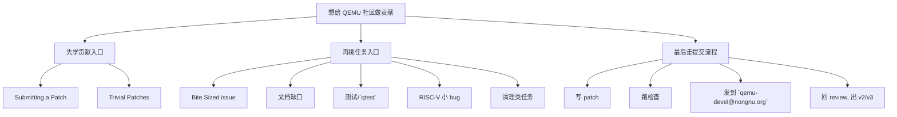

# QEMU 社区里现在可以怎么贡献（截至 2026-04-19）

这页回答的是一个很实际的问题：

- **如果我不只是自己学 QEMU，而是想往社区贡献一点东西，现在该从哪里切进去？**

---

## 先给整体图

---

## 社区贡献入口，先记住两个

### 1. 官方 patch 提交流程

QEMU 官方文档明确说：

- 贡献欢迎 bug fix、功能、文档改进
- 但 **提交入口不是直接在 issue 里贴 diff**
- 而是要把 patch 发到邮件列表 `qemu-devel@nongnu.org`

你最少要记住这几个要求：

- patch 里要有 `Signed-off-by:`
- 要准备回应 review
- 最终是走 **邮件列表 code review 工作流**

这点和很多 GitHub PR 项目不一样。

### 2. `Trivial Patches` 入口

官方专门保留了一条 trivial patch 通道，处理这类改动：

- 改动很小
- 通常只有单 patch 或很短 series
- 不属于特别活跃、有人天天盯着的大子系统

如果你做的是这种小修小补，官方建议：

- 可以把 patch 也抄送给 `qemu-trivial@nongnu.org`

这对第一次贡献很友好，因为：

- 你的题目不需要特别大
- 也不要求一开始就改一个重量级子系统

---

## 现在最适合切进去的 5 类任务

### 1. `Bite Sized` issue

这是最直接的社区“入口池”。

我在 **2026-04-19** 现查到的开放 `Bite Sized` issue 里，有这些比较典型：

- `#372`：TCG / CPU 子系统里把 TAB 缩进改成空格
- `#1798`：把 `malloc/calloc/free` 逐步换成 `g_malloc/g_new/g_free`
- `#227`：`meson` / `make help` 不完整
- `#414`：把一些 `errp` 位置的 `NULL` 换成 `&error_abort`
- `#89`：`mtdblock`、`option-rom`、`pflash` 文档缺失

这些题目有个共同点：

- scope 通常比较小
- review 成本相对低
- 很适合先熟悉 QEMU 的 patch 流程

### 2. 文档贡献

这是我最推荐你优先做的一类。

尤其适合现在的你，因为你已经在读：

- `RISC-V virt`
- 启动流程
- `QOM`
- 中断控制器

文档贡献可以是：

- 给现有文档补缺页
- 改不清楚的描述
- 补命令例子
- 补 `RISC-V` 相关 feature 的使用说明
- 把旧 wiki / 零散信息整理成更清晰的正式文档

为什么它很适合第一步：

- 你不一定要一开始就碰很深的语义 bug
- 但你会强迫自己把某个子系统真正讲清楚
- 这对后面做代码贡献特别有帮助

### 3. 测试 / `qtest`

很多 QEMU 改动不是先从“加功能”开始，而是从：

- 先补测试
- 先把 bug 固化成可复现 case

这类贡献很值钱，因为它会直接提高：

- 回归保护
- 可维护性
- reviewer 对 patch 的信心

如果你现在已经在看设备模型，那很自然的入口就是：

- 给某个 `MMIO`/板级设备补一个小 `qtest`

### 4. `RISC-V` 小 bug / 小规格修正

我在 **2026-04-19** 现查到的开放 `RISC-V` 相关 issue 里，有这些方向：

- `#3367`：`mstatus.UXL` 可写入保留值 `11`
- `#3380`：非法 `cbo` 指令时没有正确写 `mtval`
- `#2763`：`RISC-V APLIC` level-triggered 直送中断屏蔽后 pending 状态不对
- `#1606`：`fence.i` 不工作
- `#2828`：`RISC-V AIA` 过滤/虚拟中断可能有问题

这类题目更贴近你现在的学习线，但也要注意：

- 比起文档和 trivial cleanup，它们通常更需要你读规范
- 有些甚至要先写最小复现，再判断是实现 bug 还是预期行为

所以更适合当“第二阶段贡献”。

### 5. 清理类任务

QEMU 社区长期都有一些“不是新功能，但非常需要人做”的工作：

- API 清理
- 错误处理风格统一
- 内存分配 helper 统一
- 文档与代码风格收敛
- 小范围重构

这类任务看起来“没那么酷”，但其实非常社区友好，因为：

- reviewer 比较容易判断对不对
- 也能让你熟悉代码风格和 maintainer 预期

---

## 如果按你现在的背景，我会这样排优先级

### 第一优先级：文档 + 小测试

最适合你现在的原因：

- 你已经在积累 `RISC-V virt` / `QOM` / 启动流程知识
- 这时写文档和小测试，投入产出比最高
- 它能把“自己看懂”推进到“让别人也看懂 / 让 bug 可复现”

### 第二优先级：`Bite Sized` 里的小清理任务

例如：

- `#372`
- `#1798`
- `#227`
- `#414`

这类任务很适合你学：

- QEMU 提交格式
- commit message 风格
- maintainer / reviewer 工作流

### 第三优先级：`RISC-V` 实现 bug

例如：

- `#3367`
- `#3380`
- `#2763`

这类最贴你主线，但建议等你对：

- `virt`
- 中断
- CSR / 异常语义
- `qtest` / 最小复现

更熟一点再上。

---

## 如果你想真的开始贡献，我建议第一步不要太大

一个比较稳的起手顺序是：

1. 先读官方 `Submitting a Patch`
2. 挑一个 `Bite Sized` 或文档 issue
3. 本地做一个非常小的 patch
4. 跑格式/测试检查
5. 学会 `Signed-off-by:`、cover letter、v2/v3
6. 发到 `qemu-devel@nongnu.org`

也就是说，**QEMU 社区不是没有适合新人的任务，而是它的门槛主要不在“有没有小题”，而在“你要适应邮件列表式贡献流程”。**

---

## 对你最现实的建议

如果你现在就想开始，我最建议的不是直接扑进一个很深的 `RISC-V` 语义 bug，而是三选一：

1. **文档类**
   - 补 `RISC-V` / 设备 / 启动相关说明

2. **测试类**
   - 给一个你已经看懂的设备补最小 `qtest`

3. **Bite Sized 清理类**
   - 选一个 scope 很清楚、改动小的 issue

这三种都比“直接改大功能”更像第一次社区贡献的正确打开方式。

---

## 这页参考的当前入口

截至 **2026-04-19**，我这次主要参考了这些官方/项目入口：

- QEMU `Submitting a Patch`
  - <https://www.qemu.org/docs/master/devel/submitting-a-patch.html>
- QEMU `Trivial Patches`
  - <https://www.qemu.org/docs/master/devel/trivial-patches.html>
- QEMU 官方 GitLab issue 列表（`Bite Sized` 示例）
  - `#372`: <https://gitlab.com/qemu-project/qemu/-/work_items/372>
  - `#1798`: <https://gitlab.com/qemu-project/qemu/-/work_items/1798>
  - `#227`: <https://gitlab.com/qemu-project/qemu/-/work_items/227>
  - `#414`: <https://gitlab.com/qemu-project/qemu/-/work_items/414>
  - `#89`: <https://gitlab.com/qemu-project/qemu/-/work_items/89>
- QEMU 官方 GitLab issue 列表（`RISC-V` 示例）
  - `#3367`: <https://gitlab.com/qemu-project/qemu/-/work_items/3367>
  - `#3380`: <https://gitlab.com/qemu-project/qemu/-/work_items/3380>
  - `#2763`: <https://gitlab.com/qemu-project/qemu/-/work_items/2763>
  - `#1606`: <https://gitlab.com/qemu-project/qemu/-/work_items/1606>
  - `#2828`: <https://gitlab.com/qemu-project/qemu/-/work_items/2828>
