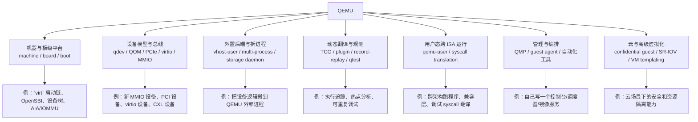
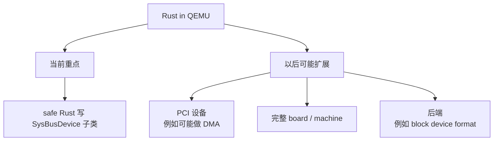

# 围绕 QEMU 能做什么：主线方向地图（2026-04）

这页不是在列“所有能和 QEMU 沾边的题目”，而是想回答一个更实际的问题：

- **如果以后继续围绕 `QEMU` 往下做，比较像“主线”的方向有哪些？**
- **哪些方向更适合你现在这个 `RISC-V virt` / 启动流程 / 设备模型的学习底子继续长出来？**

---

## 先给整体图



---

## 截至 2026-04-19，我会把现在比较“像主线”的方向分成 7 条

> 这里的“主线”不是说只有这些才算正统，  
> 而是说：**它们都能直接对上 QEMU 官方文档里现在持续存在的功能面。**

### 1. 板级平台 / 启动流程线

这是你现在最贴近的一条线。

典型关键词：

- `-M virt`
- firmware / bootloader / kernel / `DTB`
- `PLIC` / `AIA` / `IMSIC` / `APLIC`
- `RISC-V IOMMU`
- machine 初始化、内存图、复位向量

这条线适合做什么：

- 把 `virt` 启动链彻底吃透
- 增加一个小型板级外设
- 补某个 `RISC-V virt` 特性的实验验证
- 做“从命令行参数到设备树/内存图”的可视化工具

为什么它像主线：

- 这是 QEMU 最基础的 system emulation（整机模拟）能力。
- 官方文档里 `RISC-V AIA support`、`RISC-V IOMMU support` 都已经是单独规格文档。

### 2. 设备模型 / 总线模型线

这是最典型的“在 QEMU 上做东西”路线。

典型关键词：

- `QOM`
- `qdev`
- `SysBus`
- `PCIe`
- `virtio`
- `MMIO`
- `CXL`

这条线适合做什么：

- 写一个教学型 `MMIO` 设备
- 写一个 `PCI`/`PCIe` 设备原型
- 给现有设备补 feature / trace / test
- 做一个简单的 `virtio` 设备或理解 `virtio-mmio` / `virtio-pci`
- 往 `CXL` 设备模型、拓扑、内存窗口方向深入

为什么它像主线：

- 设备模型是 QEMU 最中心的工作内容之一。
- 官方文档现在仍然持续覆盖 `virtio`、`CXL`、`SR-IOV`、设备规格与内部 API。

### 补充：`Rust in QEMU` 当前最先瞄准哪类设备

`docs/devel/rust.rst` 里说：

> Right now, the focus is on making it possible to write devices that inherit from `SysBusDevice` in *safe* Rust.

这句话的意思不是“现在 QEMU 已经能用 Rust 重写所有设备”，而是说：**当前 Rust 支持的优先目标，是让开发者能用安全 Rust 写一类继承 `SysBusDevice` 的 QEMU 设备。**

可以把范围图先记成：



几个关键词要分开看：

- `SysBusDevice`：QEMU 里表示“系统总线设备”的基类，常用于板级代码固定创建和映射的 `MMIO` / `IRQ` 平台设备。
- `inherit from SysBusDevice`：新设备在 QOM（QEMU Object Model，QEMU 对象模型）类型层级里作为 `SysBusDevice` 的子类出现，类似 C 代码里写一个 `TYPE_SYS_BUS_DEVICE` 下面的具体设备类型。
- `safe Rust`：设备作者尽量只写 Rust 安全代码，不直接暴露裸指针、未定义行为、手动生命周期管理等 `unsafe` 细节；这些危险边界由 QEMU 的 Rust 封装层兜住。
- `PCI devices that can do DMA`：这类设备更复杂，因为 PCI（Peripheral Component Interconnect，外设部件互连）有配置空间、BAR（Base Address Register，基地址寄存器）、总线枚举等机制，DMA（Direct Memory Access，直接内存访问）还会涉及设备直接读写 guest 内存。
- `complete boards`：指以后也许能用 Rust 描述一整块 machine / board，而不只是写单个设备。
- `backends`：指 QEMU 设备或子系统背后的实现逻辑，例如块设备镜像格式、存储后端等。

所以学习时可以把它理解成一个阶段性路线：

```text
第一阶段：先把最典型、边界相对清楚的 SysBus/MMIO 设备用 Rust 安全地写出来
第二阶段：再考虑 PCI/DMA、整板 machine、block 后端这类更复杂的 QEMU 子系统
```

### 3. 外置后端 / 拆进程线

这条线很适合以后做“QEMU 不是全部，QEMU 只是前台”的项目。

典型关键词：

- `vhost-user`
- `multi-process QEMU`
- `qemu-storage-daemon`
- `virtiofsd`

这条线适合做什么：

- 把一个设备后端写成独立 daemon，而不是塞进 QEMU 主进程
- 试做一个 `vhost-user` 实验设备
- 做存储导出、镜像管理、块层服务
- 探索“前台 QEMU + 后台专用服务”的架构

为什么它像主线：

- 官方文档明确提供了 `multi-process QEMU`、`vhost-user back ends`、`QEMU Storage Daemon`。
- 这意味着 QEMU 官方已经把“拆分成多个进程/多个服务协作”当成了正经方向，而不是野路子。

### 4. 动态翻译 / 观测 / 可重复调试线

这条线更偏“QEMU 是研究仪器”。

典型关键词：

- `TCG`（Tiny Code Generator，微型代码生成器）
- plugin
- `record/replay`
- `qtest`
- execution tracing

这条线适合做什么：

- 写一个 `TCG plugin` 统计基本块、指令、访存
- 做 guest 执行热点分析
- 做系统启动过程指令级追踪
- 利用 `record/replay` 做可重复调试
- 给设备模型补 `qtest`

为什么它像主线：

- 官方开发文档里单独有 `TCG Plugins`、`Record/replay`、`QTest`。
- 这说明 QEMU 不只是“跑起来”，它也是一个很强的实验/分析平台。

### 5. 用户态跨 ISA 执行线

这条线不是整机，而是“跨架构跑程序”。

典型关键词：

- `qemu-user`
- syscall translation
- signal handling
- threading
- compatibility layer

这条线适合做什么：

- 理解和实验“为什么不模拟整台机器也能跑别的架构程序”
- 研究 `syscall` 翻译与 ABI 边界
- 做面向开发者的跨架构调试/测试工具
- 往 `QEMU + Wine` / 兼容层思路延伸

为什么它像主线：

- 官方一直把 `User Mode Emulation` 作为和 `System Emulation` 并列的一大类能力。

### 6. 管理接口 / 自动化编排线

这条线最像“围绕 QEMU 搭平台”。

典型关键词：

- `QMP`（QEMU Machine Protocol，QEMU 机器协议）
- `qemu-ga`（QEMU Guest Agent，QEMU 来宾代理）
- block job
- snapshot
- orchestration

这条线适合做什么：

- 自己写一个最小版 VM 管理器
- 做批量起虚机、发命令、收状态的工具
- 做镜像转换/导出/快照流程
- 用 `QMP` 把 QEMU 接到你自己的实验平台或 Web 控制台

为什么它像主线：

- 官方把 `QMP Reference Manual`、`QEMU Guest Agent`、`QEMU Storage Daemon QMP` 都单独维护成文档。
- 这说明“通过协议管理 QEMU”是稳定接口层，不只是内部调试口。

### 7. 云与高级虚拟化线

这条线更偏云基础设施/生产特性。

典型关键词：

- confidential guest
- `SEV` / `TDX`
- `VM templating`
- `SR-IOV`
- passthrough / isolation

这条线适合做什么：

- 理解云虚拟化里“QEMU 负责什么、硬件/内核负责什么”
- 做资源隔离、安全、快速克隆、设备直通相关实验
- 往 cloud hypervisor / 虚拟化平台能力延伸

为什么它像主线：

- 官方系统文档里现在已经有 `Confidential Guest Support`、`QEMU VM templating`、`Composable SR-IOV device` 这些主题。
- 说明这条线已经不是边角料，而是正式能力面的一部分。

---

## 如果你问“我以后在这个平台上能做点什么”，我会先给你 3 个层级

### A. 最适合你当前阶段的：板级 + 设备模型

最推荐先做这类：

1. **给 `RISC-V virt` 增一个很小的教学型 `MMIO` 设备**
   - 例如计数器、状态寄存器、门铃、中断触发器
   - 你会顺手把 `QOM`、`MemoryRegionOps`、IRQ、设备树挂接都过一遍

2. **把 `virt` 的某条启动/中断/IOMMU 分支做成“源码 + 图 + 命令 + 现象”笔记**
   - 例如 `AIA` 打开和关闭时，设备树和初始化路径有什么变化
   - 这种项目看起来小，但特别能沉淀主线理解

3. **给某个已有设备补 `qtest`**
   - 这会逼你真正理解“设备对外暴露了什么寄存器语义”

这三类最适合你现在的原因很简单：

- 你当前已经在读 `virt`、启动流程、QOM、设备模型
- 这几类项目几乎都能复用你现在的积累
- 不需要一上来就碰特别重的云平台或超复杂后端

### B. 再往上一层：外置后端 / 管理接口

当你已经不满足“只在 QEMU 进程内写设备”时，可以上这层。

比较好的题目：

1. **写一个最小版 `vhost-user` 设备后端**
2. **写一个基于 `QMP` 的小型 VM 管理脚本/服务**
3. **围绕 `qemu-storage-daemon` 做镜像导出、快照、块设备实验**

这层的价值在于：

- 你会开始理解 **QEMU 作为平台组件**，而不是单体程序
- 也更像以后真正能接近平台工程/虚拟化平台的工作方式

### C. 更偏研究味的：TCG / 插件 / record-replay / user-mode

如果你以后想把 QEMU 当“研究工具”而不只是“虚拟机”：

1. **做一个 `TCG plugin`**
   - 指令统计
   - 热点块统计
   - 访存/分支行为采样

2. **用 `record/replay` 做可重复调试实验**
   - 这很适合内核 / 启动问题 / 非确定性问题

3. **研究 `qemu-user`**
   - 这条线很容易延伸到兼容层、跨架构开发工具、程序分析

---

## 如果只想要“以后可以做的具体题目”，我给你一版从近到远的清单

### 近线题目：1~2 周可起步

- 给 `RISC-V virt` 加一个简单 `MMIO` 教学设备
- 画清楚 `virt` 的某段启动链并配合 `gdbstub` 验证
- 给一个设备写最小 `qtest`
- 做一个“QEMU 命令行 -> 设备树节点/内存图”的解析脚本

### 中线题目：2~6 周能做出像样 demo

- 写一个最小 `vhost-user` 后端
- 写一个基于 `QMP` 的 VM 控制台
- 给 `virt` 某个子系统补 trace / debug 工具
- 做 `record/replay + gdb` 的可重复调试工作流

### 远线题目：更像研究/平台方向

- 深入 `TCG` translator / plugin / profiling
- 做 `qemu-user` + ABI / syscall 翻译研究
- 做 `CXL` / `SR-IOV` / confidential guest 相关实验平台
- 往多进程 QEMU、设备拆分、云虚拟化控制面继续走

---

## 如果你让我直接给建议：下一阶段优先级怎么排

我会这样排：

1. **先继续压实 `RISC-V virt` + 设备模型**
2. **然后补一条 `qtest` / tracing / 调试验证线**
3. **再选“外置后端”或“管理接口”二选一**
4. **最后再决定要不要上 `TCG` / `user-mode` / 云虚拟化高级特性**

原因是：

- 前两步最能打地基
- 第三步开始，QEMU 才真正从“源码阅读对象”变成“平台组件”
- 第四步再往上，才更像研究方向或平台方向分叉

---

## 一句话结论

- **如果你想问“围绕 QEMU 以后还能做什么”，答案其实很多，但最主线的不是“换个题目继续写虚机命令”，而是沿着 `板级平台 → 设备模型 → 外置后端 / 管理接口 → 动态翻译 / 高级虚拟化` 这条路逐层往外长。**
- **对你现在这套 `QEMU + RISC-V virt + 启动流程 + QOM` 的学习底子来说，下一步最自然的是：先做小设备 / 小测试 / 小调试工具，再往 `QMP` 或 `vhost-user` 走。**

如果你已经开始考虑“那我能不能直接去社区贡献”，可以继续看：

- [QEMU 社区里现在可以怎么贡献（截至 2026-04-19）](qemu-community-contribution.md)

---

## 这页判断所参考的官方线索

截至 **2026-04-19**，QEMU 官网下载页可见：

- `11.0.0-rc4` 发布于 **2026-04-14**

我这次判断“哪些方向仍然像主线”，主要依据的是官方文档中仍被持续维护的主题：

- QEMU 下载页：当前版本线
  - <https://www.qemu.org/download/>
- 文档总目录：当前仍被官方单列维护的能力面
  - <https://www.qemu.org/docs/master/>
- Multi-process QEMU
  - <https://www.qemu.org/docs/master/system/multi-process.html>
- vhost-user back ends
  - <https://www.qemu.org/docs/master/system/devices/virtio/vhost-user.html>
- QTest
  - <https://www.qemu.org/docs/master/devel/testing/qtest.html>
- QEMU TCG Plugins
  - <https://www.qemu.org/docs/master/devel/tcg-plugins.html>
- Record/replay
  - <https://www.qemu.org/docs/master/system/replay.html>
- User Mode Emulation
  - <https://www.qemu.org/docs/master/user/main.html>
- QMP Reference
  - <https://www.qemu.org/docs/master/interop/qemu-qmp-ref.html>
- QEMU Storage Daemon
  - <https://www.qemu.org/docs/master/tools/qemu-storage-daemon.html>
- Confidential Guest Support
  - <https://www.qemu.org/docs/master/system/confidential-guest-support.html>
- QEMU VM templating
  - <https://www.qemu.org/docs/master/system/vm-templating.html>
- Composable SR-IOV device
  - <https://www.qemu.org/docs/master/system/sriov.html>
- RISC-V AIA support
  - <https://www.qemu.org/docs/master/specs/riscv-aia.html>
- RISC-V IOMMU support
  - <https://www.qemu.org/docs/master/specs/riscv-iommu.html>
