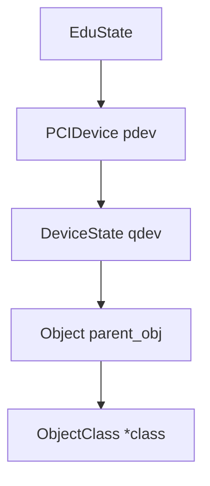
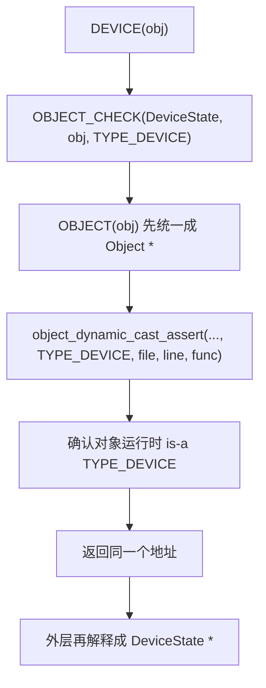

# QOM 对象布局与转型宏

这页只管两件事：

- 为什么 QOM 能在 C 里模拟继承
- 为什么 `OBJECT_CHECK(...)` / `DEVICE(obj)` 这些宏能成立

## QOM 的核心布局技巧

最短一句话：

- **子结构体把父结构体放在第一个字段**

所以：

- `DeviceState *`
- `&dev->parent_obj`
- `Object *`

可以落在同一个起始地址上。

## 一个最常见的实例链



这张图表达的是：

- 第一个字段一层层嵌套

不是：

- 运行时指针跳来跳去

## `Object.parent` 为什么不是继承链

`Object` 里有：

- `Object *parent`

它表示的是：

- QOM 对象树里的父对象

它不是：

- `PCIDevice` 继承 `DeviceState` 的那层“父类”

最短记法：

- 首字段嵌入
  - 管继承布局
- `Object.parent`
  - 管对象树关系

## 常见 cast / check 宏先总览一下

| 宏/函数 | 检查谁 | 一句话理解 |
| --- | --- | --- |
| `OBJECT(obj)` | 不做检查 | 先统一看成 `Object *` |
| `OBJECT_CLASS(klass)` | 不做检查 | 先统一看成 `ObjectClass *` |
| `OBJECT_CHECK(type, obj, name)` | 实例 | 运行时确认对象 is-a `name` |
| `OBJECT_CLASS_CHECK(type, klass, name)` | 类对象 | 运行时确认类对象 is-a `name` |
| `OBJECT_GET_CLASS(type, obj, name)` | 从实例取类对象 | 再做类型安全包装 |

## `DECLARE_INSTANCE_CHECKER(...)` 在干什么

它本质上只是：

- 生成一个“实例侧 checked cast helper”

例如：

```c
DECLARE_INSTANCE_CHECKER(DeviceState, DEVICE, TYPE_DEVICE)
```

近似展开后就是：

```c
static inline DeviceState *DEVICE(const void *obj)
{
    return OBJECT_CHECK(DeviceState, obj, TYPE_DEVICE);
}
```

所以：

- `DEVICE(obj)`
  - 不是新机制
- 它只是把：
  - `OBJECT_CHECK(DeviceState, obj, TYPE_DEVICE)`
  - 包成更好读的专用入口

## `OBJECT_DECLARE_TYPE(...)` 到底声明了什么

例如：

```c
#define TYPE_DEVICE "device"
OBJECT_DECLARE_TYPE(DeviceState, DeviceClass, DEVICE)
```

它最重要的职责不是“注册类型”，而是：

- 在头文件里声明一组 C 侧 helper

可以把它理解成三件事：

1. 确定实例侧 C 结构体名
   - `DeviceState`
2. 确定类侧 C 结构体名
   - `DeviceClass`
3. 确定宏前缀
   - `DEVICE`

然后生成：

- `DEVICE(obj)`
- `DEVICE_CLASS(klass)`
- `DEVICE_GET_CLASS(obj)`

这些 helper。

### 为什么这里只传 `DeviceState` 和 `DeviceClass`

因为它只负责：

- 名字
- cast helper

它不负责：

- 父类型是谁
- `instance_size` 多大
- `class_size` 多大
- `class_init` / `instance_init` 是谁
- interface 列表是什么

那些信息都属于：

- `TypeInfo`
- 或 `OBJECT_DEFINE_TYPE(...)`

## `OBJECT_CHECK(...)` 的真实逻辑

定义大致是：

```c
#define OBJECT_CHECK(type, obj, name) \
  ((type *)object_dynamic_cast_assert(OBJECT(obj), (name), __FILE__, __LINE__, __func__))
```

三个参数要分清：

| 参数 | 所属世界 | 例子 |
| --- | --- | --- |
| `type` | C 类型系统 | `DeviceState` |
| `obj` | 当前对象指针 | `obj` / `dev` |
| `name` | QOM 运行时类型系统 | `TYPE_DEVICE` -> `"device"` |

所以：

- `type`
  - 决定返回值在 C 编译器眼里是什么类型
- `name`
  - 决定运行时到底按哪个 QOM 类型名去检查

## `OBJECT_CHECK(...)` 这条链怎么走



注意：

- 成功时返回的是同一个地址
- 它不是“生成新对象”
- 也不是“做指针偏移换地址”

## `object_dynamic_cast_assert(...)` 真正在干什么

可以先压成一句话：

- **实例级安全转型 + 调试断言入口**

更细一点，它会做这些事：

1. 先记一条 trace
2. 如果开了 `CONFIG_QOM_CAST_DEBUG`
   - 先查成功缓存
   - 再做真正的动态类型检查
   - 失败时打印 `file` / `line` / `func` 并 `abort()`
3. 成功时返回原地址

最关键的一句是：

- **QOM 的 cast 成功后，返回的还是原来的对象地址，只是你现在可以按更具体类型解释它。**

## `CONFIG_QOM_CAST_DEBUG` 要怎么理解

它是 Meson 构建选项，不是源码里手写常量。

最准确的说法是：

- 默认倾向开启
- 但可以显式关闭

所以你应该把它理解成：

- “默认保留的运行时类型安全检查”

而不是：

- “永远不可关闭的硬规则”

## 为什么还要再包一层 `MY_DEVICE(obj)` 这种宏

因为这样调用点更像“这个类型自己的 API”。

它们主要解决四件事：

1. 不用每次手写很长的 `OBJECT_CHECK(...)`
2. 区分“我要实例”“我要类对象”“我要从实例拿类对象”
3. 保留运行时类型检查
4. 让调用点一眼看出期待的具体类型

所以：

- `MY_DEVICE(obj)`
  - 不是新能力
- 只是：
  - “带检查的、可读性更好的类型专用入口”

## `OBJECT_CHECK(...)` 和 `OBJECT_CLASS_CHECK(...)` 最本质的区别

| 名字 | 检查对象 | 依赖什么 |
| --- | --- | --- |
| `OBJECT_CHECK(...)` | 实例 | `obj->class->type` |
| `OBJECT_CLASS_CHECK(...)` | 类对象 | `class->type` 和 interface 链 |

也就是说：

- 前者从实例出发
- 后者从类对象出发

## 和 `g_autoptr` 的关系

`OBJECT_DECLARE_TYPE(...)` 旁边你经常还会看到：

- `G_DEFINE_AUTOPTR_CLEANUP_FUNC(...)`

这部分不是 QOM 类型注册主线，而是：

- GLib 给 `g_autoptr(...)` 用的自动清理规则

如果你想补这块背景，建议顺带看：

- [QEMU 源码阅读里的 C 语言与头文件基础](../c/c-language-and-headers.md)

## 一句话收束

1. QOM 用“父结构体放第一个字段”在 C 里模拟继承。
2. `OBJECT(obj)` 只是统一入口，不是真正的检查。
3. 真正的实例类型判断在 `object_dynamic_cast_assert(...)`。
4. 成功 cast 后返回的还是原地址。
5. `DEVICE(obj)`、`PCI_DEVICE(obj)` 这种宏本质上只是具体类型的专用 checked cast helper。
