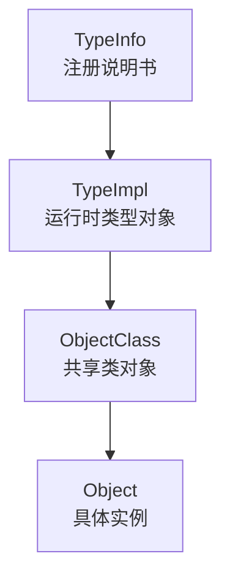

# QOM 四个核心对象与两条链

这页只回答一个问题：

- `QOM` 到底在维护哪些“层次不同”的对象

## 一张图先看



这四个名字里，最容易混的是中间两层：

- `TypeImpl`
  - 更像“后台类型档案”
- `ObjectClass`
  - 更像“这个类型真正给实例共享的类对象”

## 两条链要分开看

### 1. 实例链

```text
Object -> DeviceState -> PCIDevice -> EduState
```

它回答的问题是：

- 这个对象实例里有哪些字段
- 这些字段在内存里怎么排

### 2. 类链

```text
ObjectClass -> DeviceClass -> PCIDeviceClass
```

它回答的问题是：

- 这个类型有哪些共享方法
- 这个类型有哪些类级属性

所以不要把下面两件事混成一件：

- `DeviceState`
  - 是 `TYPE_DEVICE` 这个类型的实例侧 C 结构体
- `DeviceClass`
  - 是 `TYPE_DEVICE` 这个类型的类侧 C 结构体

## `Object` 到底是什么

先把 `Object` 记成：

- 所有 QOM 实例对象共同的头部

它最关键的几个字段可以先这样记：

| 字段 | 作用 |
| --- | --- |
| `class` | 指向这个实例当前运行时类型对应的类对象 |
| `ref` | 引用计数 |
| `parent` | QOM 对象树里的父对象 |

最短记法：

- `class`
  - 管“我是什么类型”
- `ref`
  - 管“我还能不能被释放”
- `parent`
  - 管“我挂在对象树里的哪里”

## `ObjectClass` 到底是什么

先把 `ObjectClass` 记成：

- 所有类对象共同的头部

它不是某个“语言级 class 定义”本身，而是：

- 运行时真正存在的一块共享类对象内存

这块内存里最关键的是：

- `type`
  - 反查到自己对应哪个 `TypeImpl`
- `interfaces`
  - 挂着这个类型已经初始化好的接口类链表
- `properties`
  - 类级属性表

所以：

- `TypeImpl`
  - 持有并缓存 `ObjectClass`
- `Object`
  - 通过 `obj->class` 指向 `ObjectClass`

## `TypeInfo` 和 `TypeImpl` 的关系

### `TypeInfo`

它是源码作者填写的静态说明书，例如：

```c
static const TypeInfo pci_device_type_info = {
    .name = TYPE_PCI_DEVICE,
    .parent = TYPE_DEVICE,
    .instance_size = sizeof(PCIDevice),
    .class_size = sizeof(PCIDeviceClass),
    .class_init = pci_device_class_init,
};
```

### `TypeImpl`

它是 QOM 内部真正运转的运行时类型对象。

所以更准确的话是：

- `TypeInfo`
  - 告诉 QOM“希望怎么注册这个类型”
- `TypeImpl`
  - 是 QOM 把这份说明书读进去后形成的内部工作对象

## 一个最常见的真实链条

假设你手上拿的是一个 `PCIDevice *pdev`，那最关键的关系是：

```text
PCIDevice *
  -> DeviceState qdev
  -> Object parent_obj
  -> Object.class
  -> PCIDeviceClass / DeviceClass / ObjectClass
```

这条链表达的是：

1. `PCIDevice` 实例最前面嵌了 `DeviceState`
2. `DeviceState` 最前面嵌了 `Object`
3. `Object` 里有 `class`
4. 这个 `class` 指向共享类对象

所以：

- 实例对象不是“包含一个 `DeviceClass`”
- 实例对象是“通过 `Object.class` 指向自己的类对象”

## `Object.parent` 为什么不是继承链

这是初学时最容易混的一点。

`Object.parent` 表示的是：

- QOM composition tree 里的父对象

它不是：

- `PCIDevice` 的父类
- `DeviceState` 的父类
- `Object` 头部嵌入那条继承链

最短记法：

- “首字段嵌入”
  - 管继承布局
- `Object.parent`
  - 管对象树挂载关系

## `struct Object` / `struct ObjectClass` 那两段注释应该怎么读

### `struct Object`

它的核心意思是：

- 所有子对象都把父对象头放在第一个字段
- 所以任何子对象都可以无偏移地先看成 `Object *`
- 再通过 `obj->class` 去判断运行时真实类型

### `struct ObjectClass`

它的核心意思是：

- 所有类对象也有共同头部
- 这个头部里最关键的是“我对应哪个运行时类型”

如果你看到文档里提到：

- `integer type handle`

不要机械理解成“这里真有个整数句柄”。

按当前代码，更接近事实的说法是：

- `ObjectClass.type` 持有的是一个 `Type`
- 而 `Type` 本质上是：
  - `typedef struct TypeImpl *Type;`

也就是：

- 一个指向 `TypeImpl` 的句柄

## 一句话收束

- `TypeInfo`
  - 是输入说明书
- `TypeImpl`
  - 是后台运行时类型对象
- `ObjectClass`
  - 是类型共享的类对象
- `Object`
  - 是真正被创建出来的实例

如果你接下来想看“这些东西是怎么被注册出来的”，跳到：

- [QOM 类型注册与模块初始化](qom-type-registration.md)

如果你接下来想看“为什么 `OBJECT_CHECK(...)` 能成立”，跳到：

- [QOM 对象布局与转型宏](qom-casts-and-layout.md)
