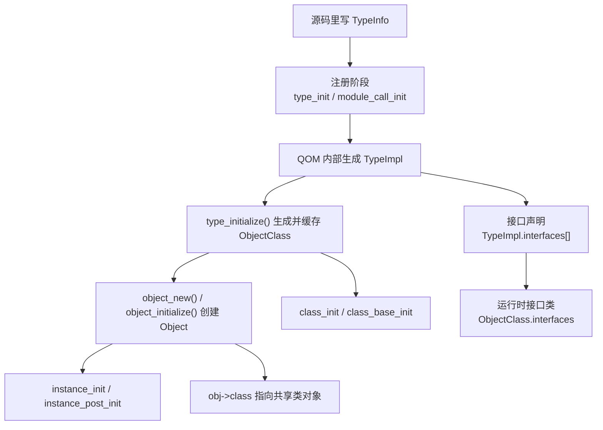

# QEMU QOM 对象模型总览

这页现在只做一件事：

- 给 `QOM`（QEMU Object Model，QEMU 对象模型）建立总图

原来那份 5000 多行的长文已经按主题拆开，避免把：

- 核心对象关系
- 类型注册
- 转型宏
- `TypeImpl`
- 类初始化 / 实例初始化
- interface / property / 对象树

都堆在一个文件里。

## 先看整体图

## 先记四个核心名字

| 名字 | 它是什么 | 最短记法 |
| --- | --- | --- |
| `TypeInfo` | 源码里手写的注册说明书 | 输入配方 |
| `TypeImpl` | QOM 内部运行时类型对象 | 后台类型档案 |
| `ObjectClass` | 某个类型共享的类对象 | 方法表 + 类属性 |
| `Object` | 真正创建出来的实例 | 对象头 |

## 这套笔记现在怎么分

1. [QOM 四个核心对象与两条链](qom-core-objects.md)
   - 讲 `Object`、`ObjectClass`、`TypeInfo`、`TypeImpl` 之间的层次关系
   - 讲实例链、类链、`Object.parent`、`class` / `ref` / `parent`
2. [QOM 类型注册与模块初始化](qom-type-registration.md)
   - 讲 `type_init(...)`、`module_call_init(...)`、`type_register_static(...)`
   - 讲 `TYPE_OBJECT` / `TYPE_INTERFACE` 自举、`type_register_internal()`、`module_obj(...)`
3. [QOM 对象布局与转型宏](qom-casts-and-layout.md)
   - 讲“首字段嵌入”为什么能模拟继承
   - 讲 `OBJECT_CHECK(...)`、`OBJECT_CLASS_CHECK(...)`、`OBJECT_DECLARE_TYPE(...)`
4. [QOM 的 `TypeImpl`、类初始化与对象创建](qom-typeimpl-and-object-creation.md)
   - 讲 `type_initialize()` 真正在做什么
   - 讲 `class_init` / `instance_init`、`memcpy(parent->class)`、`object_new()`
5. [QOM 的 interface、property 与对象树](qom-interfaces-properties-and-composition.md)
   - 讲 `TypeInfo.interfaces`、`TypeImpl.interfaces[]`、`ObjectClass.interfaces`
   - 讲 `class->properties` / `obj->properties`、`Object.parent`、`opaque`

## 按问题来读

### 我先想搞清“QOM 里到底有哪些对象”

1. [QOM 四个核心对象与两条链](qom-core-objects.md)
2. [QOM 的 `TypeImpl`、类初始化与对象创建](qom-typeimpl-and-object-creation.md)

### 我在追“这个类型是怎么注册进 QOM 的”

1. [QOM 类型注册与模块初始化](qom-type-registration.md)
2. [QOM 的 `TypeImpl`、类初始化与对象创建](qom-typeimpl-and-object-creation.md)

### 我在追 `OBJECT_CHECK(...)`、`DEVICE(obj)`、`OBJECT_DECLARE_TYPE(...)`

1. [QOM 对象布局与转型宏](qom-casts-and-layout.md)
2. [QOM 四个核心对象与两条链](qom-core-objects.md)

### 我在追 interface、property、对象树关系

1. [QOM 的 interface、property 与对象树](qom-interfaces-properties-and-composition.md)
2. [QOM 的 `TypeImpl`、类初始化与对象创建](qom-typeimpl-and-object-creation.md)

## 30 秒复习版

1. `TypeInfo` 是注册说明书，`TypeImpl` 是 QOM 内部真正运转的类型对象。
2. `ObjectClass` 是共享类对象，`Object` 是具体实例。
3. 实例链和类链都靠“父结构体放第一个字段”来模拟继承。
4. `type_init(...)` 挂的是注册函数，不是 `TypeInfo` 本身。
5. `module_call_init(MODULE_INIT_QOM)` 才会真正执行这些注册函数。
6. `type_initialize()` 会建好 `ti->class`，并跑 `class_base_init` / `class_init`。
7. `object_new()` / `object_initialize_with_type()` 会创建实例，并跑 `instance_init`。
8. interface、property、对象树关系，都是在这条主线旁边补到类对象或实例对象上的运行时结构。
