# QEMU QOM 对象模型基础

这份笔记只保留 **QOM 主线**：

- 对象长什么样
- 类型怎么注册
- 运行时怎么做转型
- 类初始化和实例初始化怎么配合
- `edu.c` 这种设备代码是怎么接到 QOM 上的

不再把所有问答都原样堆进来。更细的术语解释放到旁边笔记里：

- [C 语言与头文件基础](../c/c-language-and-headers.md)
- [RISC-V virt 术语表](../riscv-virt/glossary.md)
- [RISC-V virt 启动阅读指引](../riscv-virt/virt-init-reading-guide.md)

---

- [QEMU QOM 对象模型基础](#qemu-qom-对象模型基础)
  - [一张图先看全局](#一张图先看全局)
  - [四个核心对象](#四个核心对象)
  - [类型注册主线](#类型注册主线)
    - [最重要的纠正](#最重要的纠正)
    - [`TypeInfo` 常见有三种来源](#typeinfo-常见有三种来源)
    - [注册流程图](#注册流程图)
    - [以 `PCIDevice` 看 `TypeInfo -> TypeImpl -> 实例` 怎么接起来](#以-pcidevice-看-typeinfo---typeimpl---实例-怎么接起来)
    - [为什么 `pci.c` 里同时有“总线抽象”和“设备抽象”](#为什么-pcic-里同时有总线抽象和设备抽象)
    - [关键源码位置](#关键源码位置)
    - [`module.h` 和 `module.c` 整体在干嘛](#moduleh-和-modulec-整体在干嘛)
    - [QEMU module 是什么，什么时候会起作用](#qemu-module-是什么什么时候会起作用)
      - [1. `main()` 之前：登记初始化函数](#1-main-之前登记初始化函数)
      - [2. QEMU 启动早期：统一执行某类初始化函数](#2-qemu-启动早期统一执行某类初始化函数)
      - [3. 按需使用某个 QOM 类型时：可能触发动态模块加载](#3-按需使用某个-qom-类型时可能触发动态模块加载)
      - [4. 某些命令需要列出/检查全部类型时：会加载全部 QOM 模块](#4-某些命令需要列出检查全部类型时会加载全部-qom-模块)
    - [`module_obj(TYPE_MY_DEVICE)` 是干什么的](#module_objtype_my_device-是干什么的)
    - [`module_init(function, type)` 宏怎么读](#module_initfunction-type-宏怎么读)
    - [`init_type_list[MODULE_INIT_QOM]` 到底是什么](#init_type_listmodule_init_qom-到底是什么)
    - [`register_module_init()` 在做什么](#register_module_init-在做什么)
    - [`edu` 这类代码怎么接上来](#edu-这类代码怎么接上来)
    - [QOM 自己的根类型也走同一条链](#qom-自己的根类型也走同一条链)
    - [为什么非得在 `object.c` 里先挂上这两个 `TypeInfo`](#为什么非得在-objectc-里先挂上这两个-typeinfo)
      - [`interface_info` 的作用](#interface_info-的作用)
      - [`object_info` 的作用](#object_info-的作用)
      - [为什么这里用 `type_register_internal()`，不是 `type_register_static()`](#为什么这里用-type_register_internal不是-type_register_static)
      - [这两个名字为什么这么取](#这两个名字为什么这么取)
      - [如果不先注册这两个根类型，会怎样](#如果不先注册这两个根类型会怎样)
  - [对象布局与转型](#对象布局与转型)
    - [为什么子对象能直接当成 `Object *`](#为什么子对象能直接当成-object-)
    - [一个实例链例子](#一个实例链例子)
    - [`Object.parent` 不是继承链](#objectparent-不是继承链)
    - [常见 cast/check 宏](#常见-castcheck-宏)
    - [`DECLARE_INSTANCE_CHECKER(...)` 是干什么的](#declare_instance_checker-是干什么的)
    - [`OBJECT_DECLARE_TYPE(DeviceState, DeviceClass, DEVICE)` 展开看](#object_declare_typedevicestate-deviceclass-device-展开看)
    - [为什么这里只传 `DeviceState` 和 `DeviceClass`](#为什么这里只传-devicestate-和-deviceclass)
    - [把 `OBJECT_CHECK(...)` 展开看](#把-object_check-展开看)
      - [`CONFIG_QOM_CAST_DEBUG` 什么时候会开启](#config_qom_cast_debug-什么时候会开启)
    - [`object_dynamic_cast_assert(...)` 这一个函数到底在干什么](#object_dynamic_cast_assert-这一个函数到底在干什么)
      - [1. 先记一条 trace](#1-先记一条-trace)
      - [2. 真正的断言逻辑只在 `CONFIG_QOM_CAST_DEBUG` 下启用](#2-真正的断言逻辑只在-config_qom_cast_debug-下启用)
      - [3. 先查一个很小的成功缓存](#3-先查一个很小的成功缓存)
      - [4. 缓存没命中，就走真正的动态检查](#4-缓存没命中就走真正的动态检查)
      - [5. 如果 cast 失败，而且对象本身不是空指针，就报错退出](#5-如果-cast-失败而且对象本身不是空指针就报错退出)
      - [6. 成功时断言“返回值必须还是原地址”](#6-成功时断言返回值必须还是原地址)
      - [7. 把成功结果塞进缓存，优化下次 cast](#7-把成功结果塞进缓存优化下次-cast)
      - [8. 最后为什么返回 `obj` 而不是 `inst`](#8-最后为什么返回-obj-而不是-inst)
    - [为什么每个类型还要再包一层 `MY_DEVICE(...)` 这种宏](#为什么每个类型还要再包一层-my_device-这种宏)
    - [`OBJECT_CHECK(...)` 和 `OBJECT_CLASS_CHECK(...)` 最本质的区别](#object_check-和-object_class_check-最本质的区别)
  - [类初始化与实例初始化](#类初始化与实例初始化)
    - [可以先把它们分成两层](#可以先把它们分成两层)
    - [最常见的创建流程](#最常见的创建流程)
    - [这里最值得背的 4 句话](#这里最值得背的-4-句话)
  - [属性表与 `parent` 指针](#属性表与-parent-指针)
    - [属性有两层](#属性有两层)
    - [`parent` 指针什么时候有值](#parent-指针什么时候有值)
    - [`MemoryRegion` 里的 `opaque` 是什么](#memoryregion-里的-opaque-是什么)
      - [Notion 笔记：`void *`、`BqlCell`、`BqlRefCell`、`Opaque` 怎么理解](#notion-笔记void-bqlcellbqlrefcellopaque-怎么理解)
        - [一句话结论](#一句话结论)
        - [为什么不要直接转成 `&mut`](#为什么不要直接转成-mut)
        - [正确的心智模型](#正确的心智模型)
        - [三个类型分别干什么](#三个类型分别干什么)
        - [`BqlCell` / `BqlRefCell` 为什么带 `Bql`](#bqlcell--bqlrefcell-为什么带-bql)
        - [`vmstate` 为什么认识它们](#vmstate-为什么认识它们)
        - [`Opaque<T>` 是干什么的](#opaquet-是干什么的)
        - [最终怎么记](#最终怎么记)
  - [以 `edu` 为例](#以-edu-为例)
    - [实例链怎么展开](#实例链怎么展开)
    - [`class` 和 `parent` 分别该怎么看](#class-和-parent-分别该怎么看)
    - [一句话版](#一句话版)
  - [`DeviceState` 速读](#devicestate-速读)
    - [它和具体设备的关系](#它和具体设备的关系)
    - [最值得记住的几个字段](#最值得记住的几个字段)
    - [关于 `PCI` / `GPIO` / `IRQ` / `clock`](#关于-pci--gpio--irq--clock)
  - [`TypeImpl` 速读](#typeimpl-速读)
    - [它到底是什么](#它到底是什么)
    - [最重要的字段](#最重要的字段)
    - [`struct InterfaceImpl { const char *typename; }` 到底在干什么](#struct-interfaceimpl--const-char-typename--到底在干什么)
    - [为什么它目前只需要一个 `typename`](#为什么它目前只需要一个-typename)
    - [它不是最终接口对象](#它不是最终接口对象)
    - [interface 的函数指针到底放在哪里](#interface-的函数指针到底放在哪里)
    - [`ObjectClass.interfaces` 和 `TypeImpl.interfaces[]` 到底是什么关系](#objectclassinterfaces-和-typeimplinterfaces-到底是什么关系)
    - [一句话记忆](#一句话记忆)
    - [最重要的函数](#最重要的函数)
    - [从 `object.h` 开始看，它在整层抽象里的位置](#从-objecth-开始看它在整层抽象里的位置)
    - [`TypeInfo` 和 `ObjectClass` 的关系](#typeinfo-和-objectclass-的关系)
    - [为什么 `TypeInfo` 和 `TypeImpl` 看起来很多字段都差不多](#为什么-typeinfo-和-typeimpl-看起来很多字段都差不多)
    - [为什么不直接只保留一个 `TypeInfo`](#为什么不直接只保留一个-typeinfo)
      - [1. `TypeInfo` 更像外部输入](#1-typeinfo-更像外部输入)
      - [2. `TypeImpl` 更像内部工作状态](#2-typeimpl-更像内部工作状态)
    - [所以它们的关系更像什么](#所以它们的关系更像什么)
    - [能不能类比成 `TypeInfo : TypeImpl = ObjectClass : Object`](#能不能类比成-typeinfo--typeimpl--objectclass--object)
    - [类和对象到底是什么关系](#类和对象到底是什么关系)
    - [那 `TypeImpl` 和 `ObjectClass` 更像什么关系](#那-typeimpl-和-objectclass-更像什么关系)
    - [为什么 `TypeInfo` 放在 `object.h`，但 `TypeImpl` 放在 `object.c`](#为什么-typeinfo-放在-objecth但-typeimpl-放在-objectc)
      - [1. 为什么 `TypeInfo` 必须放头文件里](#1-为什么-typeinfo-必须放头文件里)
      - [2. 为什么 `TypeImpl` 要藏在 `.c` 文件里](#2-为什么-typeimpl-要藏在-c-文件里)
      - [3. 这代表了什么](#3-这代表了什么)
      - [4. 为什么这很重要](#4-为什么这很重要)
      - [5. 顺手对比一下：为什么 `Object` / `ObjectClass` 反而放在头文件里](#5-顺手对比一下为什么-object--objectclass-反而放在头文件里)
    - [`ObjectClass` 是怎么被“制造”出来的](#objectclass-是怎么被制造出来的)
    - [回到 `qom/object.c:336`：`type_initialize(TypeImpl *ti)` 到底在干什么](#回到-qomobjectc336type_initializetypeimpl-ti-到底在干什么)
      - [为什么 `instance_size == 0` 会被强制标记为 `abstract`](#为什么-instance_size--0-会被强制标记为-abstract)
    - [看一个真实代码例子：`ObjectClass -> DeviceClass -> PCIDeviceClass`](#看一个真实代码例子objectclass---deviceclass---pcideviceclass)
    - [所以能不能说“`ObjectClass` 也依赖 `TypeInfo` 才能被制造出来”](#所以能不能说objectclass-也依赖-typeinfo-才能被制造出来)
    - [一句话总结](#一句话总结)
  - [最短复习版](#最短复习版)
    - [`type_table` 里的 `TypeImpl` 到底在哪里生成 `Object`](#type_table-里的-typeimpl-到底在哪里生成-object)
  - [最短复习版](#最短复习版-1)

---

## 一张图先看全局

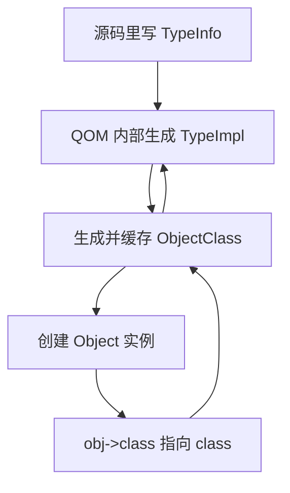

先只记一句话：

- `TypeInfo` 是“注册说明书”
- `TypeImpl` 是“QOM 内部运行时类型档案”
- `ObjectClass` 是“共享类对象 / 方法表”
- `Object` 是“真正创建出来的实例”

---

## 四个核心对象

| 名字          | 是什么                           | 你最该记住什么                                               |
| ------------- | -------------------------------- | ------------------------------------------------------------ |
| `Object`      | 所有实例对象的基类头             | 第一个字段是 `class`，所以实例可以在运行时知道自己是什么类型 |
| `ObjectClass` | 所有类对象的基类头               | 里面有 `type`，能反查到自己的运行时类型                      |
| `TypeInfo`    | 注册时填写的静态说明书           | 描述名字、父类、大小、`class_init`、`instance_init`、接口等  |
| `TypeImpl`    | QOM 内部真正使用的运行时类型对象 | 保存父类链、接口链、共享类对象和各种回调                     |

可以把 QOM 粗略分成两条链：

- **实例链**
  - `Object -> DeviceState -> PCIDevice -> EduState`
  - 负责“对象里有哪些字段”
- **类链**
  - `ObjectClass -> DeviceClass -> PCIDeviceClass`
  - 负责“这个类型有哪些方法和类属性”

可以说：

- `DeviceState` 是 `DeviceClass` 对应的实例结构体
- 更准确地说，`TYPE_DEVICE` 这个 QOM 类型有两侧：
  - 实例侧：`DeviceState`
  - 类侧：`DeviceClass`

但不要理解成：

- `DeviceState` 在 C 语言类型系统里是 `DeviceClass` 的实例
- 或者 `DeviceClass` 像 Rust/C++ 的类型构造器一样“创建”了 `DeviceState`

QOM 里真正的关系是：

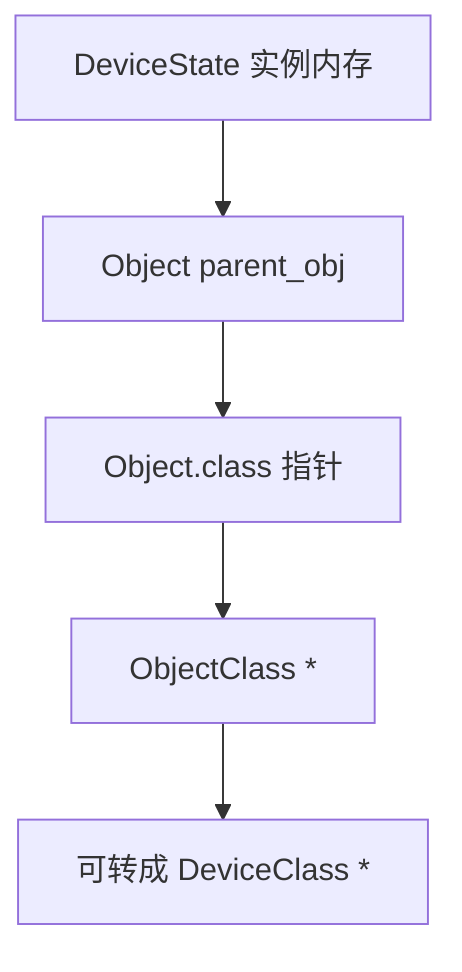

也就是说：

- `DeviceState` 里第一个字段是 `Object parent_obj`
- `Object` 里有 `ObjectClass *class`
- 这个 `class` 指向该对象的类对象
- 对设备对象来说，这个类对象可以当成 `DeviceClass *` 使用

如果对象的实际类型是更具体的设备，例如 `PCI` 设备，那么更准确的图是：

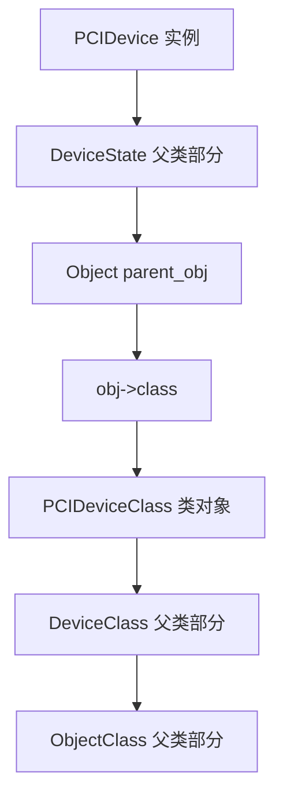

对应到真实结构体就是：

```c
struct PCIDevice {
    DeviceState qdev;
    ...
};

struct DeviceState {
    Object parent_obj;
    ...
};

struct Object {
    ObjectClass *class;
    ...
};

struct PCIDeviceClass {
    DeviceClass parent_class;
    ...
};

struct DeviceClass {
    ObjectClass parent_class;
    ...
};
```

所以如果问“`DeviceClass` 是不是通过 `DeviceState` 关联起来的”，答案要分两层：

1. **对普通设备基类来说，是通过 `DeviceState.parent_obj.class` 找到类对象**
   - `DeviceState` 里没有直接放一个 `DeviceClass *`
   - 它是先有 `Object parent_obj`
   - 再由 `Object.class` 指向 `ObjectClass *`
   - 然后这个 `ObjectClass *` 可以检查并转成 `DeviceClass *`

2. **对 `PCIDevice` 这种子类来说，是通过它内嵌的 `DeviceState qdev` 间接关联**
   - `PCIDevice` 第一个字段是 `DeviceState qdev`
   - `qdev` 第一个字段是 `Object parent_obj`
   - `parent_obj.class` 指向实际类对象
   - 如果实际类型是 PCI 设备，这个类对象通常是 `PCIDeviceClass`
   - 而 `PCIDeviceClass` 开头又嵌了 `DeviceClass parent_class`

所以链条是：

```text
PCIDevice *
  -> &pdev->qdev
  -> &pdev->qdev.parent_obj
  -> pdev->qdev.parent_obj.class
  -> PCIDeviceClass / DeviceClass / ObjectClass 这块类对象内存
```

`DEVICE_GET_CLASS(&pdev->qdev)` 走的是“拿 `Object.class`，再转成 `DeviceClass *`”；
`PCI_DEVICE_GET_CLASS(pdev)` 则会拿同一个 `Object.class`，再转成 `PCIDeviceClass *`。

所以一句话总结：

- **实例对象不是“包含一个 `DeviceClass`”**
- **实例对象是通过 `Object.class` 指针指向自己的类对象**
- **`DeviceState` 和 `DeviceClass` 是同一个 QOM 类型的实例侧 / 类侧配对**

如果把 `Object` 头里最值得先记的几个字段压缩一下，可以先这样看：

| 字段 | 作用 |
| --- | --- |
| `class` | 指向这个实例当前运行时类型对应的类对象 |
| `ref` | QOM 对象的引用计数 |
| `parent` | QOM 对象树里的父对象指针 |

其中 `ref` 最容易和“父子关系”混在一起，但它们不是一回事：

- `ref`
  - 解决的是：**这个对象现在还有没有人持有它**
- `parent`
  - 解决的是：**这个对象在 QOM 对象树里挂在哪个父对象下面**

最短记法：

- **`class` 管“我是什么类型”**
- **`ref` 管“我还能不能被释放”**
- **`parent` 管“我挂在哪棵对象树上”**

---

## 类型注册主线

### 最重要的纠正

- `init_type_list[MODULE_INIT_QOM]` 里放的 **不是** `TypeInfo`
- 它放的是：**注册类型的函数**

也就是说，模块系统记住的是：

- `container_register_types()`
- `pci_edu_register_types()`
- `do_qemu_init_edu_types()`

而不是直接记住：

- `container_info`
- `edu_types[]`
- `object_info`

### `TypeInfo` 常见有三种来源

| 方式     | 形式                                          | 适合什么场景     |
| -------- | --------------------------------------------- | ---------------- |
| 手写单个 | `static const TypeInfo foo_info = { ... }`    | 一个类型         |
| 手写数组 | `static const TypeInfo foo_types[] = { ... }` | 一次注册多个类型 |
| 宏生成   | `OBJECT_DEFINE_TYPE...`                       | 常见模板化类型   |

### 注册流程图

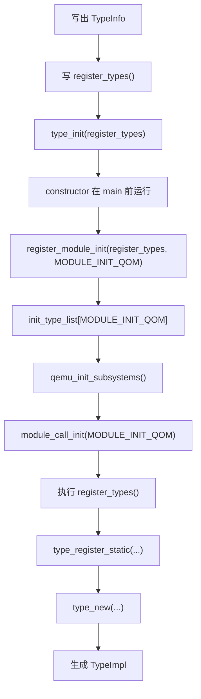

### 以 `PCIDevice` 看 `TypeInfo -> TypeImpl -> 实例` 怎么接起来

先说关键结论：

- `include/hw/pci/pci_device.h` 主要负责 **声明 C 侧结构体和 cast helper**
- `TypeInfo` 不是在 `pci_device.h` 里“注入”的
- 真正把 `PCIDevice` / `PCIDeviceClass` 接进 QOM 类型系统的是 `hw/pci/pci.c` 里的 `pci_device_type_info`

`pci_device.h` 里做了三件事：

```c
#define TYPE_PCI_DEVICE "pci-device"
typedef struct PCIDeviceClass PCIDeviceClass;
DECLARE_OBJ_CHECKERS(PCIDevice, PCIDeviceClass, PCI_DEVICE, TYPE_PCI_DEVICE)

struct PCIDeviceClass {
    DeviceClass parent_class;
    ...
};

struct PCIDevice {
    DeviceState qdev;
    ...
};
```

这说明：

- QOM 类型名是 `TYPE_PCI_DEVICE`，也就是字符串 `"pci-device"`
- 实例侧 C 结构体是 `PCIDevice`
- 类侧 C 结构体是 `PCIDeviceClass`
- 实例继承链靠 `PCIDevice` 第一个字段 `DeviceState qdev`
- 类继承链靠 `PCIDeviceClass` 第一个字段 `DeviceClass parent_class`

但到这里为止，还只是“C 侧结构体和 helper 函数准备好了”。

真正的 QOM 注册说明书在 `hw/pci/pci.c`：

```c
static const TypeInfo pci_device_type_info = {
    .name = TYPE_PCI_DEVICE,
    .parent = TYPE_DEVICE,
    .instance_size = sizeof(PCIDevice),
    .abstract = true,
    .class_size = sizeof(PCIDeviceClass),
    .class_init = pci_device_class_init,
    .class_base_init = pci_device_class_base_init,
};
```

这里就是把 `pci_device.h` 里的 C 结构体“接进” QOM：

| `TypeInfo` 字段 | 对 `PCIDevice` 的含义 |
| --- | --- |
| `.name = TYPE_PCI_DEVICE` | 这个 QOM 类型叫 `"pci-device"` |
| `.parent = TYPE_DEVICE` | 父 QOM 类型是 `"device"` |
| `.instance_size = sizeof(PCIDevice)` | 创建实例时分配 `PCIDevice` 那么大的内存 |
| `.class_size = sizeof(PCIDeviceClass)` | 创建类对象时分配 `PCIDeviceClass` 那么大的内存 |
| `.class_init = pci_device_class_init` | 类对象初始化后，填 PCI 设备的默认方法/属性 |
| `.class_base_init = pci_device_class_base_init` | 子类 class 初始化时做基类校验/清理 |
| `.abstract = true` | `pci-device` 本身是抽象基类，不能直接实例化 |

这里的 `.abstract = true` 要重点理解：

- 它不是说 `PCIDevice` / `PCIDeviceClass` 这两个 C 结构体“没用”
- 也不是说这个类型不能被继承
- 它的意思是：
  - **`TYPE_PCI_DEVICE` / `"pci-device"` 这个 QOM 类型只作为基类存在**
  - **不能直接创建一个“裸的 PCI 设备”实例**
  - **真正可创建的是它的具体子类**

例如很多设备会写：

```c
.parent = TYPE_PCI_DEVICE,
```

这些具体设备类型继承 `pci-device`，复用 `PCIDevice` / `PCIDeviceClass` 提供的 PCI 公共能力；但它们自己会补上具体设备的行为，比如 vendor/device id、BAR、realize/reset 等。

所以可以类比成：

```text
TYPE_DEVICE      抽象/通用设备基类
  -> TYPE_PCI_DEVICE   抽象 PCI 设备基类
      -> e1000e / xhci / vfio-pci / ... 具体 PCI 设备类型
```

源码里这个限制有两层：

1. `TypeInfo.abstract` 会被复制到 QOM 内部的 `TypeImpl.abstract`
   - `type_new(info)` 里会做：
     - `ti->abstract = info->abstract`

2. 真正创建对象时会检查它
   - `object_new_with_props(...)` 会通过 `object_class_is_abstract(klass)` 报错：
     - `object type '%s' is abstract`
   - 更底层的 `object_initialize_with_type(...)` 也有断言：
     - `g_assert(type->abstract == false)`

因此：

- 可以把 `TYPE_PCI_DEVICE` 用作父类型
- 可以用它做类型判断，比如“这个对象是不是 PCI 设备”
- 可以让子类继承它的类方法、属性、公共字段布局
- 但不能把它当成最终设备直接实例化

最短记法：

- **`abstract = true` 表示“这个 QOM 类型是抽象基类，只能被继承/匹配，不能直接 new 出来”。**

然后 `pci_register_types()` 注册它：

```c
static void pci_register_types(void)
{
    ...
    type_register_static(&pci_device_type_info);
}

type_init(pci_register_types)
```

这条链实际是：

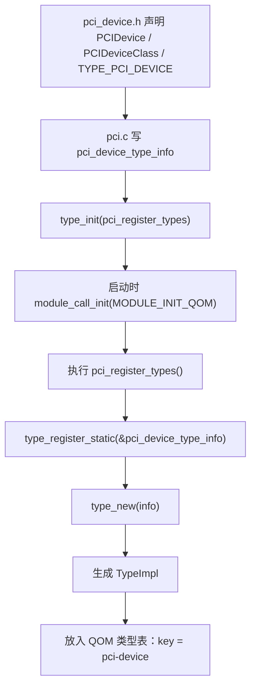

`type_new(info)` 会把 `TypeInfo` 里的内容复制/转换到 `TypeImpl`：

- `ti->name = g_strdup(info->name)`
- `ti->parent = g_strdup(info->parent)`
- `ti->class_size = info->class_size`
- `ti->instance_size = info->instance_size`
- `ti->class_init = info->class_init`
- `ti->class_base_init = info->class_base_init`
- `ti->instance_init = info->instance_init`

所以 `TypeInfo` 是静态说明书，`TypeImpl` 是 QOM 内部运行时类型档案。

后面当某个具体 PCI 子类被创建时，会走实例创建链。以抽象流程说：

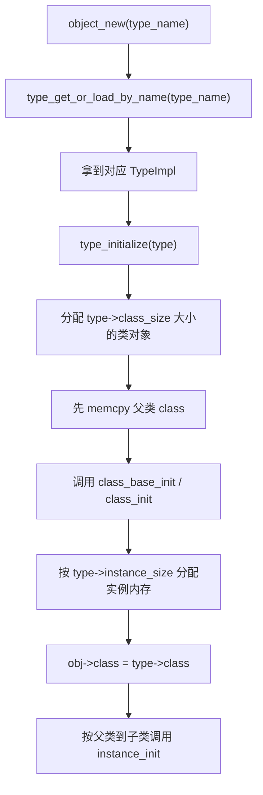

对 `PCIDevice` 这层来说，重要的是：

- `type->instance_size` 来自 `sizeof(PCIDevice)`
- `type->class_size` 来自 `sizeof(PCIDeviceClass)`
- `type->class` 指向一块可以当成 `PCIDeviceClass *` / `DeviceClass *` / `ObjectClass *` 看待的类对象内存
- 实例里的 `Object.class` 会被设置为 `type->class`

所以最终链条是：

```text
pci_device_type_info
  -> type_register_static()
  -> type_new()
  -> TypeImpl("pci-device")
  -> type_initialize()
  -> TypeImpl.class = PCIDeviceClass 类对象
  -> object_initialize_with_type()
  -> PCIDevice.qdev.parent_obj.class = TypeImpl.class
```

这就是 `TypeInfo` / `TypeImpl` 和 `PCIDevice` 的连接方式。

注意这里的“注入”不是往 `struct PCIDevice` 里塞一个 `TypeInfo *` 或 `TypeImpl *` 字段。

真正发生的是：

- `TypeInfo` 通过 `sizeof(PCIDevice)` 和 `sizeof(PCIDeviceClass)` 描述这两个 C 结构体
- QOM 注册时把 `TypeInfo` 变成 `TypeImpl`
- QOM 初始化 class 时把 `TypeImpl.class` 建成 `PCIDeviceClass` 大小
- QOM 创建实例时把 `Object.class` 指向这个 `TypeImpl.class`

所以一句话版：

- **`pci_device.h` 提供形状**
- **`pci.c` 的 `TypeInfo` 提供说明书**
- **`qom/object.c` 把说明书变成 `TypeImpl`**
- **实例创建时通过 `Object.class` 把 `PCIDevice` 实例连回 `TypeImpl.class`**

### 为什么 `pci.c` 里同时有“总线抽象”和“设备抽象”

这不是混乱，而是因为 `pci.c` 承担的是：

- **PCI 子系统的公共骨架**

而不是只实现“某一个具体设备”。

在 QEMU 的 `qdev/QOM` 模型里，一个硬件子系统通常天然有两类对象：

1. **总线（bus）**
   - 负责“设备挂在哪里、怎么枚举、地址规则是什么、父子层级怎么走”
2. **设备（device）**
   - 负责“这个设备自己有哪些寄存器/能力/回调/状态”

PCI 正好是这两层都很强的子系统，所以 `pci.c` 里会同时定义：

- `pci_bus_info`
  - 对应 `TYPE_PCI_BUS`
  - 父类是 `TYPE_BUS`
- `pci_device_type_info`
  - 对应 `TYPE_PCI_DEVICE`
  - 父类是 `TYPE_DEVICE`

也就是说，`pci.c` 不是只在说“PCI 设备”；
它在同时说：

- **PCI 设备应该挂在什么 bus 上**
- **PCI bus 自己是什么对象**
- **PCI 设备这种对象应该有什么默认行为**

可以把它和通用 `qdev` 层对照着看：

| 通用层 | PCI 专门化 |
| --- | --- |
| `BusState` / `BusClass` | `PCIBus` / `PCIBusClass` |
| `DeviceState` / `DeviceClass` | `PCIDevice` / `PCIDeviceClass` |
| `TYPE_BUS` | `TYPE_PCI_BUS` |
| `TYPE_DEVICE` | `TYPE_PCI_DEVICE` |

所以这不是“一个文件里放了两套互不相干的抽象”，而是：

- **PCI 把 `qdev` 的 bus/device 这对抽象一起专门化了**

为什么必须一起专门化？

因为 PCI 的很多规则本来就是“设备 + 总线”共同决定的：

- 一个 `PCIDevice` 的 `devfn` 是否可用，要看 `PCIBus`
- 一个 PCI 设备的 IRQ 路由，要通过 `PCIBus`
- 设备配置空间、桥接、次级总线号、root bus 路径，都离不开 bus 端状态
- 某个设备能不能 realize，也依赖 `DeviceClass.bus_type = TYPE_PCI_BUS`

所以从设计上讲：

- `PCIDevice` 不是脱离 `PCIBus` 单独存在的抽象
- `PCIBus` 也不是脱离 `PCIDevice` 毫无意义的容器
- 它们共同构成了“PCI 子系统”

可以先把 `pci.c` 粗略分成两半看：

| 部分 | 关注点 |
| --- | --- |
| bus 侧 | `TYPE_PCI_BUS`、root bus 初始化、设备枚举表、父子 bus 关系、IRQ 路由、bus 地址空间 |
| device 侧 | `TYPE_PCI_DEVICE`、设备 realize/unrealize、配置空间、BAR、MSI/MSI-X、设备 reset、设备注册 |

但它们最终会在这些地方汇合：

- `PCIBus.devices[devfn]`
  - bus 侧保存设备槽位
- `PCIBus.parent_dev`
  - bus 可以挂在桥设备下面
- `DeviceClass.bus_type = TYPE_PCI_BUS`
  - 设备类声明自己应该属于 PCI bus
- `pci_qdev_realize()`
  - 设备 realize 时真正把设备接到 bus 上

Rust 对比的话，可以把它想成：

- `trait Bus`
- `trait Device`
- 然后 PCI 子系统同时提供：
  - `struct PCIBus: Bus`
  - `struct PCIDevice: Device`

并且大量逻辑是“`PCIDevice` 只有放进 `PCIBus` 里才有完整语义”。

所以一句话版：

- **`pci.c` 同时有 bus 抽象和 device 抽象，是因为 PCI 在 QEMU 里本来就是一个完整子系统，而不是单独一个设备类库。**

### 关键源码位置

| 结构/函数                | 位置                    | 作用                                             |
| ------------------------ | ----------------------- | ------------------------------------------------ |
| `TypeInfo`               | `include/qom/object.h`  | 说明书定义                                       |
| `type_init(function)`    | `include/qemu/module.h` | 把注册函数归入 `MODULE_INIT_QOM`                 |
| `register_module_init()` | `util/module.c`         | 把注册函数放进链表                               |
| `module_call_init()`     | `util/module.c`         | 统一执行某类初始化链                             |
| `qemu_init_subsystems()` | `system/runstate.c`     | 启动早期调用 `module_call_init(MODULE_INIT_QOM)` |
| `type_register_static()` | `qom/object.c`          | 开始把 `TypeInfo` 交给 QOM                       |
| `type_new()`             | `qom/object.c`          | 真正从 `TypeInfo` 构造 `TypeImpl`                |

### `module.h` 和 `module.c` 整体在干嘛

可以先把它们分成：

- `module.h`
  - **前台接口层**
  - 定义初始化类别、声明 API、提供 `type_init(...)` / `block_init(...)` 这类好用宏
- `module.c`
  - **后台调度层**
  - 真正维护链表、登记函数、按类别统一执行、需要时加载动态模块

最短可以记成：

- **`module.h` 负责“怎么登记”**
- **`module.c` 负责“把谁记下来、什么时候统一执行”**

### QEMU module 是什么，什么时候会起作用

这里说的 `module` 不是 Linux 内核模块，也不是热补丁，而是 QEMU 用户态进程自己的“模块机制”。

它同时承担两类事情：

1. **统一初始化框架**
   - 把不同子系统的初始化函数先登记起来；
   - 等 QEMU 启动到合适阶段，再按类别统一执行；
   - 例如 `type_init(function)` 会把函数登记到 `MODULE_INIT_QOM` 这一类。
2. **动态共享库模块加载**
   - 如果编译时开启 `CONFIG_MODULES`，某些功能可以不直接编进主程序；
   - QEMU 运行时需要某个 QOM 类型、block driver、UI backend 等功能时，再加载对应的动态库模块。

所以 `module` 这个词在 QEMU 里容易让人误会。更准确地说：

```text
QEMU module
  = 初始化函数登记/调度框架
  + 可选的用户态动态库按需加载机制
```

它会在几个时间点起作用。

#### 1. `main()` 之前：登记初始化函数

`type_init(foo)`、`block_init(foo)` 等宏最终会生成带 `__attribute__((constructor))` 的函数。

这些 constructor 会在 `main()` 之前运行，但这时通常只是：

```text
把 foo 这个函数指针登记到 init_type_list[...] 链表里
```

注意：这一步**还不是执行 `foo()`**。

#### 2. QEMU 启动早期：统一执行某类初始化函数

比如系统模拟器启动早期会走到：

```text
qemu_init_subsystems()
  -> module_call_init(MODULE_INIT_TRACE)
  -> module_call_init(MODULE_INIT_QOM)
  -> module_call_init(MODULE_INIT_MIGRATION)
```

其中 `module_call_init(MODULE_INIT_QOM)` 会遍历 `init_type_list[MODULE_INIT_QOM]`，真正执行那些由 `type_init(...)` 登记过的注册函数。

很多 QOM 类型就是在这个阶段注册进 `type_table` 的：

```text
type_init(register_types)
  -> main 前登记 register_types
  -> module_call_init(MODULE_INIT_QOM)
  -> register_types()
  -> type_register_static(&xxx_info)
  -> TypeInfo 变成 TypeImpl
  -> 放进 type_table
```

#### 3. 按需使用某个 QOM 类型时：可能触发动态模块加载

如果开启了 `CONFIG_MODULES`，QEMU 查找某个 QOM 类型时，不只是查已有的 `type_table`。

路径大致是：

```text
object_new("some-type")
  -> type_get_or_load_by_name("some-type")
  -> type_table 里没有
  -> module_load_qom("some-type")
  -> 查模块元数据：哪个模块声明自己提供 some-type
  -> 加载对应 .so
  -> 模块里的 type_init 注册函数生效
  -> 再回到 type_table 查到这个类型
```

这个场景里，`module_obj(TYPE_XXX)` 的作用就是提供“模块元数据”：

```text
这个动态模块能提供 TYPE_XXX 这个 QOM 类型
```

否则 QEMU 只知道“我现在缺一个类型”，但不知道该加载哪个模块来补这个类型。

#### 4. 某些命令需要列出/检查全部类型时：会加载全部 QOM 模块

有些路径会调用：

```c
module_load_qom_all();
```

意思是：把所有声明了 QOM 对象的动态模块都尝试加载进来。

例如某些 QMP 查询、设备帮助、或者 dump/检查类逻辑，需要看到“所有可用 QOM 类型”，这时不能只等某个类型被单独请求，可能需要先把 QOM 模块都加载出来。

一句话版：

> QEMU module 在“启动时统一执行初始化函数”和“运行时按需加载动态共享库模块”这两个阶段起作用；对 QOM 来说，它的结果通常就是让更多 `TypeInfo` 被注册成 `TypeImpl`，进入 `type_table`。

### `module_obj(TYPE_MY_DEVICE)` 是干什么的

`docs/devel/qom.rst` 里有一句：

> In case the `ObjectClass` implementation can be built as module a `module_obj()` line must be added to make sure qemu loads the module when the object is needed.

可以先翻成人话：

- 如果某个 QOM 类型的实现可能被编译成动态模块，而不是直接编进 `qemu-system-*` 主程序；
- 那么源码里要额外写一行：

```c
module_obj(TYPE_MY_DEVICE);
```

它的意思是：

- “当前这个模块提供了 `TYPE_MY_DEVICE` 这个 QOM 类型”
- 这样 QEMU 之后按类型名查找 `TYPE_MY_DEVICE` 时，才知道应该加载哪个模块

这和 `type_init(...)` 的作用不完全一样：

| 代码 | 作用 | 解决的问题 |
| --- | --- | --- |
| `type_init(my_device_register_types)` | 模块已经被装进进程后，把注册函数挂到 QOM 初始化链 | “怎么把 `TypeInfo` 注册进 QOM” |
| `module_obj(TYPE_MY_DEVICE)` | 生成模块元数据，声明这个模块提供哪个 QOM 类型 | “还没加载模块时，QEMU 怎么知道该加载谁” |

可以把动态模块场景想成：

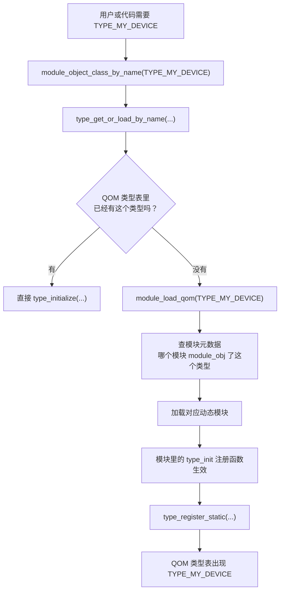

所以 `module_obj(TYPE_MY_DEVICE)` 不是注册类型本身。

更准确地说：

- `type_register_static(...)` / `type_init(...)` 负责 **类型注册**
- `module_obj(...)` 负责 **告诉模块系统：某个模块能提供哪个 QOM 类型**

如果少了 `module_obj(...)`，可能会发生：

- 这个类型的代码确实在某个 `.so` 模块里
- 但 QEMU 按 `TYPE_MY_DEVICE` 查找时，不知道哪个模块包含它
- 于是“需要这个对象时自动加载模块”这条路就断了

这里的“动态加载模块”更接近：

- 用户态程序在运行时 `dlopen()` 一个共享库 / 插件
- 然后执行这个库里的初始化函数，让新类型、新驱动或新功能注册进当前进程

它**不像**“内核 live patch / 热补丁”那样：

- 重点不是给已经运行中的函数打补丁、替换旧代码
- 而是把一整个模块装进当前 QEMU 进程里，让它开始提供新的 QOM 类型或功能

如果一定要类比：

- **最像：插件 / 共享库按需加载**
- **次像：内核模块 `insmod`**
- **不像：内核热补丁 / live patch**

如果再具体一点：

| 文件 | 它的角色 |
| --- | --- |
| `include/qemu/module.h` | 提供统一初始化框架的“对外规则”和宏接口 |
| `util/module.c` | 实现这个框架背后的链表管理、执行顺序和动态模块加载 |

### `module_init(function, type)` 宏怎么读

`include/qemu/module.h` 里的核心宏是：

```c
#define module_init(function, type)                                        \
static void __attribute__((constructor)) do_qemu_init_##function(void)     \
{                                                                         \
    register_module_init(function, type);                                  \
}
```

它做的事可以拆成三步：

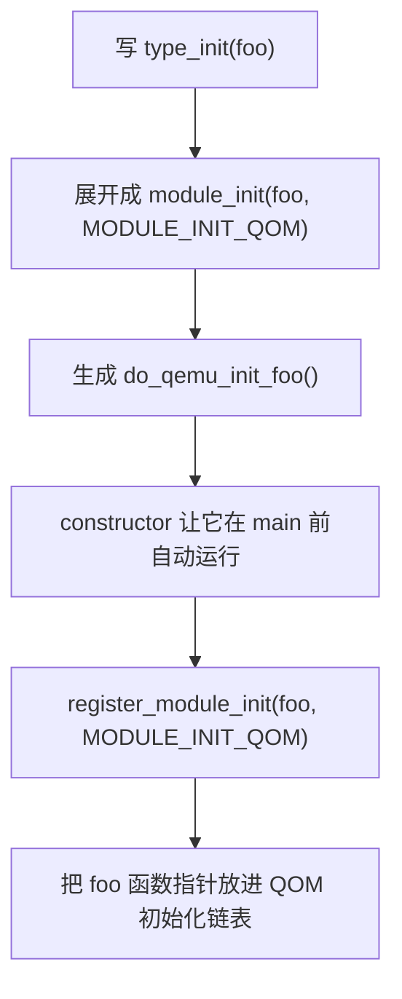

最关键的是：

- `function` 不是在这里被调用
- `register_module_init(function, type)` 传进去的是函数指针
- 真正调用 `function()`，要等之后 `module_call_init(type)` 遍历链表

其中：

| 写法 | 含义 |
| --- | --- |
| `static` | 生成的 `do_qemu_init_xxx` 只在当前 `.c` 文件内部可见 |
| `__attribute__((constructor))` | 告诉编译器/链接器：这个函数在 `main()` 前自动执行 |
| `do_qemu_init_##function` | `##` 是宏里的 token 拼接，例如 `foo` 会拼成 `do_qemu_init_foo` |
| `register_module_init(function, type)` | 把 `function` 这个初始化函数登记到对应类型的初始化链表里 |

### `init_type_list[MODULE_INIT_QOM]` 到底是什么

这个写法不是一个单独命名的数据结构，而是：

- 一个数组：`init_type_list`
- 再用枚举值：`MODULE_INIT_QOM`
- 去取这个数组里的某一个槽位

也就是：

```c
init_type_list[MODULE_INIT_QOM]
```

含义相当于：

- “初始化类型数组里，QOM 这一类初始化函数对应的那条链表”

源码里对应关系是：

```c
typedef QTAILQ_HEAD(, ModuleEntry) ModuleTypeList;
static ModuleTypeList init_type_list[MODULE_INIT_MAX];
```

所以：

- `init_type_list` 的每个元素类型都是 `ModuleTypeList`
- `ModuleTypeList` 本质上是一个 `QTAILQ_HEAD(...)`
- 链表里的每个节点是 `ModuleEntry`
- `ModuleEntry` 里装着一个函数指针 `void (*init)(void)` 和一个 `type`

这里很多人第一次会卡住一个点：

- **为什么这个链表头宏展开出来是 `union`，而不是 `struct`？**

先说结论：

- 这里的 `union` **不是**在表达“这个链表头要么是 `tqh_first`，要么是 `tqh_circ`”这种业务语义
- 它更像 QEMU `queue.h` 为了写通用链表宏，做的一种 **C 版伪模板技巧**

`include/qemu/queue.h` 里源码自己就写了注释：

- `The union acts as a poor man template, as if it were QTailQLink<type>.`

可以把它翻成人话：

- “这个 `union` 充当一种很简陋的模板机制，效果有点像 `QTailQLink<type>`”

也就是说，它主要想同时满足两件事：

1. **让前向指针带上具体节点类型**
   - 比如这里是 `struct ModuleEntry *tqh_first`
   - 这样宏展开后，`QTAILQ_FIRST(head)` 之类操作拿到的是正确的节点类型

2. **又让链表操作能复用同一套通用链接布局**
   - `QTailQLink` 里面有：
     - `void *tql_next`
     - `QTailQLink *tql_prev`
   - 宏内部做插入、删除、回链时，可以统一按这套“通用链接结构”来操作

所以你可以把 `QTAILQ_HEAD` 脑补成“同一块内存的两种视角”：

```text
链表头这块内存
  - 作为 tqh_first 看：它是一个 `struct ModuleEntry *`
  - 作为 tqh_circ 看：它是一个通用 `QTailQLink`
```

对应宏大致是：

```c
union {
    struct ModuleEntry *tqh_first;
    QTailQLink tqh_circ;
}
```

为什么这样能工作？

- 因为 `union` 的成员共享同一块起始内存
- 宏作者就能一会儿把它当“typed 的 first 指针”用
- 一会儿又把它当“通用 link 结构”用

所以这里最适合的理解不是：

- “联合体里到底现在存的是 `tqh_first` 还是 `tqh_circ`？”

而是：

- **这是一块被宏系统故意设计成可从两种布局视角访问的内存**

最短记忆版：

- `tqh_first`
  - 给你一个“类型安全一点”的头指针视角
- `tqh_circ`
  - 给链表宏一个“统一通用链接结构”的操作视角
- `union`
  - 把这两种视角压到同一块链表头内存上

这里还有一个非常容易误解的点：

- **这不是“要么只存 `tqh_first`，要么只存 `tqh_circ`，二选一丢掉另一份”**

关键原因是：

- `union` 的大小取决于**最大的那个成员**
- 这里 `tqh_circ` 的类型是 `QTailQLink`
- `QTailQLink` 里面有两个指针：
  - `tql_next`
  - `tql_prev`

所以这块链表头内存的实际大小，至少要能装下：

```c
typedef struct QTailQLink {
    void *tql_next;
    struct QTailQLink *tql_prev;
} QTailQLink;
```

也就是说，脑补内存布局时，更接近：

```text
ModuleTypeList / QTAILQ_HEAD 这块内存

offset 0: 第一个指针槽
offset 8: 第二个指针槽   （64 位机器上可以先这样理解）
```

然后：

- `tqh_first`
  - 只是把 **offset 0** 这一槽解释成 `struct ModuleEntry *`
- `tqh_circ.tql_next`
  - 也是在看 **offset 0**
- `tqh_circ.tql_prev`
  - 在看 **offset 8**

所以真正发生的不是：

- “这个头有时候只有一个指针，有时候只有两个指针”

而是：

- **这块头内存本来就至少有两格指针大小**
- **第一格既可以按 `tqh_first` 看，也可以按 `tql_next` 看**
- **第二格通过 `tql_prev` 来看**

可以画成：

```text
同一块 head 内存

┌───────────────────────┬────────────────────────┐
│ offset 0              │ offset 8               │
│ tqh_first             │                        │
│ = tqh_circ.tql_next   │ tqh_circ.tql_prev      │
└───────────────────────┴────────────────────────┘
```

所以它根本不是“只存数据不存指针”。

更准确地说：

- 这里存的压根不是业务数据
- **这里存的全是链表元数据指针**

顺手解释 `QTAILQ_HEAD(, ModuleEntry)` 里第一个参数为什么是空的。

宏定义是：

```c
#define QTAILQ_HEAD(name, type)                                         \
union name {                                                            \
        struct type *tqh_first;                                         \
        QTailQLink tqh_circ;                                            \
}
```

如果正常传入第一个参数，例如：

```c
QTAILQ_HEAD(ModuleEntryList, ModuleEntry)
```

宏展开大概是：

```c
union ModuleEntryList {
    struct ModuleEntry *tqh_first;
    QTailQLink tqh_circ;
}
```

这里的 `ModuleEntryList` 是 `union` 的 **tag name（标签名）**。

但 QEMU 这里写的是：

```c
typedef QTAILQ_HEAD(, ModuleEntry) ModuleTypeList;
```

第一个参数为空，宏展开后就接近：

```c
typedef union {
    struct ModuleEntry *tqh_first;
    QTailQLink tqh_circ;
} ModuleTypeList;
```

也就是说：

- 不给这个 `union` 起 tag name
- 只通过 `typedef` 给最终类型起别名 `ModuleTypeList`

所以这里不是“少传了一个必要参数”，而是故意写成：

- **匿名 `union` + `typedef` 别名**

这和下面这种写法很像：

```c
typedef struct {
    int x;
    int y;
} Point;
```

这里的 `struct` 也没有 tag name，但你仍然可以用 `Point` 来声明变量。

因此：

```c
typedef QTAILQ_HEAD(, ModuleEntry) ModuleTypeList;
```

最适合脑补成：

```c
typedef union {
    struct ModuleEntry *tqh_first;
    QTailQLink tqh_circ;
} ModuleTypeList;
```

如果第一个参数不为空，得到的是“有 tag name 的 union”；
如果第一个参数为空，再配合外层 `typedef`，得到的是“匿名 union 的 typedef 别名”。

链表里的真正节点数据在 `ModuleEntry` 里：

```c
typedef struct ModuleEntry
{
    void (*init)(void);
    QTAILQ_ENTRY(ModuleEntry) node;
    module_init_type type;
} ModuleEntry;
```

也就是说：

- `ModuleTypeList`
  - 是链表头，只负责记“第一个节点是谁”和“尾部回链信息”
- `ModuleEntry`
  - 才是链表节点，里面既有业务字段，也有链表链接字段

如果看空链表初始化：

```c
#define QTAILQ_INIT(head) do {                                          \
        (head)->tqh_first = NULL;                                       \
        (head)->tqh_circ.tql_prev = &(head)->tqh_circ;                  \
} while (/*CONSTCOND*/0)
```

它做的事是：

1. `head->tqh_first = NULL`
   - 头指针为空，表示当前没有第一个节点
   - 同时也等价于 `head->tqh_circ.tql_next = NULL`

2. `head->tqh_circ.tql_prev = &head->tqh_circ`
   - 尾部回链先指回自己
   - 表示“现在还是空表，最后那个 link 就是 head 自己”

所以空表时可以脑补成：

```text
head:
  next/first = NULL
  prev       = &head->tqh_circ
```

这样后面插尾时：

```c
(head)->tqh_circ.tql_prev->tql_next = (elm);
```

第一次插入就会变成：

- 因为 `tql_prev` 现在指向 `head->tqh_circ`
- 所以实际上写到的是 `head->tqh_circ.tql_next`
- 而这又和 `head->tqh_first` 是同一槽内存

于是：

- **空表插入第一个元素时，会自动把 `head->tqh_first` 设成这个新节点**

这就是为什么它能正常长成链表。

可以把它脑补成：

```c
init_type_list[MODULE_INIT_QOM]
    -> 一个双向尾队列头
    -> 队列里挂着很多 “QOM 注册函数”
```

而 `MODULE_INIT_QOM` 自己只是枚举值，不是结构体：

- `MODULE_INIT_QOM` 定义在 `include/qemu/module.h`
- `init_type_list` 定义在 `util/module.c`

整个过程就是：

1. `type_init(foo)` 最终展开成 `register_module_init(foo, MODULE_INIT_QOM)`
2. `register_module_init()` 把 `foo` 包成 `ModuleEntry`
3. 再插到 `init_type_list[MODULE_INIT_QOM]` 这条链表尾部
4. 以后 `module_call_init(MODULE_INIT_QOM)` 再把这条链表依次执行一遍

### `register_module_init()` 在做什么

源码在 `util/module.c`：

```c
void register_module_init(void (*fn)(void), module_init_type type)
{
    ModuleEntry *e;
    ModuleTypeList *l;

    e = g_malloc0(sizeof(*e));
    e->init = fn;
    e->type = type;

    l = find_type(type);

    QTAILQ_INSERT_TAIL(l, e, node);
}
```

它的作用一句话说就是：

- **把一个初始化函数 `fn` 登记到对应 `type` 的初始化队列里，先不执行它。**

可以按数据流看：

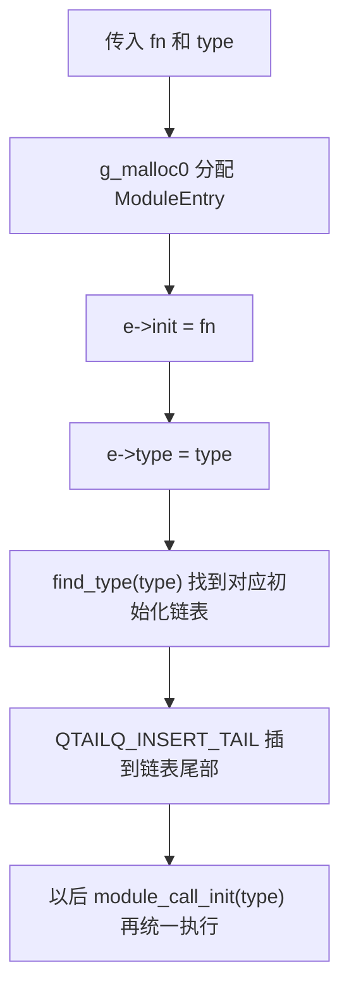

逐行拆开：

| 代码 | 含义 |
| --- | --- |
| `void (*fn)(void)` | 一个“没有参数、没有返回值”的函数指针，比如某个 `register_types` 函数 |
| `module_init_type type` | 初始化类别，例如 `MODULE_INIT_QOM`、`MODULE_INIT_BLOCK` |
| `e = g_malloc0(sizeof(*e))` | 分配一个全零的 `ModuleEntry` 节点 |
| `e->init = fn` | 把真正要执行的初始化函数保存起来 |
| `e->type = type` | 记录这个节点属于哪一类初始化 |
| `l = find_type(type)` | 找到 `init_type_list[type]` 这条队列；内部也会确保队列已经初始化 |
| `QTAILQ_INSERT_TAIL(l, e, node)` | 把节点 `e` 挂到队列尾部，`node` 是 `ModuleEntry` 里嵌入的链表指针字段 |

这里最容易误会的是：

- `register_module_init()` **不是执行初始化函数**
- 它只是把 `fn` 存进链表
- 真正执行发生在 `module_call_init(type)`：

```c
QTAILQ_FOREACH(e, l, node) {
    e->init();
}
```

这里的 `QTAILQ_FOREACH(e, l, node)` 看起来很像黑魔法，但宏本体其实很直接：

```c
#define QTAILQ_FOREACH(var, head, field)                                \
        for ((var) = ((head)->tqh_first);                               \
                (var);                                                  \
                (var) = ((var)->field.tqe_next))
```

所以：

```c
QTAILQ_FOREACH(e, l, node) {
    e->init();
}
```

几乎就等价于：

```c
for (e = l->tqh_first; e; e = e->node.tqe_next) {
    e->init();
}
```

可以拆成三步：

1. `e = l->tqh_first`
   - 从链表头的第一个节点开始
2. `e`
   - 只要当前节点不为 `NULL` 就继续
3. `e = e->node.tqe_next`
   - 每轮走到下一个节点

这里第三个参数 `node` 的意思是：

- **告诉宏：当前节点结构体里，哪一个字段是链表链接字段**

而 `ModuleEntry` 里刚好是：

```c
typedef struct ModuleEntry
{
    void (*init)(void);
    QTAILQ_ENTRY(ModuleEntry) node;
    module_init_type type;
} ModuleEntry;
```

所以：

- `e->node.tqe_next`
  - 就是“当前 `ModuleEntry` 的下一个节点”

最短理解版：

- `QTAILQ_FOREACH(e, l, node)`
  - **从 `l` 这条链表的第一个节点开始**
  - **沿着 `node.tqe_next` 一直往后走**
  - **每次把当前节点放进变量 `e`**

所以对 `type_init(foo)` 来说，主线是：

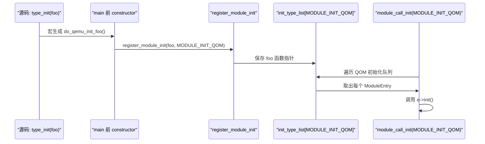

因此这层机制本质上是一个“**先登记，后统一调用**”的启动初始化框架。

### `edu` 这类代码怎么接上来

`hw/misc/edu.c` 里是数组版：

```c
static const TypeInfo edu_types[] = {
    {
        .name = TYPE_PCI_EDU_DEVICE,
        .parent = TYPE_PCI_DEVICE,
        .instance_size = sizeof(EduState),
        .instance_init = edu_instance_init,
        .class_init = edu_class_init,
    }
};

DEFINE_TYPES(edu_types)
```

`DEFINE_TYPES(edu_types)` 的本质就是：

- 自动生成一个注册函数
- 里面调用 `type_register_static_array(edu_types, ARRAY_SIZE(edu_types))`
- 再用 `type_init(...)` 把它挂到 `MODULE_INIT_QOM`

### QOM 自己的根类型也走同一条链

`TYPE_OBJECT` 和 `TYPE_INTERFACE` 也不是“天外飞来”的特殊对象。
它们同样是在 `qom/object.c` 里写 `TypeInfo`，再通过 `type_init(register_types)` 注册进去。

这段源码体现的是 QOM 的“自举”：

```c
static void register_types(void)
{
    static const TypeInfo interface_info = {
        .name = TYPE_INTERFACE,
        .class_size = sizeof(InterfaceClass),
        .abstract = true,
    };

    static const TypeInfo object_info = {
        .name = TYPE_OBJECT,
        .instance_size = sizeof(Object),
        .class_init = object_class_init,
        .abstract = true,
    };

    type_interface = type_register_internal(&interface_info);
    type_register_internal(&object_info);
}

type_init(register_types)
```

可以先把它理解成：

- QOM 类型系统启动时，先把自己最根上的两个类型注册进去
- 一个是普通对象体系的根：`TYPE_OBJECT`
- 一个是接口体系的根：`TYPE_INTERFACE`

这里容易误解的是“根对象和接口是不是也是一个对象”。

答案要分层说：

1. **它们首先是 QOM 类型**
   - `TYPE_OBJECT` 是一个类型名字符串：`"object"`
   - `TYPE_INTERFACE` 是一个类型名字符串：`"interface"`
   - 注册后分别会变成 QOM 内部的 `TypeImpl`

2. **`TYPE_OBJECT` 是普通对象实例链的根类型**
   - `DeviceState`、`BusState`、`MachineState` 等最终都继承自它
   - 它有 `.instance_size = sizeof(Object)`
   - 说明它定义了普通实例对象最基础的内存头：`struct Object`
   - 但它 `.abstract = true`，所以不能当成普通具体设备那样直接实例化使用

3. **`TYPE_INTERFACE` 是接口类型体系的根类型**
   - 它不是普通对象实例的父类
   - 它没有 `.instance_size`
   - 只有 `.class_size = sizeof(InterfaceClass)`
   - 说明接口更偏“类侧能力/协议”，不是创建普通实例对象

所以最关键的区别是：

| 根类型 | 作用 | 有没有普通实例布局 | 有没有 class 布局 | 是否抽象 |
| --- | --- | --- | --- | --- |
| `TYPE_OBJECT` | 普通对象体系的根 | 有，`sizeof(Object)` | 默认按 `ObjectClass` | 是 |
| `TYPE_INTERFACE` | 接口体系的根 | 没有 | 有，`sizeof(InterfaceClass)` | 是 |

因此：

- `TYPE_OBJECT` 不是“某一个具体对象实例”
- `TYPE_INTERFACE` 也不是“某一个接口实例”
- 它们都是 QOM 运行时类型系统里的 **根类型节点**

可以画成两棵树：

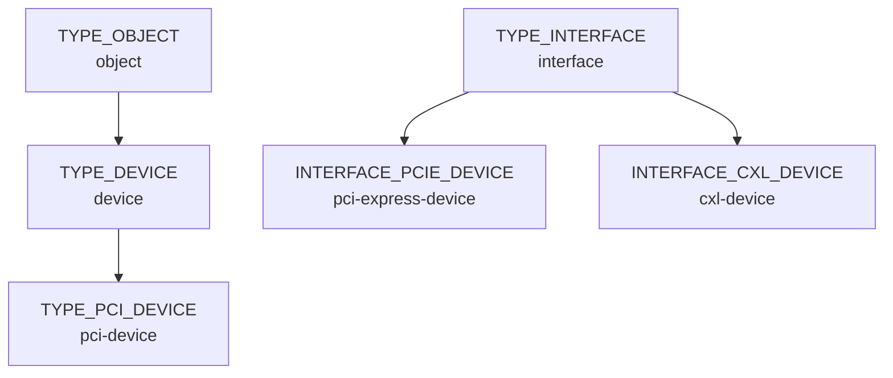

`TYPE_OBJECT` 这棵树主要回答：

- “这个对象是什么类？”
- “它的实例内存怎么布局？”
- “它的类对象怎么初始化？”

`TYPE_INTERFACE` 这棵树主要回答：

- “某个类有没有实现某种能力/协议？”
- “能不能把某个 class 动态看成某个 interface？”

和 Rust 对比的话，可以粗略理解成：

- `TYPE_OBJECT` 像一套手写对象系统里的“所有 struct object 的共同根基”
- `TYPE_INTERFACE` 像一套运行时可查询的“trait/interface 分类根”

但这只是类比。

Rust 的 `trait` 是语言级机制；QOM 的 interface 是 C 里手写出来的运行时类型系统。

`type_init(register_types)` 的意思也很关键：

- 它不是马上在这一行执行 `register_types()`
- 它会展开成一个带 `constructor` 属性的启动注册钩子
- 在程序早期，把 `register_types` 挂到 `MODULE_INIT_QOM` 初始化链表里
- 等 QEMU 启动到 `module_call_init(MODULE_INIT_QOM)` 时，再真正执行 `register_types()`

于是这段的整体流程是：

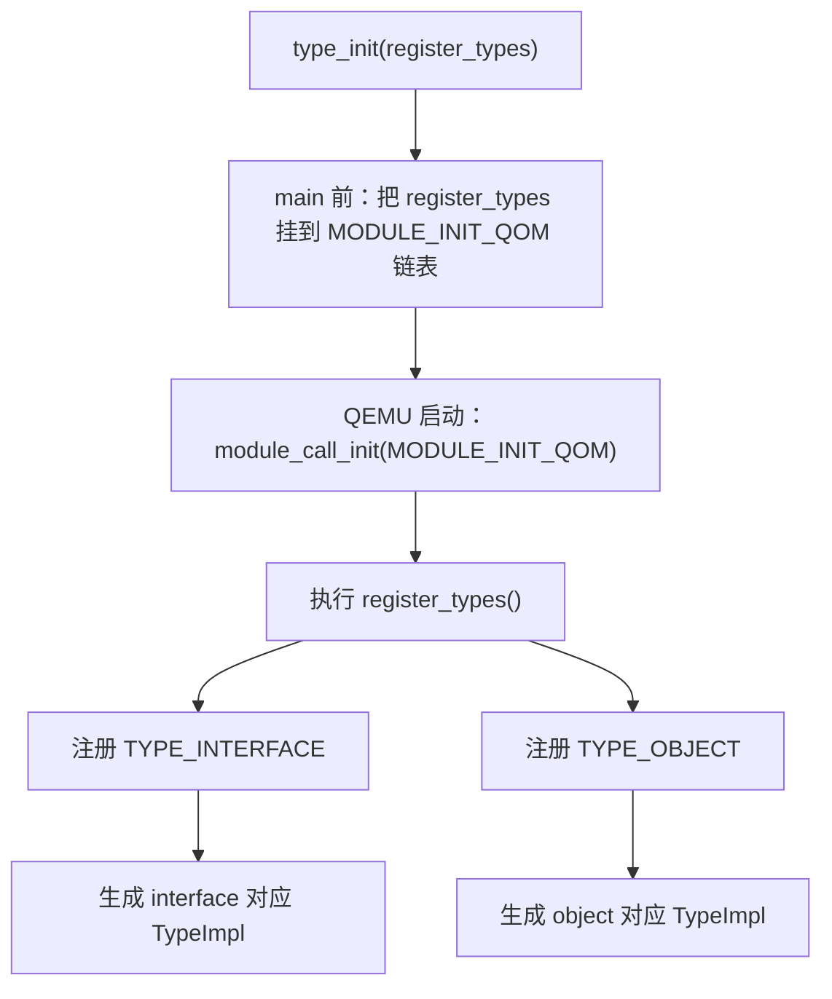

所以一句话版：

- **`TYPE_OBJECT` 和 `TYPE_INTERFACE` 不是普通业务对象，而是 QOM 类型系统自举时注册进去的两个根类型。**
- **`TYPE_OBJECT` 是对象继承树的根。**
- **`TYPE_INTERFACE` 是接口类型树的根。**
- **它们都会变成 `TypeImpl`，但 `TYPE_INTERFACE` 不对应普通实例对象。**

这里有个很容易被忽略的小变量：

```c
static Type type_interface;
```

它的意思不是：

- “保存一个接口实例”
- 或者“保存字符串 `TYPE_INTERFACE`”

这里的 `Type` 在 QOM 里其实是：

```c
typedef struct TypeImpl *Type;
```

所以：

- `type_interface`
- 本质上是一个 **指向 `TypeImpl` 的静态指针**
- 它专门缓存“`TYPE_INTERFACE` 这个根接口类型”对应的运行时类型对象

它在 `register_types()` 里被赋值：

```c
type_interface = type_register_internal(&interface_info);
```

这里 `interface_info` 就是：

```c
static const TypeInfo interface_info = {
    .name = TYPE_INTERFACE,
    .class_size = sizeof(InterfaceClass),
    .abstract = true,
};
```

所以这几步连起来是：

```text
TYPE_INTERFACE ("interface")
  -> interface_info
  -> type_register_internal(...)
  -> 生成对应的 TypeImpl
  -> 保存到静态变量 type_interface
```

那为什么要专门缓存它？

因为后面 QOM 初始化类型时，需要频繁判断：

- “当前这个类型是不是 interface 根类型本身”
- 或者
- “当前这个类型是不是某个 interface 的后代”

例如：

```c
if (type_is_ancestor(ti, type_interface)) {
    ...
}
```

这段的意思就是：

- 如果当前 `ti` 是 `TYPE_INTERFACE`，或者继承自 `TYPE_INTERFACE`
- 那它就属于“接口类型”这条支系
- QOM 会对它施加一些额外约束

比如源码里马上就断言：

- interface 类型不能有普通实例大小
- 必须是抽象的
- 不能有普通 `instance_init`
- 不能再声明普通对象那套实例 finalize/post-init 逻辑

所以 `type_interface` 其实就是一个“运行时哨兵 / 根节点指针”：

- 让 QOM 能快速识别“某个类型是不是接口体系里的类型”

和 Rust 粗略类比的话，它有点像：

- 运行时保存一份“`Interface` 根 trait/object family 的元信息句柄”
- 后面做类型分类时拿它当基准点比较

但它不是 Rust 那种语言级 `trait` 对象元数据，只是 QOM 自己维护的一份 `TypeImpl *`。

### 为什么非得在 `object.c` 里先挂上这两个 `TypeInfo`

如果把问题压缩成一句话，就是：

- **QOM 要先把“对象树根”和“接口树根”注册出来，后面别的类型才能沿着这两棵树继续长。**

可以先看整体图：

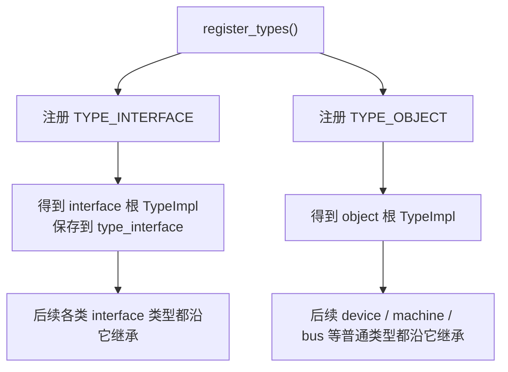

这里的“挂上”不是把两个对象实例挂到某棵树上，而是：

- 把两份最根上的 `TypeInfo`
- 变成 QOM 运行时能识别的 `TypeImpl`
- 放进全局 type table

后面所有普通 QOM 类型、接口类型、动态转型、对象创建，都是建立在这一步之上的。

#### `interface_info` 的作用

```c
static const TypeInfo interface_info = {
    .name = TYPE_INTERFACE,
    .class_size = sizeof(InterfaceClass),
    .abstract = true,
};
```

它至少做了 4 件事：

1. **给“接口类型树”提供根节点**
   - 后面凡是接口类型，本质上都落在 `TYPE_INTERFACE` 这条支系下面
   - QOM 需要一个统一的根，才能判断“这个目标类型是不是接口类型”

2. **给接口类型提供 class 侧布局**
   - 它指定了 `.class_size = sizeof(InterfaceClass)`
   - 说明 interface 不是普通实例对象，而是“只有类侧元信息”的类型
   - `InterfaceClass` 里嵌着 `ObjectClass parent_class`，这样接口 class 也能参与 `object_class_dynamic_cast()`

3. **给 QOM 一个运行时哨兵 `type_interface`**
   - `type_interface = type_register_internal(&interface_info);`
   - 之后很多地方会拿它做判断基准
   - 例如 `type_initialize()` 里用 `type_is_ancestor(ti, type_interface)` 判断某类型是不是接口体系成员
   - `object_class_dynamic_cast()` 里也用它区分“这是往父类 cast”还是“这是往 interface cast”

4. **给接口类型施加一套特殊约束**
   - 因为接口不是普通实例对象，所以不能有普通 `instance_size`
   - 也不能有普通 `instance_init` / `instance_finalize`
   - `type_initialize()` 识别出它属于 `TYPE_INTERFACE` 支系后，会强制这些约束成立

最短记法：

- **`TYPE_INTERFACE` 让 QOM 知道“接口类型是什么一类东西”。**

#### `object_info` 的作用

```c
static const TypeInfo object_info = {
    .name = TYPE_OBJECT,
    .instance_size = sizeof(Object),
    .class_init = object_class_init,
    .abstract = true,
};
```

它的作用也可以压成 4 件事：

1. **给“普通对象继承树”提供根节点**
   - `DeviceState`、`MachineState`、`BusState`、`CPUState` 这些普通对象类型，最终都沿着 `TYPE_OBJECT` 往上追
   - 没有这个根，后面普通 QOM 对象体系就没有共同起点

2. **定义所有普通对象最基础的实例头布局**
   - 它指定 `.instance_size = sizeof(Object)`
   - 也就是普通 QOM 实例至少要有 `Object` 这一层头
   - 其中最关键的是 `Object.class`
   - 这样任意子类实例都能在运行时找到自己的类对象

3. **提供最基础的类初始化**
   - `object_info.class_init = object_class_init`
   - `object_class_init()` 会给每个类挂上通用 `"type"` 属性
   - 所以它不是“随便填个回调”，而是在根类层面放了一份所有对象都共享的基础类行为

4. **把 `TYPE_OBJECT` 设成抽象根类型**
   - `.abstract = true`
   - 说明它只负责做“共同父类”和“共同头部布局”
   - 不是让你直接去创建一个裸 `object`

最短记法：

- **`TYPE_OBJECT` 让 QOM 知道“普通对象最底层长什么样”。**

#### 为什么这里用 `type_register_internal()`，不是 `type_register_static()`

这是一个很关键的“自举细节”：

- `type_register_static()` 里有 `assert(info->parent);`
- 也就是说它默认你注册的类型 **已经有父类型**

但这里这两个类型本身就是根：

- `TYPE_INTERFACE` 没有再往上的接口父类
- `TYPE_OBJECT` 也没有再往上的普通对象父类

所以这里只能直接走更底层的 `type_register_internal()`。

换句话说：

- **普通设备/机器类型是在“已有根类型”的世界里注册**
- **而 `TYPE_INTERFACE` / `TYPE_OBJECT` 是在给这个世界先搭地基**

#### 这两个名字为什么这么取

这里的命名不要按“英语字面翻译”去硬猜，而要按 **QOM 作者想区分的使用层次** 去看。

先说 `type_register_internal()`：

- `internal`
- 更像是在说：**这是内部底层实现用的注册原语**
- 它做真正的注册动作：
  - 检查名字是否合法
  - `type_new(info)`
  - `type_table_add(ti)`
- 它不额外假设“你这个类型一定已经有父类”

所以 `internal` 这个名字强调的是：

- **这是 QOM 内部真正干活的那层**
- **约束更少**
- **更接近底层机制**

再说 `type_register_static()`：

- 这里的 `static` **不是**在强调 C 语言里“内部链接”的那个 `static`
- 更接近“注册一份源码里静态写好的、正常挂在父类链上的类型描述”

为什么会这样叫？

因为在 QOM 的典型使用方式里：

- 你通常会在源码里写一份 `static const TypeInfo foo_info = { ... };`
- 它的内容在编译后基本就是固定的
- 然后在 `register_types()` 里把它交给 QOM

也就是说，这个名字里的 `static` 更像是在表达：

- **这是给普通静态声明的类型定义用的入口**
- **不是给根类型自举、也不是给非常规动态拼装场景准备的底层口子**

再结合实现看，意思就更清楚了：

- `type_register_static()` 先 `assert(info->parent);`
- 然后直接调用 `type_register_internal()`

所以它的命名意图其实是：

- `internal`：QOM 内部底层注册函数
- `static`：给常规静态 `TypeInfo`、并且已经有父类型的普通注册入口

如果硬把这两个名字翻成一句中文，可以粗略记成：

- `type_register_internal()`：**内部原始注册**
- `type_register_static()`：**常规静态类型注册**

但要注意：

- 这个“静态”主要是 **API 设计语气**
- 不是说它只能接收 C 语言 `static` 存储期的对象
- 真正关键的约束其实是：**它假定这是一个已经有父类的普通类型**

#### 如果不先注册这两个根类型，会怎样

后果可以分两棵树看：

1. **没有 `TYPE_OBJECT`**
   - 普通 QOM 类型没有共同根
   - `instance_size` 继承链没法收敛到 `sizeof(Object)`
   - `object_new()` / `object_initialize_with_type()` 这条普通对象创建链也失去基础前提

2. **没有 `TYPE_INTERFACE`**
   - QOM 就没法统一识别“哪些类型是 interface”
   - `type_initialize()` 无法对接口类型施加那套特殊规则
   - `object_class_dynamic_cast()` 也无法正确走 interface cast 分支

所以这两个 `TypeInfo` 的作用不是“注册两个普通类型”这么简单，而是：

- **把 QOM 自己的两套元模型先注册出来**
- **一套是普通对象模型**
- **一套是接口模型**

后面的设备模型、总线模型、机器模型、接口实现，才都是在这个地基上继续往上搭。

---

## 对象布局与转型

### 为什么子对象能直接当成 `Object *`

QOM 的核心技巧是：

- **子结构体把父结构体放在第一个字段**

所以：

- `DeviceState *` 的起始地址
- `&dev->parent_obj`
- `Object *`

可以指向同一块起始地址。

### 一个实例链例子

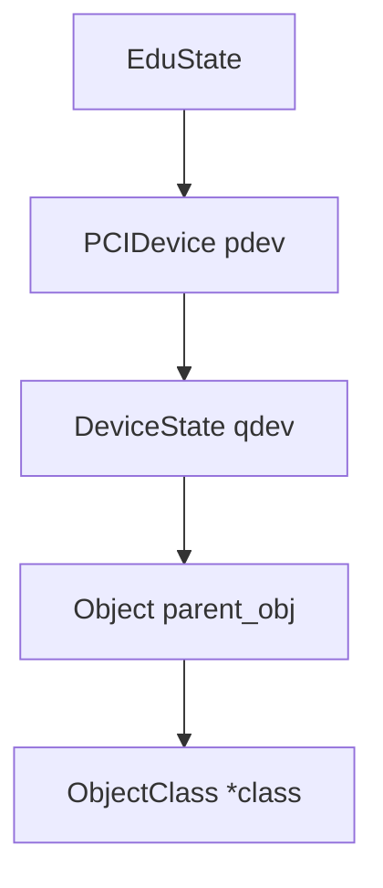

这张图表示的不是“指针跳转”，而是“第一个字段一层层嵌套”。

### `Object.parent` 不是继承链

`Object` 里有个：

- `Object *parent`

它表示的是：

- **QOM 对象树里的父对象 / 容器关系**

它不是：

- C 结构体继承里的父类
- `PCIDevice` / `DeviceState` 那种嵌入式父字段

所以最短记忆版：

- **第一个字段负责继承布局**
- **`parent` 负责对象树关系**

### 常见 cast/check 宏

| 宏/函数 | 作用 | 一句话理解 |
| --- | --- | --- |
| `OBJECT(obj)` | 先把实例统一看成 `Object *` | 靠首字段布局成立 |
| `OBJECT_CLASS(klass)` | 先把类对象统一看成 `ObjectClass *` | 类链的统一入口 |
| `OBJECT_CHECK(type, obj, name)` | 实例向下转型并做运行时检查 | “先验证，再把同一地址解释成更具体类型” |
| `OBJECT_CLASS_CHECK(type, klass, name)` | 类对象向下转型并做运行时检查 | 检查 `class->type` / 接口链 |
| `OBJECT_GET_CLASS(type, obj, name)` | 从实例拿到具体类对象 | `object_get_class()` 的类型安全包装 |
| `DECLARE_INSTANCE_CHECKER(...)` | 生成 `FOO(obj)` helper | 本质只是包一层 `OBJECT_CHECK(...)` |
| `OBJECT_DECLARE_TYPE(...)` | 声明实例类型、类类型和 cast helper | 头文件里常见入口 |

### `DECLARE_INSTANCE_CHECKER(...)` 是干什么的

源码是：

```c
#define DECLARE_INSTANCE_CHECKER(InstanceType, OBJ_NAME, TYPENAME)             \
  static inline G_GNUC_UNUSED InstanceType *OBJ_NAME(const void *obj) {        \
    return OBJECT_CHECK(InstanceType, obj, TYPENAME);                          \
  }
```

它的作用可以直接翻成人话：

- 为某个 QOM 类型生成一个“实例侧的专用 checked cast helper”
- 这个 helper 的名字就是 `OBJ_NAME`
- 传入一个对象指针
- 返回一个已经过 QOM 运行时检查的 `InstanceType *`

如果代入一个真实例子：

```c
DECLARE_INSTANCE_CHECKER(DeviceState, DEVICE, TYPE_DEVICE)
```

就会变成近似：

```c
static inline DeviceState *DEVICE(const void *obj)
{
    return OBJECT_CHECK(DeviceState, obj, TYPE_DEVICE);
}
```

所以：

- `InstanceType`
  - 决定返回值的 **C 结构体类型**
  - 例如 `DeviceState`
- `OBJ_NAME`
  - 决定生成出来的 helper 名字
  - 例如 `DEVICE`
- `TYPENAME`
  - 决定运行时要检查的 **QOM 类型名**
  - 例如 `TYPE_DEVICE`，展开后通常是 `"device"`

这个宏里每一部分分别在干什么：

- `static`
  - 因为它通常写在头文件里
  - `static` 可以避免多个翻译单元重复定义时发生外部符号冲突
- `inline`
  - 这种 helper 非常短，适合内联
- `G_GNUC_UNUSED`
  - 告诉编译器“即使这个 helper 没被用到，也别因为它定义在头文件里就报警告”
  - 这里的 `G` 不是 `GCC` 的意思，更适合理解成 **`GLib` 这套命名空间前缀**
  - 也就是说，`G_GNUC_UNUSED` 不是 “GCC 自己定义的一种类型”，而是 **`GLib` 提供的宏包装**
  - 中间的 `GNUC` 表示：这类宏在包装 `GNU C` / `GCC` 风格编译器属性
  - `UNUSED` 则表示它包装的是“未使用也不要警告”的属性
  - 所以它整体可以近似理解成：`GLib` 对 `__attribute__((unused))` 这一类 GNU 编译器属性的统一封装
- `const void *obj`
  - 让调用点更宽松
  - 你手上可能是 `Object *`、父类实例指针、子类实例指针
  - 先统一收进来，再交给 `OBJECT_CHECK(...)` 做真正检查
- `OBJECT_CHECK(...)`
  - 才是真正的核心
  - 它会先把对象统一看成 `Object *`
  - 再按 `TYPENAME` 做 QOM 运行时类型检查
  - 成功后把同一个地址当成 `InstanceType *` 返回

所以最短记忆版：

- `DECLARE_INSTANCE_CHECKER(...)` 不是“定义对象”
- 它只是“生成一个实例侧 checked cast 函数”
- 也就是把：

```c
OBJECT_CHECK(DeviceState, obj, TYPE_DEVICE)
```

包成更好读、更像类型自己 API 的：

```c
DEVICE(obj)
```

和 Rust 对比的话，它更像你手写一个“带断言的向下转型 helper”，例如：

```rust
fn as_device(obj: &Object) -> &DeviceState {
    // 先检查运行时类型，再返回更具体的引用
    unimplemented!()
}
```

但要注意它不像 Rust 的 `&Object -> &DeviceState` 那样天然受借用系统保护。

- Rust 的引用转换受类型系统和借用规则约束
- QOM 这里本质上仍然是 C 指针 + 运行时类型检查

### `OBJECT_DECLARE_TYPE(DeviceState, DeviceClass, DEVICE)` 展开看

`include/hw/core/qdev.h` 里有：

```c
#define TYPE_DEVICE "device"
OBJECT_DECLARE_TYPE(DeviceState, DeviceClass, DEVICE)
```

它的意思是：声明一个 QOM（QEMU Object Model，QEMU 对象模型）类型在 C 语言侧常用的“类型名字”和“三个转型入口”。

### 为什么这里只传 `DeviceState` 和 `DeviceClass`

因为 `OBJECT_DECLARE_TYPE(...)` 的职责非常窄：

- 它只负责 **声明阶段**
- 不负责 **定义结构体内容**
- 不负责 **填写父类型**
- 不负责 **注册 `TypeInfo`**
- 不负责 **提供 `instance_init` / `class_init` / interface 列表**

所以它只需要知道两件最基本的事：

1. 这个 QOM 类型在 **实例侧** 对应哪个 C 结构体
   - 这里就是 `DeviceState`
2. 这个 QOM 类型在 **类侧** 对应哪个 C 结构体
   - 这里就是 `DeviceClass`

再加一个：

1. 这个类型的宏名前缀是什么
   - 这里就是 `DEVICE`
   - 用来生成 `DEVICE(obj)`、`DEVICE_CLASS(klass)`、`DEVICE_GET_CLASS(obj)`，以及拼出 `TYPE_DEVICE`

换句话说，它要解决的不是：

- “这个类型继承谁？”
- “实例有多大？”
- “类有多大？”
- “初始化函数是谁？”
- “有哪些接口？”

而只是：

- “以后在头文件和调用点里，我怎么把这个类型叫出来？”
- “我怎么把 `Object *` 安全地看成 `DeviceState *`？”
- “我怎么把 `ObjectClass *` 安全地看成 `DeviceClass *`？”

那些“更重”的信息都在 **定义/注册阶段** 才需要，所以会出现在 `TypeInfo` 或 `OBJECT_DEFINE_*` 宏里，而不是这里。

例如：

- 父类型：`.parent = TYPE_OBJECT`
- 实例大小：`.instance_size = sizeof(DeviceState)`
- 类大小：`.class_size = sizeof(DeviceClass)`
- 初始化函数：`.instance_init = device_initfn`
- 类初始化函数：`.class_init = device_class_init`

这些都在 `hw/core/qdev.c` 的 `device_type_info` 里。

所以从设计上讲，`OBJECT_DECLARE_TYPE(DeviceState, DeviceClass, DEVICE)` 只传这几个参数，正是因为：

- **声明宏只关心“名字”和“转型 helper”**
- **注册宏 / `TypeInfo` 才关心“继承关系、大小、初始化逻辑”**

可以把它和 `OBJECT_DEFINE_TYPE(...)` 对比着记：

| 宏 | 主要职责 | 需要什么信息 |
| --- | --- | --- |
| `OBJECT_DECLARE_TYPE(...)` | 在头文件里声明类型名和 cast helper | 实例类型名、类类型名、宏前缀 |
| `OBJECT_DEFINE_TYPE(...)` | 在源文件里定义并注册类型 | 类型名、父类型、大小、init/class_init、接口等 |

所以不是“QEMU 这里只有 `DeviceState` 和 `DeviceClass` 这两个东西最重要”；

而是：

- **对一个 QOM 类型来说，在“声明这套 C API”这一步，真正必须显式告诉宏的，就只有实例类型名和类类型名（再加宏前缀）**
- 其他信息属于下一阶段，放在 `TypeInfo` 里更合适

如果你想确认这不是“解释者脑补”，可以直接沿着宏链往下追：

```c
OBJECT_DECLARE_TYPE(DeviceState, DeviceClass, DEVICE)
```

先到：

```c
DECLARE_OBJ_CHECKERS(DeviceState, DeviceClass, DEVICE, TYPE_DEVICE)
```

再到：

```c
DECLARE_INSTANCE_CHECKER(DeviceState, DEVICE, TYPE_DEVICE)
DECLARE_CLASS_CHECKERS(DeviceClass, DEVICE, TYPE_DEVICE)
```

最后就是：

```c
static inline G_GNUC_UNUSED DeviceState *DEVICE(const void *obj) {
    return OBJECT_CHECK(DeviceState, obj, TYPE_DEVICE);
}

static inline G_GNUC_UNUSED DeviceClass *DEVICE_GET_CLASS(const void *obj) {
    return OBJECT_GET_CLASS(DeviceClass, obj, TYPE_DEVICE);
}

static inline G_GNUC_UNUSED DeviceClass *DEVICE_CLASS(const void *klass) {
    return OBJECT_CLASS_CHECK(DeviceClass, klass, TYPE_DEVICE);
}
```

也就是说：

- 这不是“我猜测 QEMU 大概会生成这些 helper”
- 而是 **按 `include/qom/object.h` 里的宏定义逐层代换，能直接推出来**

我前面为了讲解省略了 `G_GNUC_UNUSED`，但核心三条 helper 的形状和调用链是有源码根据的。

而且这些 helper 在仓库里确实被大量使用，例如：

- `DEVICE_GET_CLASS(dev)`：`hw/core/qdev.c`
- `DEVICE(object_new(name))`：`hw/core/qdev.c`
- `DeviceClass *dc = DEVICE_CLASS(klass);`：`hw/tpm/tpm_tis_isa.c`、`target/riscv/cpu.c`

可以把它近似展开成：

```c
typedef struct DeviceState DeviceState;
typedef struct DeviceClass DeviceClass;

G_DEFINE_AUTOPTR_CLEANUP_FUNC(DeviceState, object_unref)

static inline DeviceState *DEVICE(const void *obj)
{
    return OBJECT_CHECK(DeviceState, obj, TYPE_DEVICE);
}

static inline DeviceClass *DEVICE_GET_CLASS(const void *obj)
{
    return OBJECT_GET_CLASS(DeviceClass, obj, TYPE_DEVICE);
}

static inline DeviceClass *DEVICE_CLASS(const void *klass)
{
    return OBJECT_CLASS_CHECK(DeviceClass, klass, TYPE_DEVICE);
}
```

这里最容易混的点是第三个参数 `DEVICE`：

- 它不是 C 结构体名；
- 它会被拼成 `TYPE_DEVICE`；
- 而 `TYPE_DEVICE` 在这里又被定义成字符串 `"device"`；
- 所以 QOM 运行时真正用来识别类型的是 `"device"` 这个类型名。

三类名字可以分开记：

| 名字 | 所属世界 | 例子 | 作用 |
| --- | --- | --- | --- |
| 实例结构体类型 | C 类型系统 | `DeviceState` | 每个设备实例自己的公共字段 |
| 类结构体类型 | C 类型系统 | `DeviceClass` | 所有设备类型共享的方法表 / 类信息 |
| QOM 类型名 | QOM 运行时类型系统 | `TYPE_DEVICE` -> `"device"` | 运行时判断对象是不是某个类型 |

这行宏不会定义 `struct DeviceState` 和 `struct DeviceClass` 的内容。

真正的结构体内容仍然要手写，例如同一个头文件后面会继续定义：

```c
struct DeviceClass {
    ObjectClass parent_class;
    /* ... */
};

struct DeviceState {
    Object parent_obj;
    /* ... */
};
```

所以这行宏的作用不是“创建一个设备类”，而是给已经存在/即将手写的 C 结构体补上 QOM 常用声明：

- `DeviceState` / `DeviceClass` 两个 typedef；
- `g_autoptr(DeviceState)` 的自动清理规则，离开作用域时走 `object_unref`；
- `DEVICE(obj)`：把实例指针检查并转成 `DeviceState *`；
- `DEVICE_CLASS(klass)`：把类对象指针检查并转成 `DeviceClass *`；
- `DEVICE_GET_CLASS(obj)`：从实例拿到类对象，再检查并转成 `DeviceClass *`。

这里的：

```c
G_DEFINE_AUTOPTR_CLEANUP_FUNC(DeviceState, object_unref)
```

不是 QOM 自己发明的“对象注册机制”，而是 GLib（GNOME 基础库）给 `g_autoptr(...)` 用的一条“自动清理规则声明”。

可以先直接记成人话：

- “以后如果有人写 `g_autoptr(DeviceState) x = ...;`”
- “那这个变量离开作用域时，就自动调用 `object_unref(x)`”

也就是把 C 里的“手动 `object_unref(...)`”变成一种 **作用域结束自动清理**。

GLib 头文件里的关键宏链是：

```c
#define G_DEFINE_AUTOPTR_CLEANUP_FUNC(TypeName, func) \
  _GLIB_DEFINE_AUTOPTR_CLEANUP_FUNCS(TypeName, TypeName, func)

#define g_autoptr(TypeName) \
  _GLIB_CLEANUP(_GLIB_AUTOPTR_FUNC_NAME(TypeName)) \
  _GLIB_AUTOPTR_TYPENAME(TypeName)
```

而 `_GLIB_CLEANUP(func)` 本质上又是：

```c
__attribute__((cleanup(func)))
```

所以底层机制其实是：

- GCC / Clang 的 `cleanup` 变量属性
- GLib 在上面包了一层类型安全和命名规则

你可以把它理解成一个“RAII（Resource Acquisition Is Initialization，资源获取即初始化）味道很重的 C 宏方案”：

- 变量是普通局部变量
- 但离开作用域时会自动调用清理函数

在 QEMU 这里，清理函数是：

```c
object_unref(void *objptr)
```

它会把参数先看成 `Object *`，然后给 QOM 对象做一次引用计数减一；如果引用减到 0，就进入 `object_finalize(...)`。

所以：

- `G_DEFINE_AUTOPTR_CLEANUP_FUNC(DeviceState, object_unref)`
- 的真正含义就是：
- **给 `DeviceState *` 注册一条 `g_autoptr` 清理规则：作用域结束时执行 `object_unref`**

如果写成普通代码，大致等价于：

```c
void foo(void)
{
    DeviceState *dev = qdev_new("...");
    ...
    object_unref(dev);
}
```

而有了这条规则后，就可以写成：

```c
void foo(void)
{
    g_autoptr(DeviceState) dev = qdev_new("...");
    ...
}
```

函数返回、`goto` 跳出当前块、或者普通离开作用域时，GLib 都会帮你调用清理函数。

这里要特别注意：

- `G_DEFINE_AUTOPTR_CLEANUP_FUNC(DeviceState, object_unref)` 只是让 **`DeviceState` 这个类型支持 `g_autoptr(DeviceState)` 写法**
- 它不会让所有 `DeviceState *` 都自动清理
- 只有变量声明处真的写了 `g_autoptr(DeviceState)`，这个局部变量才会带上 `cleanup` 属性

例如：

```c
DeviceState *a = qdev_new("...");
g_autoptr(DeviceState) b = qdev_new("...");
```

这里：

- `a` 是普通指针，离开作用域不会自动 `object_unref(a)`
- `b` 是带 GLib 自动清理属性的局部指针，离开作用域会自动 `object_unref(b)`

从宏展开角度看，`g_autoptr(DeviceState)` 大致相当于把变量声明改成：

```c
__attribute__((cleanup(glib_autoptr_cleanup_DeviceState)))
DeviceState_autoptr b;
```

而 `DeviceState_autoptr` 又是 GLib 生成的 typedef，近似等于：

```c
typedef DeviceState *DeviceState_autoptr;
```

所以不是“把清理函数挂到某个运行时的 `__attributes__` 表里”。

更准确地说：

- `__attribute__((cleanup(...)))` 是 **GCC/Clang 编译器理解的变量属性**
- 它直接附着在这个局部变量声明上
- 编译器在这个变量离开作用域的位置插入 cleanup 调用
- 没有一个 QEMU/GLib 运行时的“属性表”在负责扫描变量

这点和 Rust 也很像又很不同：

- 像：都是编译期决定“离开作用域要清理”
- 不同：Rust 是语言内建的析构/drop glue；GLib 是宏把 GCC/Clang 变量属性贴到某个 C 局部变量上

和 Rust 对比的话，它最像 Rust 的 **RAII + `Drop`**，但只像其中一部分。

Rust 里常见写法是：

```rust
fn foo() {
    let dev = make_device();
    // ...
} // 这里自动 drop(dev)
```

如果类型实现了 `Drop`：

```rust
impl Drop for Device {
    fn drop(&mut self) {
        // 释放资源 / 递减引用计数 / 关闭句柄
    }
}
```

那么变量离开作用域时，Rust 编译器会自动插入析构逻辑。

`g_autoptr(DeviceState)` 做的事情和这个很像：

```c
void foo(void)
{
    g_autoptr(DeviceState) dev = qdev_new("...");
    ...
} /* 这里自动 object_unref(dev) */
```

所以可以这样对应：

| Rust | C + GLib/QEMU | 对应关系 |
| --- | --- | --- |
| `let dev = ...;` | `g_autoptr(DeviceState) dev = ...;` | 局部变量绑定资源 |
| 作用域结束自动 `drop(dev)` | 作用域结束自动 `object_unref(dev)` | 都是作用域结束清理 |
| `impl Drop for T` | `G_DEFINE_AUTOPTR_CLEANUP_FUNC(T, cleanup)` | 给类型指定清理逻辑 |
| `std::mem::forget(dev)` / 转移所有权 | `g_steal_pointer(&dev)` | 阻止当前作用域自动清理 |

但是差别非常重要：

| 差别 | Rust | `g_autoptr` |
| --- | --- | --- |
| 是否语言级机制 | 是，编译器和类型系统内建 | 不是，是 GLib 宏 + GCC/Clang `cleanup` 属性 |
| 所有权检查 | 有，移动后原变量不能再用 | 没有，C 编译器不会帮你防 use-after-free / double-unref |
| 借用检查 | 有 `&` / `&mut` 规则 | 没有 |
| 清理覆盖范围 | 普通局部变量天然有析构 | 只有显式写 `g_autoptr(T)` 的局部指针才有 |
| 资源类型 | 任意实现 `Drop` 的值 | 指针变量，且必须提前定义 cleanup 规则 |

所以最精确的说法是：

- `g_autoptr` **是在 C 里模拟 Rust/C++ 那类 RAII 作用域清理习惯**
- 但它 **没有 Rust 的所有权系统和借用检查**
- 它只负责“离开作用域时帮你调用 cleanup 函数”

因此：

- `g_autoptr(DeviceState)` 像 Rust 里的“带 `Drop` 的局部 owner 变量”
- `object_unref` 像这个 owner 的析构逻辑
- 但 C 不知道“谁真正拥有这个引用”，这个约定仍然要靠程序员遵守

所以最短记忆版：

- `G_DEFINE_AUTOPTR_CLEANUP_FUNC(T, f)` = “给类型 `T *` 声明 `g_autoptr(T)` 的自动清理函数是 `f`”
- `g_autoptr(T)` = “这个局部指针变量离开作用域时自动清理”
- 在 QEMU 这里，`f = object_unref`
- 所以它服务的是 **引用计数对象的自动 `unref`**

注意：注释里的 “register the type for use with `g_autoptr`” 不是说把 QOM 类型注册进运行时类型表。

真正的 QOM 类型注册仍然要靠 `TypeInfo` 加 `type_register_static(...)`，例如 `hw/core/qdev.c` 里的 `device_type_info` 和 `qdev_register_types()`。

最短记忆版：

- `OBJECT_DECLARE_TYPE(...)` 是 **头文件里的 QOM 类型声明模板**；
- `DeviceState` / `DeviceClass` 是 **C 结构体类型**；
- `DEVICE` 是 **用来拼宏名的前缀**；
- `TYPE_DEVICE` / `"device"` 是 **QOM 运行时类型名**；
- `DEVICE(obj)` 这类 helper 是 **带 QOM 类型检查的转型入口**。

### 把 `OBJECT_CHECK(...)` 展开看

源码里的定义是：

```c
#define OBJECT_CHECK(type, obj, name)                                          \
  ((type *)object_dynamic_cast_assert(OBJECT(obj), (name), __FILE__, __LINE__, \
                                      __func__))
```

先把三个参数记清楚：

| 参数 | 含义 | 例子 |
| --- | --- | --- |
| `type` | 返回值要使用的 **C 结构体类型** | `MyDevice` |
| `obj` | 传进来的对象指针 | `obj` / `dev` / `OBJECT(s)` |
| `name` | QOM（QEMU Object Model，QEMU 对象模型）里的类型名字符串 | `TYPE_MY_DEVICE` |

这里的 `name` 要特别注意：

- **它通常就是 `TYPE_DEVICE` 这种宏**
- 而这类宏展开后通常就是一个字符串字面量，例如：
  - `#define TYPE_DEVICE "device"`
- 所以如果你看到：
  - `OBJECT_CHECK(DeviceState, obj, TYPE_DEVICE)`
- 那它传给 QOM 运行时类型系统去检查的，其实就是：
  - `"device"`
- 也就是说：
  - `type` 是 **C 世界里的结构体类型名**
  - `name` 是 **QOM 运行时类型系统里的类型名字字符串**

它可以按下面这条链理解：

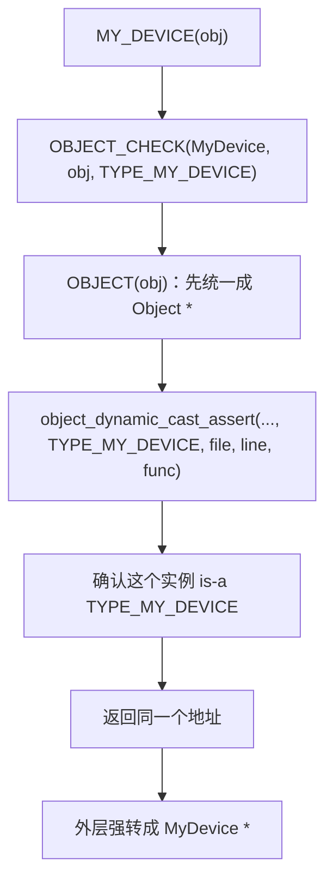

关键点是：

1. **`OBJECT(obj)` 不是检查，只是统一入口**
   - 它本质是 `(Object *)(obj)`。
   - 之所以能这样转，是因为 QOM 的实例结构体通过“第一个字段嵌入父类”模拟继承。

2. **真正的 QOM 类型判断在 `object_dynamic_cast_assert(...)` 里**
   - 它会根据对象的 `obj->class->type` 去判断这个对象是不是目标 `name` 类型，或者是不是它的子类型 / 兼容接口。
   - 成功时返回的还是原来那个对象地址，只是类型视角变了。

3. **最外层 `(type *)` 是给 C 编译器看的返回类型**
   - 如果写的是 `OBJECT_CHECK(MyDevice, obj, TYPE_MY_DEVICE)`，表达式整体类型就是 `MyDevice *`。
   - 后面的代码就可以用 `s->field` 访问 `MyDevice` 里的字段。

4. **`__FILE__` / `__LINE__` / `__func__` 是报错定位信息**
   - 如果运行时发现 cast 不合法，QEMU 可以打印“哪个文件、哪一行、哪个函数里发生了错误 cast”。

不过还要注意一个源码细节：

- 当前 `qom/object.c` 里的 `object_dynamic_cast_assert(...)` 把完整动态检查包在 `CONFIG_QOM_CAST_DEBUG` 里。
- 所以学习时可以把它理解成“带调试断言能力的 QOM 安全转型入口”，但不要误解成“所有构建里都会无条件检查每一次 cast”。
- 这也是为什么 QEMU 源码经常用类型专用宏，例如 `DEVICE(obj)`、`RISCV_VIRT_MACHINE(obj)`：既保留可读性，也方便在调试构建里尽早抓到错误对象类型。

#### `CONFIG_QOM_CAST_DEBUG` 什么时候会开启

这不是源码里手写 `#define` 打开的，而是 **Meson 构建选项** 决定的：

- `meson_options.txt` 里定义了：

```meson
option('qom_cast_debug', type: 'boolean', value: true,
       description: 'cast debugging support')
```

- `meson.build` 再把它写进生成配置：

```meson
config_host_data.set('CONFIG_QOM_CAST_DEBUG', get_option('qom_cast_debug'))
```

所以最准确的说法是：

- **只要当前构建的 `qom_cast_debug` 选项为 `true`，`CONFIG_QOM_CAST_DEBUG` 就会开启**
- **如果显式配置成 `false`，这个宏就不会定义出来**

命令行上对应的是：

- `--enable-qom-cast-debug`
- `--disable-qom-cast-debug`

在这份仓库当前源码里，默认值是：

- **开启**

也就是如果你不手动关掉它，默认生成的 `config-host.h` 里通常就会有：

```c
#define CONFIG_QOM_CAST_DEBUG
```

就我现在检查到的本地构建目录来看：

- `build/config-host.h`
- `build-rust/config-host.h`

这两个里都已经定义了 `CONFIG_QOM_CAST_DEBUG`，说明这两份现成构建当前都是开启状态。

如果再追问“**为什么默认开着，但源码里又允许整段检查被编译掉**”，可以把它理解成两层设计：

1. **默认策略层：倾向保留类型安全检查**
   - 从 `QEMU` 官方 2018 年邮件讨论看，有人提议把 `QOM cast debug` 默认改成关闭，理由是它可能带来性能开销。
   - 但维护者 Peter Maydell 明确反问：这会不会把 `QOM cast` 的类型检查整体关掉？他认为这种检查“不应该默认去掉”，类比上更接近 `assert()`，而不是普通可随手关闭的调试噪声。
   - 这和今天源码里默认值仍然是 `true` 是一致的。

2. **实现层：仍然保留一个可关闭的性能开关**
   - 同一讨论里，提案方给出的理由是：某些 workload 里 `object_class_dynamic_cast_assert` 可能出现在 profile 热点，说明这类检查在个别场景下确实可能有性能成本。
   - 所以 QEMU 最终保留了一个显式开关：
     - 默认 **开**
     - 但允许你在特别关心性能、或做对比实验时手动 **关**

所以这两件事并不矛盾：

- **“默认开启”** 说明官方更看重运行时类型安全
- **“源码里放在 `#ifdef CONFIG_QOM_CAST_DEBUG` 下”** 说明官方也承认它有成本，因此给高级用户留了关闭选项

最短可以记成一句话：

- **QEMU 把它当成“默认应保留的类型安全检查”，但不是“永远不可关闭的硬规则”。**

再更细一点：

- **对 `object_dynamic_cast_assert(...)` 这条“实例 cast 断言”路径来说，关掉 `CONFIG_QOM_CAST_DEBUG` 后，确实几乎就只剩 trace + `return obj`。**
- **但对 `object_class_dynamic_cast_assert(...)` 这条“类对象 cast 断言”路径来说，并不是所有情况都直接返回。**
  - 如果 `class == NULL`，或者这个类没有接口链（`!class->interfaces`），它会直接 `return class`
  - 但如果这个类实现了接口，它仍然会继续走 `object_class_dynamic_cast(...)`
  - 因为类 cast 不只是“检查对不对”，有时还承担“从类对象拿到对应接口 class 指针”的语义，不能一概直接返回原 `class`

### `object_dynamic_cast_assert(...)` 这一个函数到底在干什么

可以先把它压缩成一句话：

- **它是 `OBJECT_CHECK(...)` 背后的实例级“安全转型 + 调试断言”入口。**

更完整一点：

- 输入：一个 `Object *obj`，以及你想转成的 QOM 类型名字 `typename`
- 目标：确认这个对象运行时确实是该类型（或其子类型 / 兼容接口）
- 成功：返回 **同一个对象地址**
- 失败：在启用 `CONFIG_QOM_CAST_DEBUG` 时打印错误并 `abort()`

可以先按流程记：

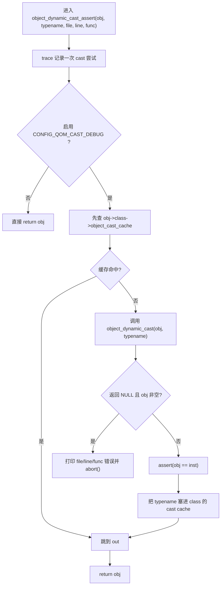

逐段看：

#### 1. 先记一条 trace

```c
trace_object_dynamic_cast_assert(obj ? obj->class->type->name : "(null)",
                                 typename, file, line, func);
```

- 这不是类型检查本体。
- 它只是把“这次有人尝试把某对象 cast 成某类型”记到 tracing 系统里。
- 如果 `obj == NULL`，它会记成 `"(null)"`。

#### 2. 真正的断言逻辑只在 `CONFIG_QOM_CAST_DEBUG` 下启用

```c
#ifdef CONFIG_QOM_CAST_DEBUG
...
#endif
return obj;
```

- 这是这段函数最关键、也最容易忽略的一点。
- 如果没开 `CONFIG_QOM_CAST_DEBUG`，中间整段检查代码都不会编进去。
- 那么这个函数几乎就退化成：

```c
trace(...);
return obj;
```

- 所以不能把它理解成“任何构建下都会严格检查每一次 cast”。

#### 3. 先查一个很小的成功缓存

```c
for (i = 0; obj && i < OBJECT_CLASS_CAST_CACHE; i++) {
    if (qatomic_read(&obj->class->object_cast_cache[i]) == typename) {
        goto out;
    }
}
```

- `OBJECT_CLASS_CAST_CACHE` 当前是 `4`。
- 缓存在 `ObjectClass` 里，不在实例里。
- 意思是：**“这个类最近成功 cast 成过哪些目标类型名？”**
- 如果缓存命中，就直接认为这次 cast 合法，跳过后面的完整检查。

这里还要注意一个细节：

- 它比较的是指针相等 `== typename`，不是 `strcmp(...)`
- 所以这是一个 **非常便宜的 fast path**
- 如果没命中，也完全没关系，后面还会走真正的动态检查
- 换句话说：**缓存只影响性能，不影响正确性**

这里的 `qatomic_read(...)` 可以先理解成：

- **QEMU 封装的原子读取 helper**
- 定义在 `include/qemu/atomic.h`
- 当前实现会调用类似：
  - `__atomic_load_n(ptr, __ATOMIC_RELAXED)`

也就是说，它不是普通的：

```c
obj->class->object_cast_cache[i]
```

而是显式告诉编译器：

- 这个位置可能被别的线程读写
- 不要把这次读取优化没了
- 不要随便把它拆成不安全的普通访问
- 但这里用的是 **relaxed（松散）原子读**，不额外建立 acquire/release 那种跨线程顺序保证

在这个 cast cache 场景里，它的语义更像：

- **我只想安全、便宜地读一下这个缓存槽现在是什么**
- **命中就走 fast path**
- **没命中也能走完整检查，所以不需要靠这个缓存提供强同步语义**

#### 4. 缓存没命中，就走真正的动态检查

```c
inst = object_dynamic_cast(obj, typename);
```

而 `object_dynamic_cast(...)` 自己很短：

```c
if (obj && object_class_dynamic_cast(object_get_class(obj), typename)) {
    return obj;
}
return NULL;
```

所以它本质上是在问：

- `obj->class` 这个类，运行时是不是 `typename`
- 或者是不是它的子类
- 或者是不是兼容的接口实现

这里如果继续往下看 `object_class_dynamic_cast(...)`，一上来会先做一个很便宜的 fast path：

```c
type = class->type;
if (type->name == typename) {
    return class;
}
```

这段可以直接翻成人话：

- 先拿到这个类对象对应的运行时类型：`class->type`
- 再问：
  - **“这个类自己的类型名，和你要 cast 到的目标类型名，是不是同一个名字指针？”**
- 如果是：
  - 说明这就是 **精确命中**
  - 不用再去查目标类型对象
  - 不用再走父类链
  - 也不用再查接口链
  - 直接返回当前 `class`

为什么这里能先这样做？

- 因为很多 cast 请求，其实就是：
  - “这个对象/类本来就是这个具体类型，请确认一下”
- 尤其对注释里说的 `leaf classes`（叶子类）来说更常见：
  - 它们通常是层级最底下的具体设备类型
  - 很多调用点拿着它们的 `class`，目标也是它们自己的确切类型
  - 这时根本没必要再做更贵的通用判断

这里还要注意两个细节：

1. **它比较的是指针相等，不是字符串内容比较**
   - 写的是：
     - `type->name == typename`
   - 不是：
     - `strcmp(type->name, typename) == 0`
   - 所以这只是一个“极便宜的命中捷径”。

2. **这个 fast path 只影响性能，不影响正确性**
   - 如果这里没命中，不代表类型就不匹配。
   - 后面照样会：
     - `type_get_by_name_noload(typename)`
     - 再用 `type_is_ancestor(...)`
     - 或接口链判断去做完整检查
   - 所以正确理解应该是：
     - **“先试试看是不是最简单的完全相等情况；不是的话，再走通用慢路径。”**

这里顺手补一个很容易想到的类比：

- `#define TYPE_DEVICE "device"` 这种东西
- **在“生命周期感觉”上**，确实有点像 Rust 里的 `&'static str`
- 因为它展开后是字符串字面量，具有 **static storage duration（静态存储期）**

但它和 Rust `&'static str` 不能直接画等号，至少有几个关键区别：

| 角度 | C 里的 `TYPE_DEVICE` / `const char *` | Rust 里的 `&'static str` |
| --- | --- | --- |
| 本体 | 指向 NUL 结尾字符序列的指针 | 带长度的字符串切片引用 |
| 生命周期表达 | 类型系统里不写出来 | `'static` 明确写进类型系统 |
| 编码保证 | 不保证必须是 UTF-8 | `str` 保证 UTF-8 |
| 边界信息 | 靠 `'\0'` 结束 | 长度随值一起保存 |

所以更精确的说法是：

- **字符串字面量 `"device"` 在“存活整个程序”这件事上，像 `&'static str`**
- **但 `const char *` 这个类型本身，并不等于 Rust 的 `&'static str`**

另外，在 QOM 这里还有一个很关键的源码细节：

```c
ti->name = g_strdup(info->name);
```

也就是说：

- `TypeInfo.name` 里原本可能是宏展开出来的字符串字面量 `"device"`
- 但到了 `TypeImpl.name`，QOM 会再复制一份字符串

所以通常不能把：

- `type->name == TYPE_DEVICE`

理解成一个“总会成立”的逻辑。

也正因为这样，`type->name == typename` 这里只是：

- **快路径优化**
- **不是 correctness 依赖的唯一判断**

真正保证正确性的，是后面的：

- `type_get_by_name_noload(typename)`

而 `type_table_get()` 用的是：

- `g_hash_table_new(g_str_hash, g_str_equal)`

这表示后续查表按的是：

- **字符串内容相等**

不是纯粹只靠指针相等。

如果是：

- 返回的还是 **原来的 `obj` 地址**

如果不是：

- 返回 `NULL`

#### 5. 如果 cast 失败，而且对象本身不是空指针，就报错退出

```c
if (!inst && obj) {
    fprintf(stderr, "%s:%d:%s: Object %p is not an instance of type %s\n",
            file, line, func, obj, typename);
    abort();
}
```

- 这里为什么写 `!inst && obj`，而不是只写 `!inst`？
- 因为 `obj == NULL` 时，QOM 这里选择“空指针直接透传”，不把它当成类型错误。
- 真正要抓的是：
  - **“你给了一个非空对象，但它运行时根本不是这个类型”**

打印出来的 `file` / `line` / `func` 就是 `OBJECT_CHECK(...)` 展开的调用点位置。

#### 6. 成功时断言“返回值必须还是原地址”

```c
assert(obj == inst);
```

这句是在强调 QOM 这里的 cast 语义：

- 它不是 C++ 那种可能调指针偏移的多态对象布局转换
- 这里的“cast”本质是：
  - **先做运行时 is-a 判断**
  - **然后把同一个地址按更具体类型解释**

所以成功的话，`inst` 必须就是 `obj` 本身。

#### 7. 把成功结果塞进缓存，优化下次 cast

```c
if (obj && obj == inst) {
    for (i = 1; i < OBJECT_CLASS_CAST_CACHE; i++) {
        qatomic_set(&obj->class->object_cast_cache[i - 1],
                   qatomic_read(&obj->class->object_cast_cache[i]));
    }
    qatomic_set(&obj->class->object_cast_cache[i - 1], typename);
}
```

- 成功后，会把缓存整体左移一格
- 再把这次成功的 `typename` 放到最后一个槽位
- 可以粗略理解成一个很小的“最近成功 cast 记录”

因为缓存挂在 `obj->class` 上，所以受益的是：

- **同一个运行时类的后续 cast**

而不是单个对象实例独享。

#### 8. 最后为什么返回 `obj` 而不是 `inst`

```c
return obj;
```

因为前面已经保证了：

- 失败时要么 `abort()`，要么 `obj == NULL`
- 成功时 `assert(obj == inst)`

所以这里直接返回 `obj` 就够了。

可以近似理解成：

- `inst` 只是中间用来判断“这次 cast 成没成功”
- 最终返回值语义上就是“原对象地址，只不过现在你可以把它当成目标类型用了”

### 为什么每个类型还要再包一层 `MY_DEVICE(...)` 这种宏

官方文档里常见这种写法：

```c
#define MY_DEVICE_GET_CLASS(obj) \
   OBJECT_GET_CLASS(MyDeviceClass, obj, TYPE_MY_DEVICE)
#define MY_DEVICE_CLASS(klass) \
   OBJECT_CLASS_CHECK(MyDeviceClass, klass, TYPE_MY_DEVICE)
#define MY_DEVICE(obj) \
   OBJECT_CHECK(MyDevice, obj, TYPE_MY_DEVICE)
```

它们本质上 **没有创造新的底层能力**，只是把通用 QOM 宏包成“这个具体类型自己的专用入口”。

可以直接记成：

| 宏 | 传进去的东西 | 返回什么 | 作用 |
| --- | --- | --- | --- |
| `MY_DEVICE(obj)` | 实例指针 | `MyDevice *` | 把某个 `Object *` / 父类实例安全地当成 `MyDevice *` 用 |
| `MY_DEVICE_CLASS(klass)` | 类对象指针 | `MyDeviceClass *` | 把某个 `ObjectClass *` / 父类类对象安全地当成 `MyDeviceClass *` 用 |
| `MY_DEVICE_GET_CLASS(obj)` | 实例指针 | `MyDeviceClass *` | 先从实例拿 `obj->class`，再安全转成 `MyDeviceClass *` |

它们的意义主要有四个：

1. **把类型名写死，避免每次手写**
   - 不用每次都写：
     - `OBJECT_CHECK(MyDevice, obj, TYPE_MY_DEVICE)`
   - 直接写：
     - `MY_DEVICE(obj)`

2. **把实例 / 类 / 从实例取类 这三种常见动作固定下来**
   - `MY_DEVICE(obj)`：我要的是“实例”
   - `MY_DEVICE_CLASS(klass)`：我要的是“类对象”
   - `MY_DEVICE_GET_CLASS(obj)`：我手上只有实例，但我要调类方法

3. **保留运行时类型检查**
   - 它不是普通 C 里的裸强转。
   - 底下最终会走 `object_dynamic_cast_assert(...)` 或 `object_class_dynamic_cast_assert(...)`
   - 如果传进来的对象实际不是 `TYPE_MY_DEVICE`，会在运行时报错，而不是默默把地址错解释掉。

4. **让调用点更像“这个类型自己的 API”**
   - 看到 `MY_DEVICE(obj)`，你马上知道“这里期待的是 `MyDevice`”
   - 比看到一长串 `OBJECT_CHECK(...)` 更容易读

所以这几个包装器可以理解成：

- **不是新机制**
- **而是给具体类型做的类型安全、可读性更好的快捷入口**

### `OBJECT_CHECK(...)` 和 `OBJECT_CLASS_CHECK(...)` 最本质的区别

| 名字 | 检查对象 | 依赖什么 |
| --- | --- | --- |
| `OBJECT_CHECK(...)` | 实例 | `obj->class->type` |
| `OBJECT_CLASS_CHECK(...)` | 类对象 | `class->type` 和 interface 链 |

---

## 类初始化与实例初始化

### 可以先把它们分成两层

| 名字 | 作用层级 | 什么时候发生 |
| --- | --- | --- |
| `class_init` | 类型级 | 一个类型第一次真正被初始化时 |
| `instance_init` | 实例级 | 每创建一个对象实例都执行一次 |

### 最常见的创建流程

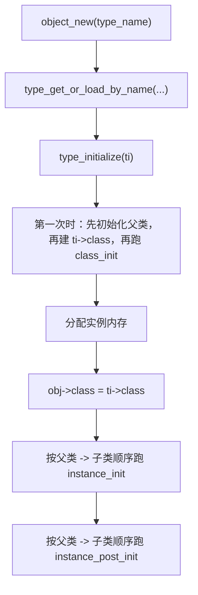

### 这里最值得背的 4 句话

- `class_init`
  - 更像“准备类对象 / 方法表”
- `instance_init`
  - 更像“构造具体对象”
- 父类方法之所以“被继承”
  - 是因为子类 class 初始化时先拷贝父类 class，再覆写自己关心的函数指针
- 第二次再创建同类型对象
  - 不会重新跑整套 `class_init`
  - 但会重新跑 `instance_init`

---

## 属性表与 `parent` 指针

### 属性有两层

| 位置 | 含义 |
| --- | --- |
| `class->properties` | 类级属性表 |
| `obj->properties` | 实例级属性表 |

可以先粗略理解成：

- 类属性更像“这个类型默认提供什么接口/属性”
- 实例属性更像“这个具体对象当前挂了什么属性值”

### `parent` 指针什么时候有值

刚 `object_new(...)` 出来时，通常可以先记：

- `class` 已经准备好了
- `parent` 往往还是 `NULL`

只有当对象真正被放进某个 QOM 容器关系里，例如：

- `object_property_add_child(...)`

之后，`parent` 才会指向某个实际的 QOM 父对象。

---

### `MemoryRegion` 里的 `opaque` 是什么

`opaque` 直译是“不透明的”。在 C / QEMU 里，`void *opaque` 常常表示：

- 这是一根指针；
- 但当前这层框架不关心它具体指向什么类型；
- 框架只负责把它保存起来，并在回调时原样传回去；
- 真正懂它类型的，是注册这个回调的人。

以 `MemoryRegion` 为例，`include/system/memory.h` 里可以看到两层配合：

```c
struct MemoryRegionOps {
    uint64_t (*read)(void *opaque, hwaddr addr, unsigned size);
    void (*write)(void *opaque, hwaddr addr, uint64_t data, unsigned size);
    ...
};

struct MemoryRegion {
    ...
    const MemoryRegionOps *ops;
    void *opaque;
    ...
};
```

初始化 I/O 类型的 `MemoryRegion` 时，调用者会传入：

```c
memory_region_init_io(mr, owner, ops, opaque, name, size);
```

然后 `system/memory.c` 里会保存：

```c
mr->ops = ops;
mr->opaque = opaque;
```

等客户机访问这段 MMIO（Memory-Mapped I/O，内存映射输入输出）地址时，QEMU 再调用：

```c
mr->ops->read(mr->opaque, addr, size);
mr->ops->write(mr->opaque, addr, value, size);
```

所以 `opaque` 的核心意思不是“神秘”，而是：

```text
MemoryRegion 框架看不懂它，只把它当作上下文指针保存；
设备自己的 read/write 回调知道它原本是什么，再把它转回去使用。
```

常见情况是把某个设备状态结构体指针传进去，例如概念上类似：

```c
MyDeviceState *s = ...;
memory_region_init_io(&s->mmio, OBJECT(s), &my_ops, s, "my-mmio", size);
```

之后回调里再取回：

```c
static uint64_t my_read(void *opaque, hwaddr addr, unsigned size)
{
    MyDeviceState *s = opaque;
    ...
}
```

把这件事放到 Rust 语境里看，就容易出现所有权 / 借用问题：

```text
QOM object 被创建
  ↓
同一个对象地址又作为 MemoryRegion 的 opaque 保存成 *mut
  ↓
QOM object 被挂进 QOM composition tree
  ↓
内存访问发生，opaque 被转成 &mut 访问设备状态
  ↓
但对象仍然可以从 QOM 树这条共享路径被观察到
```

这里危险的地方不在于 `*mut` 本身。裸指针（raw pointer）不受 Rust 借用检查器直接约束。真正危险的是：

- 一旦把 `*mut T` 转成 `&mut T`；
- 就是在向 Rust 承诺：这段时间里我独占这个 `T`；
- 但同一个对象如果还通过 QOM composition tree 被共享持有 / 可达；
- 那这个“独占”承诺就可能不成立。

所以这里的 `opaque value` 可以先记成：

- **C/QEMU 层**：`void *opaque` 是框架不解释的上下文指针；
- **QOM 层**：它可能指向某个 QOM 设备对象或设备状态；
- **Rust 层**：它通常表现为 `*mut T` / `*mut c_void`，转成 `&mut T` 时要非常小心别违反 aliasing 规则。

#### Notion 笔记：`void *`、`BqlCell`、`BqlRefCell`、`Opaque` 怎么理解

##### 一句话结论

在 QEMU 的 Rust 代码里，**不要把 C 传来的 `void *` 随手转成 `&mut T`**。

更推荐的思路是：

```text
C 的 void *
  -> Rust 里的共享引用 &T / &self
  -> 需要修改内部状态时，用 BqlCell / BqlRefCell
  -> 需要直接调用 C 函数时，用 Opaque<T> 转 raw pointer
```

##### 为什么不要直接转成 `&mut`

`void *` 在 C 里很普通，意思大概是：

```text
这是一根指针，但当前这层代码不关心它到底指向什么类型。
```

但 `&mut T` 在 Rust 里不是“普通可写指针”。它表示：

```text
我现在独占这个 T。
在这个 &mut T 活着的时候，不能有其他路径同时访问这个对象。
```

QEMU 的对象经常挂在 QOM（QEMU Object Model，QEMU 对象模型）树里。也就是说，即使某个回调拿到了 `void *opaque`，这个对象也可能还通过 QOM 树被其他地方共享地“看见”。

所以如果直接这样理解：

```text
void *opaque -> &mut MyDeviceState
```

就可能等于对 Rust 编译器说：

```text
我独占这个设备对象。
```

但实际情况可能是：

```text
这个设备对象仍然挂在 QOM 树里，并不是真正独占。
```

这就是文档提醒的核心。

##### 正确的心智模型

更适合 QEMU 的写法是：

```text
外层对象：用 &self 共享访问
内部会变的字段：放进特殊容器里
真正修改时：通过容器控制访问规则
```

这就是 **interior mutability（内部可变性）**。

通俗地说：

```text
外壳看起来是共享的，
但里面某些抽屉允许在规则保护下修改。
```

##### 三个类型分别干什么

| 类型 | 主要场景 | 可以怎么记 |
| --- | --- | --- |
| `BqlCell<T>` | 小字段，例如计数器、标志位、指针值 | “一个小盒子”，每次 get / set 一个值 |
| `BqlRefCell<T>` | 较大的设备状态，例如一组寄存器 | “一间小房间”，进去以后可以临时读写一批状态 |
| `Opaque<T>` | C 绑定层，包住底层 C struct | “黑盒包装”，Rust 不直接看里面，只把指针交给 C |

##### `BqlCell` / `BqlRefCell` 为什么带 `Bql`

`BQL` 是 **Big QEMU Lock（大 QEMU 锁）**。

QEMU 里很多设备状态的访问默认依赖这把锁来保护。普通 Rust 的 `Cell` / `RefCell` 只懂 Rust 单线程里的内部可变性；但 QEMU 还需要表达：

```text
这个字段可以内部修改，
但访问时应该处在 BQL 保护下。
```

所以 QEMU 提供了：

```text
BqlCell      = 带 BQL 规则的 Cell 风格容器
BqlRefCell   = 带 BQL 规则的 RefCell 风格容器
```

它们不是为了让代码“绕过 Rust”，而是为了把 QEMU 真实的锁规则告诉 Rust。

##### `vmstate` 为什么认识它们

`vmstate` 可以理解成 QEMU 的“设备状态保存说明书”。

虚拟机迁移、保存、恢复时，QEMU 需要知道：

- 这个设备有哪些状态字段；
- 每个字段在结构体里的偏移是多少；
- 每个字段应该怎么保存和恢复。

如果设备结构体长这样：

```rust
struct MyDevice {
    counter: BqlCell<u32>,
    registers: BqlRefCell<MyRegisters>,
}
```

`vmstate` 不能只看到外面的 `BqlCell` / `BqlRefCell`，它还要知道里面真正要保存的是：

```text
u32
MyRegisters
```

所以文档说 `vmstate` 能 “look inside them”，意思是：

```text
vmstate 知道 BqlCell / BqlRefCell 是包装层，
生成迁移布局时，可以继续看里面真正的数据类型。
```

普通 `RefCell` 或 `Mutex` 不在这套 QEMU 设备迁移约定里，所以不能随便拿来替换。

##### `Opaque<T>` 是干什么的

`Opaque<T>` 主要用在 Rust 和 C 的交界处。

例如：

```rust
pub struct Object(Opaque<bindings::Object>);
```

可以这样理解：

```text
bindings::Object 是 C 那边的对象布局；
Rust 不直接把它当普通 Rust struct 操作；
Rust 只保留一个安全边界外壳；
需要调用 C 函数时，再拿 raw pointer 出去。
```

为什么要这样？

- C struct 可能还没完全初始化；
- C 函数可能通过共享指针修改它；
- C 侧的生命周期、别名关系、锁规则，Rust 编译器不一定知道；
- 所以 Rust 不应该随便假设它是一个普通、安全、完整的 Rust 值。

##### 最终怎么记

```text
写设备逻辑：
  用 &self + BqlCell / BqlRefCell
  表达“共享对象里有受 BQL 保护的可变状态”

写 C 绑定层：
  用 Opaque<T>
  表达“这是 C 管的底层对象，Rust 只通过 raw pointer 跟它交互”

做迁移状态：
  vmstate 认识 BqlCell / BqlRefCell
  能穿过包装看到里面真正要保存的数据
```

---

## 以 `edu` 为例

### 实例链怎么展开

| 层级 | 结构体 | 这一层负责什么 |
| --- | --- | --- |
| 0 | `EduState` | `edu` 自己额外的状态 |
| 1 | `PCIDevice` | PCI 设备公共状态 |
| 2 | `DeviceState` | 所有设备公共状态 |
| 3 | `Object` | 最基础的 QOM 对象头 |

### `class` 和 `parent` 分别该怎么看

对 `EduState` 来说：

- `class`
  - 指向 `"edu"` 这个运行时类型对应的共享类对象
- `parent`
  - 指向 QOM 树里的父对象
  - 不是 `PCIDevice`
  - 也不是 `DeviceState`

### 一句话版

- **`EduState` 的最前面最终会展开到 `Object` 头**
- **它的 `class` 说明“我是什么类型”**
- **它的 `parent` 说明“我被谁收在对象树里”**

---

## `DeviceState` 速读

`DeviceState` 可以先记成：

- **所有设备实例共用的基础层**

### 它和具体设备的关系

```text
Object -> DeviceState -> PCIDevice -> EduState
```

### 最值得记住的几个字段

| 字段 | 粗略含义 |
| --- | --- |
| `parent_obj` | 让 `DeviceState` 成为真正的 QOM 对象 |
| `parent_bus` | 这个设备挂在哪条总线上 |
| `realized` | 设备是否已完成 realize |
| `gpios` | 设备对外暴露的 GPIO 端口列表 |
| `clocks` | 设备对外暴露的 clock 端口列表 |

### 关于 `PCI` / `GPIO` / `IRQ` / `clock`

这些更适合放在术语表里看，避免这份 QOM 主线笔记继续膨胀：

- `PCI`：见 `../riscv-virt/glossary.md`
- `GPIO`：见 `../riscv-virt/glossary.md`
- `IRQ`：见 `../riscv-virt/glossary.md`

如果只保留一句：

- `GPIO` 是泛化的离散信号线
- `IRQ` 是承载“中断语义”的那类信号线
- `clock` 是时钟输入输出端口

---

## `TypeImpl` 速读

### 它到底是什么

- **`TypeImpl` 是 QOM 内部真正运转的运行时类型对象**

如果只看 `object.h`，你会看到的是：

- `Type`
- `TypeInfo`
- `OBJECT_CHECK(...)`
- `object_new(...)`

但这些接口真正落地时，最后都会汇聚到 `TypeImpl`。

### 最重要的字段

| 字段 | 作用 |
| --- | --- |
| `name` | 类型名 |
| `parent` / `parent_type` | 父类型名字 / 父类型指针缓存 |
| `class_size` / `instance_size` / `instance_align` | 类对象和实例对象的最终布局参数 |
| `class_init` / `instance_init` | 类初始化和实例初始化回调 |
| `abstract` | 是否抽象 |
| `interfaces` | 这个类型实现了哪些接口 |
| `class` | 该类型共享的类对象缓存 |

### `struct InterfaceImpl { const char *typename; }` 到底在干什么

先给最短答案：

- **`InterfaceImpl` 是 QOM 内部拿来记录“某个类型声明自己实现了哪些接口”的极简运行时条目。**

源码里它长这样：

```c
struct InterfaceImpl
{
    const char *typename;
};
```

如果只看这一行 `typename`，很容易觉得“这也太少了，好像没干什么”。  
但它的意义不在“字段多不多”，而在它所在的位置：

```c
struct TypeImpl
{
    ...
    int num_interfaces;
    InterfaceImpl interfaces[MAX_INTERFACES];
};
```

也就是说：

- 每个 `TypeImpl` 都可以带一小组 `InterfaceImpl`
- 这组数组表示：
  - **“这个类型源码里声明实现了哪些接口类型名”**

它和 `object.h` 里的 `InterfaceInfo` 是一前一后的关系：

| 名字 | 所在层次 | 作用 |
| --- | --- | --- |
| `InterfaceInfo` | `TypeInfo` 静态注册层 | 你在源码里手写的接口声明 |
| `InterfaceImpl` | `TypeImpl` 运行时层 | QOM 内部保存下来的接口条目 |

对应代码就是：

```c
for (i = 0; info->interfaces && info->interfaces[i].type; i++) {
    ti->interfaces[i].typename = g_strdup(info->interfaces[i].type);
}
ti->num_interfaces = i;
```

这说明：

- 你在 `TypeInfo.interfaces` 里写的，是 `InterfaceInfo.type`
- 到了 `type_new()`，QOM 会把这些接口名字拷进 `TypeImpl.interfaces[]`
- 每一项 `InterfaceImpl` 现在只先记一个：
  - **接口类型名字符串**

所以可以把 `InterfaceImpl` 理解成：

- **“接口实现声明的内部登记表项”**
- 而不是：
  - 具体接口方法表
  - 接口对象本身
  - 接口 class 本身

### 为什么它目前只需要一个 `typename`

因为在这一步，QOM 还没有真正把接口 class 挂到 `ti->class->interfaces` 上。

`TypeImpl.interfaces[]` 在这里更像是：

- **待处理清单**
- **待解析的接口名字列表**

后面 `type_initialize()` 时，才会把这些名字真正解析成接口类型对象：

```c
TypeImpl *t = type_get_by_name_noload(ti->interfaces[i].typename);
...
type_initialize_interface(ti, t, t);
```

也就是说流程是：

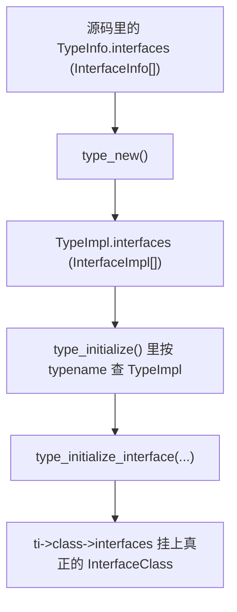

所以 `InterfaceImpl.typename` 的职责非常明确：

- **先把“我要实现哪个接口”记下来**
- **等类型真正初始化时，再把这个名字解析成接口类型并生成对应接口 class**

### 它不是最终接口对象

这个区分很重要：

- `InterfaceImpl`
  - 只是 `TypeImpl` 里的一条内部记录
- `InterfaceClass`
  - 才是后面真正挂到 `ObjectClass.interfaces` 链表里的接口类对象

看 `type_initialize_interface(...)`：

```c
info.parent = parent_type->name;
info.name = g_strdup_printf("%s::%s", ti->name, interface_type->name);
info.abstract = true;

iface_impl = type_new(&info);
iface_impl->parent_type = parent_type;
type_initialize(iface_impl);

new_iface = (InterfaceClass *)iface_impl->class;
new_iface->interface_type = interface_type;

ti->class->interfaces = g_slist_append(ti->class->interfaces, new_iface);
```

这里最容易卡住的是这行：

```c
info.name = g_strdup_printf("%s::%s", ti->name, interface_type->name);
```

它的意思不是在做什么“C++ 风格命名空间”，而是：

- **动态拼出一个新的、唯一的 QOM 类型名**

其中：

- `g_strdup_printf(...)`
  - 是 `GLib` 的“格式化字符串 + 分配新字符串”函数
  - 可以先粗略理解成“`sprintf` + `strdup` 合在一起”

- `"%s::%s"`
  - 表示把两个字符串按 `左边::右边` 拼起来

- `ti->name`
  - 当前正在初始化的具体类型名

- `interface_type->name`
  - 当前要接到它上面的接口类型名

所以拼出来的名字大概像：

- `device::user-creatable`
- `virt-machine::resettable`

它的目的主要是：

- **给“某个具体类型 + 某个接口”这份接口 class 组合，造一个内部唯一名字**

因为这里不是直接复用接口类型本身的 `InterfaceClass`，而是要为：

- “`ti` 这个具体类型实现了 `interface_type` 这个接口”

单独构造一个接口 class 类型对象 `iface_impl`。

所以可以把它理解成：

```text
ti->name              = 具体类型名
interface_type->name = 接口类型名
--------------------------------
拼出来的新名字        = “这个具体类型对应的那个接口 class 类型名”
```

再结合上一行：

```c
info.parent = parent_type->name;
```

意思就是：

- 这个新造出来的内部类型
- 父类是 `parent_type`
- 名字是 `具体类型名::接口类型名`

然后 `type_new(&info)` / `type_initialize(iface_impl)` 再把它真正注册并初始化出来。

最短记法：

- **这行是在给接口 class 的“具体实现类型”起内部名字**
- **不是在给普通对象实例命名**
- **`::` 在这里只是人为选的分隔符，用来表达“某类型对应某接口”**

所以真正给 `object_class_dynamic_cast(...)`、接口查询这些运行时逻辑使用的，是：

- `ti->class->interfaces`

而不是前面的：

- `ti->interfaces[i].typename`

前者更像“运行时已经挂好的接口 class 链表”，后者更像“初始化阶段的接口名字清单”。

### interface 的函数指针到底放在哪里

interface 的虚函数指针不放在裸的 `InterfaceClass` 里。

`InterfaceClass` 只是所有接口 class 的公共头：

```c
struct InterfaceClass {
    ObjectClass parent_class;
    Type interface_type;
};
```

真正的函数指针放在“具体接口自己的 Class 结构体”里，而且这个结构体第一个字段通常就是 `InterfaceClass parent_class`。

例如 `UserCreatableClass`：

```c
struct UserCreatableClass {
    InterfaceClass parent_class;

    void (*complete)(UserCreatable *uc, Error **errp);
    bool (*can_be_deleted)(UserCreatable *uc);
};
```

某个类型实现 `TYPE_USER_CREATABLE` 时，它的 `class_init` 可以这样填接口函数指针：

```c
static void rng_backend_class_init(ObjectClass *oc, const void *data)
{
    UserCreatableClass *ucc = USER_CREATABLE_CLASS(oc);

    ucc->complete = rng_backend_complete;
}
```

这里能把 `ObjectClass *oc` 转成 `UserCreatableClass *`，是因为当前 `oc` 实际上指向的是 `type_initialize_interface()` 给这个“具体类型 + 接口”组合生成出来的接口 class 内存。

最短记法：

- `InterfaceClass`：接口 class 的公共头
- `UserCreatableClass` / `MemoryDeviceClass` 等：具体接口 class，里面才放虚函数指针
- `ti->class->interfaces`：挂的是这些具体接口 class 的公共头指针

### `ObjectClass.interfaces` 和 `TypeImpl.interfaces[]` 到底是什么关系

有关系，但不是“同一份数据的两种写法”。

更准确地说：

- `TypeImpl.interfaces[]`
  - 表示：**这个类型自己在 `TypeInfo` 里声明了哪些接口名字**
  - 还是“待解析清单”
  - 只记录当前类型直接声明的接口，不是最终继承结果

- `ObjectClass.interfaces`
  - 表示：**这个类型初始化完成后，类对象上真正挂好的接口 class 链表**
  - 是运行时可直接使用的结果
  - 既包含从父类继承来的接口，也包含当前类型自己新增的接口

`type_initialize()` 里两条来源都会汇合到最终的 `ti->class->interfaces`：

```c
for (e = parent->class->interfaces; e; e = e->next) {
    ...
    type_initialize_interface(ti, iface->interface_type, klass->type);
}

for (i = 0; i < ti->num_interfaces; i++) {
    TypeImpl *t = type_get_by_name_noload(ti->interfaces[i].typename);
    ...
    type_initialize_interface(ti, t, t);
}
```

所以可以把它理解成：

```text
父类 ObjectClass.interfaces
        \
         +--> type_initialize() --> 当前类型的 ObjectClass.interfaces
        /
当前类型 TypeImpl.interfaces[]
```

这里最重要的区别是：

- **`TypeImpl.interfaces[]` 更像“输入”**
- **`ObjectClass.interfaces` 更像“输出 / 最终运行时结果”**

还有一个细节要注意：

- 在处理 `TypeImpl.interfaces[]` 时，QOM 会先检查目标接口是否已经被父类链上的某个更具体接口覆盖
- 如果已经覆盖，就不会重复挂一份

所以它们的关系不是简单的一一对应，而是：

- **`TypeImpl.interfaces[]` 参与生成 `ObjectClass.interfaces`**
- **但 `ObjectClass.interfaces` 还会额外包含继承结果和去重后的最终形态**

### 一句话记忆

- **`InterfaceInfo` 是源码里写的接口说明**
- **`InterfaceImpl` 是 QOM 内部保存的接口名字条目**
- **`InterfaceClass` 才是最后真正挂到类对象上的接口运行时实体**

### 最重要的函数

| 函数 | 作用 |
| --- | --- |
| `type_new()` | 从 `TypeInfo` 生成 `TypeImpl` |
| `type_register_static()` | 把类型交给 QOM 注册 |
| `type_get_parent()` | 走父类链 |
| `type_is_ancestor()` | 判断祖先关系 |
| `type_initialize()` | 真正把类型初始化成熟 |

### 从 `object.h` 开始看，它在整层抽象里的位置

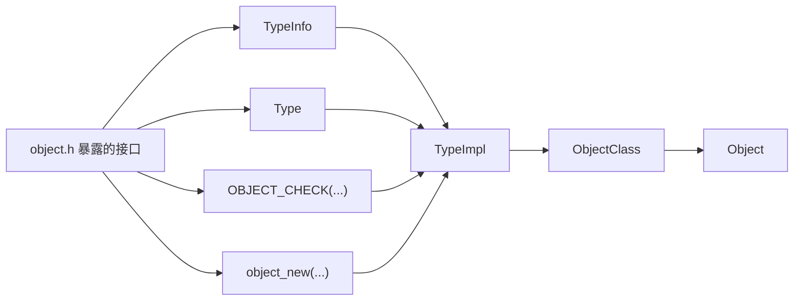

### `TypeInfo` 和 `ObjectClass` 的关系

先给最短答案：

- **`TypeInfo` 不是 `ObjectClass`**
- **`TypeInfo` 是制造 `ObjectClass` 所需的原始说明书之一**
- **真正直接持有并缓存 `ObjectClass` 的，是 `TypeImpl`**

### 为什么 `TypeInfo` 和 `TypeImpl` 看起来很多字段都差不多

对，**这基本就是故意这么设计的**。

可以先给最短结论：

- `TypeInfo`
  - **源码作者填写的静态注册说明书**
- `TypeImpl`
  - **QOM 内部把这份说明书拷进去后，继续补充运行时状态得到的工作对象**

所以它们“长得像”不是重复设计失误，而是因为：

- `TypeImpl` 一开始就需要把 `TypeInfo` 里的核心声明信息接住
- 然后再在这个基础上追加：
  - 父类型缓存
  - 已初始化好的类对象
  - 接口链展开结果
  - 运行时修正过的布局信息

最直观的证据就是 `type_new()`：

```c
ti->name = g_strdup(info->name);
ti->parent = g_strdup(info->parent);
ti->class_size = info->class_size;
ti->instance_size = info->instance_size;
ti->instance_align = info->instance_align;
ti->class_init = info->class_init;
ti->class_base_init = info->class_base_init;
ti->class_data = info->class_data;
ti->instance_init = info->instance_init;
ti->instance_post_init = info->instance_post_init;
ti->instance_finalize = info->instance_finalize;
ti->abstract = info->abstract;
```

这段就说明：

- **`TypeInfo -> TypeImpl` 不是“重新发明一套完全不同的数据结构”**
- 而是：
  - **先把注册时声明的核心字段搬进来**
  - **再把它升级成运行时可用的内部类型对象**

### 为什么不直接只保留一个 `TypeInfo`

因为这两层职责不一样。

#### 1. `TypeInfo` 更像外部输入

它的角色是：

- 给类型注册代码填写
- 适合写成 `static const TypeInfo xxx_info = { ... }`
- 描述“我希望 QOM 怎么注册这个类型”

它更像：

- 配方
- 声明
- 模板

#### 2. `TypeImpl` 更像内部工作状态

它除了保留配方字段，还要承载运行时状态，例如：

- `parent_type`
  - 已解析好的父类型指针缓存
- `class`
  - 已分配好的共享类对象
- `num_interfaces` / `interfaces`
  - 已复制进内部的接口声明条目

而且有些字段在运行时还会被“定稿”或修正：

```c
ti->class_size = type_class_get_size(ti);
ti->instance_size = type_object_get_size(ti);
ti->instance_align = type_object_get_align(ti);
```

这说明：

- `TypeInfo` 里给的是“注册时提供的初始信息”
- `TypeImpl` 里保存的是“QOM 运行时真正采用的最终信息”

### 所以它们的关系更像什么

最适合这样记：

| 层次 | 更像什么 |
| --- | --- |
| `TypeInfo` | 你手写的类型注册表单 / 说明书 |
| `TypeImpl` | QOM 内部根据表单生成并维护的运行时类型档案 |

所以“字段很像”是自然结果，因为：

1. 运行时档案必须先包含注册说明书里的核心内容
2. 但运行时档案还要继续长出内部状态

最短记法：

- **`TypeInfo` 是输入配方**
- **`TypeImpl` 是把配方读进去之后形成的后台工作对象**
- **它们相似，是因为后者本来就以前者为起点**

### 能不能类比成 `TypeInfo : TypeImpl = ObjectClass : Object`

可以借这个类比帮自己先抓住“前后有承接关系”，但**不能把它当成严格对应**。

先给最短结论：

- **不太准确，最多只能说“都有前者支撑后者”**
- **`ObjectClass : Object` 是“类对象 : 实例对象”**
- **`TypeInfo : TypeImpl` 是“静态注册说明书 : 运行时类型元数据对象”**

也就是说，这两组关系发生在**不同层**：

| 关系 | 更准确的含义 |
| --- | --- |
| `ObjectClass -> Object` | 这个类型的共享类对象，被实例通过 `obj->class` 指向 |
| `TypeInfo -> TypeImpl` | 源码里手写的注册说明，被 QOM 拷进内部工作对象 |

所以如果硬要类比，会有两个容易误伤的点：

1. **`ObjectClass` 和 `Object` 是“类 / 实例”关系**
   - 它们都是真正运行时存在并直接配合工作的对象
   - `Object` 创建出来后，里面就有 `ObjectClass *class`

2. **`TypeInfo` 和 `TypeImpl` 不是“类 / 实例”关系**
   - `TypeInfo` 不是 `TypeImpl` 的“类”
   - `TypeImpl` 也不是 `TypeInfo` 的“实例”
   - 更像是：**你写了一张注册表单，QOM 把它读进去，变成后台维护的运行时类型档案**

更适合背成下面这条链：

```text
TypeInfo -> TypeImpl -> ObjectClass -> Object
```

其中：

- `TypeInfo -> TypeImpl`
  - **输入说明** 变成 **内部类型工作对象**
- `TypeImpl -> ObjectClass`
  - **内部类型工作对象** 产出并缓存 **共享类对象**
- `ObjectClass -> Object`
  - **共享类对象** 被 **具体实例** 引用

所以更准确的话不是：

- `TypeInfo` 之于 `TypeImpl` 就像 `ObjectClass` 之于 `Object`

而是：

- **`TypeInfo : TypeImpl` 更像“配置/说明书 : 运行时档案”**
- **`ObjectClass : Object` 更像“类对象/方法表 : 实例对象”**

如果只想保留一个不太会错的超短版本，可以记成：

- **前一组是“注册层 -> 类型层”**
- **后一组是“类层 -> 实例层”**

### 类和对象到底是什么关系

先给一个尽量标准、但又不太绕的说法：

- **类（class）是对一类对象共同结构和共同行为的抽象**
- **对象（object）是这个抽象在运行时的具体实例**

可以拆成三层看：

| 层 | 它回答的问题 |
| --- | --- |
| 类 | “这一类东西通常有哪些字段、能做哪些事？” |
| 对象 | “眼前这个具体东西现在自己的状态是什么？” |
| 类和对象的关系 | “对象按类的规则组织，但每个对象有自己独立的实例状态” |

最容易先抓住的两个点是：

1. **类描述共性**
   - 比如“设备一般有 `realize` / `reset` 这类行为槽位”
   - 这属于“这一类对象通常怎么做事”

2. **对象保存个体状态**
   - 比如“这个具体设备当前寄存器值是多少、是否已经 realize、挂在哪个 parent 下面”
   - 这属于“这个具体实例现在是什么样”

所以更短一句话就是：

- **类管“定义和共性”，对象管“实例和个体状态”**

如果用一个不太会误导的类比：

| 概念 | 更像什么 |
| --- | --- |
| 类 | 设计蓝图 / 规则模板 |
| 对象 | 按这份蓝图造出来的某一个具体东西 |

但这里要立刻补一个精确限制：

- **对象不是“把整个类拷一份进自己体内”**
- 更准确地说，是：
  - **对象按类规定的布局来组织自己的实例数据**
  - **对象在需要共同行为时，再去引用类侧那份共享定义**

这正好就是 QOM 里 `ObjectClass` 和 `Object` 的关系：

- `ObjectClass`
  - 保存类侧共享内容
  - 更像“方法表 + 类级元信息”
- `Object`
  - 保存实例自己的状态
  - 并通过 `obj->class` 指向那份共享类对象

所以在 QOM 里，不要把它想成：

- “每个 `Object` 里面都完整包含一个 `ObjectClass`”

而要想成：

- **每个 `Object` 都带一个指针，指向它所属类型那份共享的 `ObjectClass`**

如果把通用概念和 QOM 一一对上，可以先这样背：

| 通用概念 | QOM 里的对应物 |
| --- | --- |
| 类 | `ObjectClass` 及其派生类 |
| 对象 | `Object` 及其派生实例 |
| 对象知道自己属于哪个类 | `obj->class` |
| 类知道自己对应哪个运行时类型 | `klass->type` |

最后给一个最短复习版：

- **类 = 共性定义**
- **对象 = 具体实例**
- **对象按类的规则组织自己，但保存自己的实例状态**
- **在 QOM 里，这条关系落成 `ObjectClass -> Object`，中间靠 `obj->class` 连起来**

### 那 `TypeImpl` 和 `ObjectClass` 更像什么关系

这组更适合类比成：

- **`TypeImpl` 像“类型档案 / 类型控制块”**
- **`ObjectClass` 像“这个类型对应的共享类对象 / 方法表实例”**

先给最短结论：

- **不是一对并列概念**
- **更像“上游元数据对象” 和 “它产出的类侧运行时对象”**
- **`TypeImpl` 持有 `ObjectClass *class`，`ObjectClass` 反过来有 `Type type` 指回 `TypeImpl`**

可以先用一句话抓住：

- **`TypeImpl` 负责代表“这个类型本身”**
- **`ObjectClass` 负责代表“这个类型在类侧可被实例共享使用的那一份对象”**

如果套一个更生活化但还算稳的比喻：

| 东西 | 更像什么 |
| --- | --- |
| `TypeImpl` | 某个类型在 QOM 后台的总档案卡 |
| `ObjectClass` | 按这张档案卡真正做出来的一份共享类对象 |

所以它们不是：

- “类 / 实例”
- “说明书 / 实现”

而更像：

- **“运行时类型元数据” -> “该类型对应的类侧实体”**

最关键的源码关系就是两根指针：

- `TypeImpl -> class`
  - 这个类型对应的共享类对象是谁
- `ObjectClass -> type`
  - 这份类对象属于哪个运行时类型

所以两者关系很像一对互相可回跳的对象：

```text
TypeImpl <-> ObjectClass
```

但职责不同：

1. `TypeImpl`
   - 保存类型名、父类型、大小、回调、接口声明、抽象属性等
   - 更偏“类型元数据中心”

2. `ObjectClass`
   - 保存这个类型最后可供实例共享使用的类侧内容
   - 包括继承下来的父类部分、当前类覆盖后的方法槽位、属性表、接口类链等
   - 更偏“类对象 / 方法表实体”

所以如果你要找一个最不容易错的短句，可以直接记：

- **`TypeImpl` 是“类型的后台档案”**
- **`ObjectClass` 是“这个类型落地后的共享类对象”**

### 为什么 `TypeInfo` 放在 `object.h`，但 `TypeImpl` 放在 `object.c`

这其实特别能说明 QOM 的边界设计。

先给最短结论：

- **`TypeInfo` 是对外暴露的“注册输入格式”**
- **`TypeImpl` 是 QOM 内部私有的“运行时工作结构”**

所以：

- `TypeInfo` 必须放在 `include/qom/object.h`
- `TypeImpl` 刻意只放在 `qom/object.c`

#### 1. 为什么 `TypeInfo` 必须放头文件里

因为别的模块真的要**直接写它**。

QEMU 里典型写法就是：

```c
static const TypeInfo pci_device_type_info = {
    .name = TYPE_PCI_DEVICE,
    .parent = TYPE_DEVICE,
    .instance_size = sizeof(PCIDevice),
    .class_size = sizeof(PCIDeviceClass),
    .abstract = true,
};
```

这里有个关键点：

- 这不是“只拿一个指针”
- 而是要在别的 `.c` 文件里**定义一个 `TypeInfo` 对象本体**
- 还要用指定初始化器（`.name = ...`, `.parent = ...`）

这就要求调用方在编译时必须知道：

- `TypeInfo` 这个结构体真的存在
- 它有哪些字段
- 字段名字和布局是什么

所以 `TypeInfo` 的完整定义必须公开在 `include/qom/object.h`。

你可以把它理解成：

- **QOM 对外公布了一张“你要怎么描述一个新类型”的表单格式**

#### 2. 为什么 `TypeImpl` 要藏在 `.c` 文件里

因为外部模块不应该直接操作它。

`TypeImpl` 是 QOM 内部真正工作的结构：

- 保存从 `TypeInfo` 拷进来的字段
- 缓存父类型指针
- 缓存 `ObjectClass *class`
- 保存接口展开后的内部记录
- 在 `type_initialize()` 里继续被修正和补全

这些都属于：

- **QOM 内部实现细节**
- **运行时状态**
- **将来维护者可能想改的内部布局**

所以 QOM 只在头文件里给你一个：

```c
typedef struct TypeImpl *Type;
```

意思是：

- 外部可以把它当成一个“类型句柄（handle）”传来传去
- 但外部**看不见** `struct TypeImpl` 里面到底有什么字段
- 也就不能写 `type->class`、`type->parent_type` 这种代码

这就是典型的 C 风格封装：

- **公开名字**
- **隐藏内部结构**

#### 3. 这代表了什么

它代表 QOM 明确分了两层：

| 层 | 对外是否公开 | 作用 |
| --- | --- | --- |
| `TypeInfo` | 公开 | 给类型作者填写注册说明 |
| `TypeImpl` | 不公开 | 给 QOM 内核自己维护运行时类型状态 |

换句话说，QOM 是在告诉你：

- **你可以告诉我“这个类型应该长什么样”**
- **但你不能直接碰我内部真正维护的类型对象**

#### 4. 为什么这很重要

因为这样有三个好处：

1. **降低耦合**
   - 设备代码、机器代码、总线代码只需要会写 `TypeInfo`
   - 不需要依赖 QOM 内部运行时结构怎么组织

2. **保留内部实现自由**
   - 以后 `TypeImpl` 想加字段、改字段、换组织方式
   - 只要对外 API 不变，外部代码通常不用跟着改

3. **防止外部越权依赖内部状态**
   - 如果 `TypeImpl` 也公开，外部代码很容易开始偷读：
     - `type->class`
     - `type->parent_type`
     - `type->interfaces`
   - 这样一来 QOM 内部实现就被“冻住”了

#### 5. 顺手对比一下：为什么 `Object` / `ObjectClass` 反而放在头文件里

这正好能帮助你看清边界。

`Object` 和 `ObjectClass` 虽然也是运行时对象，但它们要公开定义在头文件里，是因为：

- QOM 的“继承”靠的是**把父结构体放在第一个字段**
- 子类型要写：
  - `Object parent_obj;`
  - `ObjectClass parent_class;`

这要求外部代码必须知道：

- `Object` 的完整结构体定义
- `ObjectClass` 的完整结构体定义

否则连子结构体都没法正确声明。

所以可以把这几者一起背成：

| 东西 | 为什么放这里 |
| --- | --- |
| `TypeInfo` 在 `object.h` | 因为外部模块要按它的字段格式填写注册说明 |
| `TypeImpl` 在 `object.c` | 因为它是 QOM 内核私有的运行时实现结构 |
| `Object` / `ObjectClass` 在 `object.h` | 因为外部子类型要靠完整结构体做首字段嵌套继承 |

如果只背一句最稳的话，就是：

- **`TypeInfo` 是 QOM 对外公开的“注册协议”，`TypeImpl` 是 QOM 对内隐藏的“实现细节”。**

顺手补一个英文阅读里容易卡住的词：

- 文档里如果写 `ObjectClass derivatives`
- 这里的 `derivatives` **不是数学里的“导数”**
- 它在这里更接近：
  - **派生类**
  - **派生类型**
  - **从 `ObjectClass` 继承出来的类结构体**

在 `QEMU/QOM` 里可以先这样记：

- `ObjectClass`
  - 最基础的类对象基类
- `DeviceClass`
  - `ObjectClass` 的派生类
- `PCIDeviceClass`
  - `DeviceClass` 的派生类

所以像这句：

- `ObjectClass derivatives are instantiated dynamically`

更贴近原意的理解不是：

- “`ObjectClass` 的导数会被动态实例化”

而是：

- **“从 `ObjectClass` 派生出来的那些类对象类型，会在运行时被动态创建出来”**

再结合后半句：

- `but there is only ever one instance for any given type`

整句更自然的理解可以记成：

- **对每一个运行时类型，QOM 都会有一份对应的共享类对象；这些类对象属于 `ObjectClass` 及其派生类体系，它们在运行时动态创建，但每个具体类型只保留一份。**

可以把它们理解成三层：

| 层次 | 东西 | 作用 |
| --- | --- | --- |
| 静态注册层 | `TypeInfo` | 你在源码里手写的“类型说明书” |
| 运行时类型层 | `TypeImpl` | QOM 内部真正保存类型元数据的对象 |
| 共享类对象层 | `ObjectClass` | 这个类型对应的“类对象 / 方法表” |

关系图可以画成：

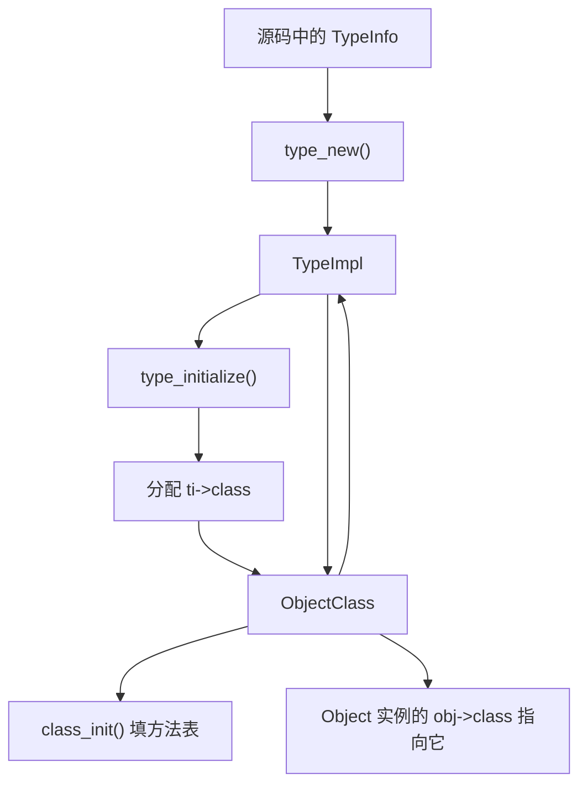

这里最关键的是两步：

1. `type_new()` 先把 `TypeInfo` 拷进 `TypeImpl`
2. `type_initialize()` 再根据 `TypeImpl` 真正分配并初始化 `ObjectClass`

所以你可以说：

- **没有 `TypeInfo`，QOM 通常就不知道怎么注册出这个类型**
- **没有 `TypeImpl`，QOM 也不会直接从 `TypeInfo` 跳到 `ObjectClass`**
- **`ObjectClass` 是运行时产物，不是你手写在源码里的静态说明书**

再看它们在源码里的“正反链接”：

- `TypeImpl` 里有 `ObjectClass *class`
- `ObjectClass` 里有 `Type type`

也就是：

- `TypeImpl -> class`：这个类型对应的共享类对象是谁
- `ObjectClass -> type`：这个类对象属于哪个运行时类型

这两个方向连起来后，QOM 就能在“类型元数据”和“类对象”之间来回跳。

### `ObjectClass` 是怎么被“制造”出来的

`type_initialize()` 里的关键动作是：

1. 先算好这个类型最终的 `class_size`
2. `g_malloc0(ti->class_size)` 分配一块类对象内存
3. 如果有父类，先递归初始化父类
4. `memcpy(ti->class, parent->class, parent->class_size)` 先把父类方法表和基类内容拷下来
5. 设置 `ti->class->type = ti`
6. 最后调用本类型自己的 `class_init()`，覆盖或补充方法槽位

所以 `ObjectClass` 不是“凭空 new 出来一块空结构体就完事”，而是：

- 先继承父类类对象的内容
- 再把当前类型自己的信息补进去

这就很像你前面理解到的“继承感”：

- **实例继承** 靠的是“父结构体放第一个字段”
- **类继承 / 方法继承** 靠的是“父类对象先 `memcpy` 到子类对象，再由 `class_init` 覆盖”

### 回到 `qom/object.c:336`：`type_initialize(TypeImpl *ti)` 到底在干什么

可以先把它理解成一句话：

- **它负责把“还只是类型描述”的 `TypeImpl`，真正初始化成一个可用的 QOM 运行时类型，重点产物就是 `ti->class` 这份共享类对象。**

如果按源码顺序拆，它主要做 5 件事：

1. **防重复初始化**
   - `if (ti->class) return;`
   - 说明这个类型的类对象已经建好了，就不要再做一遍

2. **确定这个类型的最终尺寸和抽象属性**
   - `type_class_get_size(ti)`
   - `type_object_get_size(ti)`
   - `type_object_get_align(ti)`
   - 注意这里判断的不是原始 `TypeInfo.instance_size`，而是经过 `type_object_get_size(ti)` 沿父类型链解析后的最终 `ti->instance_size`
   - 如果某个普通对象类型没有填写 `TypeInfo.instance_size`，但它的父类型有实例大小，那么最终会继承父类型大小，不会保持为 0
   - 只有整条父类型链都没有实例大小时，最终 `ti->instance_size` 才会是 0；这种类型没有可分配的 `Object` 实例布局，所以会被强制视为抽象类型
   - 接口（`interface`）类型就是典型情况：`TYPE_INTERFACE` 自身没有 `instance_size`，它的子接口也必须保持 `instance_size == 0`，只能提供接口类信息，不能被直接实例化

#### 为什么 `instance_size == 0` 会被强制标记为 `abstract`

这里容易和 `TypeInfo` 文档混在一起：

```c
@instance_size: ... If @instance_size is 0, then the size of the object will be
the size of the parent object.
```

这里还有一个很容易卡住初学者的小点：

- `#Object` 不是 C 预处理器语法，也不是“井号加变量名”
- 它是 `gtk-doc` 风格的文档交叉引用写法
- 这里的 `Object` 指的是 `QOM`（QEMU Object Model，QEMU 对象模型）里的基类 `Object`

所以：

```c
The size of the object (derivative of #Object)
```

更自然的中文应该读成：

> “这个对象的大小（这里说的是从 `Object` 派生出来的对象实例）”

也就是：

- `instance_size` 描述的是“某个 `QOM` 实例对象”要分配多大内存
- 这个对象不是随便一个 C `struct`，而是 **继承自 `Object` 的 QOM 对象**
- 常见情况就是：
  - 父类结构体把 `Object parent_obj;` 放在开头
  - 子类结构体在后面继续追加自己的字段
  - `instance_size = sizeof(子类结构体)`

可以先把关系记成：

```mermaid
flowchart TD
    A["QOM 根对象 Object"] --> B["父类型结构体"]
    B --> C["子类型结构体"]
    C --> D["instance_size = sizeof(该子类型结构体)"]
```

这句话说的是 **输入层的省略规则**：源码里的 `TypeInfo.instance_size = 0` 可以表示“我不新增实例字段，沿用父类型实例大小”。

但 `type_initialize()` 里执行的是：

```c
ti->instance_size = type_object_get_size(ti);
if (ti->instance_size == 0) {
    ti->abstract = true;
}
```

也就是说，`type_initialize()` 看到的 0 已经不是“当前 `TypeInfo` 没填”的原始 0，而是“向父类型追溯之后仍然找不到任何实例大小”的最终 0。

可以画成两种情况：

```mermaid
flowchart TD
    A["普通子类型 TypeInfo.instance_size = 0"] --> B["type_object_get_size(child)"]
    B --> C["父类型有 instance_size = sizeof(Object 或子结构体)"]
    C --> D["最终 ti->instance_size 非 0"]
    D --> E["可以是具体类型"]

    F["接口类型 TypeInfo.instance_size = 0"] --> G["type_object_get_size(interface)"]
    G --> H["父链 TYPE_INTERFACE 也没有 instance_size"]
    H --> I["最终 ti->instance_size 仍为 0"]
    I --> J["强制 abstract = true"]
```

所以这两句话并不矛盾：

- `TypeInfo` 文档说：**原始字段为 0 时，尝试继承父类型实例大小**
- `type_initialize()` 代码说：**如果继承完以后最终仍然是 0，那就说明这个类型根本没有实例布局，必须是抽象类型**

1. **分配类对象内存，并先把父类那份“继承”下来**
   - `ti->class = g_malloc0(ti->class_size)`
   - 如果有父类，先递归 `type_initialize(parent)`
   - 再 `memcpy(ti->class, parent->class, parent->class_size)`
   - 这一步就是 QOM 类继承的核心：**先拷父类方法表，再让子类覆盖**

2. **补齐接口（interface）对应的类侧信息**
   - 先把父类已经有的接口类也带下来
   - 再处理当前类型自己声明的接口
   - 这里会调用 `type_initialize_interface(...)`
   - 所以它不只是“建普通 class”，还负责把接口这条支线也接好

3. **完成类对象的最终初始化**
   - 创建 `properties` 哈希表
   - 设置 `ti->class->type = ti`
   - 沿父类链执行 `class_base_init`
   - 最后执行当前类型自己的 `class_init`

可以画成：

```mermaid
flowchart TD
    A["type_initialize(ti)"] --> B{"ti->class 已存在?"}
    B -- "是" --> C["直接返回"]
    B -- "否" --> D["计算 class_size / instance_size / align"]
    D --> E["必要时标记 abstract / interface 约束检查"]
    E --> F["分配 ti->class"]
    F --> G{"有父类?"}
    G -- "有" --> H["先递归初始化父类"]
    H --> I["memcpy 父类 class 到子类 class"]
    I --> J["继承并补齐 interfaces"]
    G -- "无" --> J
    J --> K["创建 properties 表"]
    K --> L["ti->class->type = ti"]
    L --> M["沿父类链跑 class_base_init"]
    M --> N["跑当前类型的 class_init"]
```

所以这个函数最本质的作用不是“创建实例”，而是：

- **把一个 QOM 类型的类侧元数据真正落地**
- **建立父类到子类的 class 继承结果**
- **让之后的对象实例都能通过 `obj->class` 指到一份已经准备好的类对象**

### 看一个真实代码例子：`ObjectClass -> DeviceClass -> PCIDeviceClass`

先看几个基础类结构体定义：

```c
struct DeviceClass {
    ObjectClass parent_class;
    ...
};

struct PCIDeviceClass {
    DeviceClass parent_class;
    ...
};
```

这说明：

- `DeviceClass` 把 `ObjectClass` 放在第一个字段
- `PCIDeviceClass` 又把 `DeviceClass` 放在第一个字段

所以类对象这条链本身也有“结构体嵌套继承”：

```text
ObjectClass -> DeviceClass -> PCIDeviceClass
```

再看一个真正自定义类结构体的例子：`hw/xen/xen_pt.h`

```c
typedef struct XenPTDeviceClass {
    PCIDeviceClass parent_class;
    XenPTQdevRealize pci_qdev_realize;
} XenPTDeviceClass;
```

这表示：

- `XenPTDeviceClass` 继承自 `PCIDeviceClass`
- 它在父类后面又新增了自己的类级字段 `pci_qdev_realize`

然后在对应的 `TypeInfo` 里：

```c
static const TypeInfo xen_pci_passthrough_info = {
    .parent = TYPE_PCI_DEVICE,
    .class_init = xen_pci_passthrough_class_init,
    .class_size = sizeof(XenPTDeviceClass),
    ...
};
```

这里三件事要连起来看：

1. `.parent = TYPE_PCI_DEVICE`
   - 说明它的父类型是 `PCIDevice`
2. `.class_size = sizeof(XenPTDeviceClass)`
   - 说明这个类型对应的类对象，不再只是父类那份 `PCIDeviceClass`
   - 而是要分配更大的 `XenPTDeviceClass`
3. `type_initialize()` 里先 `memcpy` 父类 class，再调用自己的 `class_init`
   - 所以子类 class 会先继承父类已有的方法表和字段
   - 再覆盖/补充自己的槽位

最后再看它的 `class_init()`：

```c
static void xen_pci_passthrough_class_init(ObjectClass *klass, const void *data)
{
    DeviceClass *dc = DEVICE_CLASS(klass);
    PCIDeviceClass *k = PCI_DEVICE_CLASS(klass);
    XenPTDeviceClass *xpdc = XEN_PT_DEVICE_CLASS(klass);

    xpdc->pci_qdev_realize = dc->realize;
    dc->realize = xen_igd_clear_slot;
    k->realize = xen_pt_realize;
    ...
}
```

这段特别能说明“类继承”的感觉：

- 同一块 `klass` 内存
- 可以同时被看成：
  - `ObjectClass *`
  - `DeviceClass *`
  - `PCIDeviceClass *`
  - `XenPTDeviceClass *`

因为它们的父类部分都嵌在开头。

所以结论可以直接背成：

- **不只是 `Object` 实例有继承链**
- **`ObjectClass` 这条类对象链自己也有继承关系**
- **实现方法和实例链非常像：父类结构体放第一个字段，再配合父 class 拷贝 + 子类 `class_init` 覆盖**

### 所以能不能说“`ObjectClass` 也依赖 `TypeInfo` 才能被制造出来”

可以，但最好说得更精确一点：

- **从注册入口看，能。因为最初的信息来源就是 `TypeInfo`**
- **从运行时实现看，`ObjectClass` 是由 `TypeImpl` 在 `type_initialize()` 阶段分配和初始化出来的**

也就是说，更准确的话是：

- `TypeInfo` 提供原始配方
- `type_new()` 把配方变成 `TypeImpl`
- `type_initialize()` 根据 `TypeImpl` 生成 `ObjectClass`

所以中间其实隔着一层 `TypeImpl`，不是 `TypeInfo -> ObjectClass` 的直接一跳。

### 一句话总结

- **`TypeInfo` 是说明书**
- **`TypeImpl` 是后台真正运转的类型内核**
- **`ObjectClass` 是共享类对象**
- **`Object` 是真正被创建和使用的实例**

---

## 最短复习版

### `type_table` 里的 `TypeImpl` 到底在哪里生成 `Object`

如果已经知道 `type_register_static()` / `type_register_internal()` 会把 `TypeInfo` 转成 `TypeImpl`，并注册到 `type_table`，那么下一步要找的“真正生成对象”的代码在：

- `qom/object.c` 的 `object_new(const char *typename)`
- `qom/object.c` 的 `object_new_with_type(Type type)`
- `qom/object.c` 的 `object_initialize_with_type(Object *obj, size_t size, TypeImpl *type)`

整体路径是：

```mermaid
flowchart TD
    A["object_new(typename)"] --> B["type_get_or_load_by_name(typename, ...)"]
    B --> C["从 type_table 找到 TypeImpl *ti"]
    C --> D["object_new_with_type(ti)"]
    D --> E["type_initialize(ti)"]
    E --> F["确保 ti->class / instance_size / instance_align 已准备好"]
    F --> G["按 type->instance_size 分配内存"]
    G --> H["object_initialize_with_type(obj, size, type)"]
    H --> I["memset 清零对象内存"]
    I --> J["obj->class = type->class"]
    J --> K["object_ref(obj)"]
    K --> L["初始化属性表"]
    L --> M["object_init_with_type(obj, type)"]
    M --> N["递归调用父类到子类的 instance_init"]
    N --> O["object_post_init_with_type(obj, type)"]
    O --> P["返回 Object *"]
```

对应源码可以按这条链读：

```c
Object *object_new(const char *typename)
{
    TypeImpl *ti = type_get_or_load_by_name(typename, &error_fatal);

    return object_new_with_type(ti);
}
```

这里 `typename` 是类似 `TYPE_DEVICE`、`TYPE_RISCV_CPU`、某个 machine type 字符串这样的 QOM 类型名。`type_get_or_load_by_name()` 会根据名字找到之前注册进 `type_table` 的 `TypeImpl`。

然后进入：

```c
static Object *object_new_with_type(Type type)
{
    ...
    type_initialize(type);

    size = type->instance_size;
    align = type->instance_align;
    ...
    obj = g_malloc(size);
    ...
    object_initialize_with_type(obj, size, type);
    obj->free = obj_free;

    return obj;
}
```

这一层做两件关键事：

1. `type_initialize(type)`：确保这个 `TypeImpl` 已经初始化成熟，尤其是 `type->class`、`type->instance_size`、`type->instance_align` 都已经确定。
2. 按 `type->instance_size` 分配对象实例内存。

真正把这块内存“变成一个 QOM Object”的核心在：

```c
static void object_initialize_with_type(Object *obj, size_t size, TypeImpl *type)
{
    type_initialize(type);

    g_assert(type->instance_size >= sizeof(Object));
    g_assert(type->abstract == false);
    g_assert(size >= type->instance_size);

    memset(obj, 0, type->instance_size);
    obj->class = type->class;
    object_ref(obj);
    object_class_property_init_all(obj);
    obj->properties = g_hash_table_new_full(g_str_hash, g_str_equal,
                                            NULL, object_property_free);
    object_init_with_type(obj, type);
    object_post_init_with_type(obj, type);
}
```

这段代码就是 `TypeImpl -> Object` 的关键转换点。

它不是“根据 `TypeImpl` 生成一个 C 结构体类型”，因为 C 的结构体类型在编译期已经固定了；它做的是：

1. 用 `type->instance_size` 知道这个对象实例需要多大内存。
2. 把对象内存清零。
3. 设置 `obj->class = type->class`，让这个实例指向自己的共享类对象。
4. 初始化引用计数和属性表。
5. 调用 `object_init_with_type()`，从父类型到子类型依次执行 `instance_init`。
6. 调用 `object_post_init_with_type()`，从父类型到子类型依次执行 `instance_post_init`。

其中 `object_init_with_type()` 是实例初始化链：

```c
static void object_init_with_type(Object *obj, TypeImpl *ti)
{
    if (type_has_parent(ti)) {
        object_init_with_type(obj, type_get_parent(ti));
    }

    if (ti->instance_init) {
        ti->instance_init(obj);
    }
}
```

注意它会先递归到父类型，再执行当前类型的 `instance_init`。所以如果类型继承链是：

```text
Object -> DeviceState -> PCIDevice -> 某个具体设备
```

那么实例初始化顺序大致是：

```text
Object 的 instance_init
DeviceState 的 instance_init
PCIDevice 的 instance_init
具体设备的 instance_init
```

不是所有层都有 `instance_init`，但顺序是按这个规则来的。

所以可以把 QOM 的对象创建背成：

```text
TypeInfo
  -> type_new()
  -> TypeImpl
  -> type_table
  -> object_new("type-name")
  -> type_get_or_load_by_name()
  -> object_new_with_type(TypeImpl *)
  -> 分配 instance_size 大小的内存
  -> object_initialize_with_type()
  -> Object *
```

这里还要区分两条常见入口：

| 入口 | 谁负责分配内存 | 适用场景 |
| --- | --- | --- |
| `object_new(typename)` | QOM 自己按 `instance_size` 分配 | 普通堆对象 |
| `object_initialize(data, size, typename)` | 调用者已经准备好内存 | 对象嵌在别的结构体里，或者 child object 初始化 |

`object_initialize()` 最终也会走到 `object_initialize_with_type()`：

```c
void object_initialize(void *data, size_t size, const char *typename)
{
    TypeImpl *type = type_get_or_load_by_name(typename, &error_fatal);

    object_initialize_with_type(data, size, type);
}
```

因此真正的共同核心是：

```text
object_initialize_with_type()
```

一句话总结：

> `type_table` 里的 `TypeImpl` 不是直接“自己 new Object”，而是在 `object_new()` 查出来之后，经由 `object_new_with_type()` 分配实例内存，再由 `object_initialize_with_type()` 把这块内存初始化成真正的 `Object`。

---

## 最短复习版

如果你只想在 30 秒里把 QOM 背一遍，可以直接背下面这几句：

1. `Object` 是实例基类，`ObjectClass` 是类基类。
2. 子结构体把父结构体放在第一个字段，所以可以无偏移向上转型。
3. `TypeInfo` 是注册说明书，`TypeImpl` 是运行时类型对象。
4. `type_init(...)` 挂的是“注册函数”，不是 `TypeInfo` 本身。
5. `module_call_init(MODULE_INIT_QOM)` 执行这些注册函数，随后 `TypeInfo` 才被变成 `TypeImpl`。
6. `OBJECT_CHECK(...)` 检查实例类型，`OBJECT_CLASS_CHECK(...)` 检查类对象类型。
7. `class_init` 是按类型执行，`instance_init` 是按对象执行。
8. `Object.parent` 是对象树关系，不是继承链。
