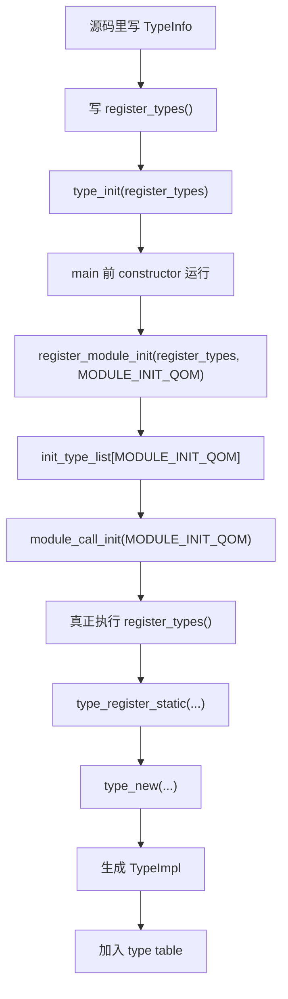
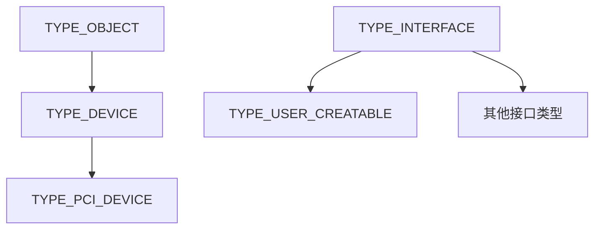

# QOM 类型注册与模块初始化

这页回答的是：

- 一个 QOM 类型是怎么从源码里的 `TypeInfo` 走到运行时里的 `TypeImpl`

## 最重要的纠正

`type_init(...)` 挂到初始化链里的不是：

- `TypeInfo`

而是：

- “注册函数”

也就是说，模块系统记住的是：

- `pci_register_types()`
- `container_register_types()`
- `register_types()`

不是直接记住：

- `pci_device_type_info`
- `object_info`
- `interface_info`

## 最典型的路径



## `TypeInfo` 常见有三种来源

| 方式 | 形式 | 适合什么场景 |
| --- | --- | --- |
| 手写单个 | `static const TypeInfo foo_info = { ... }` | 一个类型 |
| 手写数组 | `static const TypeInfo foo_types[] = { ... }` | 一次注册多个类型 |
| 宏生成 | `OBJECT_DEFINE_TYPE...` / `DEFINE_TYPES(...)` | 常见模板化类型 |

## 先看一个真实例子：`pci-device`

### 头文件层

`include/hw/pci/pci_device.h` 这层主要是在声明：

- QOM 类型名字
- 实例结构体
- 类结构体
- cast helper

例如：

```c
#define TYPE_PCI_DEVICE "pci-device"
typedef struct PCIDeviceClass PCIDeviceClass;
DECLARE_OBJ_CHECKERS(PCIDevice, PCIDeviceClass, PCI_DEVICE, TYPE_PCI_DEVICE)
```

这一步还不是类型注册。

它只是把 C 世界里的壳准备好。

### 注册层

真正把它接进 QOM 的，是 `hw/pci/pci.c` 里的 `TypeInfo`：

```c
static const TypeInfo pci_device_type_info = {
    .name = TYPE_PCI_DEVICE,
    .parent = TYPE_DEVICE,
    .instance_size = sizeof(PCIDevice),
    .abstract = true,
    .class_size = sizeof(PCIDeviceClass),
    .class_init = pci_device_class_init,
    .class_base_init = pci_device_class_base_init,
};
```

这里最该记住的是：

| 字段 | 含义 |
| --- | --- |
| `.name` | 这个 QOM 类型叫什么 |
| `.parent` | 它继承哪个 QOM 父类型 |
| `.instance_size` | 实例对象要分配多大 |
| `.class_size` | 类对象要分配多大 |
| `.class_init` | 类对象初始化时填什么 |
| `.abstract` | 这个类型能不能直接实例化 |

### 执行注册

```c
static void pci_register_types(void)
{
    type_register_static(&pci_device_type_info);
}

type_init(pci_register_types)
```

这才把 `TypeInfo` 送进 QOM。

## `module.h` 和 `module.c` 在干什么

可以先把它们分工记成：

| 文件 | 角色 |
| --- | --- |
| `include/qemu/module.h` | 前台接口层：定义初始化类别和宏 |
| `util/module.c` | 后台调度层：保存链表、统一执行、按需加载模块 |

最短记法：

- `module.h`
  - 负责“怎么登记”
- `module.c`
  - 负责“把谁记下来、什么时候执行”

## `type_init(...)` 到底做了什么

它不是“立刻执行注册函数”。

它做的是：

1. 生成一个带 `constructor` 属性的辅助函数
2. 在 `main()` 之前运行这个辅助函数
3. 把你的注册函数挂到 `MODULE_INIT_QOM` 这一类初始化链里

所以：

- `type_init(foo)`
  - 不是“现在执行 `foo()`”
- 更像是：
  - “先把 `foo` 记到账上，等 QEMU 启动早期统一执行”

## `register_module_init()` 在做什么

它本质上只做一件事：

- 把一个初始化函数登记到对应类别的队列里

如果压成一句话：

- **先登记，后统一调用**

后面真正执行发生在：

- `module_call_init(MODULE_INIT_QOM)`

## `DEFINE_TYPES(...)` 这种宏做了什么

以 `edu` 为例：

```c
static const TypeInfo edu_types[] = {
    {
        .name = TYPE_PCI_EDU_DEVICE,
        .parent = TYPE_PCI_DEVICE,
        .instance_size = sizeof(EduState),
        .instance_init = edu_instance_init,
        .class_init = edu_class_init,
    }
};

DEFINE_TYPES(edu_types)
```

它本质是在帮你生成：

1. 一个注册函数
2. 这个函数里调用 `type_register_static_array(...)`
3. 再用 `type_init(...)` 挂到 `MODULE_INIT_QOM`

## `TYPE_OBJECT` 和 `TYPE_INTERFACE` 为什么也要注册

因为 QOM 自己也要先把地基搭出来。

`qom/object.c` 里会先注册两个根类型：

- `TYPE_OBJECT`
  - 普通对象继承树的根
- `TYPE_INTERFACE`
  - 接口类型树的根

可以先画成：



如果不先注册这两个根：

- 普通对象类型没有共同根
- 接口类型也没有共同根
- 后面的 `type_initialize()`、动态 cast、interface 规则都没有地基

## 为什么这里要用 `type_register_internal()`

根类型自举时，不能直接用：

- `type_register_static()`

因为这条常规入口默认假设：

- 你已经有父类型

但：

- `TYPE_OBJECT`
  - 没有再往上的普通对象父类
- `TYPE_INTERFACE`
  - 没有再往上的接口父类

所以这里要走更底层的：

- `type_register_internal()`

最短记法：

- `type_register_internal()`
  - 内部原始注册
- `type_register_static()`
  - 常规静态类型注册

## `type_register_static()` 和 `type_register_internal()` 的命名差别

这里的 `static` 不要理解成：

- C 语言那个“内部链接”的 `static`

它更像是在说：

- “这是给普通静态写好的 `TypeInfo` 用的常规入口”

而 `internal` 强调的是：

- QOM 内部真正干活的底层原语

## `module_obj(TYPE_MY_DEVICE)` 是干什么的

这和 `type_init(...)` 不同。

| 机制 | 解决的问题 |
| --- | --- |
| `type_init(...)` | 模块已经装进进程后，怎么把类型注册进 QOM |
| `module_obj(...)` | 动态模块还没加载时，QEMU 怎么知道哪个模块能提供这个类型 |

所以：

- `type_register_static(...)`
  - 负责类型注册
- `module_obj(...)`
  - 负责模块元数据

如果少了 `module_obj(...)`，动态模块场景下可能会出现：

- 类型代码明明在某个 `.so` 里
- 但 QEMU 按类型名查找时，不知道该加载哪个模块

## 一句话收束

如果只保留主线，可以直接背：

1. 源码里先写 `TypeInfo`。
2. 再写 `register_types()`。
3. `type_init(...)` 把注册函数挂到 `MODULE_INIT_QOM`。
4. `module_call_init(MODULE_INIT_QOM)` 真正执行这些注册函数。
5. `type_register_static(...)` / `type_register_internal(...)` 把 `TypeInfo` 变成 `TypeImpl`。
6. 这些 `TypeImpl` 进入全局 type table，后面才能被 `object_new(...)` 找到。

接下来如果你想看：

- “这些类型后来怎么变成 `ObjectClass` 和 `Object`”

跳到：

- [QOM 的 `TypeImpl`、类初始化与对象创建](qom-typeimpl-and-object-creation.md)
