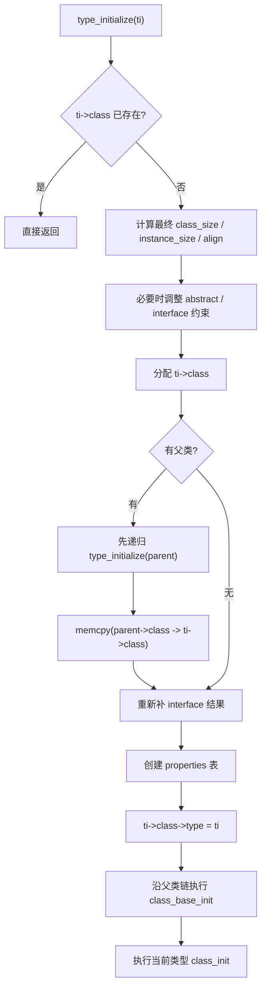
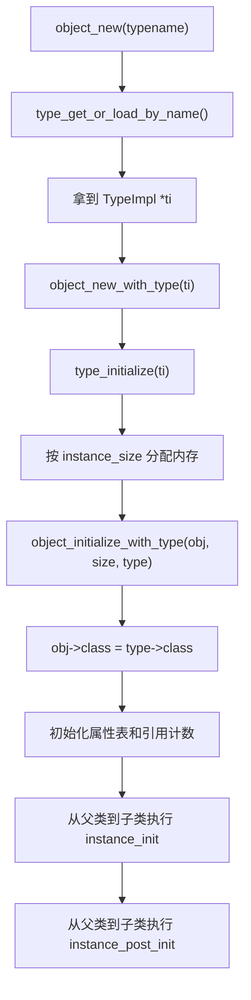

# QOM 的 `TypeImpl`、类初始化与对象创建

这页回答的是：

- `TypeInfo` 变成 `TypeImpl` 之后，QOM 怎么把一个类型真正初始化成熟
- `ObjectClass` 和 `Object` 又是怎么被建出来的

## `TypeImpl` 到底是什么

最短答案：

- **`TypeImpl` 是 QOM 内部真正运转的运行时类型对象。**

`TypeInfo` 更像源码作者填写的说明书；
`TypeImpl` 则是 QOM 把它读进去之后形成的后台工作对象。

## 最值得先记的字段

| 字段 | 作用 |
| --- | --- |
| `name` | 类型名 |
| `parent` / `parent_type` | 父类型名字 / 已解析好的父类型指针 |
| `class_size` / `instance_size` / `instance_align` | 类对象和实例对象最终采用的尺寸参数 |
| `class_init` / `class_base_init` | 类初始化逻辑 |
| `instance_init` / `instance_post_init` | 实例初始化逻辑 |
| `abstract` | 是否抽象 |
| `interfaces` | 这个类型声明实现了哪些接口 |
| `class` | 这个类型共享的类对象缓存 |

## `TypeInfo` 和 `TypeImpl` 为什么长得像

因为这本来就是故意的。

`type_new()` 会先把 `TypeInfo` 里的核心字段拷进来，再补运行时状态。

所以它们的关系更适合记成：

| 层次 | 更像什么 |
| --- | --- |
| `TypeInfo` | 注册说明书 |
| `TypeImpl` | 后台运行时类型档案 |

不要把它类比成：

- `ObjectClass : Object`

因为那一组是：

- 类对象 : 实例对象

而 `TypeInfo : TypeImpl` 更像：

- 输入说明 : 内部工作对象

## `type_initialize()` 真正在做什么

先给一句话版：

- **把一个还只是“类型描述”的 `TypeImpl`，真正初始化成一个可用的 QOM 运行时类型。**

重点产物是：

- `ti->class`

也就是这个类型的共享类对象。

## 主流程图



## `instance_size == 0` 为什么最后会变成抽象类型

这里最容易混的是：

- `TypeInfo.instance_size = 0`

在输入层并不总是意味着“这个类型完全没有实例布局”。

它也可能只是表示：

- “我自己没新增实例字段，沿用父类实例大小”

但 `type_initialize()` 里看到的 `ti->instance_size` 已经是：

- 沿父类型链解析之后的最终结果

所以如果最后仍然是 `0`，说明：

- 这条父类链上根本没有普通实例布局

典型例子就是：

- interface 类型

它们只有类侧信息，没有普通对象实例布局，所以必须是抽象的。

## `memcpy(ti->class, parent->class, parent->class_size)` 到底在干什么

这一步就是 QOM 类继承最核心的地方：

- 先把父类 class 内容整体拷到子类 class 里

然后子类再：

- 覆盖自己关心的函数指针
- 增补自己的类级字段

最短记法：

- **先继承父类方法表，再让子类覆写。**

## `class_base_init` 和 `class_init` 有什么区别

### `class_base_init`

更像：

- 父类在说“凡是继承我的人，都先按我的规则修正这一层 class”

它常用来做：

- 清掉不该直接 memcpy 继承的缓存
- 强制所有子类都满足某些基类规则

### `class_init`

更像：

- 当前类型在说“继承和修正完成后，我再填我自己的最终实现”

所以职责边界可以记成：

- `class_base_init`
  - 父类负责自己的那层不变量
- `class_init`
  - 当前类型负责自己的最终行为

## 为什么这套逻辑应该由父类定义

因为：

1. 哪些字段属于父类自己的内部约束，父类最清楚
2. 这条规则要对所有后代生效
3. 如果交给每个子类自己修，容易重复也容易漏

最适合记的一句话是：

- **谁定义了这一层字段和不变量，谁负责这层字段的继承修正。**

## 接口为什么不能跟着 `memcpy` 直接继承完事

因为 `interfaces` 不是普通小字段。

`ObjectClass.interfaces` 挂的是：

- 当前这个具体类型已经初始化好的接口类链表

而不是：

- 一个可以直接共享给所有子类的静态模板

所以子类初始化时会：

1. 先把 `ti->class->interfaces` 清空
2. 再按“父类已有接口结果 + 当前类型自己声明的接口”重新建一遍

这部分更细的关系放在：

- [QOM 的 interface、property 与对象树](qom-interfaces-properties-and-composition.md)

## `ObjectClass` 是怎么被“制造”出来的

更精确的说法是：

1. `TypeInfo`
   - 提供原始配方
2. `type_new()`
   - 把配方变成 `TypeImpl`
3. `type_initialize()`
   - 根据 `TypeImpl` 分配并初始化 `ObjectClass`

所以可以说：

- `ObjectClass` 最初依赖 `TypeInfo`

但中间隔着一层非常关键的：

- `TypeImpl`

## 看一个真实类链例子

```c
struct DeviceClass {
    ObjectClass parent_class;
    ...
};

struct PCIDeviceClass {
    DeviceClass parent_class;
    ...
};
```

这说明类链本身也靠“父结构体放第一个字段”来继承。

所以同一块 `klass` 内存可以先后被看成：

- `ObjectClass *`
- `DeviceClass *`
- `PCIDeviceClass *`

## `class_init` 和 `instance_init` 要怎么分

| 名字 | 作用层级 | 什么时候发生 |
| --- | --- | --- |
| `class_init` | 类型级 | 某个类型第一次真正初始化时 |
| `instance_init` | 实例级 | 每创建一个对象实例都执行一次 |

最重要的四句话：

1. `class_init`
   - 更像“准备类对象 / 方法表”
2. `instance_init`
   - 更像“构造具体对象”
3. 第二次再创建同类型对象
   - 不会重复跑整套 `class_init`
4. 但每次创建实例
   - 都还会跑 `instance_init`

## 对象到底在哪里被创建

真正的主线是：



## `object_initialize_with_type()` 是共同核心

不管入口是：

- `object_new(typename)`
- `object_initialize(data, size, typename)`

最终都会汇到：

- `object_initialize_with_type()`

它在做的事情可以压成：

1. 确保 `TypeImpl` 已初始化成熟
2. 把对象内存清零
3. 设置 `obj->class = type->class`
4. 初始化引用计数和属性表
5. 从父类到子类执行 `instance_init`
6. 再执行 `instance_post_init`

## 一句话收束

1. `TypeImpl` 是 QOM 内部真正运转的运行时类型对象。
2. `type_initialize()` 负责把它初始化成熟，并建出 `ti->class`。
3. 类继承的核心是“先 memcpy 父类 class，再跑 base_init / class_init 覆盖”。
4. 对象创建的共同核心是 `object_initialize_with_type()`。
5. 实例对象最关键的一步是：`obj->class = type->class`。
