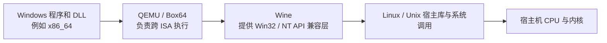
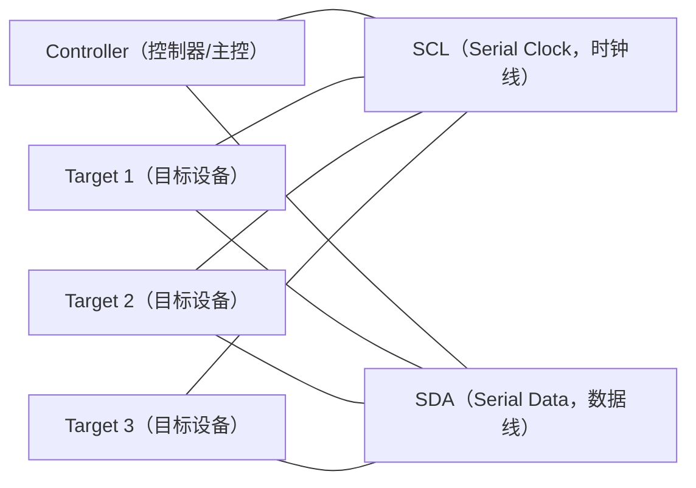
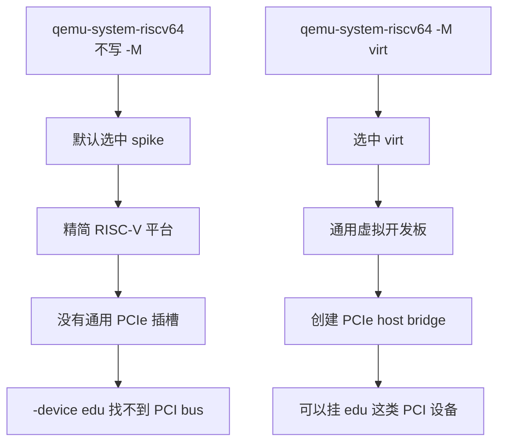
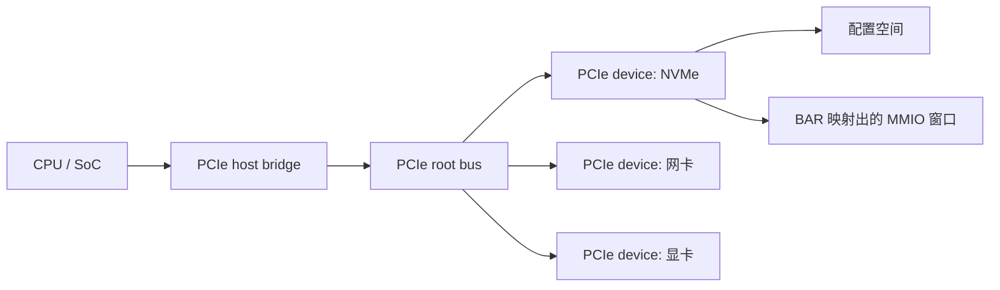
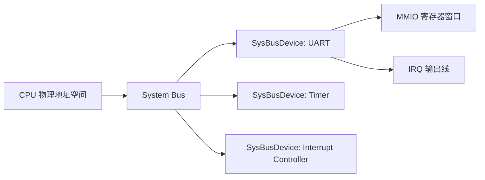
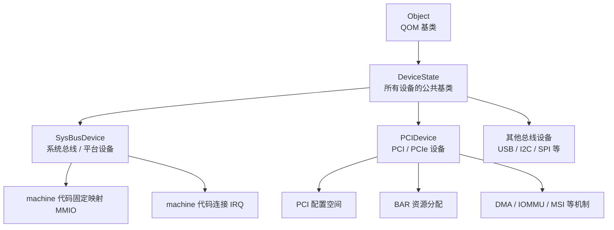
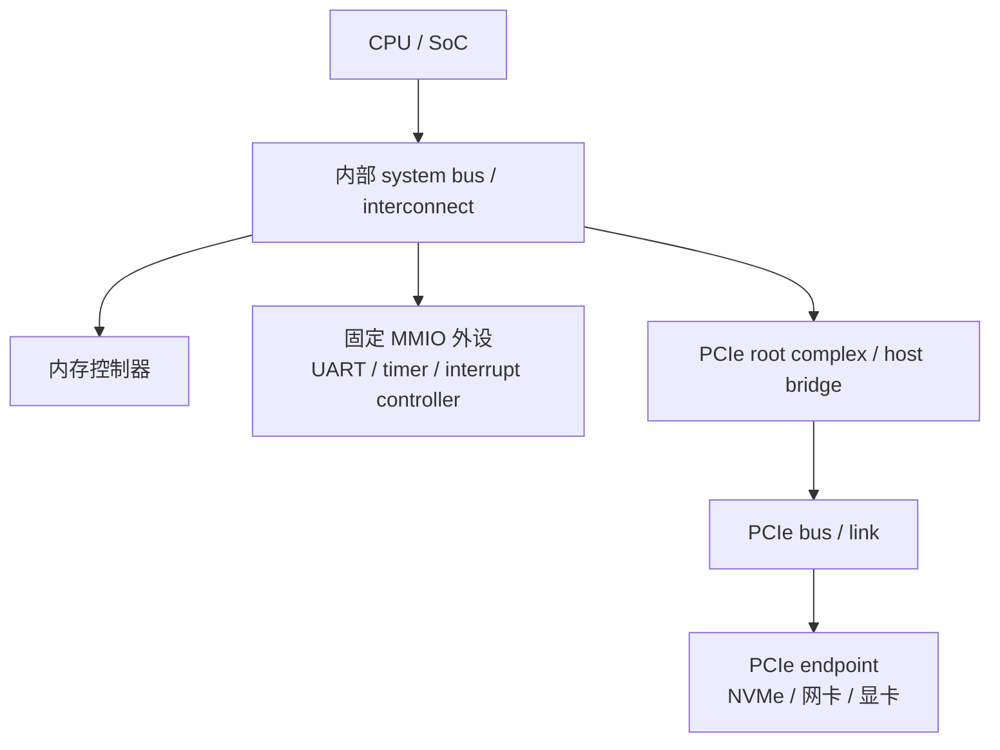

# QEMU / RISC-V 术语速查

这份文档专门用来记我现在在看 `QEMU`（Quick Emulator，快速模拟器）和 `RISC-V` 启动流程时经常碰到的名词。

原则：

- 第一次出现缩写时，尽量写出英文全称和中文意思。
- 解释优先用人话，不强行追求最严格的学术定义。
- 先记“它是干什么的”，再记“它是怎么实现的”。

---

## 1. 启动链路里最常见的词

### QEMU（Quick Emulator，快速模拟器）

- 一个可以模拟整台计算机的平台。
- 在这里主要用来模拟一台 `RISC-V virt` 虚拟机器。
- 它会负责创建 `CPU`（Central Processing Unit，中央处理器）、`RAM`（Random Access Memory，随机存取存储器）、串口、时钟、中断控制器等设备。

### TCG（Tiny Code Generator，小型代码生成器）

- `QEMU` 里一套很核心的软件翻译执行后端。
- 当你看到 `TCG emulation`，通常意思是：
  - `QEMU` 不直接让宿主机硬件原生执行来宾 `CPU` 指令
  - 而是先把来宾指令翻译成宿主机能执行的代码，再在宿主机上运行
- 如果在 `aarch64` 宿主机上跑 `qemu-system-riscv64`，可以粗略理解成：
  - `RISC-V` 来宾指令会被 `QEMU TCG` 转换成 `aarch64` 宿主机能执行的代码
  - 但这不是简单的“一条 `RISC-V` 指令直译成一条 `aarch64` 指令”
  - 更准确地说，`QEMU` 会把一段来宾指令解码成 `TCG IR`（Intermediate Representation，中间表示），再由 `TCG` 后端生成宿主机机器码
- `TCG` 本身不是一套通用行业标准，也不是一个独立于 `QEMU` 的虚拟化产品。
  - 它更准确地说是 `QEMU` 内部的一套动态二进制翻译机制。
  - 它也不像 `OpenGL`（Open Graphics Library，开放图形库）那样是一个对外发布的标准接口，再由 `Mesa`、`NVIDIA` 驱动、`ANGLE` 等不同项目去实现。
  - `TCG IR` 是 `QEMU` 内部使用的中间表示，不是给外部程序稳定依赖的公共标准、`API`（Application Programming Interface，应用程序编程接口）或 `ABI`（Application Binary Interface，应用程序二进制接口）。
  - 但 `TCG` 背后的知识属于更通用的领域，例如动态二进制翻译、即时编译、编译器中间表示、代码生成、异常处理和内存访问模拟。
  - 所以学习时可以把它分成两层：先把 `TCG` 当作 `QEMU` 里的执行后端理解；深入时再把它放到“编译器 / 虚拟机 / 动态翻译”这门更大的学问里理解。

整体图可以先记成：


- 它的特点通常是：
  - 跨架构：宿主机和来宾架构可以不同
  - 通用：没有硬件虚拟化支持时也能工作
  - 较慢：因为多了一层动态翻译 / 模拟开销
- 和 `KVM`（Kernel-based Virtual Machine，基于内核的虚拟机）这类硬件辅助虚拟化路径相比：
  - `TCG` 更接近“软件仿真 / 动态翻译”
  - `KVM` 更接近“让真实硬件尽量直接执行来宾代码”
- 所以源码里看到 `TCG only`，通常表示：
  - 这个功能只在 `TCG` 路径里实现或测试
  - 如果切到 `KVM` 等加速路径，这个功能可能不可用，或者根本不是由 `QEMU` 自己来模拟

### KVM（Kernel-based Virtual Machine，基于内核的虚拟机）

- `Linux` 内核提供的一套硬件辅助虚拟化机制。
- 当你看到 `KVM acceleration`，通常意思是：
  - 来宾 `CPU` 指令不再主要靠 `QEMU` 自己翻译执行
  - 而是交给内核里的 `KVM` 模块，尽量让宿主机 `CPU` 直接运行来宾代码

整体图可以先记成：


- 它的特点通常是：
  - 更快：来宾 `CPU` 指令大多不需要经过 `QEMU TCG` 动态翻译
  - 更依赖硬件：要有宿主机 `CPU` 和内核虚拟化支持
  - 更受架构限制：一般不能像 `TCG` 那样自由跨架构运行
- 但要特别注意：
  - `KVM` 不等于“`QEMU` 不干活了”
  - 即使用 `KVM`，`QEMU` 仍然通常负责创建 machine、布置内存映射、挂设备模型、加载 firmware、处理很多 `MMIO` / `virtio` / 串口等外设逻辑
  - 真正主要换掉的是“来宾 `CPU` 指令怎么执行”这一层

### TCG 和 KVM 最核心的区别

很多初学者会误以为：

- `TCG` 是“软件模拟器”
- `KVM` 是“另一套完全不同的虚拟机”

更准确的理解其实是：

- 它们都是 `QEMU` 的执行 / 加速后端
- 它们最核心的差异，主要在 **来宾 `CPU` 指令怎么跑**
- 而 `QEMU virt` 这台“板子”本身、很多设备模型、启动流程的大框架并不会因为切到 `KVM` 就完全消失

可以先用一张对照表记：

| 维度 | `TCG` | `KVM` |
| --- | --- | --- |
| 来宾 `CPU` 指令怎么执行 | `QEMU` 动态翻译后再执行 | 尽量交给 `KVM` + 宿主机硬件直接执行 |
| 宿主机 / 来宾架构关系 | 可以不同 | 通常要求相同或高度匹配 |
| 速度 | 较慢 | 较快 |
| `QEMU` 参与深度 | `CPU` 执行和设备模拟都参与很深 | 设备模型仍多在 `QEMU`，但 `CPU` 执行更多交给 `KVM` |
| 适合场景 | 跨架构、学习、调试、没有硬件虚拟化时 | 同架构、高性能运行 |

如果只记一句话，可以记成：

- `TCG`：`QEMU` 自己“翻译并执行”来宾 `CPU` 指令
- `KVM`：`QEMU` 继续搭机器，但把“跑来宾 `CPU` 指令”这件事尽量交给内核和硬件

对我们现在看 `RISC-V virt` 的源码，最实用的理解是：

- 如果你在 `x86_64` 或 `arm64` 宿主机上跑 `qemu-system-riscv64`，通常走的是 `TCG`
- 只有宿主机本身也具备对应架构的 `KVM` 支持时，才可能走 `KVM`
- 所以阅读 `virt.c`、设备树和板级初始化时，先把主线建立在 `TCG` / 通用 machine 初始化视角上，通常最容易入门

### compatibility layer（兼容层）

- 兼容层不是“把整台目标机器完整模拟出来”。
- 它更像是：
  - **程序二进制格式和调用约定尽量保留原样**
  - **操作系统接口语义由另一套实现来兼容**
- `Wine` 这类东西的核心思路通常不是“模拟一台完整 `Windows` 电脑”；
  - 而是让 `Windows` 程序以为自己还在调用熟悉的 `Win32` / `NT` 世界
  - 但底下很多事情其实被翻译、转接到 `Linux` / `Unix` 宿主环境去做
- 所以它和“整机模拟器 / 全系统虚拟机”的边界要分清：
  - **整机模拟 / 虚拟机**：连 `CPU`、内存映射、设备、固件、启动链都要建出来
  - **兼容层**：重点在“程序接口语义兼容”，不一定要模拟整机

### Wine + `QEMU` / `Box64` 这种“奇美拉架构”到底是什么

- 它不是一种新的 `ISA`（Instruction Set Architecture，指令集架构）。
- 更准确地说，它是一种**混合执行模型**：
  - 客体 `Windows` 程序里的客体 `ISA` 机器码，需要有人负责跨架构执行
  - `Windows API`（Application Programming Interface，应用程序编程接口）语义，需要有人负责兼容
  - 能直接复用的宿主 `Linux` / `Unix` 能力，则尽量直接复用

可以先把整体图记成：



- 所以这类方案“聪明”的地方不在于发明了一个多高级的新指令架构；
  - 而在于它把问题拆层了：
  - **必须跨架构执行的机器码**，才交给动态翻译器
  - **必须兼容的 `Windows` 接口语义**，交给 `Wine`
  - **宿主本来就会做的事**，尽量不要重复模拟
- 这就是你那段描述里“非必要不模拟”的核心意思。
- 这样做通常比“整台虚拟机 + 一整套 `Windows` 系统”更轻：
  - 启动更快
  - 额外层次更少
  - 用户态程序场景里常常性能更好
- 但它也不是“什么都不模拟”：
  - 只要遇到客体 `ISA` 机器码，就仍然需要动态二进制翻译
  - 只要遇到 `Windows` 特有接口语义，就仍然需要 `Wine` 去补语义差异
  - 某些边角行为、驱动、内核态能力、反作弊、异常 `ABI` 约定，仍可能很麻烦
- 所以更准确的一句话是：
  - **这不是“高级指令架构”，而是“工程上很讲究分层和取舍的跨架构兼容方案”。**

### RISC-V

- 一种指令集架构（Instruction Set Architecture，指令集架构）。
- 可以把它先理解成：`CPU` 能听懂的一套机器指令规则。

### OpenSBI（Open Supervisor Binary Interface，开源监管者二进制接口实现）

- `RISC-V` 平台常见的一层固件。
- 它通常运行在 `M-mode`（Machine Mode，机器模式）里。
- 它负责在更高权限层帮操作系统做一些事情，比如定时器、中断、关机、启动下一阶段程序。

### Linux kernel（Linux 内核）

- 操作系统内核。
- 在 `RISC-V` 上通常运行在 `S-mode`（Supervisor Mode，监管者模式）里。
- 它不是最高权限，所以很多机器级操作要通过 `SBI`（Supervisor Binary Interface，监管者二进制接口）请求 `OpenSBI` 帮忙。

### reset vector（复位向量）

- `CPU` 上电或复位后最先开始执行的一小段代码入口。
- 在 `QEMU` 的 `virt` 机器里，这段代码通常会先放在一个小型只读区域里，然后跳转到固件，比如 `OpenSBI`。

---

## 2. 机器和硬件拓扑相关

### CPU（Central Processing Unit，中央处理器）

- 计算机的处理核心。
- 在虚拟机里，`QEMU` 会模拟出一个或多个 `CPU`。

### hart（hardware thread，硬件线程）

- `RISC-V` 里常见的术语。
- 可以先粗略理解成：一个可独立执行指令流的 `CPU` 执行上下文。
- 学习初期可以先把它近似当成“一个核对应的一个执行单元”。

### core（处理器核心）

- 一颗 `CPU` 芯片内部的一个处理核心。
- 一个 `core` 有时可以包含一个或多个硬件线程。

### socket（处理器插槽 / 拓扑分组）

- 在真实机器里，常指主板上的物理 `CPU` 插槽。
- 在 `QEMU` 这份 `RISC-V virt` 代码里，更常是一个逻辑拓扑分组，不一定真对应物理插槽。
- 这里可以先理解成：一组 `hart` 被分到同一个节点里。

### NUMA（Non-Uniform Memory Access，非一致性内存访问）

- 一种多处理器系统的内存访问模型。
- 核心意思：不同 `CPU` 访问不同内存区域的速度不一样。
- 常见理解方式是：每个 `NUMA node`（NUMA 节点）有一组本地 `CPU` 和一块本地内存。
- 访问本地内存更快，访问远端节点的内存更慢。

### NUMA node（NUMA 节点）

- `NUMA` 架构中的一个节点。
- 可以先理解成：一组 `CPU` 加一块离它们更近的内存。

---

## 3. 内存和设备访问相关

### RAM（Random Access Memory，随机存取存储器）

- 运行时主要内存。
- 程序、内核、数据通常都放在这里。

### ROM（Read-Only Memory，只读存储器）

- 只读区域。
- 在虚拟机启动时，常用来放早期启动代码或固件相关内容。

### MROM（Mask ROM，掩膜只读存储器）

- 一种只读启动存储区域的叫法。
- 在 `QEMU virt` 里常用来放复位向量和启动前的少量信息。

### MMIO（Memory-Mapped I/O，内存映射输入输出）

- 把设备寄存器映射到物理地址空间里。
- `CPU` 读写这段地址时，看起来像在读写内存，实际上是在访问设备。
- 例如串口、时钟、中断控制器、`virtio-mmio` 设备都常通过 `MMIO` 暴露给系统。

### MemoryRegion（内存区域）

- `QEMU` 里的一个重要抽象。
- 用来表示一段地址空间，可能是：
  - 普通内存
  - 只读存储
  - `MMIO` 设备寄存器窗口
- `QEMU` 会把不同的 `MemoryRegion` 挂到不同地址上。

### address decoding（地址解码）

- 指系统根据访问地址判断“这次访问应该落到谁身上”的过程。
- 例如：
  - 某段地址属于 `RAM`
  - 某段地址属于串口
  - 某段地址属于中断控制器
- 在真实硬件里，通常由片上互连、桥、控制器等逻辑完成。
- 在 `QEMU` 里，类似工作由地址空间和 `MemoryRegion` 分发机制完成。

### bus（总线）

- 用来连接 `CPU`、内存、设备的通信通路或抽象。
- 可以先把它想成：
  - **一套“谁能和谁通信、怎么通信”的公共规则**
  - 而不只是“一根线”
- 对软件视角来说，总线最重要的意义通常不是“电路长什么样”，而是：
  - 设备怎么接进系统
  - `CPU` 怎么访问它
  - 系统怎么发现和管理它
- 平时口语上常说“总线把请求发给设备”，更精确地说是总线后的互连、桥、控制器和地址路由逻辑在做分发。

可以用一个不严格但好记的比喻：

- `bus` 像一套公共道路 + 交通规则
- `CPU` / 内存 / 设备像不同的地点或车辆
- 地址、配置空间、读写事务像“你要去哪里、带什么请求过去”
- 桥、互连、控制器像路口和分流系统

所以当我们说：

- “这个设备挂在 `PCI` 总线上”

更接近在说：

- “这个设备是按 `PCI` 这套接入和通信规则接进系统的”

而不是只在说：

- “它物理上连了一根叫 PCI 的线”

### I2C（Inter-Integrated Circuit，集成电路间总线）

- `I2C` 首先可以把它理解成：
  - **芯片和芯片之间进行短距离通信的一套串行总线协议**
- 它很常见于板级外设连接，比如：
  - 传感器
  - `EEPROM`
  - 电源管理芯片
  - 实时时钟（`RTC`）
  - 一些低速控制类外设

先看整体图：



从这个图里可以先抓住 4 个核心点：

- 它通常只有 **两根信号线**
  - `SCL`：时钟线
  - `SDA`：数据线
- 它是 **串行（serial）** 通信
  - 数据不是很多根线同时并行发
  - 而是按位一个个送
- 一条总线上可以挂 **多个设备**
  - 不是控制器和一个设备独占一根专线
- 通信时通常有一个发起方
  - 现代说法常叫 `controller` / `target`
  - 传统资料里常写 `master` / `slave`

它大致怎么工作，可以先粗略记成：

1. `controller` 先发起一次传输
2. 说明自己要找哪个地址的设备
3. 说明这次是读还是写
4. 目标设备应答（`ACK`）后继续传数据
5. 传完再结束这次事务

所以从软件/驱动角度看，`I2C` 的重点通常是：

- 总线上有哪些设备地址
- 某个设备寄存器怎么读写
- 一次传输的起始、应答、结束是否正确

### 为什么它叫 `I2C`

`I2C` 是 `Inter-Integrated Circuit` 的缩写。

- `Inter`
  - 表示“在……之间”
- `Integrated Circuit`
  - 就是“集成电路”，也就是芯片

所以它原本的字面意思就是：

- **芯片与芯片之间通信**

之所以写成 `I2C`，是因为：

- 开头是 `I`
- 后面有两个连续的单词都以 `C` 开头
  - `Integrated`
  - `Circuit`
- 于是就习惯写成 `I²C` 或 `I2C`

你可以把它记成：

- `I2C` = `I` + 2 个 `C`
- 也就是 **Inter-Integrated Circuit**

如果只用一句最标准、最够用的话来记：

- **`I2C` 是一种让多个芯片通过两根线进行短距离串行通信的总线协议。**

### GPIO（General Purpose Input/Output，通用输入输出）

- 一组很基础的数字引脚接口。
- `GPIO` 的核心特点是：
  - **通用**
    - 不是专门给某一种设备功能定制的
  - **输入 / 输出**
    - 可以读某个引脚当前是高电平还是低电平
    - 也可以把某个引脚主动拉高或拉低
- 可以先把它理解成：
  - 芯片或设备上预留出来的一组“可编程小开关 / 小信号口”

站在软件角度看，`GPIO` 常用来做这些事：

- 读按键有没有按下
- 控制 `LED` 亮灭
- 收发简单的控制信号
- 通知另一个设备“现在该复位 / 使能 / 关断了”

它和 `MMIO` 不一样的地方在于：

- `MMIO` 说的是：`CPU` 通过内存地址访问设备寄存器
- `GPIO` 说的是：设备或芯片对外暴露的一组离散数字信号线

两者经常会一起出现：

- `CPU` 先通过 `MMIO` 写某个 GPIO 控制器的寄存器
- 再由这个 GPIO 控制器去改变某根引脚的高低电平

在 `QEMU` 里提到 `GPIO` 时，很多时候重点不是“真实电压”，而是：

- 一个设备向外提供或接收某个布尔型/边沿型信号
- 比如复位线、中断线、片选信号、状态通知线

所以你可以先把 `GPIO` 记成一句话：

- **设备之间传递简单数字信号用的一组通用引脚/信号线**

---

## 4. 中断和设备树相关

### interrupt（中断）

- 一种让设备或系统状态主动打断 `CPU` 当前执行流的机制。
- 例如串口收到数据、定时器到点、磁盘完成请求，都可能触发中断。

### IRQ（Interrupt Request，中断请求）

- `IRQ` 全称是 `Interrupt Request`。
- 可以直译成“中断请求”。
- 它通常表示：
  - 某个设备或控制器向 `CPU` / 中断控制器发出的“我有事需要处理”的通知信号
- 口语上说“一根 `IRQ` 线”，常常就是指：
  - 设备用来发中断通知的那根信号线
- 在 `QEMU` 源码里，`qemu_irq` 常用来表示这种信号线；它也会和 `GPIO` 基础设施共用同一套抽象。

### PLIC（Platform-Level Interrupt Controller，平台级中断控制器）

- `RISC-V` 里常见的外部中断控制器。
- 它负责接收外设中断并把它们转交给 `CPU`。
- 在 `QEMU virt` 里，当 `aia=none` / `VIRT_AIA_TYPE_NONE` 时，每个 socket 会创建传统 `PLIC`。

### CLINT（Core-Local Interruptor，核心本地中断器）

- 老一点的 `RISC-V` 平台常见组件。
- 常负责软件中断和定时器中断等本地中断源。
- 它和 `PLIC` 不是同一类：`CLINT` 偏本地中断，`PLIC` 偏外设中断。

### ACLINT（Advanced Core Local Interruptor，高级核心本地中断器）

- `CLINT` 的较新拆分/演进形式。
- 目标是把本地中断和定时器相关逻辑更清晰地组织起来。
- 在 `QEMU virt` 里可以通过 `aclint=on/off` 控制，源码说明它是 `TCG only`。

### AIA（Advanced Interrupt Architecture，高级中断架构）

- `RISC-V` 较新的中断架构方案。
- 和传统 `PLIC` 路线相比，它提供了更新的中断组织方式。
- 在 `QEMU virt` 里常见取值是 `aia=none`、`aia=aplic`、`aia=aplic-imsic`。

### IMSIC（Incoming Message-Signaled Interrupt Controller，入站消息信号中断控制器）

- `AIA` 体系中的一个组件。
- 常用于处理消息信号中断。
- 可以先理解成每个 hart 附近的 `MSI` 中断“收件箱”。

### APLIC（Advanced Platform-Level Interrupt Controller，高级平台级中断控制器）

- `AIA` 体系中的平台级中断控制器。
- 它负责接外设中断；在 `aplic-imsic` 模式下，还会和 `IMSIC` 配合投递中断。

更多中断控制器对比见：

- `interrupt-controllers.md`

### device tree（设备树）

- 一种描述硬件布局的数据结构。
- 内核可以通过它知道这台机器里有什么设备、设备地址在哪、中断怎么接。

### DTS（Device Tree Source，设备树源码）

- 人能直接阅读和修改的设备树文本格式。

### DTB（Device Tree Blob，设备树二进制）

- `DTS` 编译后的二进制结果。
- 启动时常由固件或引导程序传给内核。
- 可以把它先理解成：给内核看的硬件说明书（二进制版）。

### FDT（Flattened Device Tree，扁平设备树）

- 设备树在启动阶段常用的扁平化格式。
- 平时很多上下文里，`FDT` 和“启动时传给内核的设备树二进制”说的是同一类东西。

---

## 5. 启动接口和权限级别相关

### SBI（Supervisor Binary Interface，监管者二进制接口）

- `RISC-V` 的一套接口规范。
- 它定义了：运行在 `S-mode` 的操作系统内核，如何请求更高权限层帮忙做事。
- 可以把它先理解成：`Linux kernel` 和 `OpenSBI` 之间的一套约定好的求助接口。

### ecall（environment call，环境调用）

- `RISC-V` 的一条指令。
- 常用来从较低权限级别向更高权限级别发起请求。
- 在 `SBI` 场景里，内核常通过 `ecall` 请求 `OpenSBI`。

### M-mode（Machine Mode，机器模式）

- `RISC-V` 中最高权限级别。
- 固件如 `OpenSBI` 通常运行在这里。

### S-mode（Supervisor Mode，监管者模式）

- 操作系统内核运行的常见权限级别。
- 例如 `Linux kernel` 一般运行在这里。

### U-mode（User Mode，用户模式）

- 用户程序运行的常见权限级别。
- 普通应用程序通常在这里执行。

---

## 6. QEMU 源码阅读里常见的词

### virt machine（virt 机器）

- `QEMU` 为 `RISC-V` 提供的一种通用虚拟开发板模型。
- 它不一定对应某一块真实开发板，而是一个方便运行通用系统的软件虚拟平台。
- 这台板子会创建一套比较完整的通用外设环境，比如 `UART`、`virtio-mmio`、`fw_cfg`，以及 `PCIe host bridge`（PCIe 主机桥）。
- 所以如果你想挂接 `PCI` / `PCIe` 设备（比如 `edu`），通常要显式写：
  - `-M virt`

### spike machine（Spike 机器）

- `QEMU` 的 `riscv64` system emulator 默认 machine 不是 `virt`，而是 `spike`。
- 这里的 `Spike` 可以先理解成 `RISC-V` 世界里的一个参考模拟器 / 参考平台名字；`QEMU` 里的 `spike` machine 是围绕这种简化 `RISC-V` 平台模型做出来的板子。
- `spike` 更偏向一个精简的 `RISC-V` 板级模型，不是拿来提供完整通用外设平台的。
- 它适合做一些偏指令集、固件、简单启动验证的事情；如果目标是跑通用系统、挂 `virtio`、挂 `PCIe` 设备，通常应该用 `virt`。
- 源码里 `spike_board_init()` 主要创建：
  - `hart` / `CPU`
  - `CLINT` / `ACLINT` 风格的本地中断和定时器
  - `RAM`
  - `MROM`
  - `FDT`
  - `HTIF`（Host-Target Interface，主机-目标接口）控制台
- 它没有像 `virt` 那样创建 `gpex_pcie_init()` 对应的 `PCIe host bridge`。
- 所以可以这样记：



- 这个默认值本身也有历史原因：`spike` 是 QEMU 里较早实现的 `RISC-V` machine，所以当年被设成默认；但现在 QEMU 文档也认为这个默认容易造成误解，因为很多用户其实以为自己在跑 `virt`。
- 所以你如果直接运行：
  - `qemu-system-riscv64 -device edu`
- 很可能会报：
  - `No 'PCI' bus found for device 'edu'`
- 根本原因不是 `edu` 本身坏了，而是当前 machine 没有给它提供可挂接的 `PCI` 总线。

### PCIe host bridge（PCIe 主机桥）

- 可以先把它理解成：把 `CPU` / 系统总线一侧和 `PCIe` 设备一侧接起来的那个“桥”。
- 没有这层桥，`PCI` 设备就没有地方挂。
- 在当前这份 `QEMU RISC-V virt` 代码里，`virt_machine_init()` 会调用 `gpex_pcie_init()` 来创建这套 `PCIe` 主机桥。

### PCIe device（PCI Express Device，PCIe 设备）

- `PCIe` 是 `PCI Express` 的缩写，是一种高速外设互连标准。
- `PCIe device` 指挂在 `PCIe` 总线 / 链路上的外设。
- 真实机器里常见的 `PCIe` 设备包括：
  - 独立显卡
  - 网卡
  - NVMe SSD 控制器
  - 声卡
  - USB 控制器
  - SATA / RAID 控制器
  - FPGA / 采集卡 / 加速卡
- `PCIe` 设备和简单 `MMIO` 平台设备不同，它有一套标准发现和配置机制。操作系统通常会扫描 `PCIe` 总线，读取设备的配置空间，识别 vendor id、device id、class code 等信息。
- `BAR`（Base Address Register，基地址寄存器）是 `PCI` / `PCIe` 设备配置空间里的重要字段，用来告诉系统：这个设备需要多大的 `MMIO` 或 `I/O` 地址窗口。系统分配地址后，设备寄存器或显存窗口才会映射到 CPU 可访问的地址空间。
- 可以这样理解：



- 在 `QEMU` 里，具体 `PCI` / `PCIe` 设备通常继承 `PCIDevice`，挂到 `PCIBus` 上。比如教学设备 `edu` 就是一个 `PCI` 设备模型。
- 在 `RISC-V virt` 里，如果要挂 `PCI` / `PCIe` 设备，machine 必须先创建 `PCIe host bridge`，也就是 `gpex_pcie_init()` 相关的那套桥和 bus。否则会出现类似 `No 'PCI' bus found for device 'edu'` 的错误。

### `SysBusDevice`（System Bus Device，系统总线设备）

- `SysBusDevice` 是 `QEMU` 设备模型里一种“挂在系统总线上的设备”基类。
- 这里的 system bus 可以先理解成：板级 `SoC` 里 `CPU` 直接能通过物理地址访问的那条主干总线。
- 这类设备通常不是 `PCI` / `USB` / `I2C` 这种可枚举外设总线上的设备，而是板子设计时就固定放在某个地址上的片上外设或平台设备。
- 典型特征是：
  - 通过 `MMIO` 暴露寄存器窗口。
  - 通过 `IRQ` 线连到中断控制器。
  - 由 machine 初始化代码直接创建、映射地址、连接中断。
- 源码定义在 `include/hw/sysbus.h`，结构里保存了 `mmio[]`、`pio[]` 等资源。
- 常见辅助函数包括：
  - `sysbus_init_mmio()`：设备声明自己有一个 `MMIO` 区域。
  - `sysbus_mmio_map()`：machine 把这个 `MMIO` 区域映射到某个物理地址。
  - `sysbus_init_irq()`：设备声明自己有一根中断输出线。
  - `sysbus_connect_irq()`：machine 把设备中断线接到中断控制器。
- 可以这样记：



- 在 `RISC-V virt` 语境里，可以把 `SysBusDevice` 粗略理解成：`UART`、中断控制器、定时器、`virtio-mmio` 等这类“由板级代码固定摆在地址空间里的平台设备”。
- 它和 `PCI` 设备的主要区别是：
  - `SysBusDevice` 通常由 machine 代码直接放到固定地址。
  - `PCI` 设备挂在 `PCI` / `PCIe` 总线上，通过配置空间、BAR（Base Address Register，基地址寄存器）等机制发现和分配资源。
- 注意：`SysBusDevice` 不是一个真实硬件世界里的标准分类。真实物理板子上通常不会把“所有可连接设备”都叫作 `SysBusDevice`。
- 真实硬件上更常见的说法是：
  - 设备挂在 `PCIe`、`USB`、`I2C`、`SPI`、`UART` 等具体总线或接口上。
  - 片上外设通过 `AXI`、`AHB`、`APB` 等 `SoC` 内部总线连接到处理器和内存系统。
  - 某些外设寄存器被映射进处理器物理地址空间，软件通过 `MMIO` 访问。
- `QEMU` 的 `SysBusDevice` 更像是把这些“板级固定地址的 `MMIO` / `IRQ` 设备”统一放进一个软件抽象里，方便 machine 代码创建、映射和连中断。

#### 为什么 QEMU Rust 文档先强调 `SysBusDevice`

官方 Rust 文档说当前重点是让新设备能用 safe Rust 继承 `SysBusDevice`，以后才可能扩展到 `PCI` 设备、整块 board 或后端。这不是说 `SysBusDevice` 和“设备”是并列概念，而是因为它在 QEMU 设备层次里是一个相对容易先封装安全边界的子类：



- `SysBusDevice` 仍然是 `DeviceState` 的子类，是“设备模型”的一部分。
- 它通常由 machine 代码直接创建、映射 `MMIO`、连接 `IRQ`，生命周期和资源连接路径比较直接。
- `PCI` / `PCIe` 设备还涉及 `PCIBus`、配置空间、`BAR`（Base Address Register，基地址寄存器）、`DMA`（Direct Memory Access，直接内存访问）、`MSI`（Message Signaled Interrupts，消息信号中断）等机制，安全封装面更大。
- 所以 Rust 文档里的区分更像是“当前 safe Rust 设备支持范围的阶段划分”，不是硬件世界里把 `SysBusDevice` 和所有其他设备绝对切开。

#### System bus 和 PCI bus 的区别

可以先用一句话区分：

- **system bus 更像板子 / SoC 内部把 CPU、内存控制器、固定外设连起来的主干互连。**
- **PCI bus / PCIe bus 是一套标准化的外设扩展总线，用来挂可发现、可配置的 PCI / PCIe 设备。**



在真实主板或 SoC 上，它们通常确实不是同一个东西：

- `PCIe` 是明确标准化的总线 / 链路协议，有 root complex、switch、endpoint、配置空间、BAR 等机制；PC 主板上的 PCIe 插槽和走线就是这套东西的物理体现。
- `system bus` 在 QEMU 里更偏软件抽象，不一定对应真实硬件上一根就叫 “System Bus” 的线。真实芯片里可能是 `AXI`、`AHB`、`APB`、片上 NoC（Network-on-Chip，片上网络）等内部互连。
- 固定 MMIO 外设通常不需要被扫描发现，板级代码或设备树直接描述“它就在这个物理地址，中断线接到这里”。
- PCI / PCIe 设备则通常通过总线枚举发现，系统读取配置空间，再给 BAR 分配地址窗口，之后 CPU 才通过这些窗口访问设备寄存器或显存。

所以在 QEMU 里可以这样记：

| 角度 | `SysBusDevice` / system bus | `PCIDevice` / PCI bus |
| --- | --- | --- |
| 典型位置 | 板级固定外设、SoC 内部外设 | 外设扩展总线上的设备 |
| 发现方式 | machine 代码或设备树直接描述 | PCI 枚举、读取配置空间 |
| 地址资源 | 通常固定 MMIO 地址 | 通过 BAR 申请并分配地址窗口 |
| 中断资源 | machine 代码直接连 IRQ | INTx / MSI / MSI-X 等 PCI 机制 |
| QEMU 基类 | `SysBusDevice` | `PCIDevice` |

几个常见内部互连缩写可以这样记：

| 缩写 | 全称 | 中文理解 |
| --- | --- | --- |
| `AXI` | `Advanced eXtensible Interface` | 高级可扩展接口，常用于高性能片上互连 |
| `AHB` | `Advanced High-performance Bus` | 高级高性能总线，比 `APB` 更适合高带宽模块 |
| `APB` | `Advanced Peripheral Bus` | 高级外设总线，常用于低速、简单外设寄存器访问 |
| `NoC` | `Network-on-Chip` | 片上网络，把芯片内部互连做得更像网络拓扑 |

其中 `AXI`、`AHB`、`APB` 都属于 `AMBA`（Advanced Microcontroller Bus Architecture，高级微控制器总线架构）家族。学习 QEMU 时不必先深入这些协议细节，只要先知道：它们是现实 SoC 里连接 CPU、内存控制器、DMA、外设控制器等模块的内部互连规范或结构。

### `virt_machine_init`

- `QEMU` 在创建 `virt` 机器时的重要初始化函数。
- 它主要负责：
  - 建立 `CPU`
  - 建立内存
  - 建立各类设备
  - 建立或加载设备树

### `virt_machine_done`

- `QEMU` 在机器主要初始化结束后的收尾阶段回调。
- 在这一步通常会继续做：
  - 加载固件
  - 加载内核
  - 放置 `DTB`
  - 设置复位向量

### `create_fdt`

- `QEMU` 里生成设备树的函数。
- 当没有手动提供外部 `DTB` 时，它常用来动态创建当前机器的硬件描述。

### `object_initialize_child`

- `QEMU` 对象模型里常见的初始化函数。
- 用来给某个父对象创建并初始化一个子对象。

---

## 7. 调试器和调用栈相关

### GDB（GNU Debugger，GNU 调试器）

- 常见的命令行调试器。
- 在远程调试、内核调试、裸机调试时非常常见。

### LLDB（LLVM Debugger，LLVM 调试器）

- `LLVM` 生态里的调试器。
- 在 `macOS` 上尤其常见。

### backtrace（调用栈回溯）

- 显示当前函数是被谁调用、再被谁调用，一层层追溯上去的结果。

### frame（栈帧）

- 调用栈中的一层。
- `frame #0` 通常表示当前正在执行的位置。
- 数字越大，调用层级越往上。

### TUI（Text User Interface，文本用户界面）

- 基于终端字符界面的交互方式。
- 比纯命令行更直观，但还不是完整图形界面。

### gdbstub

- 调试 stub（调试桩）的一种说法。
- `QEMU` 可以暴露一个远程调试接口，让 `GDB` 连上来调试虚拟机里的程序或内核。

---

## 8. 一条最简启动主线

如果只记一条主线，就记这个：

1. `QEMU` 创建 `RISC-V virt` 虚拟机器。
2. `QEMU` 创建 `CPU`、`RAM`、串口、中断控制器等设备。
3. `QEMU` 创建或加载 `DTB`（Device Tree Blob，设备树二进制）。
4. `QEMU` 加载 `OpenSBI`。
5. `CPU` 从 `reset vector` 开始执行。
6. `CPU` 跳到 `OpenSBI`。
7. `OpenSBI` 再启动 `Linux kernel`。
8. `Linux kernel` 运行后继续通过 `SBI` 请求 `OpenSBI` 帮忙做机器级操作。

---

## 9. 目前最该优先记住的五个词

如果脑子很乱，先只记下面五个：

- `MMIO`（Memory-Mapped I/O，内存映射输入输出）：把设备伪装成内存地址。
- `DTB`（Device Tree Blob，设备树二进制）：给内核看的硬件说明书。
- `OpenSBI`（Open Supervisor Binary Interface，开源监管者二进制接口实现）：`RISC-V` 启动时常见固件。
- `NUMA`（Non-Uniform Memory Access，非一致性内存访问）：`CPU` 和内存分组后，访问速度不再一致。
- `SBI`（Supervisor Binary Interface，监管者二进制接口）：内核请求更高权限固件帮忙的一套接口。

---

## 10. 之后补充时的写法约定

之后往这份文档里补词时，统一按这个格式：

```md
### 缩写（英文全称，中文）

- 它是什么。
- 它是干什么的。
- 在我当前看的 QEMU / RISC-V 上下文里，它具体对应什么。
```
