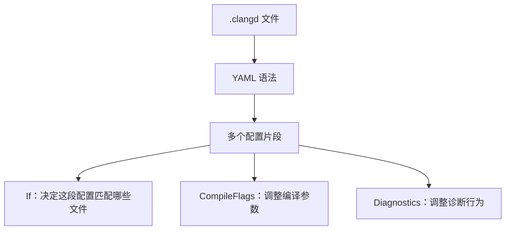
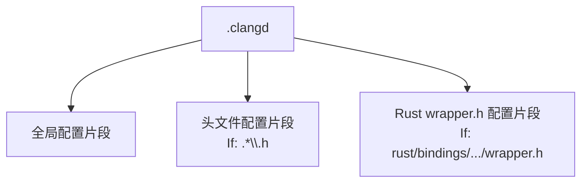

# QEMU 编辑器、clangd 与格式化器笔记
这份笔记记录 QEMU 这种大型 C 项目里，编辑器诊断、clangd、`.editorconfig`、`clang-format` 之间的边界和常见误区。
## 相关笔记
- [C 语言与头文件基础](../c/c-language-and-headers.md)
- [QOM 对象模型基础](../qom/qom-object-model.md)

---

## 为什么 `clangd` 有时会误报

像这类提示：

- `Included header osdep.h is not used directly`
- `Must use 'struct' tag to refer to type 'Object'`

很多时候不是代码真错了，而是：

- `clangd` 把某个头文件当成“独立文件”去分析
- 但这个头文件默认依赖了 QEMU 的常规编译上下文
- 这个上下文里通常已经先有了 `qemu/osdep.h`

换句话说：

- QEMU 某些头文件并不是完全脱离环境也能单独分析得很漂亮
- 单独分析时就容易出现“理解歪了”的噪声诊断

这也是为什么项目里额外加了：

- `.clangd:1`

用来：

- 关掉噪声较大的 `UnusedIncludes`
- 给头文件分析时补一个 `-include qemu/osdep.h`

这只是为了编辑器体验更接近 QEMU 的真实构建方式。

---

## `.clangd` 是什么语法

`.clangd` 使用的是 YAML（YAML Ain't Markup Language）语法，但它的内容不是随便写的 YAML，而是 `clangd` 规定的一组配置字段。

可以把它理解成：



最常见的结构是：

```yaml
CompileFlags:
  CompilationDatabase: build
---
If:
  PathMatch: .*\.h
CompileFlags:
  Add: [-include, qemu/osdep.h]
```

这里有几层含义：

- `CompileFlags:` 是一个 map key，表示下面配置和编译参数有关。
- `CompilationDatabase: build` 告诉 `clangd` 去哪里找 `compile_commands.json`。
- `---` 是 YAML 文档分隔符，在 `.clangd` 里常用来分隔多个配置片段。
- `If:` 是条件配置，表示下面这段只对匹配的文件生效。
- `PathMatch: .*\.h` 是正则表达式，表示匹配头文件。
- `Add: [...]` 表示给匹配到的文件额外添加编译参数。

YAML 的缩进很重要。同一层级的 key 左边要对齐，子项要缩进：

```yaml
CompileFlags:
  Add:
    - -x
    - c
    - -std=gnu11
```

这和下面这种行内数组写法含义类似：

```yaml
CompileFlags:
  Add: [-x, c, -std=gnu11]
```

在 QEMU 这种项目里，`.clangd` 通常不是用来“改变真实构建”的，而是用来让编辑器里的 `clangd` 更接近真实构建上下文。真实编译仍然由 Meson、Ninja、Make、编译器参数和 `compile_commands.json` 决定。

---

## 这段 `.clangd` 头文件配置是什么意思

仓库里的这段配置：

```yaml
If:
  PathMatch: .*\.h
  PathExclude: (build|build-rust|subprojects)/.*
CompileFlags:
  Add: [-include, qemu/osdep.h]
```

意思是：当 `clangd` 分析源码目录里的 `.h` 头文件时，自动给它补一个 `-include qemu/osdep.h` 编译参数；但不要对 `build`、`build-rust`、`subprojects` 这些目录里的文件这么做。

逐项看：

- `If:` 表示下面是匹配条件。
- `PathMatch: .*\.h` 表示匹配所有路径以 `.h` 结尾的头文件。
- `PathExclude: (build|build-rust|subprojects)/.*` 表示排除 `build/`、`build-rust/`、`subprojects/` 下面的文件。
- `CompileFlags:` 表示下面要修改 `clangd` 用来分析文件的编译参数。
- `Add: [-include, qemu/osdep.h]` 表示额外添加两个参数：`-include` 和 `qemu/osdep.h`。

其中 `-include qemu/osdep.h` 是 Clang/GCC 风格的参数，含义是：在真正分析这个 `.h` 文件之前，先隐式包含：

```c
#include "qemu/osdep.h"
```

QEMU 很多头文件默认依赖 `qemu/osdep.h` 提供的平台兼容定义、基础宏和系统头文件包含顺序。如果 `clangd` 把某个 `.h` 当成独立文件分析，就可能缺少这层上下文，于是出现一些看起来很奇怪的编辑器误报。这个配置就是在模拟 QEMU 源码的常规编译上下文。

---

## 为什么 `.clangd` 会提示 `Duplicate key If is ignored`

`.clangd` 是 YAML（YAML Ain't Markup Language）格式。对 `clangd` 来说，配置文件可以由多个配置片段组成，片段之间用：

```yaml
---
```

分隔。

如果同一个 YAML 片段里连续写两个顶层 `If`：

```yaml
If:
  PathMatch: .*\.h
CompileFlags:
  Add: [-include, qemu/osdep.h]
If:
  PathMatch: .*rust/bindings/.*/wrapper\.h
CompileFlags:
  Add: [-x, c]
```

第二个 `If` 就和第一个 `If` 位于同一个 map 层级。YAML 里同一层级重复 key 是有歧义的，所以 `clangd` 会提示：

```text
Duplicate key If is ignored
```

正确写法是把两个条件配置拆成两个独立片段：

```yaml
If:
  PathMatch: .*\.h
CompileFlags:
  Add: [-include, qemu/osdep.h]
---
If:
  PathMatch: .*rust/bindings/.*/wrapper\.h
CompileFlags:
  Add: [-x, c]
```

可以这样理解：



也就是说，`---` 不是注释或装饰线，而是告诉 YAML / `clangd`：下面开始一个新的配置片段。这样两个 `If` 就不再互相覆盖或触发重复 key 诊断。

---

## `.editorconfig` 和 `clang-format` 在这个仓库里各管什么

阅读 QEMU 这种 C 项目时，很容易把编辑器规则和代码格式化器混在一起。

在这个仓库里更准确的理解是：

- `.editorconfig`
  - 主要给编辑器用
  - 约束 LF、末尾换行、基础缩进、某些文件类型的 tab/space 习惯
- `clang-format`
  - 是独立的 C/C++ 代码格式化器
  - 它不会原生读取 `.editorconfig`

仓库里的：

- `.editorconfig:15`

更偏向“基础文本约束”和“编辑器行为”。

例如：

- `Makefile*` 用 tab + 8
- `*.{c,h,c.inc,h.inc}` 用 4 空格
- `*.{s,S}` 用 tab + 8

但这不等于：

- 跑 `clang-format` 时就会自动尊重这些规则

### 为什么会出现“宏被 formatter 洗了一遍”

如果仓库没有 `.clang-format`，那么 `clang-format -style=file` 找不到配置时，会退回自己的默认/回退风格。

这就会导致：

- 宏续行重新对齐
- 指针风格变化
- 花括号位置变化
- 长行重新折行

所以：

- `.editorconfig` 防的是“编辑器把文件写脏”
- `clang-format` 做的是“主动重排代码”

这是两套不同层次的规则。

### 这个仓库现在怎么处理

为了让 `clang-format` 尽量别把 QEMU 风格洗得太厉害，仓库根目录现在补了：

- `.clang-format:1`

这份配置至少做了几件事：

- 把缩进设成 4 空格
- 关闭自动重排注释
- 关闭 include 排序
- 尽量减少宏定义体被重写

它不可能完全等同于 QEMU 手写风格，但比直接吃默认回退风格要稳得多。
