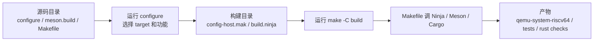

# QEMU 里的 `configure` 和 `make`

## 一句话区别

```text
configure = 先检查环境和选项，生成“怎么构建”的配置文件
make      = 按已经生成的配置文件，真正执行构建/测试/格式化等目标
```

在 QEMU 里，`configure` 不是编译器本身，`make` 也不是配置器本身。它们处在构建流程的两个阶段。

## 整体流程



## `configure` 做什么

`configure` 的作用是回答“这个项目应该怎么构建”。

典型工作包括：

- 读取用户传入的选项，例如 `--target-list=riscv64-softmmu,riscv64-linux-user`、`--enable-rust`。
- 检查本机工具链和依赖，例如 C 编译器、Rust 工具链、Meson、Ninja、库文件。
- 生成构建目录里的配置文件，例如 `config-host.mak`。
- 触发 Meson 生成 `build.ninja`，也就是后续 Ninja 实际执行构建时使用的规则图。

所以执行完 `configure` 后，通常还没有真正把 QEMU 编译出来；它只是准备好了构建规则。

在本项目的 `Makefile.camp` 里，`configure` target 大致做的是：

```text
mkdir -p build
cd build && ../configure <一组选项>
```

## `make` 做什么

`make` 的作用是回答“现在要执行哪个目标”。

例如：

```text
make -C build
make -C build clippy
make -C build rustfmt
make -C build check-rust
```

这些命令的前提是 `build/` 已经是一个配置过的构建目录，里面至少能看到：

```text
config-host.mak
build.ninja
```

在现代 QEMU 里，`make` 很多时候不是直接编译每个 `.c` 文件，而是作为一个入口，把目标转交给 Ninja、Meson 或 Cargo：

```text
make target -> QEMU Makefile -> Ninja/Meson/Cargo -> 真正执行
```

## 为什么源码根目录直接 `make clippy` 会报错

错误：

```text
Makefile:177: *** Please call configure before running make.  Stop.
```

意思是：当前目录没有 `config-host.mak`，所以 QEMU 顶层 `Makefile` 判断“这里还不是一个已经 configure 过的构建目录”。

这不是说 `clippy` 不存在，而是说 `make` 还不知道该按哪套配置执行 `clippy`。

当前项目常见的正确做法是：

```text
make -f Makefile.camp configure
make -C build clippy
```

或者使用项目封装好的构建入口：

```text
make -f Makefile.camp build
make -f Makefile.camp test-rust
```

## 类比

可以把它理解成做饭：

```text
configure = 决定菜单、检查厨房、准备菜谱和工具
make      = 按菜谱真正开始做某道菜
```

如果还没准备菜谱，就直接说“做 clippy 这道菜”，`make` 就不知道要用哪个厨房、哪些工具、哪些规则。

