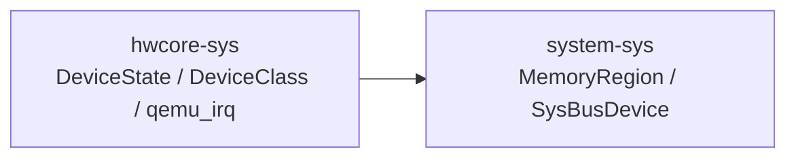
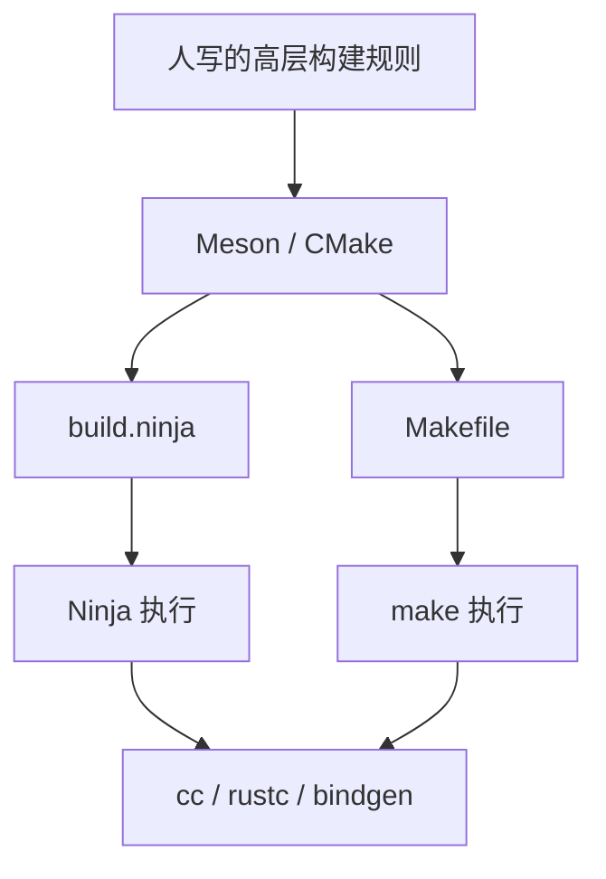
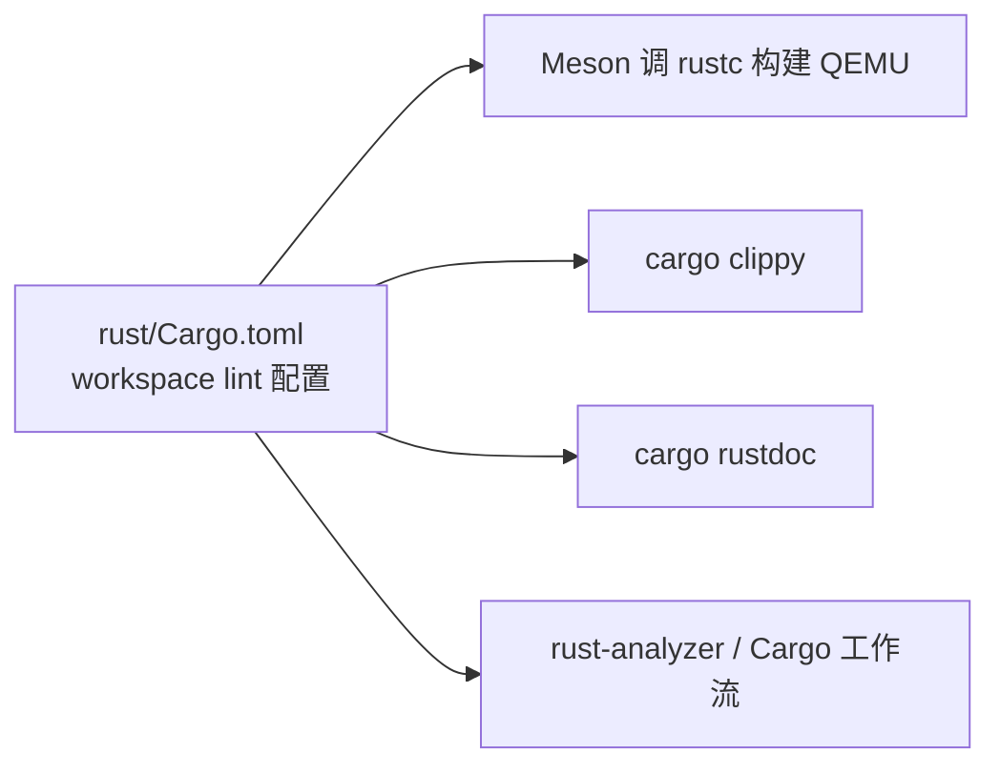
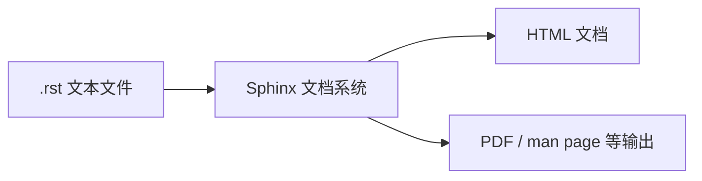
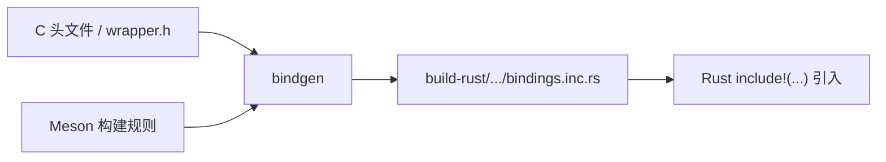
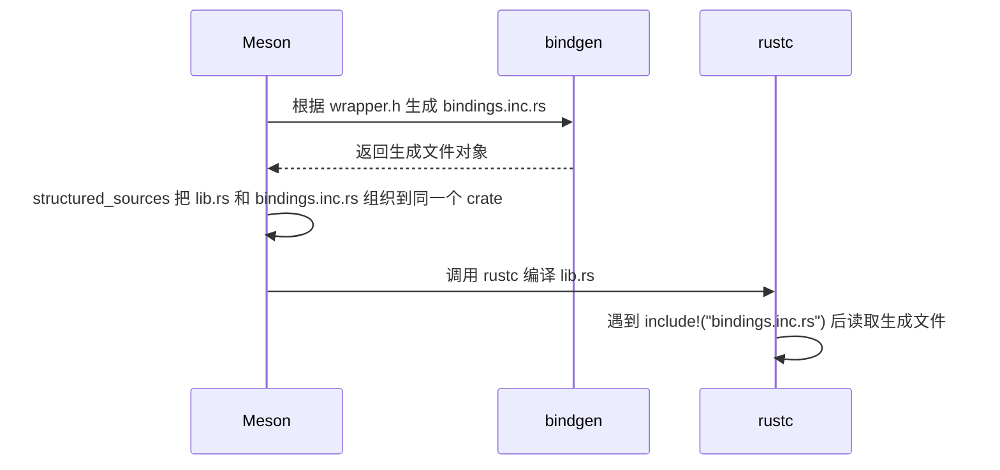
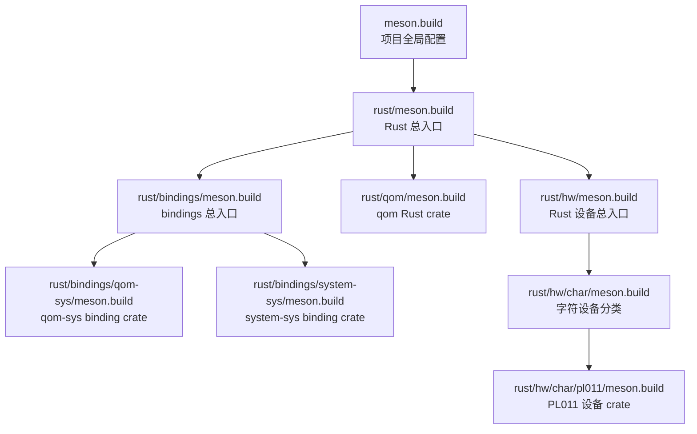
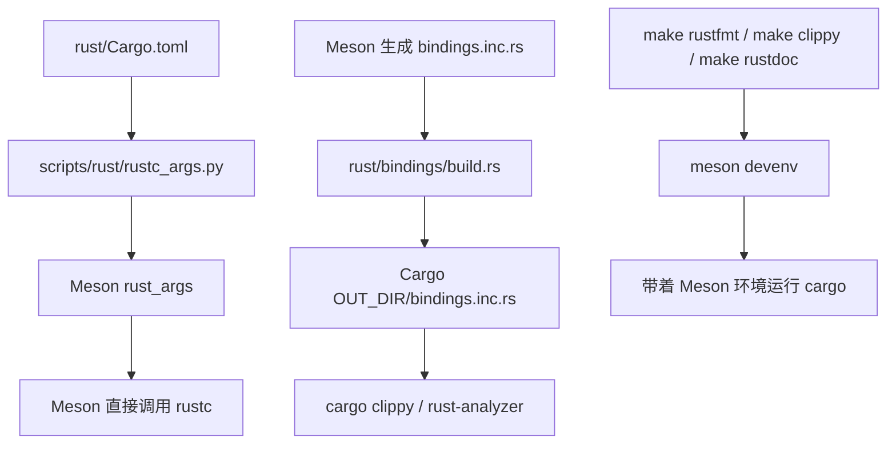

# QEMU Rust + Meson + rust-analyzer 排错笔记

## 问题现象

在基于 Meson 构建的 QEMU Rust 工程里，编辑器里出现类似报错：

- `unresolved import hwcore_sys`
- `#[cfg(MESON)]` 看起来没有生效

但实际使用 Meson 构建时，代码本身可能是能正常编译的。

## 这次问题的关键结论

### 1. Meson 构建时，`cfg(MESON)` 其实是打开的

Meson 调用 `rustc` 时会显式传入：

```text
--cfg MESON
```

因此像下面这种代码，在 **Meson 真正编译** 时会走上面的分支：

```rust
#[cfg(MESON)]
include!("bindings.inc.rs");

#[cfg(not(MESON))]
include!(concat!(env!("OUT_DIR"), "/bindings.inc.rs"));
```

也就是说：

- **Meson 编译**：走 `include!("bindings.inc.rs")`
- **Cargo / rust-analyzer 分析**：通常走 `OUT_DIR` 分支

### 2. `MESON_BUILD_ROOT` 不是 `cfg(MESON)`

这两个东西完全不是一回事：

- `MESON_BUILD_ROOT`：环境变量
- `MESON`：Rust 编译条件（`cfg`）

给 VS Code / rust-analyzer 配了：

```json
"rust-analyzer.cargo.extraEnv": {
  "MESON_BUILD_ROOT": "${workspaceFolder}/build-rust"
}
```

只代表 Cargo 侧的 `build.rs` 能找到 Meson 生成物，**不代表** rust-analyzer 自动拥有 `cfg(MESON)`。

## 为什么 rust-analyzer 会误报

rust-analyzer 默认主要依赖 Cargo 项目图来分析。

但这个仓库里真正的 Rust 构建关系，很多是 **Meson 决定的**，而不是 Cargo 单独决定的。  
如果 rust-analyzer 只看 Cargo，就可能出现：

- 条件编译分支判断和真实构建不一致
- crate 依赖关系和 Meson 不一致
- 编辑器报错，但 Meson 真编译没问题

### `hwcore-sys` 和 `system-sys` 的依赖方向

这两个 crate 特别容易让人困惑，因为 **Cargo 清单里的依赖方向** 和 **Meson 实际构建里的依赖方向** 在当前仓库里并不一致。

从 Rust 源码看，`system-sys` 明确需要 `hwcore-sys`：

```rust
use hwcore_sys::{qemu_irq, DeviceClass, DeviceState};
```

原因是 `system-sys` 的 `wrapper.h` 包含了：

```c
#include "hw/core/sysbus.h"
```

而 `SysBusDevice`、`sysbus_init_irq()`、`MemoryRegion.dev` 等接口或结构会碰到 `DeviceState`、`DeviceClass`、`qemu_irq` 这些来自 `hw/core` 层的类型。

所以真实关系更像：



Meson 里也是按这个方向表达的：

```text
system-sys depends on hwcore_sys_rs
```

也就是 `rust/bindings/system-sys/meson.build` 里有：

```text
dependencies: [common_rs, glib_sys_rs, hwcore_sys_rs, migration_sys_rs, qom_sys_rs, util_sys_rs]
```

相反，`rust/bindings/hwcore-sys/meson.build` 并没有依赖 `system_sys_rs`。这说明在 QEMU 的实际 Meson 构建图里，`hwcore-sys` 并不需要 `system-sys`。

当前容易误导人的地方在 Cargo 清单：

```text
rust/bindings/hwcore-sys/Cargo.toml
  system-sys = { path = "../system-sys" }

rust/bindings/system-sys/Cargo.toml
  没有 hwcore-sys
```

这和 `system-sys/lib.rs` 的 `use hwcore_sys::{...}` 是反的。直接用 Cargo 单独检查 `system-sys` 会失败：

```text
error[E0432]: unresolved import `hwcore_sys`
```

所以学习时可以这样记：

- **C 头文件语义**：`system` 层的 `sysbus` 会用到 `hw/core` 的设备和中断类型。
- **Meson 实际构建图**：`system-sys -> hwcore-sys`，这是和源码匹配的方向。
- **Cargo.toml 当前表现**：`hwcore-sys -> system-sys`，但当前生成的 `hwcore-sys` 绑定并没有明显使用 `system-sys`。
- **结论**：这里更像是 Cargo 侧元数据和 Meson 真实构建图不一致；不要只根据 `Cargo.toml` 判断 QEMU Rust bindings 的真实依赖方向。
- **是不是 bug**：如果把 `Cargo.toml` 视为给 `cargo check`、`rust-analyzer`、`cargo metadata` 使用的项目图，那么这可以算一个 Cargo 元数据 bug 或遗漏；但它不一定影响 QEMU 的主构建，因为主构建由 Meson 图决定。

## 这次的正确做法

让 rust-analyzer 直接读取 Meson 生成的项目描述：

```json
"rust-analyzer.linkedProjects": [
  "${workspaceFolder}/build-rust/rust-project.json"
]
```

同时保留：

```json
"rust-analyzer.cargo.extraEnv": {
  "MESON_BUILD_ROOT": "${workspaceFolder}/build-rust"
}
```

最终 `.vscode/settings.json` 类似这样：

```json
{
  "clangd.arguments": ["--compile-commands-dir=${workspaceFolder}/build-rust"],
  "rust-analyzer.linkedProjects": [
    "${workspaceFolder}/build-rust/rust-project.json"
  ],
  "rust-analyzer.cargo.extraEnv": {
    "MESON_BUILD_ROOT": "${workspaceFolder}/build-rust"
  }
}
```

## 为什么这个配置有效

`build-rust/rust-project.json` 是 Meson 生成的 Rust 项目图，里面包含：

- 每个 crate 的真实依赖关系
- `cfg = ["MESON"]`
- Meson 生成后的源码入口和结构化文件路径

所以 rust-analyzer 读取它之后，就能和 Meson 的实际构建行为对齐。

## Meson 构建系统的历史背景

Meson 不算像 `make` 那样“历史悠久”的构建系统。它大约诞生在 2012 年底，早期公开版本出现在 2013 年左右，作者是 Jussi Pakkanen。相对于 Make、Autotools、CMake 这些更早的工具，Meson 属于比较新的构建系统。

它出现的背景是：很多大型 C/C++ 项目的传统构建系统存在这些痛点：

- `Makefile` 灵活但容易写得复杂，增量构建也可能慢。
- `Autotools` 在 Unix 世界历史很久，但语法和工具链组合比较难学。
- `CMake` 跨平台能力强，但项目复杂后配置语言也会变得不直观。

Meson 的设计目标就是把这些问题反过来处理：

- 构建描述语言尽量可读。
- 默认鼓励 out-of-tree build，也就是源码目录和构建目录分开。
- 通常生成 Ninja 构建文件，让真正的增量编译由 Ninja 快速执行。
- 对 C、C++、Rust 等多语言项目提供统一的构建入口。

所以在 QEMU 这种大型项目里，Meson 扮演的是“高层构建编排器”：它负责组织目录、生成文件、声明依赖、调用 `bindgen`，再把具体任务交给底层工具如 `ninja` 和 `rustc` 执行。

### Ninja 是什么

Ninja 是一个偏底层的构建执行器。它不像 Meson 那样主要给人写“项目构建规则”，而是负责快速执行已经生成好的构建任务。

Ninja 的主要作者是 Evan Martin。它最早来自 Chromium 浏览器项目中的构建速度需求：Chromium 源码规模很大，传统构建系统在增量构建或无变化构建时启动成本太高，所以 Ninja 的目标从一开始就是“少做决策、快速执行”。

可以这样分工理解：

```text
Meson：负责理解项目结构，生成构建图
Ninja：负责按照构建图，快速执行具体命令
```

在 QEMU 里常见流程是：

```text
meson setup build-rust
        ↓
生成 build-rust/build.ninja
        ↓
ninja -C build-rust
        ↓
调用 cc / rustc / bindgen 等工具真正编译
```

所以 `build.ninja` 可以理解成 Meson 写给 Ninja 的“任务清单”。里面会记录：

- 哪个源文件生成哪个目标文件。
- 哪个目标依赖哪些输入文件。
- 如果输入文件变了，哪些命令需要重新执行。
- 具体要调用什么命令，例如 `cc`、`rustc`、`bindgen`。

Ninja 的特点是：

- **快**：它专注于判断哪些文件过期、哪些命令需要重新跑。
- **简单**：它的语言不适合手写复杂项目逻辑。
- **常作为后端**：由 Meson 或 CMake 生成 `build.ninja`，再由 Ninja 执行。

因此可以把三者关系记成：


一句话：**Meson 更像“项目经理”，Ninja 更像“施工调度员”，真正干活的是 `cc`、`rustc`、`bindgen` 这些具体工具。**

### Ninja 和 Make / CMake / Meson 的上下游关系

先给结论：**Ninja 通常是 Meson / CMake 的下游，不是上游。**

更准确地说，Ninja 和 Make 都偏向“执行构建任务”的后端；Meson 和 CMake 更偏向“生成构建任务”的前端/生成器。



可以分成两类：

| 角色 | 常见工具 | 作用 |
| --- | --- | --- |
| 构建规则生成器 | Meson、CMake | 读取高层项目描述，生成底层构建文件 |
| 构建执行器 | Ninja、make | 读取底层构建文件，执行具体编译命令 |

所以关系不是：

```text
Ninja -> CMake
```

而通常是：

```text
CMake -> Ninja -> cc/rustc
Meson -> Ninja -> cc/rustc
```

不过 `make` 有点特殊：

- 你可以手写 `Makefile`，这时 `make` 自己就直接执行构建。
- CMake 也可以生成 `Makefile`，这时 `make` 就变成 CMake 的下游执行器。
- CMake 也可以生成 `build.ninja`，这时 Ninja 就是 CMake 的下游执行器。

因此如果问“上游/下游”，可以这样记：

```text
Meson / CMake 在上游：决定构建图怎么长。
Ninja / make 在下游：按照构建图执行命令。
cc / rustc / bindgen 更下游：真正编译或生成代码。
```

### 和 Ninja / make 处在同一层的工具

如果把 Ninja / make 定义为“读取较底层的构建文件，然后调度具体命令执行”的工具，那么同一层常见工具包括：

| 工具 | 常见输入 | 主要场景 |
| --- | --- | --- |
| Ninja | `build.ninja` | Meson、CMake 常用后端，强调快速增量构建 |
| GNU Make | `Makefile` | Unix/Linux 传统构建执行器 |
| BSD make | `Makefile` | BSD 系统常见 make 实现 |
| NMake | `Makefile` / `*.mak` | Windows / MSVC 工具链里的 make 类工具 |
| MSBuild | `.sln`、`.vcxproj`、`.csproj` | Visual Studio / .NET / MSVC 项目构建 |
| xcodebuild | `.xcodeproj`、`.xcworkspace` | Apple/Xcode 项目构建 |
| Samurai | `build.ninja` | Ninja 兼容实现，定位接近 Ninja |

不过边界不是绝对的。比如 `MSBuild` 和 `xcodebuild` 不只是简单命令调度器，也承载了 IDE 项目模型；但如果站在 CMake 的角度看，它们也可以作为 CMake 的“生成目标/下游构建后端”。

容易混淆的是：

- `Meson`、`CMake`：通常比 Ninja / make 更上游，负责生成构建图。
- `cc`、`clang`、`gcc`、`rustc`、`bindgen`：通常比 Ninja / make 更下游，负责具体编译或代码生成。
- `Bazel`、`Buck`、`Pants`：更像完整的一体化构建系统，不太适合简单归到 Ninja / make 同一层。
- `Cargo`：在 Rust 项目里既懂包依赖，也会调 `rustc`，更像语言生态内的一体化构建/包管理工具，不只是 Ninja / make 这一层。

因此在 QEMU 的语境里，最重要的同层对比其实是：

```text
Ninja ≈ make
```

它们都位于：

```text
Meson / CMake 之下
cc / rustc / bindgen 之上
```

### Ninja 如何指定构建目标

在 Meson 生成了 `build-rust/build.ninja` 之后，可以用 `ninja -C build-rust <target>` 构建指定目标。

常用形式：

```text
ninja -C build-rust
ninja -C build-rust qemu-system-riscv64
ninja -C build-rust qemu-system-riscv64-unsigned
ninja -C build-rust rust/hw/char/pl011/libpl011.rlib
```

含义分别是：

- 不写目标：构建默认目标，通常接近 `all`。
- 写 `qemu-system-riscv64`：只构建最终的 RISC-V system emulator。
- 写 `qemu-system-riscv64-unsigned`：只构建未经过最终平台后处理的中间可执行文件。
- 写 `.rlib` 目标：只构建某个 Rust 静态库目标。

可以用下面命令查看当前构建目录有哪些目标：

```text
ninja -C build-rust -t targets
ninja -C build-rust -t targets all
```

如果想看某个目标依赖什么、会产出什么，可以用：

```text
ninja -C build-rust -t query qemu-system-riscv64
ninja -C build-rust -t query qemu-system-riscv64-unsigned
```

在 macOS 上，`qemu-system-riscv64-unsigned` 通常可以理解成最终可执行文件的前一阶段产物；`qemu-system-riscv64` 则可能是基于它再经过资源、entitlement、签名或类似平台后处理得到的最终目标。当前构建目录里两者都可能存在：

```text
build-rust/qemu-system-riscv64-unsigned
build-rust/qemu-system-riscv64
```

所以如果只是想运行 QEMU，优先用：

```text
build-rust/qemu-system-riscv64
```

如果只看到 `qemu-system-riscv64-unsigned`，可以显式构建最终目标：

```text
ninja -C build-rust qemu-system-riscv64
```

### 为什么 `ninja compile_commands.json` 报 unknown target

`compile_commands.json` 虽然在构建目录里，但它通常不是一个普通 Ninja target。它是 Meson 配置构建目录时为 clangd / IDE 自动生成的编译数据库文件。

所以这个命令会失败：

```text
ninja -C build-rust compile_commands.json
```

报：

```text
ninja: error: unknown target 'compile_commands.json'
```

原因是：`build-rust/compile_commands.json` 这个文件存在，不代表 `build.ninja` 里有一个叫 `compile_commands.json` 的构建目标。

在当前仓库里可以直接看到它已经存在：

```text
build-rust/compile_commands.json
```

如果需要重新生成，通常应该重新配置 Meson 构建目录，而不是把它当 Ninja target：

```text
meson setup --reconfigure build-rust
```

或者重新 `meson setup` 一个新的 build directory。

Ninja 自己也有底层工具：

```text
ninja -C build-rust -t compdb
```

但在 Meson 项目里，日常给 `clangd` 用时通常直接使用 Meson 已经生成好的 `build-rust/compile_commands.json`，不需要手动用 Ninja 构建它。

### Rust 相关命令应该在哪个目录执行

QEMU 文档里的这些命令有不同的“当前目录”假设。

如果你在**源码仓库根目录**：

```text
/Users/defv/dev/os-dev/projects/qemu-camp-2026-exper-destinyFvcker-4
```

如果这是一个 **in-tree build**，最常用的是：

```text
make clippy
make rustdoc
make rustfmt
make check-rust
```

这些是 QEMU 顶层 Makefile 提供的入口，内部会转到 Meson / Ninja / Cargo 所需的环境。

### `warnings and lints` 为什么来自 `rust/Cargo.toml`

`docs/devel/rust.rst` 里这句话：

```text
the set of warnings and lints that are used to build QEMU always comes from the rust/Cargo.toml workspace file
```

可以拆成两层理解：

- `warnings` 是 `rustc` 编译器警告，例如未使用变量、未知 `cfg`、未来 edition 里不推荐的写法等。
- `lints` 是更广义的代码检查规则，既包括 `rustc` lint，也包括 `clippy`、`rustdoc` 的 lint。

这句话的重点不是说“QEMU 用 Cargo 来完成主构建”。前文已经说了，QEMU 主构建是 **Meson 直接调用 `rustc`**，把 Rust 静态库再链接进 C 代码里。

它真正想说的是：**即使主构建由 Meson 调 `rustc`，Rust 代码采用哪些 warning / lint 规则，也统一以 `rust/Cargo.toml` 里的 workspace 配置为准。**

在当前仓库里，对应位置是：

```toml
[workspace.lints.rust]
unexpected_cfgs = { level = "deny", check-cfg = ['cfg(MESON)'] }
unknown_lints = "allow"
unsafe_op_in_unsafe_fn = "deny"

[workspace.lints.rustdoc]
broken_intra_doc_links = "deny"
invalid_html_tags = "deny"

[workspace.lints.clippy]
dbg_macro = "deny"
missing_safety_doc = "deny"
unused_self = "allow"
```

所以可以这样记：



这样设计的好处是：Meson 主构建、`cargo clippy`、`cargo rustdoc`、编辑器辅助工具看到的是同一套 Rust 代码质量规则，避免出现“Meson 构建放行，但 Cargo 检查又用另一套规则”的割裂。

但如果当前仓库用的是 **out-of-tree build**，真正配置过的是某个单独的构建目录，例如：

```text
build/
build-rust/
```

判断哪个目录已经 configure 过，可以看里面是否有：

```text
config-host.mak
build.ninja
```

源码根目录里没有 `config-host.mak` 时，直接在源码根目录执行：

```text
make rustfmt
```

会报：

```text
Makefile:177: *** Please call configure before running make.  Stop.
```

意思不是“没有 `rustfmt` 目标”，而是：**你当前目录不是已经 configure 过的 build directory**。

应该进入已经 configure 过的构建目录执行，例如当前实际构建目录是 `build/` 时：

```text
make -C build rustfmt
make -C build clippy
make -C build rustdoc
make -C build check-rust
```

如果你的实际构建目录叫 `build-rust/`，则对应改成：

```text
make -C build-rust rustfmt
make -C build-rust clippy
make -C build-rust rustdoc
make -C build-rust check-rust
```

或者等价地：

```text
cd build-rust
make rustfmt
```

如果你要直接用 Meson 的 development environment，要先看当前真正 configure 过的 build directory 是哪个。可以用：

```text
find . -path '*/pyvenv/bin/meson' -maxdepth 4 -print
```

例如本仓库当前能看到：

```text
build/pyvenv/bin/meson
```

这说明 `meson` 位于：

```text
build/pyvenv/bin/meson
```

所以从**源码仓库根目录**执行时，可以写：

```text
build/pyvenv/bin/meson devenv -C build -w rust cargo clippy --tests
build/pyvenv/bin/meson devenv -C build -w rust cargo fmt
```

这里： 

- `-C build`：告诉 Meson 使用哪个 build directory；如果你的目录叫 `build-rust/`，这里就改成 `-C build-rust`。
- `-w rust`：进入 `rust/` 目录后再运行后面的 Cargo 命令。
- `cargo clippy --tests` / `cargo fmt`：是真正执行的 Cargo 子命令。

文档里的：

```text
pyvenv/bin/meson devenv -w ../rust cargo clippy --tests
```

通常假设你已经在构建目录里面，或者使用的是 build directory 里的 `pyvenv/bin/meson`，所以 `../rust` 才能指回源码里的 `rust/` 目录。对当前仓库，从源码根目录写成 `build/pyvenv/bin/meson devenv -C build -w rust ...` 更不容易搞错。

如果要进入一个可重复使用的开发 shell，可以从源码根目录执行：

```text
build/pyvenv/bin/meson devenv -C build -w rust
```

进入后再运行：

```text
cargo fmt
cargo clippy --tests
```

如果只是给 rust-analyzer 用，则不用在终端执行 Cargo 命令，而是在 VS Code 配置里传：

```json
"rust-analyzer.cargo.extraEnv": {
  "MESON_BUILD_ROOT": "${workspaceFolder}/build-rust"
}
```

### 为什么不能直接用 Cargo 跑测试

`docs/devel/rust.rst` 里说的：

```text
you can use the --tests option as usual to operate on test code
```

这里的 `--tests` 主要是接在 `cargo clippy` 这类命令后面，例如：

```text
cargo clippy --tests
```

它表示“让 clippy 也检查测试代码”。它不是说可以直接用：

```text
cargo test
```

来构建和运行 QEMU 的 Rust 测试。

QEMU 的 Rust 测试需要大量 QEMU C 侧对象文件、生成文件、链接参数和 Meson 配置。Cargo 不知道这些完整信息，所以文档才说：

```text
you cannot build or run tests via cargo
```

在当前仓库里，正确入口是从源码根目录执行：

```text
make -C build-rust check-rust
```

或者直接用 Meson：

```text
build-rust/pyvenv/bin/meson test -C build-rust --suite rust
```

如果只想列出 Rust 相关测试，可以用：

```text
build-rust/pyvenv/bin/meson test -C build-rust --list | rg rust
```

当前能看到类似：

```text
unit+rust - qemu:rust-common-tests
unit+rust - qemu:rust-bits-tests
doc+rust  - qemu:rust-common-doctests
unit+rust - qemu:rust-hwcore-rs-integration
unit+rust - qemu:rust-integration
unit+rust - qemu:rust-i2c-unit
```

注意：`doctests` 需要构建目录里已经有相关 `.o` 文件，所以直接跑某些文档测试时，可能需要先完成对应构建。

## `.rst` 文档是什么

`.rst` 是 **reStructuredText** 的文件扩展名。reStructuredText 是一种纯文本标记语言，定位和 Markdown 有点像：用普通文本写标题、列表、链接、代码块，然后再由文档工具转换成 HTML、PDF、man page 等格式。

QEMU 的官方文档大量使用 `.rst`，并通过 **Sphinx** 构建。仓库里可以看到：

- `README.rst`
- `docs/devel/build-system.rst`
- `docs/devel/rust.rst`
- `docs/system/riscv/virt.rst`
- `docs/conf.py`

其中 `docs/conf.py` 是 Sphinx 的配置文件，里面把文档源文件后缀配置为：

```python
source_suffix = '.rst'
```

可以把关系理解成：



和 Markdown 相比，`.rst` 的特点是：

- 语法更严格。
- 更适合大型项目文档。
- 原生支持目录树、交叉引用、指令、索引等结构。
- Python、QEMU、Linux 相关文档里比较常见。

一个简单 `.rst` 例子：

```rst
标题
====

这是一段普通文字。

小标题
------

* 列表项一
* 列表项二

代码块::

    meson setup build
    ninja -C build
```

所以看到 `.rst` 时，可以先粗略理解成：**这是另一种比 Markdown 更偏工程文档系统的纯文本文档格式，QEMU 用 Sphinx 把它们生成正式文档。**

### `.rst` 和 `.md` 哪个更好用

没有绝对答案，取决于文档规模和使用场景。

| 场景 | 更推荐 | 原因 |
| --- | --- | --- |
| 个人笔记、README、快速记录 | `.md` | Markdown 更简单，编辑器和平台支持更普遍 |
| GitHub/GitLab 展示文档 | `.md` | 平台默认渲染体验通常更好 |
| 大型项目的正式文档 | `.rst` | reStructuredText + Sphinx 的目录、交叉引用、索引能力更强 |
| Python / QEMU / Linux 风格项目文档 | `.rst` | 这些生态长期大量使用 Sphinx / `.rst` |
| 需要复杂文档结构、API 文档、跨文件引用 | `.rst` | Sphinx 指令和角色系统更完整 |

对初学者来说，可以这样判断：

```text
自己写学习笔记：优先 .md
阅读 QEMU 官方文档：接受并学习 .rst
给 QEMU 提交官方文档修改：遵循项目现状，用 .rst
```

两者的直觉差异是：

- `.md` 更像“轻量笔记格式”。
- `.rst` 更像“工程文档源码格式”。

所以在本学习仓库里，`learning/` 下用 Markdown 很合适；而 QEMU 上游的 `docs/` 下大量使用 `.rst`，是因为它们要被 Sphinx 组织成完整的正式文档站点。

### VS Code 查看 `.rst` 的插件

如果只想在 VS Code 里更舒服地读 QEMU 的 `.rst` 文档，可以安装 reStructuredText 相关插件。

推荐优先安装：

- `reStructuredText`，发布者是 LeXtudio Inc.
- 或者安装 `Extension Pack for reStructuredText`，它会组合安装语法高亮、语言支持、Python 相关扩展等。

常见能力包括：

- `.rst` 语法高亮。
- 章节导航。
- 代码片段。
- lint 检查。
- IntelliSense。
- Live Preview 预览。

如果只是阅读 QEMU 文档，语法高亮和大纲导航已经很有用；如果想接近正式网页效果，需要 Sphinx / Python 环境配合，因为 QEMU 的 `.rst` 文档最终也是通过 Sphinx 构建的。

## 关于 `bindings.inc.rs` 的两条路径

先理解一句话：**“由 Meson 在构建目录生成”** 的意思是，`bindings.inc.rs` 不是手写源码文件，也不是直接放在 `rust/bindings/qom-sys/lib.rs` 旁边的源文件；它是在执行 Meson 构建时，由 Meson 调用 `bindgen`，根据 C 头文件自动生成到 `build-rust/` 这类构建输出目录里的中间产物。

```text
源码目录 source tree
├── rust/bindings/qom-sys/lib.rs
├── rust/bindings/wrapper.h
└── rust/bindings/meson.build

构建目录 build tree
└── build-rust/rust/bindings/qom-sys/bindings.inc.rs
```

这里的“构建目录”就是配置 Meson 时指定的 build directory，例如本仓库里常见的是：

```text
build-rust/
```

它和源码目录分开，专门放编译过程中产生的文件，例如 `.o`、`.rlib`、自动生成的头文件、自动生成的 Rust binding 等。

所以 `bindings.inc.rs` 的关系可以粗略理解成：



### Meson 是怎么做到的

关键不是 Rust 自己知道怎么生成 `bindings.inc.rs`，而是 Meson 在编译 Rust crate 之前，先把“生成文件”也纳入了这个 crate 的输入。

更准确地说：**不是 Meson 自己会根据 C 头文件写 Rust 代码，而是 Meson 调用了 `bindgen` 这个专门的代码生成工具。** Meson 负责的是“声明这条生成规则、安排执行顺序、把生成结果交给后续 Rust 编译”。

以 `qom-sys` 为例：

```meson
_bindgen_qom_rs = rust.bindgen(
  args: bindgen_args_common + bindgen_args_data['qom-sys'].split(),
  kwargs: bindgen_kwargs)

_qom_sys_rs = static_library(
  'qom_sys',
  structured_sources(['lib.rs', _bindgen_qom_rs]),
  ...
)
```

这里分两步：

1. `rust.bindgen(...)` 声明一个生成规则：
   - 输入是 `wrapper.h`
   - 输出名是 `bindings.inc.rs`
   - 工具是 `bindgen`
2. `structured_sources(['lib.rs', _bindgen_qom_rs])` 把：
   - 手写源码 `lib.rs`
   - 生成源码 `_bindgen_qom_rs`
   一起交给 `static_library(...)`，让它们属于同一个 Rust crate 的编译输入。

因此 Meson 实际上做的是：



也就是说，`include!("bindings.inc.rs")` 看起来像是在源码旁边找文件，但在 Meson 构建时，Meson 已经把生成物安排到了 Rust 编译器能按这个相对路径找到的位置。

如果看 Meson 生成出来的 `build-rust/build.ninja`，就能看到最终的真实命令。以 `qom-sys` 为例，Ninja 里会有类似规则：

```text
build rust/bindings/qom-sys/bindings.inc.rs: CUSTOM_COMMAND_DEP ../rust/bindings/qom-sys/wrapper.h
  COMMAND = .../bindgen ../rust/bindings/qom-sys/wrapper.h \
    --output .../build-rust/rust/bindings/qom-sys/bindings.inc.rs \
    ...很多 allowlist/blocklist/c_args 参数...
```

这说明最终执行链路是：

```text
rust/bindings/qom-sys/meson.build
        ↓
Meson 解析 rust.bindgen(...)
        ↓
写入 build-rust/build.ninja
        ↓
Ninja 执行 bindgen 命令
        ↓
bindgen 读取 wrapper.h 和相关 C 头文件
        ↓
生成 build-rust/rust/bindings/qom-sys/bindings.inc.rs
        ↓
rustc 编译 lib.rs 时通过 include!("bindings.inc.rs") 读入它
```

所以一句话：**Meson 不直接“生成 Rust 代码”；Meson 通过 `rust.bindgen(...)` 声明规则，Ninja 按规则调用 `bindgen`，`bindgen` 才是真正把 C 头文件转换成 Rust FFI 代码的工具。**

### 为什么很多子目录都有 `meson.build`

这是有意设计的。Meson 的常见组织方式是：**顶层 `meson.build` 负责全局配置和进入子目录；每个子目录自己的 `meson.build` 负责声明本目录的库、生成文件、测试和依赖关系**。

可以把它理解成一棵递归展开的构建树：



例如 `rust/meson.build` 里写：

```meson
subdir('common')
subdir('bindings')
subdir('qom')
subdir('hw')
```

意思是“进入这些子目录，继续读取它们自己的 `meson.build`”。然后 `rust/bindings/meson.build` 又会继续：

```meson
subdir('util-sys')
subdir('qom-sys')
subdir('system-sys')
```

这样拆分的好处是：

- **就近维护**：`qom-sys` 的生成规则放在 `rust/bindings/qom-sys/meson.build`，不用塞进顶层大文件。
- **模块边界清楚**：一个目录通常对应一个 Rust crate、一个设备模块，或一个功能分类。
- **依赖关系更清楚**：本目录声明自己依赖哪些库、生成哪些文件、导出什么 `declare_dependency(...)`。
- **条件构建方便**：像 `PL011`、`I2C` 这类设备可以在本目录里根据配置加入 `rust_devices_ss`。
- **符合 QEMU 的大项目风格**：QEMU 模块很多，如果所有构建规则都写在一个文件里会非常难维护。

所以每个子目录下的 `meson.build` 不是随便散落的文件，而是 Meson 构建图的一部分：父目录用 `subdir(...)` 进入子目录，子目录声明自己的构建目标，再把结果通过变量或 `declare_dependency(...)` 暴露给上层或其他模块使用。

这个仓库专门兼容了两种场景：

### A. Meson 直接编译

Meson 已经把生成好的 `bindings.inc.rs` 放在构建目录里，并通过 `--cfg MESON` 让代码直接：

```rust
include!("bindings.inc.rs");
```

### B. Cargo / rust-analyzer 分析

Cargo 不知道 Meson 的整个构建图，所以仓库用了 `build.rs`：

- 读取 `MESON_BUILD_ROOT`
- 在构建目录中找到 Meson 生成的 `bindings.inc.rs`
- 再把它链接到 Cargo 的 `OUT_DIR`

文档里说的这个 `build.rs`，具体指的是：

```text
rust/bindings/build.rs
```

各个 `*-sys` bindings crate 下面的 `build.rs` 通常是指向它的符号链接，例如：

```text
rust/bindings/qom-sys/build.rs -> ../build.rs
rust/bindings/system-sys/build.rs -> ../build.rs
rust/bindings/hwcore-sys/build.rs -> ../build.rs
```

这样非 Meson 分支也能工作：

```rust
include!(concat!(env!("OUT_DIR"), "/bindings.inc.rs"));
```

### C. 源码里的真实链路

如果把这条链路按“谁生成、谁查找、谁包含”拆开，可以直接对应到源码：

1. **Meson 负责生成 `bindings.inc.rs`**

   在 `rust/bindings/meson.build` 里，`bindgen_kwargs` 明确写了：

   - `input: 'wrapper.h'`
   - `output: 'bindings.inc.rs'`

   然后每个 `*-sys` crate 的 `meson.build` 都会调用一次 `rust.bindgen(...)`，例如：

   - `rust/bindings/qom-sys/meson.build`
   - `rust/bindings/system-sys/meson.build`

   所以真正产出 `bindings.inc.rs` 的是 **Meson + bindgen**，不是 Cargo。

2. **Cargo 的 `build.rs` 不生成内容，只做“定位 + 建链接”**

   `rust/bindings/build.rs` 做的事很直接：

   - 读 `MESON_BUILD_ROOT`
   - 读 `CARGO_MANIFEST_DIR`
   - 用 `get_rust_subdir()` 从 crate 路径里截出相对 `rust/` 的子路径
   - 拼出 Meson 生成物路径：

     ```text
     {MESON_BUILD_ROOT}/{sub}/bindings.inc.rs
     ```

   - 再把这个文件用 `symlink_file(...)` 链接到：

     ```text
     {OUT_DIR}/bindings.inc.rs
     ```

   也就是说，`build.rs` 更像一个“转接器”，不是重新跑一次 `bindgen`。

3. **Rust 源码根据构建入口选择包含哪一份**

   例如 `rust/bindings/qom-sys/lib.rs` 里：

   - `#[cfg(MESON)] include!("bindings.inc.rs");`
   - `#[cfg(not(MESON))] include!(concat!(env!("OUT_DIR"), "/bindings.inc.rs"));`

   含义是：

   - **Meson 直接编译**：当前源文件旁边就有结构化提供的 `bindings.inc.rs`
   - **Cargo / rust-analyzer 跑 `build.rs`**：改为去 `OUT_DIR` 找那份“转接”过来的文件

4. **为什么要这样绕一下**

   因为 Cargo 自己并不知道 Meson 的 `rust.bindgen(...)` 规则，也不知道构建目录里生成物放在哪里。  
   所以 QEMU 选择：

   - **生成** 这件事继续交给 Meson
   - **让 Cargo 能看见生成物** 这件事交给 `build.rs`

   这样既不会把生成逻辑复制两遍，也能让 `cargo check`、`clippy`、`rust-analyzer` 这类 Cargo 世界里的工具继续工作。

## 为什么 `trace_object_dynamic_cast_assert(...)` 会跳到 `build-rust`

这个现象很容易让人误以为：

- “是不是 `qom/object.c` 里的 trace 调用已经和 Rust 实现绑在一起了？”

这次可以先记住结论：

- **`qom/object.c` 里的那次调用，本质上仍然走的是 C 侧生成的 trace helper**
- **IDE 跳到 `build-rust`，主要是因为当前分析/构建根就在 `build-rust`，而 trace 相关文件本来就是构建期生成物**
- **同名 `.rs` 文件确实存在，但那是给 Rust 代码复用同一份 trace 事件描述生成的包装，不等于这次 C 调用“链接进 Rust 实现”**

### 1. 事件定义写在源码树里

以 QOM 为例，事件定义源头在：

- `qom/trace-events`

其中有：

```text
object_dynamic_cast_assert(const char *type, const char *target, const char *file, int line, const char *func) "%s->%s (%s:%d:%s)"
```

也就是说：

- 这里先声明“有一个叫 `object_dynamic_cast_assert` 的 trace 事件”
- 参数列表和输出格式都写在这里

### 2. 构建时 `tracetool` 会生成 C 侧 helper

QEMU 文档里明确说：

- 每个子目录的 `trace-events` 都会在构建时被 `tracetool` 处理
- 自动生成 `<builddir>/trace/trace-<subdir>.h` 和 `<builddir>/trace/trace-<subdir>.c`

对 `qom/` 来说，对应就是：

- `<builddir>/trace/trace-qom.h`
- `<builddir>/trace/trace-qom.c`

在本仓库当前构建结果里，你可以直接看到：

- `build-rust/trace/trace-qom.h`
- `build-rust/trace/trace-qom.c`

其中 `build-rust/trace/trace-qom.h` 里真正定义了：

- `static inline void trace_object_dynamic_cast_assert(...)`

而 `build-rust/trace/trace-qom.c` 里定义了：

- 事件状态变量
- `TraceEvent` 结构
- `trace_qom_register_events()`

所以从 C 代码角度，这条调用链是：

```text
qom/object.c
  -> #include "trace.h"
  -> qom/trace.h
  -> #include "trace/trace-qom.h"
  -> 生成出来的 C inline helper: trace_object_dynamic_cast_assert(...)
```

### 3. 为什么会看到 `build-rust/trace/trace-qom.rs`

这是因为同一套 `tracetool` 现在还会额外生成 Rust 版本的 trace 包装：

- 生成脚本：`scripts/tracetool/format/rs.py`
- Rust 侧入口：`rust/trace/src/lib.rs`

`rust/trace/src/lib.rs` 里会：

```rust
include!(concat!("@MESON_BUILD_ROOT@/trace/trace-", $name, ".rs"));
```

这表示：

- Rust 代码也会去包含 Meson 构建目录里的 `trace-*.rs`
- 所以在 `build-rust/trace/` 下面，除了 C 的 `trace-qom.h/.c`，也会看到 Rust 的 `trace-qom.rs`

但要分清：

- **`trace-qom.h/.c` 是给 C 编译单元用的**
- **`trace-qom.rs` 是给 Rust crate 用的**
- 它们共享同一个事件源头：`qom/trace-events`

### 4. 所以这次是不是“和 Rust 链接在一起了”

更精确的回答是：

- **不是你这句 C 调用被 Rust 实现接管了**
- **而是这个仓库开启了 Rust 支持后，Meson 在 `build-rust` 这个构建根里同时生成了 C 和 Rust 两套 trace 包装**

如果只看 `qom/object.c` 这一句：

```c
trace_object_dynamic_cast_assert(...);
```

它在 C 侧实际对应的是：

- `qom/trace.h` -> `trace/trace-qom.h`

并不是“先跳去 Rust 再回来”。

### 5. 为什么 IDE 容易跳到 `build-rust`

常见原因有两个：

1. 你的 `clangd` / `compile_commands.json` 本来就指向：
   - `build-rust/compile_commands.json`
2. 生成函数名在 `build-rust/trace/` 下同时存在：
   - `trace-qom.h`
   - `trace-qom.rs`

所以 IDE 往往会优先带你去：

- **当前构建目录下的生成文件**

这通常说明的是：

- **“这是构建生成物”**

而不必然说明：

- **“这段 C 逻辑已经跨语言调用 Rust 了”**

## QEMU 里的 tracing 是不是一种日志系统

可以先回答：

- **是，它可以理解成一种“可开关、结构化、低侵入的日志 / 事件追踪系统”**
- 但它比普通 `printf` / `qemu_log` 更像是：
  - 先在源码里埋好 **tracepoint（追踪点）**
  - 再通过运行时配置决定要不要启用这些事件
  - 最后由不同 backend 决定输出到哪里、怎么输出

以 QOM 这条为例：

```c
trace_object_dynamic_cast_assert(type, target, file, line, func);
```

它不是普通手写日志函数，而是由：

```text
qom/trace-events
```

里的事件描述生成出来的。

可以把 QEMU tracing 和普通日志粗略区分成：

| 对比项 | 普通日志 | QEMU tracing |
| - | - | - |
| 写法 | 直接调用日志函数 | 先写 `trace-events`，再调用生成的 `trace_xxx(...)` |
| 开关 | 通常按日志级别 | 可以按事件名精确启用 / 禁用 |
| 结构 | 经常是自由文本 | 每个事件有固定参数列表和格式 |
| 生成 | 一般手写函数 | `tracetool` 根据事件描述生成 C/Rust 包装 |
| 用途 | 报错、调试、人读信息 | 观察内部行为、性能路径、设备事件、调试执行流 |

所以最短记法：

- **log 更像“我现在打印一句话”**
- **trace 更像“我在这里埋一个可控观测点”**

在当前生成的 `trace-qom.h` 里，具体 backend 走的是：

```c
qemu_log("object_dynamic_cast_assert ...");
```

这说明：

- 这次 trace 事件最后确实可以落到 QEMU 的日志输出里
- 但上层机制仍然叫 tracing，因为它先经过了：
  - `trace-events` 声明
  - `tracetool` 生成
  - 事件开关检查
  - backend 输出

所以可以更准确地说：

- **tracing 是 QEMU 的事件追踪框架**
- **日志输出只是 tracing backend 可能采用的一种落地方式**

## 一条经验总结

## 为什么 QEMU 还要兼容 Cargo 工作流

`docs/devel/rust.rst` 里强调：虽然 QEMU 的 Rust 代码是由 Meson 纳入整体构建的，但构建系统也尽量照顾习惯 Cargo 工作流的 Rust 开发者。这件事看起来“像呼吸一样自然”，但其实不是必然的。

QEMU 本可以选择几种更不友好的实现方式：

### 方案 A：完全只认 Meson，不管 Cargo

也就是说：

```text
make / ninja 可以构建
cargo check / cargo clippy / cargo fmt / cargo doc 不保证能用
```

这种做法对 QEMU 主构建最简单，但 Rust 开发体验会很差：

- `rust-analyzer` 更难理解 crate 图。
- `cargo clippy` 可能找不到生成文件。
- `cargo doc` 可能无法单独跑。
- Rust 开发者熟悉的工具链不能自然使用。

### 方案 B：Meson 和 Cargo 各维护一套规则

也就是说：

```text
Meson 有自己的 warnings / lints
Cargo.toml 也有自己的 warnings / lints
```

这看起来可行，但风险是两边慢慢漂移：

- Meson 构建通过，`cargo clippy` 却报另一套问题。
- Cargo 侧格式 / lint 规则更新了，Meson 侧忘了同步。
- 贡献者不知道到底以哪边为准。

所以 QEMU 文档强调：**warnings 和 lints 始终来自 `rust/Cargo.toml` workspace 文件**。这等于把 Rust 生态里的 lint 配置放在一个标准位置，Meson 构建也复用它。

### 方案 C：让 Cargo 负责整个 QEMU Rust 构建

这对纯 Rust 项目很自然，但对 QEMU 不现实。因为 QEMU 是大型 C 项目，Rust 代码需要和大量 C 对象文件、生成头文件、Meson 配置、QEMU 子系统链接在一起。

Cargo 并不知道完整的 QEMU 构建图，例如：

- 哪些 C 文件参与当前 target。
- 哪些头文件是 Meson 生成的。
- 哪些 `config-host.mak` / Meson option 生效。
- Rust 静态库最后要怎么和 QEMU 的 C 代码链接。

因此 QEMU 的主构建仍然必须由 Meson 统一编排。

### QEMU 现在的折中

QEMU 采用的是折中方案：

```text
主构建：Meson / Ninja
Rust 日常工具：尽量兼容 Cargo
lint 配置来源：rust/Cargo.toml
生成文件桥接：build.rs + MESON_BUILD_ROOT
```

也就是说：

- 真正构建 QEMU 时，Meson 直接调用 `rustc`。
- Rust 的 lint / warning 规则放在 `rust/Cargo.toml`。
- 常见 Rust 工具任务仍可以通过 `cargo clippy`、`cargo fmt`、`cargo doc` 使用。
- `build.rs` 不重新生成 binding，而是把 Meson 构建目录里的生成物转接给 Cargo。

这就是文档这段话真正想表达的设计取舍：

```text
QEMU 不是 Cargo 主导的 Rust 项目，
但它尽量让 Rust 开发者还能使用熟悉的 Cargo 工具。
```

对纯 Rust 项目来说，这当然很自然；但对 QEMU 这种 Meson 主导的 C/Rust 混合大项目来说，这是额外做出来的兼容层。

### 这套兼容层是怎么实现的

可以分成三条线看：



第一条线：**lint / warning 配置来自 `rust/Cargo.toml`**。

在 `rust/Cargo.toml` 里，QEMU 把 Rust lint 规则集中放在 workspace 级别：

```toml
[workspace.lints.rust]
unexpected_cfgs = { level = "deny", check-cfg = ['cfg(MESON)'] }
unsafe_op_in_unsafe_fn = "deny"

[workspace.lints.rustdoc]
broken_intra_doc_links = "deny"

[workspace.lints.clippy]
manual_checked_ops = "deny"
dbg_macro = "deny"
```

各个 crate 的 `Cargo.toml` 再写：

```toml
[lints]
workspace = true
```

这表示这个 crate 复用 workspace 的 lint 规则。

但 Meson 不会天然理解 Cargo 的 lint 表，所以 QEMU 写了脚本：

```text
scripts/rust/rustc_args.py
```

这个脚本会读取 `Cargo.toml`，把 Cargo 风格的 lint 配置转换成 `rustc` 命令行参数，例如：

```text
deny   -> -D lint_name
allow  -> -A lint_name
warn   -> -W lint_name
forbid -> -F lint_name
```

然后 Meson 在各个 Rust crate 的 `meson.build` 里调用它。例如 `rust/common/meson.build`：

```meson
_common_cfg = run_command(rustc_args,
  '--config-headers', config_host_h, '--features', files('Cargo.toml'),
  capture: true, check: true).stdout().strip().splitlines()

_common_rs = static_library(
  'common',
  'src/lib.rs',
  rust_args: _common_cfg,
  ...
)
```

这里的关键是 `rust_args: _common_cfg`：Meson 直接调用 `rustc` 时，会把脚本生成的参数传进去。

第二条线：**Cargo 能找到 Meson 生成文件**。

对于 `bindings.inc.rs`，真实生成者仍然是 Meson + bindgen。Cargo 自己不知道这个生成规则，所以 `rust/bindings/build.rs` 做的是“转接”：

```text
读取 MESON_BUILD_ROOT
找到 build-rust/rust/.../bindings.inc.rs
在 Cargo OUT_DIR 里创建 bindings.inc.rs 的符号链接
```

所以源码可以同时支持两种入口：

```rust
#[cfg(MESON)]
include!("bindings.inc.rs");

#[cfg(not(MESON))]
include!(concat!(env!("OUT_DIR"), "/bindings.inc.rs"));
```

含义是：

- Meson 构建：用 Meson 安排在 crate 旁边的生成物。
- Cargo 工具：通过 `build.rs` 从 `OUT_DIR` 找到同一份生成物。

这里的 `MESON_BUILD_ROOT` 不是操作系统自带环境变量，也不是 Cargo 自带环境变量；在 QEMU 里，它是项目通过 Meson 的 development environment 机制主动设置的。顶层 `meson.build` 里有：

```meson
devenv = environment()
devenv.set('MESON_BUILD_ROOT', meson.project_build_root())
meson.add_devenv(devenv)
```

所以当你通过：

```text
pyvenv/bin/meson devenv ...
```

运行命令时，Meson 会进入这个开发环境，`MESON_BUILD_ROOT` 才会自动出现在子进程环境里。如果你直接在普通 shell 里运行 `cargo`，通常就需要自己设置它，或者让 VS Code / rust-analyzer 通过配置传入它。

第三条线：**用 Meson 环境运行 Cargo**。

`rust/meson.build` 里声明了类似 `rustfmt` 的 target：

```meson
run_target('rustfmt',
  command: [config_host['MESON'], 'devenv',
            '--workdir', '@CURRENT_SOURCE_DIR@',
            cargo, 'fmt'],
  depends: genrs)
```

这里的重点是 `meson devenv`。它会进入 Meson 准备好的开发环境，把必要环境变量和路径带上，再运行 `cargo fmt` 这类命令。

所以整体实现不是“Cargo 和 Meson 天然同步”，而是 QEMU 手动搭了桥：

- `rustc_args.py`：把 Cargo lint 配置翻译给 Meson / rustc。
- `build.rs`：把 Meson 生成物转接给 Cargo。
- `meson devenv` / Make target：用正确环境运行 Cargo 工具。

这也是为什么文档会专门说明这段：它不是 Rust 项目天然就有的能力，而是 QEMU 为了兼容 Rust 开发习惯额外设计出来的。

### 为什么已经放进 `rust/target/` 还会报找不到

文档里说的 “puts it in Cargo's output directory (typically `rust/target/`)” 容易让人误解成：文件被固定拷贝到了 `rust/target/` 根目录下面。实际不是这样。

Cargo 的 `OUT_DIR` 是**每个 crate、每次构建上下文单独分配的哈希目录**，形如：

```text
rust/target/debug/build/qom-sys-d4e4bae4bccdf9ae/out/bindings.inc.rs
rust/target/debug/build/util-sys-ae2132ab0c2d0885/out/bindings.inc.rs
```

所以 `rust/target/` 只是一个大概位置，真正被 `include!(concat!(env!("OUT_DIR"), "/bindings.inc.rs"))` 使用的是当前 crate 当前编译进程里的 `OUT_DIR`。

报错通常有几种原因：

1. **直接裸跑 Cargo，`build.rs` 还没成功执行**

   `build.rs` 需要先读到：

   ```text
   MESON_BUILD_ROOT
   ```

   如果普通 shell 里没有这个环境变量，`build.rs` 会先失败，自然也不会把 `bindings.inc.rs` 链接到当前 `OUT_DIR`。

2. **Meson 构建目录里还没有生成源文件**

   `build.rs` 只是从 Meson 构建目录“拿”文件，不会自己重新跑 `bindgen`。如果：

   ```text
   build-rust/rust/.../bindings.inc.rs
   ```

   还不存在，`build.rs` 也会报：需要先运行 `make` 或使用对应的 Meson target。

3. **旧的 `target` 里有文件，不代表当前 Cargo 这次能用**

   你可能看到旧目录里已经有：

   ```text
   rust/target/debug/build/qom-sys-旧hash/out/bindings.inc.rs
   ```

   但当前这次 Cargo 编译的 `OUT_DIR` 可能是另一个 hash 目录。`include!` 不会到整个 `rust/target/` 里搜索，它只读当前 `OUT_DIR`。

4. **rust-analyzer 的分析上下文和真实 Cargo/Meson 上下文不一致**

   即使某次 Cargo 已经生成过 `target/.../out/bindings.inc.rs`，rust-analyzer 也可能在另一套环境里运行 build script。如果它没有拿到 `MESON_BUILD_ROOT`，或者没有读取 Meson 的 `rust-project.json`，仍然可能报找不到。

所以更准确的理解是：

```text
不是“只要 rust/target 里曾经有一份 bindings.inc.rs 就永远没问题”

而是：
当前 Cargo/rust-analyzer 这次分析对应的 crate OUT_DIR 里，
必须由 build.rs 成功放入 bindings.inc.rs。
```

排查时看三件事：

```text
echo $MESON_BUILD_ROOT
ls $MESON_BUILD_ROOT/rust/bindings/qom-sys/bindings.inc.rs
find rust/target/debug/build -path '*/out/bindings.inc.rs' -print
```

### 另一种常见情况：`OUT_DIR` 里是坏掉的符号链接

如果 rust-analyzer 报错类似：

```text
failed to load file `rust/target/debug/build/system-sys-.../out/bindings.inc.rs`
```

但你用 `ls -l` 看到这个文件“存在”，还要继续检查它是不是一个已经失效的符号链接。

例如：

```text
rust/target/debug/build/system-sys-.../out/bindings.inc.rs
  -> .../build-rust/rust/bindings/system-sys/bindings.inc.rs
```

这只说明 `OUT_DIR` 里有一个 symlink，不说明 symlink 指向的目标文件还存在。真正要确认的是：

```text
ls -lL rust/target/debug/build/system-sys-.../out/bindings.inc.rs
ls -l build-rust/rust/bindings/system-sys/bindings.inc.rs
ls -l build/rust/bindings/system-sys/bindings.inc.rs
```

如果 `build-rust/.../bindings.inc.rs` 不存在，而 `build/.../bindings.inc.rs` 存在，说明当前 Meson 构建目录已经从 `build-rust` 换成了 `build`，但 Cargo/rust-analyzer 的旧 `OUT_DIR` 里还残留着指向旧构建目录的 symlink。

这时问题不是 `include!` 语法错了，而是：

```text
rust-analyzer 正在读取当前 crate 的 OUT_DIR
OUT_DIR/bindings.inc.rs 是旧 symlink
旧 symlink 指向的 Meson 生成物已经不存在
所以 rust-analyzer 说 failed to load file
```

处理方向是让 Cargo/rust-analyzer 重新运行 `build.rs`，并确保它拿到当前正确的：

```text
MESON_BUILD_ROOT=/path/to/qemu/build
```

也就是让 `build.rs` 重新把：

```text
build/rust/bindings/system-sys/bindings.inc.rs
```

链接到当前 `OUT_DIR/bindings.inc.rs`。

### 为什么加了 `linkedProjects` 后 rust-analyzer 反而像失效了

这组配置的意思是：

```json
"rust-analyzer.linkedProjects": [
  "${workspaceFolder}/build-rust/rust-project.json"
],
"rust-analyzer.cargo.extraEnv": {
  "MESON_BUILD_ROOT": "${workspaceFolder}/build-rust"
}
```

它同时做了两件事：

1. `linkedProjects`：让 rust-analyzer 不再主要从 `rust/Cargo.toml` 推导项目，而是读取 Meson 生成的 `rust-project.json`。
2. `cargo.extraEnv`：给 rust-analyzer 启动 Cargo/build script 时补 `MESON_BUILD_ROOT`。

因此一个容易误解的点是：**当 rust-analyzer 使用 `rust-project.json` 模式时，体验可能和普通 Cargo workspace 模式不完全一样。** 它更贴近 Meson 的真实构建图，但一些 Cargo 侧能力、自动发现、工作区命令、测试发现或 diagnostics 行为可能会变化。

常见原因包括：

1. **`rust-project.json` 是旧的**

   `build-rust/rust-project.json` 是 Meson 生成物。如果改过 Meson 配置、Rust crate、subproject 或构建目录，旧文件可能和当前源码不一致。需要重新配置/构建生成它。

2. **VS Code 没有重启 rust-analyzer server**

   改 `.vscode/settings.json` 后，最好执行：

   ```text
   Rust Analyzer: Restart Server
   Developer: Reload Window
   ```

3. **配置写在了错误的 VS Code 窗口/工作区层级**

   如果 VS Code 打开的不是 QEMU 仓库根目录，`${workspaceFolder}/build-rust/rust-project.json` 可能解析到错误位置。

4. **`rust-project.json` 让 rust-analyzer 绕过了普通 Cargo workspace 自动推导**

   这通常能解决 `cfg(MESON)`、生成文件路径、Meson crate 图问题；但如果你依赖的是普通 Cargo workspace 视角，可能会觉得“有些 Cargo 功能不见了”。

5. **`cargo.extraEnv` 只影响 Cargo/build script，不等于改变 `rust-project.json` 本身**

   如果 `linkedProjects` 已经完全指定了项目图，`MESON_BUILD_ROOT` 主要影响 rust-analyzer 需要调用 Cargo/build script 的场景；它不会修复一个已经过期或路径错误的 `rust-project.json`。

本仓库当前可以先确认这些文件是否存在：

```text
build-rust/rust-project.json
build-rust/rust/bindings/qom-sys/bindings.inc.rs
```

如果都存在但 VS Code 里仍然“像没工作”，优先看 rust-analyzer 的输出面板：

```text
View -> Output -> rust-analyzer Language Server
```

重点找：

```text
failed to load linked project
rust-project.json
proc-macro
sysroot
build script
```

因为这类问题通常不是 Rust 源码错，而是 rust-analyzer 的项目图加载失败、项目图过期，或 VS Code 没有重启语言服务器。

### 为什么 hover 提示消失了

如果加了 `linkedProjects` 之后，在原始源码文件里 hover 没提示，一个常见原因是：**Meson 生成的 `rust-project.json` 指向的是构建目录里的 structured sources，而不是所有原始源码路径。**

例如当前 `build-rust/rust-project.json` 里，`pl011` crate 的 root module 是：

```text
build-rust/rust/hw/char/pl011/libpl011.rlib.p/structured/lib.rs
```

而不是：

```text
rust/hw/char/pl011/src/lib.rs
```

对应的 structured 目录里会有 Meson 准备好的文件：

```text
build-rust/rust/hw/char/pl011/libpl011.rlib.p/structured/lib.rs
build-rust/rust/hw/char/pl011/libpl011.rlib.p/structured/device.rs
build-rust/rust/hw/char/pl011/libpl011.rlib.p/structured/bindings.rs
build-rust/rust/hw/char/pl011/libpl011.rlib.p/structured/bindings.inc.rs
```

这就导致：

```text
你正在编辑/hover 的文件：rust/hw/char/pl011/src/device.rs
rust-analyzer 项目图里的文件：build-rust/rust/hw/char/pl011/.../structured/device.rs
```

两者内容可能来自同一个源文件，但路径不同。rust-analyzer 按 `rust-project.json` 建项目时，可能只把 structured 路径当作 crate 内文件；原始 `src/device.rs` 就变成了“项目外的普通 Rust 文件”，hover、跳转、诊断都会变弱甚至消失。

所以这组配置有取舍：

```text
linkedProjects = 更贴近 Meson 真实构建图
Cargo.toml 模式 = 更贴近原始源码编辑体验
```

如果目标是修复原始源码文件里的 hover，常见做法是先不要强制使用 `linkedProjects`，只保留：

```json
"rust-analyzer.cargo.extraEnv": {
  "MESON_BUILD_ROOT": "${workspaceFolder}/build-rust"
}
```

让 rust-analyzer 按 `rust/Cargo.toml` 发现原始源码；`MESON_BUILD_ROOT` 继续帮助 `build.rs` 找到生成文件。

如果目标是观察 Meson 真实构建视角，则可以保留 `linkedProjects`，但要意识到 hover 最完整的位置可能是 `build-rust/.../structured/*.rs`，而不是原始 `rust/.../src/*.rs`。

### 为什么在 `system-sys/lib.rs` 里报 `unresolved import hwcore_sys`

这个具体报错发生在：

```text
rust/bindings/system-sys/lib.rs
```

里面有：

```rust
use hwcore_sys::{qemu_irq, DeviceClass, DeviceState};
```

这里不能简单解释成“你正在看的文件不在 workspace member 里”。更具体的问题是：**Meson 视角和 Cargo.toml 视角对 `system-sys` 的依赖描述不一致。**

Meson 里 `rust/bindings/system-sys/meson.build` 明确写了：

```meson
dependencies: [common_rs, glib_sys_rs, hwcore_sys_rs, migration_sys_rs, qom_sys_rs, util_sys_rs]
```

也就是说，Meson 构建 `system_sys` 时知道它依赖 `hwcore_sys`。

但 `rust/bindings/system-sys/Cargo.toml` 的 `[dependencies]` 里目前只有：

```toml
glib-sys = { workspace = true }
common = { path = "../../common" }
migration-sys = { path = "../migration-sys" }
util-sys = { path = "../util-sys" }
qom-sys = { path = "../qom-sys" }
```

没有：

```toml
hwcore-sys = { path = "../hwcore-sys" }
```

所以当 rust-analyzer 走普通 Cargo 视角分析 `system-sys/lib.rs` 时，它会认为当前 crate 没有名为 `hwcore_sys` 的依赖，于是报：

```text
unresolved import `hwcore_sys`
```

而打开 `linkedProjects = build-rust/rust-project.json` 后，rust-analyzer 读取的是 Meson 生成的项目图；这个项目图里 `system_sys` 已经包含了 `hwcore_sys` 依赖，所以这个报错会消失。

这类问题说明的不是“源码真的需要 `cargo add hwcore_sys`”，而是：

```text
Meson 项目图知道这个依赖；
Cargo.toml 项目图没有完整表达这个依赖。
```

另外，普通 Cargo workspace 视角还有一个额外限制：当前 `rust/Cargo.toml` 的 workspace members 很窄：

```toml
[workspace]
members = [
    "hw/char/pl011",
    "hw/timer/hpet",
    "tests",
]
```

`hwcore-sys` 这个 crate 实际在：

```text
rust/bindings/hwcore-sys/Cargo.toml
```

它也不是 workspace member。

另一个相关例子是 `rust/hw/core/Cargo.toml` 里确实写了：

```toml
hwcore-sys = { path = "../../bindings/hwcore-sys" }
```

所以这里其实是两种模式各有缺口：

| 模式 | 优点 | 缺口 |
| --- | --- | --- |
| `linkedProjects = build-rust/rust-project.json` | 依赖图最贴近 Meson，`hwcore_sys` 这类 crate 有完整条目 | 可能指向 `build-rust/.../structured/*.rs`，原始源码 hover 变弱 |
| 只用 `Cargo.toml + MESON_BUILD_ROOT` | 原始源码 hover 更自然 | 某些非 workspace member / generated source / Meson-only crate 可能解析不完整 |

所以这个报错不是说 `hwcore-sys` 这个 crate 不存在。它明明已经在：

```text
rust/bindings/hwcore-sys/Cargo.toml
```

问题是 rust-analyzer 当前用的 Cargo 项目图没有把它和 `system-sys/lib.rs` 正确连起来。

可选处理方式：

1. **读 Meson 真实构建图**：保留 `linkedProjects`，但主要在 `build-rust/.../structured/*.rs` 里看完整语义。
2. **读原始源码更舒服**：去掉 `linkedProjects`，保留 `MESON_BUILD_ROOT`，接受少数 Meson-only/generated crate 可能有误报。
3. **实验性折中**：临时把更多 crate 加入 `rust/Cargo.toml` 的 workspace members，但这会改项目文件，不适合作为随手修复，除非确认 QEMU 上游也接受这种组织方式。

对学习读源码来说，通常更推荐第二种：先让原始源码 hover / 跳转舒服；遇到 `*-sys` generated binding 或 Meson-only 依赖时，再切到 `linkedProjects` 或直接看 `build-rust/rust-project.json` 对应的 structured 文件。

### 阅读源码优先时如何关掉误报

如果目标是学习和阅读原始源码，而不是让 rust-analyzer 完整复刻 Meson 构建，可以采用“阅读源码优先”的 VS Code 配置：

```json
{
  "clangd.arguments": ["--compile-commands-dir=${workspaceFolder}/build-rust"],
  "rust-analyzer.cargo.extraEnv": {
    "MESON_BUILD_ROOT": "${workspaceFolder}/build-rust"
  },
  "rust-analyzer.checkOnSave": false,
  "rust-analyzer.diagnostics.disabled": [
    "unresolved-import"
  ]
}
```

含义是：

- 不启用 `linkedProjects`，让原始 `rust/.../src/*.rs` hover / 跳转更自然。
- 保留 `MESON_BUILD_ROOT`，让 `build.rs` 尽量能找到 Meson 生成物。
- 关闭 `checkOnSave`，避免 Cargo 视角不断报 Meson-only 依赖误报。
- 禁用 `unresolved-import` 诊断，减少 `system-sys/lib.rs` 这类 Cargo/Meson 项目图不一致带来的噪音。

改完配置后需要执行：

```text
Rust Analyzer: Restart Server
Developer: Reload Window
```

### 本地桥接 `rust-project.json` 到原始源码

如果想同时获得：

- Meson 生成的完整 crate 依赖图
- 原始源码目录里的 hover / 跳转体验

可以做一个本地桥接版项目图。思路是：复制 Meson 生成的 `build-rust/rust-project.json`，只把部分手写 crate 的 `root_module` 从 `build-rust/.../structured/lib.rs` 改回原始源码的 `rust/.../src/lib.rs`。

本仓库加了一个本地辅助脚本：

```text
scripts/dev/make-rust-project-source.py
```

它会生成：

```text
build-rust/rust-project-source/rust-project.json
```

当前先桥接了 `pl011`：

```text
build-rust/rust/hw/char/pl011/libpl011.rlib.p/structured/lib.rs
    -> rust/hw/char/pl011/src/lib.rs
```

然后 VS Code 使用这个本地项目图：

```json
"rust-analyzer.linkedProjects": [
  "${workspaceFolder}/build-rust/rust-project-source/rust-project.json"
]
```

这个方法的定位是“本地阅读源码辅助”，不是 QEMU 上游构建规则。每次 Meson 重新生成 `build-rust/rust-project.json` 后，可以重新运行：

```text
scripts/dev/make-rust-project-source.py
```

注意：`*-sys` binding crate 目前仍保留在 `structured` 路径，因为它们需要和 `bindings.inc.rs` 这类生成文件放在同一个结构里，强行改回源码目录反而容易让 `include!("bindings.inc.rs")` 找不到文件。

在 **Meson 主导 Rust 构建** 的项目里：

- 不要默认认为 rust-analyzer 看到的就是“真实构建状态”
- 也不要把环境变量和 Rust `cfg` 混为一谈
- 最稳妥的办法，是让 rust-analyzer 直接读取 Meson 生成的 `rust-project.json`

## 后续排错 checklist

以后再遇到类似问题，可以按这个顺序查：

1. 先确认真实构建工具是谁：`cargo` 还是 `meson`
2. 看实际 `rustc` 命令里有没有 `--cfg MESON`
3. 看 rust-analyzer 是否连接到了 `build-rust/rust-project.json`
4. 看 `.vscode/settings.json` 是否设置了 `MESON_BUILD_ROOT`
5. 修改配置后执行：
   - `Rust Analyzer: Reload Workspace`
   - 必要时 `Developer: Reload Window`

## 本次收获

这次问题的本质不是代码错了，而是：

- **Meson 的真实构建上下文**
- **rust-analyzer 的分析上下文**

两者没有对齐。

一旦把 rust-analyzer 接到 Meson 的 `rust-project.json`，问题就恢复正常了。
